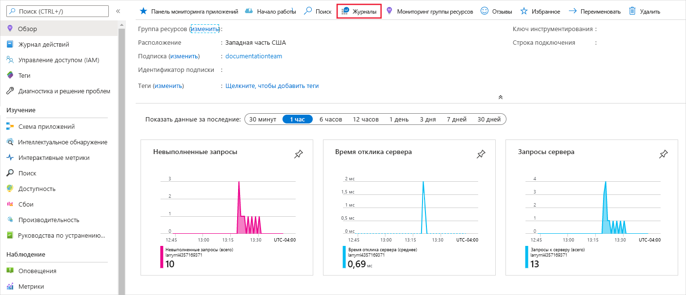
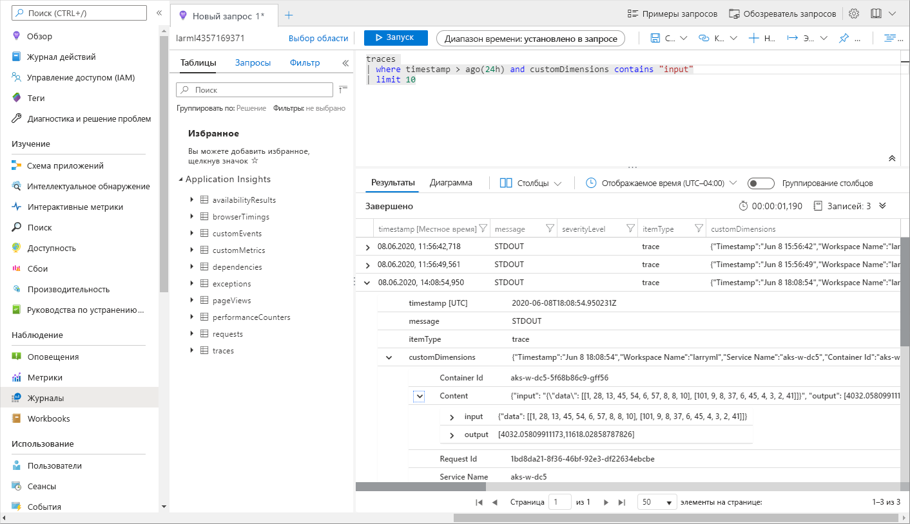

# <a name="monitor-and-collect-data-from-ml-web-service-endpoints"></a>Мониторинг и сбор данных из конечных точек веб-службы Машинного обучения


Из этой статьи вы узнаете, как выполнять получение данных из моделей, развернутых в конечных точках веб-службы в службе Kubernetes Azure (AKS) или экземплярах контейнеров Azure (ACI). Используйте [Application Insights Azure](../azure-monitor/app/app-insights-overview.md) , чтобы получить из конечной точки следующие данные:
* Выходные данные
* Ответы
* Частоты запросов, времени отклика и частоты сбоев.
* Частоты зависимостей, времени отклика и частоты сбоев.
* Исключения

В записной книжке [Enable-App-Insights-in-Production-Service. ipynb](https://github.com/Azure/MachineLearningNotebooks/blob/master/how-to-use-azureml/deployment/enable-app-insights-in-production-service/enable-app-insights-in-production-service.ipynb) описываются концепции, описанные в этой статье.
 
[!INCLUDE [aml-clone-in-azure-notebook](../../includes/aml-clone-for-examples.md)]
 
## <a name="prerequisites"></a>Обязательные условия

* Подписка Azure — попробуйте [бесплатную или платную версию машинное обучение Azure](https://aka.ms/AMLFree).

* Должны быть установлены рабочая область машинного обучения Azure, локальный каталог со скриптами и пакет SDK машинного обучения Azure для Python. Дополнительные сведения см. в разделе [Настройка среды разработки](how-to-configure-environment.md).

* Обученная модель машинного обучения. Дополнительные сведения см. в руководстве [обучение модели классификации изображений](tutorial-train-models-with-aml.md) .

<a name="python"></a>

## <a name="configure-logging-with-the-python-sdk"></a>Настройка ведения журнала с помощью пакета SDK для Python

В этом разделе вы узнаете, как включить ведение журнала Application Insights с помощью пакета SDK для Python. 

### <a name="update-a-deployed-service"></a>Обновление развернутой службы

Чтобы обновить существующую веб-службу, выполните следующие действия.

1. Найдите службу в рабочей области. Значение для `ws` — это имя рабочей области.

    ```python
    from azureml.core.webservice import Webservice
    aks_service= Webservice(ws, "my-service-name")
    ```
2. Обновление службы и включение Azure Application Insights

    ```python
    aks_service.update(enable_app_insights=True)
    ```

### <a name="log-custom-traces-in-your-service"></a>Трассировка пользовательских журналов в службе

> [!IMPORTANT]
> Azure Application Insights записывает в журнал только полезные данные размером до 64 КБ. При достижении этого предела могут возникнуть ошибки, например нехваткой памяти, или нет сведений, которые могут быть занесены в журнал. Если данные, которые нужно заносить в журнал, имеют больший размер в 64 КБ, следует сохранить их в хранилище BLOB-объектов, используя сведения из раздела " [Получение данных для моделей в рабочей среде](how-to-enable-data-collection.md)".
>
> Для более сложных ситуаций, таких как отслеживание моделей в развертывании AKS, рекомендуется использовать сторонние библиотеки, например [опенценсус](https://opencensus.io).

Чтобы зарегистрировать пользовательские трассировки, выполните стандартный процесс развертывания AKS или ACI в статье [развертывание и размещение](how-to-deploy-and-where.md) документа. Затем выполните следующие действия.

1. Обновите файл оценки, добавив инструкции Print для отправки данных в Application Insights во время вывода. Для получения более сложной информации, такой как данные запроса и ответ, используйте структуру JSON. 

    Следующий пример `score.py` файла записывается в журнал при инициализации модели, вводе и выводе во время вывода, а также о времени возникновения ошибок.

    
    ```python
    import pickle
    import json
    import numpy 
    from sklearn.externals import joblib
    from sklearn.linear_model import Ridge
    from azureml.core.model import Model
    import time

    def init():
        global model
        #Print statement for appinsights custom traces:
        print ("model initialized" + time.strftime("%H:%M:%S"))
        
        # note here "sklearn_regression_model.pkl" is the name of the model registered under the workspace
        # this call should return the path to the model.pkl file on the local disk.
        model_path = Model.get_model_path(model_name = 'sklearn_regression_model.pkl')
        
        # deserialize the model file back into a sklearn model
        model = joblib.load(model_path)
    

    # note you can pass in multiple rows for scoring
    def run(raw_data):
        try:
            data = json.loads(raw_data)['data']
            data = numpy.array(data)
            result = model.predict(data)
            # Log the input and output data to appinsights:
            info = {
                "input": raw_data,
                "output": result.tolist()
                }
            print(json.dumps(info))
            # you can return any datatype as long as it is JSON-serializable
            return result.tolist()
        except Exception as e:
            error = str(e)
            print (error + time.strftime("%H:%M:%S"))
            return error
    ```

2. Обновите конфигурацию службы и обязательно включите Application Insights.
    
    ```python
    config = Webservice.deploy_configuration(enable_app_insights=True)
    ```

3. Создайте образ и разверните его в AKS или ACI. Дополнительные сведения см. [в разделе Развертывание и размещение](how-to-deploy-and-where.md).


### <a name="disable-tracking-in-python"></a>Отключение наблюдения в Python

Чтобы отключить Application Insights Azure, используйте следующий код:

```python 
## replace <service_name> with the name of the web service
<service_name>.update(enable_app_insights=False)
```

<a name="studio"></a>

## <a name="configure-logging-with-azure-machine-learning-studio"></a>Настройка ведения журналов с помощью Машинное обучение Azure Studio

Application Insights Azure можно также включить из Машинное обучение Azure Studio. Когда вы будете готовы развернуть модель как веб-службу, выполните следующие действия, чтобы включить Application Insights:

1. Войдите в студию студии в https://ml.azure.com .
1. Перейдите к пункту **модели** и выберите модель, которую требуется развернуть.
1. Выберите  **+ развернуть**.
1. Заполнение формы **развертывание модели** .
1. Разверните меню **Дополнительно** .

    
1. Выберите **включить Application Insights диагностику и сбор данных**.

    

## <a name="view-metrics-and-logs"></a>Просмотр метрик и журналов

### <a name="query-logs-for-deployed-models"></a>Журналы запросов для развернутых моделей

Функцию можно использовать `get_logs()` для получения журналов из ранее развернутой веб-службы. Эти журналы могут содержать подробные сведения об ошибках, возникающих во время развертывания.

```python
from azureml.core.webservice import Webservice

# load existing web service
service = Webservice(name="service-name", workspace=ws)
logs = service.get_logs()
```

### <a name="view-logs-in-the-studio"></a>Просмотр журналов в студии

Azure Application Insights хранит журналы службы в той же группе ресурсов, что и Рабочая область Машинное обучение Azure. Чтобы просмотреть данные с помощью студии, выполните следующие действия.

1. Перейдите в рабочую область Машинное обучение Azure в [студии](https://ml.azure.com/).
1. Выберите **Конечные точки**.
1. Выберите развернутую службу.
1. Выберите ссылку **URL-адрес Application Insights** .

    [](././media/how-to-enable-app-insights/appinsightsloc.png#lightbox)

1. В Application Insights на вкладке **Обзор** или в разделе __мониторинг__ выберите __журналы__.

    [](./media/how-to-enable-app-insights/overview.png#lightbox)

1. Чтобы просмотреть данные, записанные в журнал из файла score.py, просмотрите таблицу __traces__ . Следующий запрос выполняет поиск журналов, в которых было записано __входное__ значение:

    ```kusto
    traces
    | where customDimensions contains "input"
    | limit 10
    ```

   [](././media/how-to-enable-app-insights/model-data-trace.png#lightbox)

Дополнительные сведения об использовании Application Insights Azure см. в разделе [что такое Application Insights?](../azure-monitor/app/app-insights-overview.md).

## <a name="web-service-metadata-and-response-data"></a>Метаданные веб-службы и данные ответа

> [!IMPORTANT]
> Azure Application Insights записывает в журнал только полезные данные размером до 64 КБ. При достижении этого предела могут возникнуть ошибки, например нехваткой памяти, или нет сведений, которые могут быть занесены в журнал.

Чтобы зарегистрировать сведения о запросе веб-службы, добавьте `print` инструкции в файл Score.py. Каждая `print` инструкция приводит к одной записи в таблице трассировки Application Insights в сообщении `STDOUT` . Application Insights сохраняет `print` выходные данные инструкции в  `customDimensions` и в `Contents` таблице трассировки. Печать строк JSON создает иерархическую структуру данных в выходных данных трассировки в разделе `Contents` .

## <a name="export-data-for-retention-and-processing"></a>Экспорт данных для хранения и обработки

>[!Important]
> Application Insights Azure поддерживает только экспорты в хранилище BLOB-объектов. Дополнительные сведения об ограничениях этой реализации см. в статье [Экспорт данных телеметрии из App Insights](../azure-monitor/app/export-telemetry.md#continuous-export-advanced-storage-configuration).

Используйте Application Insights " [непрерывный экспорт](../azure-monitor/app/export-telemetry.md) ", чтобы экспортировать данные в учетную запись хранения BLOB-объектов, где можно определить параметры хранения. Application Insights экспортирует данные в формате JSON. 

:::image type="content" source="media/how-to-enable-app-insights/continuous-export-setup.png" alt-text="непрерывный экспорт.":::

## <a name="next-steps"></a>Дальнейшие действия

В этой статье вы узнали, как включить ведение журнала и просмотреть журналы для конечных точек веб-службы. Выполните следующие действия в следующих статьях:


* [Развертывание модели в кластере AKS](./how-to-deploy-azure-kubernetes-service.md)

* [Развертывание модели в службе "экземпляры контейнеров Azure"](./how-to-deploy-azure-container-instance.md)

* [Млопс: управление, развертывание и мониторинг моделей с помощью машинное обучение Azure](./concept-model-management-and-deployment.md) для получения дополнительных сведений об использовании данных, собираемых из моделей в рабочей среде. Такие данные позволяют постоянно улучшать процесс машинного обучения.