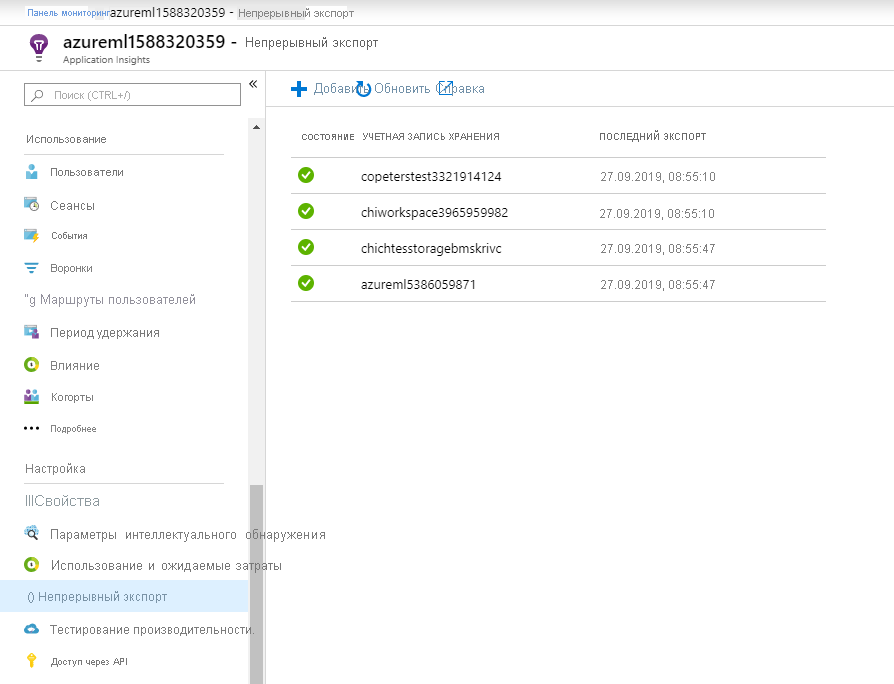

# <a name="monitor-and-collect-data-from-ml-web-service-endpoints"></a>Мониторинг и сбор данных из конечных точек веб-службы Машинного обучения
[!INCLUDE [applies-to-skus](../../includes/aml-applies-to-basic-enterprise-sku.md)]

Из этой статьи вы узнаете, как получать данные из и отслеживать модели, развернутые в конечных точках веб-службы в службе Azure Kubernetes Service (AKS), или службу "экземпляры контейнеров Azure" (ACI), включив Application Insights Azure через 
* [Пакет SDK для Машинное обучение Azure Python](#python)
* [Машинное обучение Azure Studio](#studio) вhttps://ml.azure.com

Помимо сбора выходных данных и ответов конечной точки, можно отслеживать:

* Частоты запросов, времени отклика и частоты сбоев.
* Частоты зависимостей, времени отклика и частоты сбоев.
* Исключения

Дополнительные [сведения об Azure Application Insights](../azure-monitor/app/app-insights-overview.md). 


## <a name="prerequisites"></a>Предварительные условия

* Если у вас еще нет подписки Azure, создайте бесплатную учетную запись, прежде чем начинать работу. Опробуйте [бесплатную или платную версию машинное обучение Azure](https://aka.ms/AMLFree) уже сегодня

* Должны быть установлены рабочая область машинного обучения Azure, локальный каталог со скриптами и пакет SDK машинного обучения Azure для Python. Чтобы узнать, как выполнить эти предварительные требования, см. статью [Настройка среды разработки](how-to-configure-environment.md) .

* Обученная модель машинного обучения для развертывания в службе Azure Kubernetes (AKS) или в экземпляре контейнера Azure (ACI). Если у вас ее нет, см. Руководство [обучение модели классификации изображений](tutorial-train-models-with-aml.md)

## <a name="web-service-metadata-and-response-data"></a>Метаданные веб-службы и данные ответа

>[!Important]
> Azure Application Insights записывает в журнал только полезные данные размером до 64 КБ. При достижении этого предела регистрируются только самые последние выходные данные модели. 

Метаданные и ответ на службу, соответствующие метаданным веб-службы и прогнозам модели, записываются в трассировку Application Insights Azure в соответствии с сообщением `"model_data_collection"`. Вы можете запросить Azure Application Insights напрямую для доступа к этим данным или настроить [непрерывный экспорт](https://docs.microsoft.com/azure/azure-monitor/app/export-telemetry) в учетную запись хранения для более длительного хранения или дальнейшей обработки. Данные модели можно использовать в Машинное обучение Azure для настройки меток, переобучения, пояснения, анализа данных или других способов использования. 

<a name="python"></a>

## <a name="use-python-sdk-to-configure"></a>Использование пакета SDK для Python для настройки 

### <a name="update-a-deployed-service"></a>Обновление развернутой службы

1. Найдите службу в рабочей области. Значение для `ws` — это имя рабочей области.

    ```python
    from azureml.core.webservice import Webservice
    aks_service= Webservice(ws, "my-service-name")
    ```
2. Обновление службы и включение Azure Application Insights

    ```python
    aks_service.update(enable_app_insights=True)
    ```

### <a name="log-custom-traces-in-your-service"></a>Трассировка пользовательских журналов в службе

Если требуется вести журнал пользовательских трассировок, выполните инструкции из руководства по стандартному процессу развертывания для AKS или ACI, представленные в документе [Deploy models with the Azure Machine Learning service](how-to-deploy-and-where.md) (Развертывание моделей с помощью Службы машинного обучения Azure). Затем выполните следующие действия:

1. Обновление файла оценки путем добавления инструкций Print
    
    ```python
    print ("model initialized" + time.strftime("%H:%M:%S"))
    ```

2. Обновление конфигурации службы
    
    ```python
    config = Webservice.deploy_configuration(enable_app_insights=True)
    ```

3. Создайте образ и разверните его в [AKS или ACI](how-to-deploy-and-where.md).

### <a name="disable-tracking-in-python"></a>Отключение наблюдения в Python

Чтобы отключить Application Insights Azure, используйте следующий код:

```python 
## replace <service_name> with the name of the web service
<service_name>.update(enable_app_insights=False)
```

<a name="studio"></a>

## <a name="use-azure-machine-learning-studio-to-configure"></a>Использование Машинное обучение Azure Studio для настройки

Вы также можете включить Azure Application Insights из Машинное обучение Azure Studio, когда будете готовы к развертыванию модели с помощью этих шагов.

1. Войдите в рабочую область по адресуhttps://ml.azure.com/
1. Перейдите к разделу **модели** и выберите модель, которую требуется развернуть.
1. Выбрать **+ развернуть**
1. Заполнение формы « **развертывание модели** »
1. Развернуть меню " **Дополнительно** "

    
1. Выберите **включить диагностику Application Insights и сбор данных**

    
## <a name="evaluate-data"></a>Данные оценки
Данные службы хранятся в учетной записи Azure Application Insights в той же группе ресурсов, что и Машинное обучение Azure.
Чтобы их просмотреть:

1. Перейдите к рабочей области Машинное обучение Azure в [портал Azure](https://ms.portal.azure.com/) и щелкните ссылку Application Insights

    [](././media/how-to-enable-app-insights/AppInsightsLoc.png#lightbox)

1. Перейдите на вкладку **Обзор** , чтобы просмотреть базовый набор метрик для службы.

   [](././media/how-to-enable-app-insights/overview.png#lightbox)

1. Чтобы просмотреть метаданные и ответ запроса веб-службы, выберите таблицу **запросы** в разделе **журналы (аналитика)** и выберите **выполнить** для просмотра запросов.

   [](././media/how-to-enable-app-insights/model-data-trace.png#lightbox)


3. Чтобы найти пользовательские трассировки, выберите **аналитика** .
4. В разделе схемы выберите **Трассировки**. Затем выберите **Запуск**, чтобы выполнить запрос. Данные должны отображаться в табличном формате и должны сопоставляться с пользовательскими вызовами в файле оценки.

   [](././media/how-to-enable-app-insights/logs.png#lightbox)

Дополнительные сведения об использовании Application Insights Azure см. в разделе [что такое Application Insights?](../azure-monitor/app/app-insights-overview.md).

## <a name="export-data-for-further-processing-and-longer-retention"></a>Экспорт данных для дальнейшей обработки и более длительного хранения

>[!Important]
> Application Insights Azure поддерживает только экспорты в хранилище BLOB-объектов. Дополнительные ограничения этой возможности экспорта перечислены в окне [Экспорт данных телеметрии из App Insights](https://docs.microsoft.com/azure/azure-monitor/app/export-telemetry#continuous-export-advanced-storage-configuration).

Вы можете использовать [непрерывный экспорт](https://docs.microsoft.com/azure/azure-monitor/app/export-telemetry) Azure Application Insights для отправки сообщений в поддерживаемую учетную запись хранения, где можно задать более длительное хранение. `"model_data_collection"` Сообщения хранятся в формате JSON и могут быть легко проанализированы для извлечения данных модели. 

Фабрика данных Azure, конвейеры машинного обучения Azure или другие средства обработки данных можно использовать для преобразования данных по мере необходимости. После преобразования данных их можно зарегистрировать в рабочей области Машинное обучение Azure в качестве набора данных. Дополнительные сведения см. в разделе [Создание и регистрация наборов данных](how-to-create-register-datasets.md).

   [](././media/how-to-enable-app-insights/continuous-export-setup.png)


## <a name="example-notebook"></a>Пример записной книжки

В записной книжке [Enable-App-Insights-in-Production-Service. ipynb](https://github.com/Azure/MachineLearningNotebooks/blob/master/how-to-use-azureml/deployment/enable-app-insights-in-production-service/enable-app-insights-in-production-service.ipynb) описываются концепции, описанные в этой статье. 
 
[!INCLUDE [aml-clone-in-azure-notebook](../../includes/aml-clone-for-examples.md)]

## <a name="next-steps"></a>Дальнейшие шаги

* Узнайте, [как развернуть модель в кластере службы Azure Kubernetes](https://docs.microsoft.com/azure/machine-learning/how-to-deploy-azure-kubernetes-service) или [как развернуть модель в службе "экземпляры контейнеров Azure](https://docs.microsoft.com/azure/machine-learning/how-to-deploy-azure-container-instance) ", чтобы развернуть модели в конечных точках веб-службы и разрешить Azure Application Insights использовать сбор данных и мониторинг конечных точек.
* Дополнительные сведения об использовании данных, собираемых из моделей в рабочей среде, см. в разделе [млопс. Управление, развертывание и мониторинг моделей с помощью машинное обучение Azure](https://docs.microsoft.com/azure/machine-learning/concept-model-management-and-deployment) . Такие данные позволяют постоянно улучшать процесс машинного обучения.
