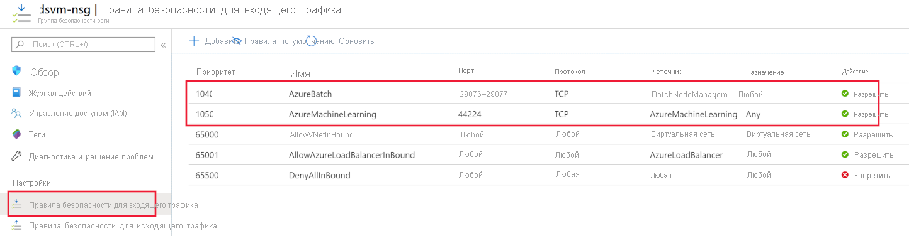

# <a name="secure-azure-ml-experimentation-and-inference-jobs-within-an-azure-virtual-network"></a>Безопасные задания по экспериментам и выводу Azure ML в виртуальной сети Azure
[!INCLUDE [applies-to-skus](../../includes/aml-applies-to-basic-enterprise-sku.md)]

В этой статье вы узнаете, как обеспечить работу по экспериментам/обучению и выводы/оценку задания в Azure Machine Learning в виртуальной сети Azure (vnet).

**Виртуальная сеть** выступает в качестве границы безопасности, изолируя ресурсы Azure от общедоступного интернета. Также вы можете подключить виртуальную сеть Azure к локальной сети. Присоединившись к сетям, вы можете безопасно обучить свои модели и получить доступ к развернутым моделям для выводов.

Для вычислений ресурсов Azure Machine Learning опирается на другие службы Azure. Для обучения и развертывания моделей используются ресурсы или [целевые показатели.](concept-compute-target.md) Цели могут быть созданы в виртуальной сети. Например, можно использовать виртуальную машину Microsoft Data Science для обучения модели, а затем развернуть модель в службе Azure Kubernetes (AKS). Для получения дополнительной информации о виртуальных сетях смотрите [обзор виртуальной сети Azure](https://docs.microsoft.com/azure/virtual-network/virtual-networks-overview).

В этой статье также содержится подробная информация о *расширенных настройках безопасности,* информация, которая не является необходимой для основных или экспериментальных случаев использования. Некоторые разделы этой статьи предоставляют информацию о конфигурации для различных сценариев. Вам не нужно выполнять инструкции в порядке или в полном объеме.

> [!TIP]
> Если конкретно не выкрикиваемый, использование ресурсов, таких как учетные записи хранения данных или вычислительные цели внутри виртуальной сети, будет работать как с конвейерами машинного обучения, так и с рабочими процессами без конвейеров, такими как запуски скриптов.

> [!WARNING]
> Корпорация Майкрософт не поддерживает использование функций Студии машинного обучения Azure, таких как Automated ML, Datasets, Datalabeling, Designer и Ноутбуки, если базовое хранилище включено в виртуальную сеть.

## <a name="prerequisites"></a>Предварительные требования

+ [Рабочее пространство](how-to-manage-workspace.md)машинного обучения Azure .

+ Общие рабочие знания как [службы виртуальной сети Azure,](https://docs.microsoft.com/azure/virtual-network/virtual-networks-overview) так и [IP-сетей.](https://docs.microsoft.com/azure/virtual-network/virtual-network-ip-addresses-overview-arm)

+ Существующая виртуальная сеть и подсеть для использования с помощью вычислительных ресурсов.

## <a name="use-a-storage-account-for-your-workspace"></a>Используйте учетную запись хранилища для рабочего пространства

Чтобы использовать учетную запись хранения Azure для рабочего пространства в виртуальной сети, используйте следующие действия:

1. Создайте вычислительный ресурс (например, экземпляр вычислений или кластер машинного обучения) позади виртуальной сети или прикрепите вычислительный ресурс к рабочему пространству (например, кластер HDInsight, виртуальная машина или кластер службы Azure Kubernetes). Вычислительный ресурс может быть для экспериментов или развертывания модели.

   Для получения дополнительной информации [Use a virtual machine or HDInsight cluster](#vmorhdi) [Use Azure Kubernetes Service](#aksvnet) см. [Use a Machine Learning compute](#amlcompute)

1. На портале Azure перейдите в хранилище, подключенное к рабочему пространству.

   [](./media/how-to-enable-virtual-network/workspace-storage.png#lightbox)

1. На странице **хранения Azure** выберите __брандмауэры и виртуальные сети.__

   

1. На странице __брандмауэров и виртуальных сетей__ выполняй следующие действия:
    - Выберите __Выбранные сети__.
    - В __рамках виртуальных сетей__выберите __существующую виртуальную сетевую__ ссылку Add. Это действие добавляет виртуальную сеть, в которой находится ваш компьютер (см. шаг 1).

        > [!IMPORTANT]
        > Учетная запись хранилища должна находиться в той же виртуальной сети и подсети, что и вычислительные экземпляры или кластеры, используемые для обучения или выводов.

    - Выберите __службу Microsoft Allow, которым поверяют, чтобы получить доступ к этой__ флажке учетной записи хранилища.

    > [!IMPORTANT]
    > При работе с SDK Azure Machine Learning необходимо подключиться к учетной записи хранения Azure. Когда учетная запись хранилища находится внутри виртуальной сети, брандмауэр должен обеспечить доступ с IP-адреса среды разработки.
    >
    > Чтобы обеспечить доступ к учетной записи хранилища, посетите __Firewalls и виртуальные сети__ для *учетной записи хранения из веб-браузера на клиенте разработки.* Затем используйте флажок __для IP-адреса клиента,__ чтобы добавить IP-адрес клиента в __ADDRESS RANGE.__ Вы также можете использовать поле __ADDRESS RANGE__ для ручного ввода IP-адреса среды разработки. После добавления IP-адреса клиента он может получить доступ к учетной записи хранилища с помощью SDK.

   [](./media/how-to-enable-virtual-network/storage-firewalls-and-virtual-networks-page.png#lightbox)

> [!IMPORTANT]
> Можно разместить как _учетную запись хранилища по умолчанию_ для машинного обучения Azure, так и _учетные записи хранения без дефолта_ в виртуальной сети.
>
> Учетная запись хранилища по умолчанию автоматически предоставляется при создании рабочего пространства.
>
> Для учетных записей `storage_account` хранения данных без дефолта параметр в [ `Workspace.create()` функции](https://docs.microsoft.com/python/api/azureml-core/azureml.core.workspace(class)?view=azure-ml-py#create-name--auth-none--subscription-id-none--resource-group-none--location-none--create-resource-group-true--sku--basic---friendly-name-none--storage-account-none--key-vault-none--app-insights-none--container-registry-none--cmk-keyvault-none--resource-cmk-uri-none--hbi-workspace-false--default-cpu-compute-target-none--default-gpu-compute-target-none--exist-ok-false--show-output-true-) позволяет указать учетную запись пользовательского хранилища по идентификатору ресурсов Azure.

## <a name="use-azure-data-lake-storage-gen-2"></a>Используйте хранилище озер данных Azure Gen 2

Azure Data Lake Storage Gen 2 — это набор возможностей для анализа больших данных, построенный на хранилище Azure Blob. Он может использоваться для хранения данных, используемых для обучения моделей с помощью Azure Machine Learning. 

Чтобы использовать Data Lake Storage Gen 2 в виртуальной сети рабочего пространства Azure Machine Learning, используйте следующие действия:

1. Создайте учетную запись Azure Data Lake Storage 2. Для получения дополнительной информации [см.](../storage/blobs/data-lake-storage-quickstart-create-account.md)

1. Используйте шаги 2-4 в предыдущем разделе, [Используйте учетную запись для рабочего пространства,](#use-a-storage-account-for-your-workspace)чтобы поместить учетную запись в виртуальную сеть.

При использовании Машинного обучения Azure с помощью Data Lake Storage Gen 2 в виртуальной сети используйте следующие рекомендации:

* Если вы используете __SDK для создания набора данных,__ а система, работая `validate=False` с кодом, не находится в __виртуальной сети,__ используйте параметр. Этот параметр пропускает проверку, которая не справляется, если система не находится в той же виртуальной сети, что и учетная запись хранилища. Для получения дополнительной информации см [from_files.](https://docs.microsoft.com/python/api/azureml-core/azureml.data.dataset_factory.filedatasetfactory?view=azure-ml-py#from-files-path--validate-true-)

* При использовании Azure Machine Learning Compute Instance или вычислительного кластера для обучения модели с использованием набора данных она должна находиться в той же виртуальной сети, что и учетная запись хранилища.

## <a name="use-a-key-vault-instance-with-your-workspace"></a>Используйте экземпляр хранилища ключей в рабочем пространстве

Экземпляр хранилища ключей, связанный с рабочим пространством, используется Azure Machine Learning для хранения следующих учетных данных:
* Строка соединения сопутствуенного хранилища
* Пароли к экземплярам репозитория контейнеров Azure
* Строки подключения к хранилищам данных

Для использования возможностей экспериментов по машинному обучению Azure с Azure Key Vault за виртуальной сетью используйте следующие действия:

1. Перейдите к хранилищу ключей, связанному с рабочим пространством.

   [](./media/how-to-enable-virtual-network/workspace-key-vault.png#lightbox)

1. На странице **Key Vault,** в левом стекле, выберите __брандмауэры и виртуальные сети.__

   

1. На странице __брандмауэров и виртуальных сетей__ выполняй следующие действия:
    - В разделе __Разрешить доступ из__ щелкните __Выбранные сети__.
    - В __виртуальных сетях__выберите __Добавить существующие виртуальные сети,__ чтобы добавить виртуальную сеть, в которой находится ваш вычисление экспериментов.
    - В соответствии с __Allow доверенных служб Майкрософт, чтобы обойти этот брандмауэр,__ выберите __Да__.

   [](./media/how-to-enable-virtual-network/key-vault-firewalls-and-virtual-networks-page.png#lightbox)

<a id="amlcompute"></a>

## <a name="use-a-machine-learning-compute"></a><a name="compute-instance"></a>Использование вычислительной техники для машинного обучения

Для использования экземпляра вычислений машин Azure или вычислительного кластера в виртуальной сети необходимо выполнить следующие требования к сети:

> [!div class="checklist"]
> * Виртуальная сеть должна находиться в той же подписке и регионе, что и рабочее пространство Машинного обучения Azure.
> * Подсеть, указанная для экземпляра вычислений или кластера, должна иметь достаточно неназначенных IP-адресов для размещения целевых мишеней. Если в подсети не хватает неназначенных IP-адресов, вычислительный кластер будет частично выделен.
> * Проверьте, ограничивают ли политики безопасности или блокировки в подписной или ресурсной группе виртуальной сети разрешения на управление виртуальной сетью. Если вы планируете обезопасить виртуальную сеть, ограничив трафик, оставьте некоторые порты открытыми для вычислительной службы. Дополнительные сведения см. в разделе [Требуемые порты](#mlcports).
> * Если вы собираетесь поместить несколько вычисляемых экземпляров или кластеров в одну виртуальную сеть, возможно, потребуется запросить увеличение квоты для одного или нескольких ресурсов.
> * Если учетная запись хранения Azure (ы) для рабочего пространства также защищена в виртуальной сети, они должны находиться в той же виртуальной сети, что и экземпляр или кластер Azure Machine Learning. 

> [!TIP]
> Экземпляр или кластер машинного обучения автоматически распределяет дополнительные сетевые ресурсы в группе ресурсов, содержащей виртуальную сеть. Для каждого экземпляра вычислений или кластера служба выделяет следующие ресурсы:
> 
> * Одна группа безопасности сети
> * Один общедоступный IP-адрес
> * Один балансировщик нагрузки
> 
> Эти ресурсы ограничены [квотами ресурсов](https://docs.microsoft.com/azure/azure-resource-manager/management/azure-subscription-service-limits) в подписке.


### <a name="required-ports"></a><a id="mlcports"></a> Требуемые порты

Сейчас Вычислительная среда Машинного обучения использует пакетную службу Azure для подготовки виртуальных машин в указанной виртуальной сети. Это означает, что подсеть должна разрешать входящие подключения из пакетной службы. Это сообщение используется для планирования запусков на узлах Machine Learning Compute и для связи с Azure Storage и другими ресурсами. Служба пакетов добавляет группы сетевой безопасности (НСГ) на уровне сетевых интерфейсов (NICs), которые прикрепляются к VMs. Эти группы безопасности сети автоматически настраивают правила для входящего и исходящего трафика, чтобы разрешить следующий трафик:

- Входящий трафик TCP на портах 29876 и 29877 от __тега обслуживания__ __BatchNodeManagement__.

    

- (Необязательно) Входящий трафик TCP в порту 22 для удаленного доступа. Используйте этот порт только в том случае, если вы хотите подключиться с помощью SSH на общедоступном IP- исиспользовании.

- Исходящий трафик в виртуальную сеть на любом порту.

- Исходящий трафик в Интернет на любом порту.

- Для вычисления экземпляра входящий трафик TCP в порту 44224 из __тега службы__ __AzureMachineLearning.__

Соблюдайте осторожность, если вы изменяете или добавляете правила для входящего и исходящего трафика в группах безопасности сети, настроенных для пакетной службы. Если NSG блокирует связь с вычислительными узлами, служба вычислений устанавливает состояние вычислительных узлов непригодным для узла.

Вам не нужно указывать НСГ на уровне подсети, потому что служба Azure Batch настраивает свои собственные НСГ. Однако, если указанная подсеть связана с НСГ или брандмауэром, назначаем входящие и исходящие правила безопасности, как упоминалось ранее.

Конфигурация правила NSG на портале Azure отображается на следующих изображениях:

[](./media/how-to-enable-virtual-network/amlcompute-virtual-network-inbound.png#lightbox)


### <a name="limit-outbound-connectivity-from-the-virtual-network"></a><a id="limiting-outbound-from-vnet"></a>Ограничьте исходящие подключения из виртуальной сети

Если вы не хотите использовать правила исходящего по умолчанию и хотите ограничить исходящий доступ к виртуальной сети, используйте следующие действия:

- Запретить исходящих интернет-соединений с помощью правил NSG.

- Для __вычисляемого экземпляра__ или __кластера вычислений__ограничьте исходящий трафик следующими элементами:
   - Лазурный хранения, с помощью __службы Тег__ __хранения.РегионНаймей__. Где `{RegionName}` называется регион Azure.
   - Реестр контейнеров Azure, с помощью __сервисного тега__ __AzureContainerRegistry.RegionName__. Где `{RegionName}` называется регион Azure.
   - Машинное обучение Azure с помощью __тега службы__ __AzureMachineLearning__
   - Менеджер ресурсов Azure, используя __тег ислужбы__ __AzureResourceManager__
   - Активный каталог Azure с помощью __тега службы__ __AzureActiveDirectory__

Конфигурация правила NSG на портале Azure отображается на следующем изображении:

[](./media/how-to-enable-virtual-network/limited-outbound-nsg-exp.png#lightbox)

> [!NOTE]
> Если вы планируете использовать изображения Докера по умолчанию, предоставляемые корпорацией Майкрософт, и включить пользовательские зависимости, необходимо также использовать __тег службы__ __MicrosoftContainerRegistry.Region_Name__ (например, MicrosoftContainerRegistry.EastUS).
>
> Эта конфигурация необходима, когда у вас есть код, похожий на следующие фрагменты, как часть ваших сценариев обучения:
>
> __Обучение RunConfig__
> ```python
> # create a new runconfig object
> run_config = RunConfiguration()
> 
> # configure Docker 
> run_config.environment.docker.enabled = True
> # For GPU, use DEFAULT_GPU_IMAGE
> run_config.environment.docker.base_image = DEFAULT_CPU_IMAGE 
> run_config.environment.python.user_managed_dependencies = True
> ```
>
> __Обучение оценщиков__
> ```python
> est = Estimator(source_directory='.',
>                 script_params=script_params,
>                 compute_target='local',
>                 entry_script='dummy_train.py',
>                 user_managed=True)
> run = exp.submit(est)
> ```

### <a name="user-defined-routes-for-forced-tunneling"></a>Пользовательские маршруты для принудительного туннелирования

Если вы используете принудительное туннелирование с помощью Machine Learning Compute, добавьте [определенные пользователем маршруты (UD)](https://docs.microsoft.com/azure/virtual-network/virtual-networks-udr-overview) в подсеть, содержащую вычислительный ресурс.

* Создайте U-раз для каждого IP-адреса, используемого службой Azure Batch в регионе, где существуют ресурсы. Эти UD-услуги позволяют службе пакетов связываться с вычислительными узлами для планирования задач. Чтобы получить список IP-адресов службы Batch, используйте один из следующих методов:

    * Загрузите [теги Azure IP ИС и службы](https://www.microsoft.com/download/details.aspx?id=56519) и ищите файл для `BatchNodeManagement.<region>` `<region>` области Azure.

    * Для загрузки информации используйте [Azure CLI.](https://docs.microsoft.com/cli/azure/install-azure-cli?view=azure-cli-latest) Следующий пример загружает информацию об IP-адресе и отфильтровывает информацию для региона East US 2:

        ```azurecli-interactive
        az network list-service-tags -l "East US 2" --query "values[?starts_with(id, 'Batch')] | [?properties.region=='eastus2']"
        ```

* Исходящий трафик в Хранилище Azure не должен блокироваться вашим сетевым прибором. В частности, URL-адреса `<account>.table.core.windows.net` `<account>.queue.core.windows.net`находятся `<account>.blob.core.windows.net`в форме, и .

При добавлении UD-адреса определите маршрут для каждой соответствующей приставки IP-адреса пакета и __установите тип следующего перехода__ в __Интернет.__ На следующем изображении показан пример этого UDR на портале Azure:


Для получения дополнительной информации смотрите [Создать пул Azure Batch в виртуальной сети.](../batch/batch-virtual-network.md#user-defined-routes-for-forced-tunneling)

### <a name="create-a-compute-cluster-in-a-virtual-network"></a>Создание вычислительного кластера в виртуальной сети

Для создания кластера машинного обучения используйте следующие действия:

1. Вопийте в [студии Машинного обучения Azure,](https://ml.azure.com/)а затем выберите подписку и рабочее пространство.

1. Слева выберите пункт __Вычисление__.

1. Выберите __обучающие кластеры__ из __+__ центра, а затем выберите.

1. В диалоге __нового учебного кластера__ расширьте раздел __Расширенные настройки.__

1. Чтобы настроить этот вычислительный ресурс для использования виртуальной сети, выполните следующие действия в разделе __виртуальной сети Настройка:__

    1. В списке выпадающих групп __ресурсов__ выберите группу ресурсов, содержащую виртуальную сеть.
    1. В __списке__ выпадающих сетей Virtual выберите виртуальную сеть, содержащую подсеть.
    1. В списке выпадающих __подсетей__ выберите подсеть для использования.

   

Вы также можете создать кластер Вычислительной среды Машинного обучения с помощью пакета SDK для Машинного обучения Azure. Следующий код создает новый кластер Вычислительной среды Машинного обучения в подсети `default`, размещенной в виртуальной сети с именем `mynetwork`:

```python
from azureml.core.compute import ComputeTarget, AmlCompute
from azureml.core.compute_target import ComputeTargetException

# The Azure virtual network name, subnet, and resource group
vnet_name = 'mynetwork'
subnet_name = 'default'
vnet_resourcegroup_name = 'mygroup'

# Choose a name for your CPU cluster
cpu_cluster_name = "cpucluster"

# Verify that cluster does not exist already
try:
    cpu_cluster = ComputeTarget(workspace=ws, name=cpu_cluster_name)
    print("Found existing cpucluster")
except ComputeTargetException:
    print("Creating new cpucluster")

    # Specify the configuration for the new cluster
    compute_config = AmlCompute.provisioning_configuration(vm_size="STANDARD_D2_V2",
                                                           min_nodes=0,
                                                           max_nodes=4,
                                                           vnet_resourcegroup_name=vnet_resourcegroup_name,
                                                           vnet_name=vnet_name,
                                                           subnet_name=subnet_name)

    # Create the cluster with the specified name and configuration
    cpu_cluster = ComputeTarget.create(ws, cpu_cluster_name, compute_config)

    # Wait for the cluster to be completed, show the output log
    cpu_cluster.wait_for_completion(show_output=True)
```

Когда процесс создания завершается, вы тренируете модель, используя кластер в эксперименте. Дополнительные сведения вы найдете в статье [Настройка целевых объектов вычислений для обучения моделей](how-to-set-up-training-targets.md).

## <a name="use-azure-databricks"></a>Используйте кирпичи данных Azure

Чтобы использовать Azure Databricks в виртуальной сети с рабочим пространством, необходимо выполнить следующие требования:

> [!div class="checklist"]
> * Виртуальная сеть должна находиться в той же подписке и регионе, что и рабочее пространство Машинного обучения Azure.
> * Если учетная запись хранения Azure (ы) для рабочего пространства также защищена в виртуальной сети, они должны находиться в той же виртуальной сети, что и кластер Azure Databricks.
> * Помимо подсетей __Databricks-private__ и __databricks,public,__ используемых Azure Databricks, также требуется подсеть __по умолчанию,__ созданная для виртуальной сети.

Для получения конкретной информации об использовании Azure Databricks с виртуальной сетью [см.](https://docs.azuredatabricks.net/administration-guide/cloud-configurations/azure/vnet-inject.html)

<a id="vmorhdi"></a>

## <a name="use-a-virtual-machine-or-hdinsight-cluster"></a>Использование виртуальной машины или кластера HDInsight

> [!IMPORTANT]
> Azure Machine Learning поддерживает только виртуальные машины, которые работают под управлением Ubuntu.

Чтобы использовать виртуальную машину или кластер Azure HDInsight в виртуальной сети с рабочим пространством, используйте следующие шаги:

1. Создайте кластер VM или HDInsight с помощью портала Azure или Azure CLI и поместите кластер в виртуальную сеть Azure. Дополнительные сведения см. в следующих статьях:
    * [Создание и администрирование виртуальных сетей Azure для виртуальных машин Linux](https://docs.microsoft.com/azure/virtual-machines/linux/tutorial-virtual-network)

    * [Расширение возможностей HDInsight с помощью виртуальной сети Azure](https://docs.microsoft.com/azure/hdinsight/hdinsight-extend-hadoop-virtual-network).

1. Чтобы позволить Azure Machine Learning общаться с портом SSH на VM или кластере, назначайте исходный вход для группы сетевой безопасности. Обычно для SSH используется порт 22. Чтобы разрешить трафик из этого источника, сделайте следующие действия:

    * В списке __выпадающих источников__ выберите __тег службы.__

    * В списке __выпадающих тегов службы Исходного кода__ выберите __AzureMachineLearning.__

    * В __диапазоне диапазонов исходных__ портов __*__ выпадвниз список, выберите .

    * В списке __выпадающих пунктов назначения__ выберите __любой__.

    * В __диапазоне диапазонов назначения выпадающий__ список, выберите __22__.

    * В соответствии с __Протоколом,__ выберите __Любой__.

    * Под __действием,__ выберите __Разрешить__.

   

    Сохраняйте правила исходящего значения по умолчанию для группы сетевой безопасности. Дополнительные сведения см. в описании стандартных правил безопасности в статье [о группах безопасности](https://docs.microsoft.com/azure/virtual-network/security-overview#default-security-rules).

    Если вы не хотите использовать правила исходящего по умолчанию и хотите ограничить исходящий [Limit outbound connectivity from the virtual network](#limiting-outbound-from-vnet) доступ вашей виртуальной сети, см.

1. Прикрепите кластер VM или HDInsight к рабочему пространству Azure Machine Learning. Дополнительные сведения вы найдете в статье [Настройка целевых объектов вычислений для обучения моделей](how-to-set-up-training-targets.md).

<a id="aksvnet"></a>

## <a name="use-azure-kubernetes-service-aks"></a>Применение службы Azure Kubernetes (AKS)

Чтобы добавить AKS в виртуальную сеть в рабочее пространство, используйте следующие шаги:

> [!IMPORTANT]
> Перед началом следующей процедуры следуйте предпосылкам в расширенной сети В Службе [Azure Kubernetes Service (AKS)](https://docs.microsoft.com/azure/aks/configure-advanced-networking#prerequisites) и планируем IP-адрес для вашего кластера.
>
> Экземпляр AKS и виртуальная сеть Azure должны находиться в одном регионе. При обеспечении безопасности учетной записи хранения данных Azure(s), используемой рабочим пространством в виртуальной сети, они должны находиться в той же виртуальной сети, что и экземпляр AKS.

> [!WARNING]
> Azure Machine Learning не поддерживает использование службы Azure Kubernetes с включенной частной ссылкой.

1. Вопийте в [студии Машинного обучения Azure,](https://ml.azure.com/)а затем выберите подписку и рабочее пространство.

1. Слева выберите пункт __Вычисление__.

1. Выберите __кластеры выводов__ из центра, __+__ а затем выберите.

1. В диалоге нового кластера __выводов__ выберите __Расширенный__ под __конфигурацией сети.__

1. Для настройки этого вычислительного ресурса для использования виртуальной сети выполните следующие действия:

    1. В списке выпадающих групп __ресурсов__ выберите группу ресурсов, содержащую виртуальную сеть.
    1. В __списке__ выпадающих сетей Virtual выберите виртуальную сеть, содержащую подсеть.
    1. В списке выпадающих __подсетей__ выберите подсеть.
    1. В поле __адресного диапазона kubernetes Service__ введите адресный диапазон услуг Kubernetes. Этот диапазон адресов использует диапазон IP-адресов Classless Inter-Domain Routing (CIDR) для определения IP-адресов, доступных для кластера. Он не должен пересекаться с любыми диапазонами IP-адресов подсети (например, 10.0.0.0/16).
    1. В __ip-адресе сервиса Kubernetes DNS__ введите IP-адрес сервиса Kubernetes DNS. Это IP-адрес, назначенный службе DNS Kubernetes. Он должен находиться в пределах диапазона адресов сервиса Kubernetes (например, 10.0.0.10).
    1. В адресной коробке __докерского моста__ введите адрес моста Докер. Этот IP-адрес, назначенный мосту Docker. Он не должен быть ни в каких диапазонах IP-адресов подсети или в диапазоне адресов службы Kubernetes (например, 172.17.0.1/16).

   

1. Убедитесь, что группа NSG, которая управляет виртуальной сетью, имеет входящее правило безопасности, включенное для конечной точки скоринга, чтобы она была вызвана из-за пределов виртуальной сети.
   > [!IMPORTANT]
   > Сохраните правила по умолчанию для исходящего трафика для группы безопасности сети. Дополнительные сведения см. в описании стандартных правил безопасности в статье [о группах безопасности](https://docs.microsoft.com/azure/virtual-network/security-overview#default-security-rules).

   [](./media/how-to-enable-virtual-network/aks-vnet-inbound-nsg-scoring.png#lightbox)

Вы также можете использовать пакет SDK для Машинного обучения Azure, чтобы добавить в виртуальную сеть Службу Azure Kubernetes. Если у вас уже есть кластер AKS в виртуальной сети, прикрепите его к рабочему пространству, описанному в [Какразовом развертывании в AKS.](how-to-deploy-and-where.md) Следующий код создает новый экземпляр `default` AKS в подсети виртуальной сети под названием: `mynetwork`

```python
from azureml.core.compute import ComputeTarget, AksCompute

# Create the compute configuration and set virtual network information
config = AksCompute.provisioning_configuration(location="eastus2")
config.vnet_resourcegroup_name = "mygroup"
config.vnet_name = "mynetwork"
config.subnet_name = "default"
config.service_cidr = "10.0.0.0/16"
config.dns_service_ip = "10.0.0.10"
config.docker_bridge_cidr = "172.17.0.1/16"

# Create the compute target
aks_target = ComputeTarget.create(workspace=ws,
                                  name="myaks",
                                  provisioning_configuration=config)
```

Когда процесс создания завершен, можно запустить вывод, или оценка модели, на кластере AKS за виртуальной сетью. Дополнительные сведения см. в статье [о развертывании в Службе Azure Kubernetes](how-to-deploy-and-where.md).

### <a name="use-private-ips-with-azure-kubernetes-service"></a>Использование частных ИП с помощью сервиса Azure Kubernetes

По умолчанию для развертывания AKS назначается общедоступный IP-адрес. При использовании AKS внутри виртуальной сети, вы можете использовать частный IP-адрес, а не. Частные IP-адреса доступны только внутри виртуальной сети или объединенных сетей.

Частный IP-адрес включен путем настройки AKS для использования _внутреннего баланса нагрузки._ 

> [!IMPORTANT]
> Вы не можете включить частный IP при создании кластера службы Azure Kubernetes. Он должен быть включен в качестве обновления существующего кластера.

Следующий фрагмент кода демонстрирует, как **создать новый кластер AKS,** а затем обновить его, чтобы использовать частный балансировора IP/внутренней нагрузки:

```python
import azureml.core
from azureml.core.compute.aks import AksUpdateConfiguration
from azureml.core.compute import AksCompute, ComputeTarget

# Verify that cluster does not exist already
try:
    aks_target = AksCompute(workspace=ws, name=aks_cluster_name)
    print("Found existing aks cluster")

except:
    print("Creating new aks cluster")

    # Create AKS configuration
    prov_config = AksCompute.provisioning_configuration(location = "eastus2")
    # Set info for existing virtual network to create the cluster in
    prov_config.vnet_resourcegroup_name = "myvnetresourcegroup"
    prov_config.vnet_name = "myvnetname"
    prov_config.service_cidr = "10.0.0.0/16"
    prov_config.dns_service_ip = "10.0.0.10"
    prov_config.subnet_name = "default"
    prov_config.docker_bridge_cidr = "172.17.0.1/16"

    # Create compute target
    aks_target = ComputeTarget.create(workspace = ws, name = "myaks", provisioning_configuration = prov_config)
    # Wait for the operation to complete
    aks_target.wait_for_completion(show_output = True)
    
    # Update AKS configuration to use an internal load balancer
    update_config = AksUpdateConfiguration(None, "InternalLoadBalancer", "default")
    aks_target.update(update_config)
    # Wait for the operation to complete
    aks_target.wait_for_completion(show_output = True)
```

__Azure CLI__

```azurecli-interactive
az rest --method put --uri https://management.azure.com"/subscriptions/<subscription-id>/resourcegroups/<resource-group>/providers/Microsoft.ContainerService/managedClusters/<aks-resource-id>?api-version=2018-11-19 --body @body.json
```

Содержимое файла, `body.json` на который ссылается команда, аналогично следующему документу JSON:

```json
{ 
    "location": "<region>", 
    "properties": { 
        "resourceId": "/subscriptions/<subscription-id>/resourcegroups/<resource-group>/providers/Microsoft.ContainerService/managedClusters/<aks-resource-id>", 
        "computeType": "AKS", 
        "provisioningState": "Succeeded", 
        "properties": { 
            "loadBalancerType": "InternalLoadBalancer", 
            "agentCount": <agent-count>, 
            "agentVmSize": "vm-size", 
            "clusterFqdn": "<cluster-fqdn>" 
        } 
    } 
} 
```

> [!NOTE]
> В настоящее время при выполнении операции __присоединения__ на существующем кластере невозможно настроить балансера нагрузки. Сначала необходимо прикрепить кластер, а затем выполнить операцию обновления для изменения балансиваля нагрузки.

Для получения дополнительной информации об использовании внутреннего баланса нагрузки с AKS, [см.](/azure/aks/internal-lb)

## <a name="use-azure-firewall"></a>Используйте брандмауэр Azure

При использовании Azure Firewall необходимо настроить сетевое правило, чтобы трафик на следующие адреса и из следующих адресов:

- `*.batchai.core.windows.net`
- `ml.azure.com`
- `*.azureml.ms`
- `*.experiments.azureml.net`
- `*.modelmanagement.azureml.net`
- `mlworkspace.azure.ai`
- `*.aether.ms`

При добавлении правила установите __Протокол__ для `*`любого, а порты — на .

Для получения дополнительной информации о настройке сетевого правила [см. Развертывание и настройка Azure Firewall.](/azure/firewall/tutorial-firewall-deploy-portal#configure-a-network-rule)

## <a name="use-azure-container-registry"></a>Использование реестра контейнеров Azure

> [!IMPORTANT]
> Реестр контейнеров Azure (ACR) может быть помещен в виртуальную сеть, однако вы должны выполнить следующие предпосылки:
>
> * Рабочее пространство Для машин Azure Machine Learning должно быть корпоративным изданием. Для получения информации о [модернизации,](how-to-manage-workspace.md#upgrade)см Обновление для предприятия edition .
> * Ваш реестр контейнеров Azure должен быть премиум-версией. Для получения дополнительной информации о модернизации [см.](/azure/container-registry/container-registry-skus#changing-skus)
> * Ваш реестр контейнеров Azure должен находиться в той же виртуальной сети и подсети, что и учетная запись хранения и вычислительные цели, используемые для обучения или выводов.
> * Рабочее пространство Azure Machine Learning должно содержать [вычислительный кластер Azure Machine Learning.](how-to-set-up-training-targets.md#amlcompute)
>
>     Когда ACR стоит за виртуальной сетью, Azure Machine Learning не может использовать ее для непосредственного создания изображений Docker. Вместо этого вычислительный кластер используется для создания изображений.

1. Чтобы найти имя реестра контейнеров Azure для рабочего пространства, используйте один из следующих методов:

    __Портал Azure__

    Из раздела обзора рабочего пространства значение значения __реестра реестра реестра__ Azure ссылается на реестр контейнеров Azure.

    

    __Azure CLI__

    Если вы [установили расширение машинного обучения для Azure CLI,](reference-azure-machine-learning-cli.md)вы можете использовать `az ml workspace show` команду для отобрагивательения информации о рабочем пространстве.

    ```azurecli-interactive
    az ml workspace show -w yourworkspacename -g resourcegroupname --query 'containerRegistry'
    ```

    Эта команда возвращает значение следующего вида: `"/subscriptions/{GUID}/resourceGroups/{resourcegroupname}/providers/Microsoft.ContainerRegistry/registries/{ACRname}"`. Последняя часть строки — это название реестра контейнеров Azure для рабочего пространства.

1. Чтобы ограничить доступ к виртуальной сети, используйте шаги в доступе к [сети Настройка для реестра.](../container-registry/container-registry-vnet.md#configure-network-access-for-registry) При добавлении виртуальной сети выберите виртуальную сеть и подсеть для ресурсов машинного обучения Azure.

1. Используйте SDK для машинного обучения Azure для настройки вычислительного кластера для создания докерных изображений. Следующий фрагмент кода демонстрирует, как это сделать:

    ```python
    from azureml.core import Workspace
    # Load workspace from an existing config file
    ws = Workspace.from_config()
    # Update the workspace to use an existing compute cluster
    ws.update(image_build_compute = 'mycomputecluster')
    ```

    > [!IMPORTANT]
    > Ваша учетная запись хранения, вычислительный кластер и реестр контейнеров Azure должны находиться в одной подсети виртуальной сети.
    
    Для получения дополнительной [информации](https://docs.microsoft.com/python/api/azureml-core/azureml.core.workspace.workspace?view=azure-ml-py#update-friendly-name-none--description-none--tags-none--image-build-compute-none-) см.

1. Если вы используете Private Link для рабочего пространства Azure Machine Learning и размещаете реестр контейнеров Azure для рабочего пространства в виртуальной сети, необходимо также применить следующий шаблон менеджера ресурсов Azure. Этот шаблон позволяет вашему рабочему пространству общаться с ACR по частной ссылке.

    ```json
    {
    "$schema": "https://schema.management.azure.com/schemas/2015-01-01/deploymentTemplate.json#",
    "contentVersion": "1.0.0.0",
    "parameters": {
        "keyVaultArmId": {
        "type": "string"
        },
        "workspaceName": {
        "type": "string"
        },
        "containerRegistryArmId": {
        "type": "string"
        },
        "applicationInsightsArmId": {
        "type": "string"
        },
        "storageAccountArmId": {
        "type": "string"
        },
        "location": {
        "type": "string"
        }
    },
    "resources": [
        {
        "type": "Microsoft.MachineLearningServices/workspaces",
        "apiVersion": "2019-11-01",
        "name": "[parameters('workspaceName')]",
        "location": "[parameters('location')]",
        "identity": {
            "type": "SystemAssigned"
        },
        "sku": {
            "tier": "enterprise",
            "name": "enterprise"
        },
        "properties": {
            "sharedPrivateLinkResources":
    [{"Name":"Acr","Properties":{"PrivateLinkResourceId":"[concat(parameters('containerRegistryArmId'), '/privateLinkResources/registry')]","GroupId":"registry","RequestMessage":"Approve","Status":"Pending"}}],
            "keyVault": "[parameters('keyVaultArmId')]",
            "containerRegistry": "[parameters('containerRegistryArmId')]",
            "applicationInsights": "[parameters('applicationInsightsArmId')]",
            "storageAccount": "[parameters('storageAccountArmId')]"
        }
        }
    ]
    }
    ```

## <a name="next-steps"></a>Следующие шаги

* [Настройка сред обучения](how-to-set-up-training-targets.md)
* [Где следует развертывать модели](how-to-deploy-and-where.md)
* [Используйте TLS для обеспечения безопасности веб-службы через Машинное обучение Azure](how-to-secure-web-service.md)
