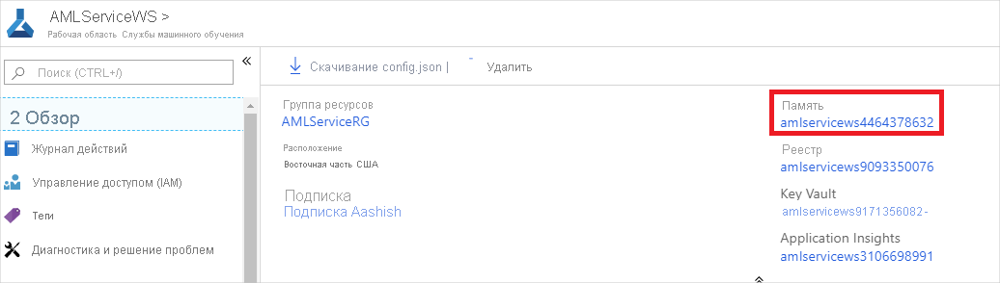
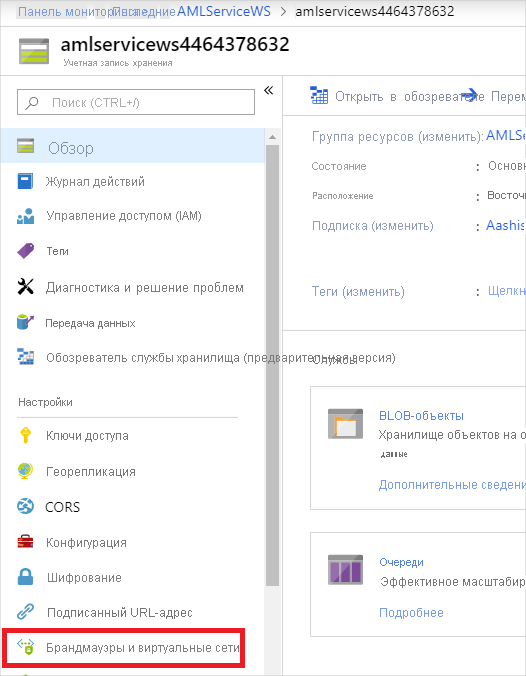
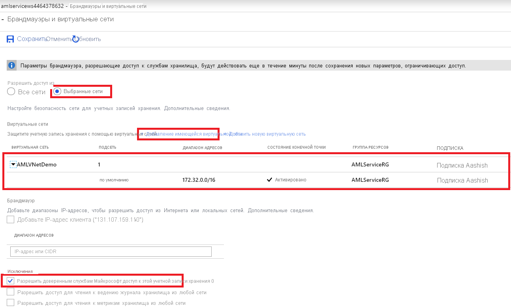
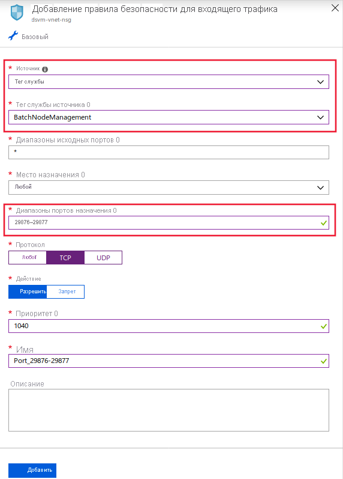
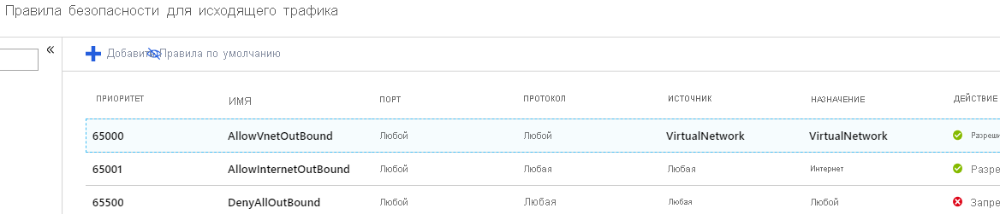
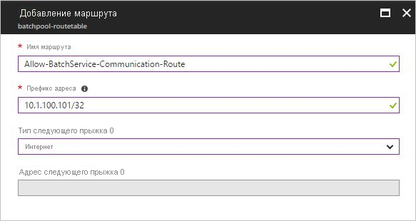
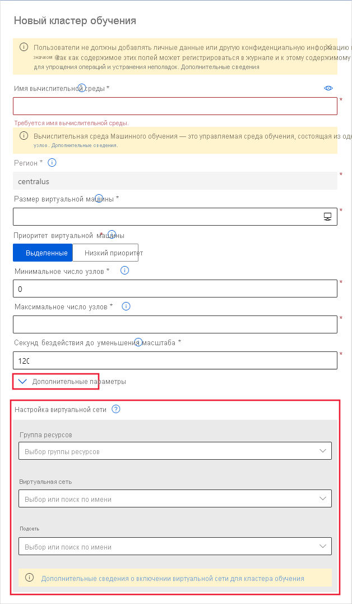
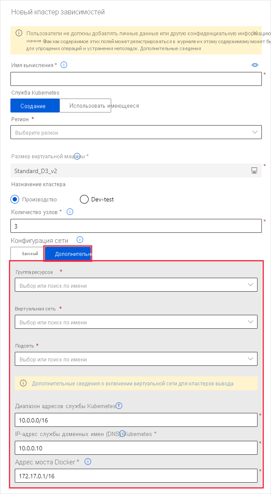
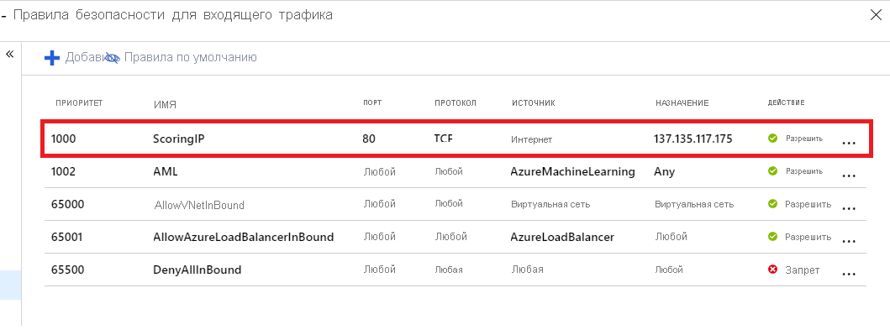
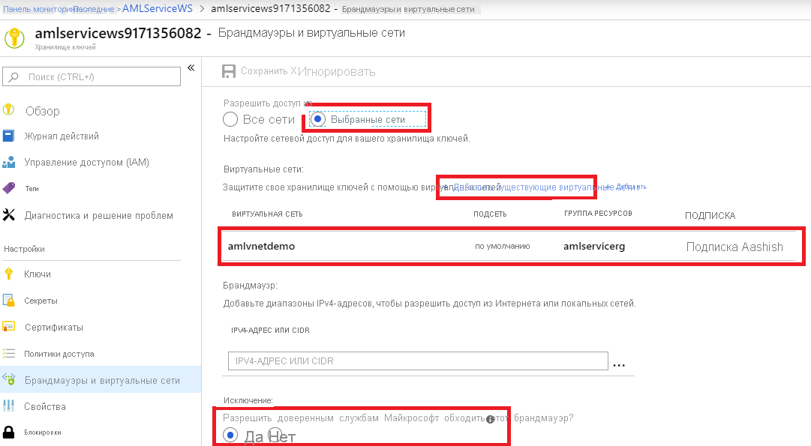

# <a name="network-isolation-during-training--inference-with-private-virtual-networks"></a>Сетевая изоляция во время обучения & вывода с частными виртуальными сетями
[!INCLUDE [applies-to-skus](../../includes/aml-applies-to-basic-enterprise-sku.md)]

В этой статье вы узнаете, как защитить жизненный цикл машинного обучения с помощью изоляции Машинное обучение Azure заданий обучения и вывода в виртуальной сети Azure. Машинное обучение Azure полагается на другие службы Azure для ресурсов вычислений, также известные как [целевые объекты вычислений](concept-compute-target.md), для обучения и развертывания моделей. Эти целевые объекты могут создаваться в виртуальной сети. Например, можно использовать вычислительные ресурсы Машинного обучения Azure для обучения модели с последующим развертыванием модели в службе Azure Kubernetes (AKS). 

__Виртуальная сеть__ выполняет роль границы безопасности, изолируя ресурсы Azure от общедоступного Интернета. Также вы можете подключить виртуальную сеть Azure к локальной сети. Объединяя сети, вы получаете возможность безопасно обучать модели и обращаться к развернутым моделям для формирования выводов.

## <a name="prerequisites"></a>Предварительные требования

+ [Рабочая область](how-to-manage-workspace.md) Машинного обучения Azure.

+ Рабочие знание общих принципов [службы виртуальной сети Azure](https://docs.microsoft.com/azure/virtual-network/virtual-networks-overview) и [IP-сетей](https://docs.microsoft.com/azure/virtual-network/virtual-network-ip-addresses-overview-arm).

+ Существующие виртуальная сеть и подсеть для использования с вычислительными ресурсами.

## <a name="private-endpoints"></a>Частные конечные точки

Кроме того, можно [включить приватный канал Azure](how-to-configure-private-link.md) для подключения к своей рабочей области с использованием частной конечной точки. Частная конечная точка — это набор частных IP-адресов в виртуальной сети. [Узнайте, как настроить эту частную конечную точку.](how-to-configure-private-link.md)


> [!TIP]
> Можно объединить виртуальную сеть и приватный канал, чтобы обеспечить безопасность обмена данными между вашей рабочей областью и другими ресурсами Azure. Однако для некоторых сочетаний требуется рабочая область выпуска Enterprise. Используйте следующую таблицу, чтобы понять, в каких сценариях требуется выпуск Enterprise.
>
> | Сценарий | Enterprise</br>edition | Basic</br>edition |
> | ----- |:-----:|:-----:| 
> | Нет виртуальной сети или приватного канала | ✔ | ✔ |
> | Рабочая область без приватного канала. Другие ресурсы (кроме реестра контейнеров Azure) в виртуальной сети | ✔ | ✔ |
> | Рабочая область без приватного канала. Другие ресурсы с приватным каналом | ✔ | |
> | Рабочая область с приватным каналом. Другие ресурсы (кроме реестра контейнеров Azure) в виртуальной сети | ✔ | ✔ |
> | Рабочая область и другие ресурсы с приватным каналом | ✔ | |
> | Рабочая область с приватным каналом. Другие ресурсы без приватного канала или виртуальной сети | ✔ | ✔ |
> | Реестр контейнеров Azure в виртуальной сети | ✔ | |
> | Управляемые клиентом ключи для рабочей области | ✔ | |
> 

> [!WARNING]
> 
> Предварительная версия вычислительных экземпляров Машинного обучения Azure не поддерживается в рабочей области с включенным приватным каналом.
>
> Машинное обучение Azure не поддерживает использование службы Azure Kubernetes с включенным приватным каналом. Вместо этого можно использовать службу Azure Kubernetes в виртуальной сети. Дополнительные сведения см. в разделе [Защита заданий экспериментирования и анализа Машинного обучения Azure в виртуальной сети Azure](how-to-enable-virtual-network.md)


<a id="amlcompute"></a>

## <a name="machine-learning-studio"></a>Машинное обучение Studio

Если данные хранятся в виртуальной сети, необходимо использовать [управляемое удостоверение](../active-directory/managed-identities-azure-resources/overview.md) рабочей области, чтобы предоставить Studio доступ к данным.

> [!IMPORTANT]
> Хотя большая часть Studio работает с данными, хранящимися в виртуальной сети, интегрированные записные книжки __не имеют__. Интегрированные записные книжки не поддерживают использование хранилища, которое находится в виртуальной сети. Вместо этого можно использовать записные книжки Jupyter из вычислительного экземпляра. Дополнительные сведения см. в разделе [доступ к данным в записной книжке для вычислительных экземпляров](#access-data-in-a-compute-instance-notebook) .

Если не предоставить доступ к Studio, вы получите эту ошибку `Error: Unable to profile this dataset. This might be because your data is stored behind a virtual network or your data does not support profile.` и отключите следующие операции:

* Предварительный просмотр данных в студии.
* Визуализируйте данные в конструкторе.
* Отправьте Аутомл эксперимент.
* Запустите проект меток.

В виртуальной сети Studio поддерживает чтение данных из следующих типов:

* Большой двоичный объект Azure
* Хранилище Azure Data Lake Storage 1-го поколения
* Azure Data Lake Storage 2-го поколения
* База данных SQL Azure

### <a name="add-resources-to-the-virtual-network"></a>Добавление ресурсов в виртуальную сеть 

Добавьте рабочую область и учетную запись хранения в ту же виртуальную сеть, чтобы они могли обращаться друг к другу.

1. Чтобы подключить рабочую область к виртуальной сети, [включите функцию "Частная связь Azure](how-to-configure-private-link.md)". Сейчас эта возможность доступна в предварительной версии. он доступен в восточной части США, Западная часть США 2, в регионах Юго-центрального региона США.

1. Чтобы подключить учетную запись хранения к виртуальной сети, [Настройте параметры брандмауэры и виртуальные сети](#use-a-storage-account-for-your-workspace).

### <a name="configure-a-datastore-to-use-managed-identity"></a>Настройка хранилища данных для использования управляемого удостоверения

После добавления рабочей области и учетной записи службы хранилища в виртуальную сеть необходимо настроить хранилища данных для доступа к данным с помощью управляемого удостоверения. Эти действия позволяют добавить управляемое удостоверение рабочей __области в службу__ хранилища с помощью управления доступом на основе ресурсов Azure (RBAC). Доступ для __чтения__ позволяет рабочей области получить параметры брандмауэра и убедиться, что данные не покидают виртуальную сеть.

1. В студии выберите __хранилища данных__.

1. Чтобы создать новое хранилище данных, выберите __+ создать хранилище данных__. Чтобы обновить существующий объект, выберите хранилище данных и щелкните __обновить учетные данные__.

1. В параметрах хранилища данных выберите __Да__ , __чтобы разрешить машинное обучение Azure службе доступ к хранилищу с помощью управляемого удостоверения рабочей области__.

> [!NOTE]
> Для вступления этих изменений в силу может потребоваться до 10 минут.

### <a name="azure-blob-storage-blob-data-reader"></a>Модуль чтения BLOB-объектов хранилища BLOB-объектов Azure

Для __хранилища BLOB-объектов Azure__управляемое удостоверение рабочей области также добавляется как [модуль чтения данных большого двоичного объекта](../role-based-access-control/built-in-roles.md#storage-blob-data-reader) , чтобы он мог считывать данные из хранилища BLOB-объектов.


### <a name="azure-data-lake-storage-gen2-access-control"></a>Azure Data Lake Storage 2-го поколения контроля доступа

Для управления доступом к данным в виртуальной сети можно использовать как RBAC, так и списки управления доступом (ACL) в стиле POSIX.

Чтобы использовать RBAC, добавьте управляемое удостоверение рабочей области в роль [читателя данных BLOB](../role-based-access-control/built-in-roles.md#storage-blob-data-reader) . Дополнительные сведения см. в разделе [Управление доступом на основе ролей](../storage/blobs/data-lake-storage-access-control.md#role-based-access-control).

Чтобы использовать списки управления доступом, управляемому удостоверению рабочей области можно назначить доступ, как и любой другой принцип безопасности. Дополнительные сведения см. [в разделе списки управления доступом для файлов и каталогов](../storage/blobs/data-lake-storage-access-control.md#access-control-lists-on-files-and-directories).


### <a name="azure-data-lake-storage-gen1-access-control"></a>Azure Data Lake Storage 1-го поколения контроля доступа

Azure Data Lake Storage 1-го поколения поддерживает только списки управления доступом в стиле POSIX. Можно назначить доступ управляемой идентификации рабочей области для ресурсов точно так же, как любой другой принцип безопасности. Дополнительные сведения см. [в разделе Контроль доступа в Azure Data Lake Storage 1-го поколения](../data-lake-store/data-lake-store-access-control.md).


### <a name="azure-sql-database-contained-user"></a>Автономный пользователь базы данных SQL Azure

Чтобы получить доступ к данным, хранящимся в базе данных SQL Azure с помощью управляемого удостоверения, необходимо создать автономного пользователя SQL, сопоставляемого с управляемым удостоверением. Дополнительные сведения о создании пользователя из внешнего поставщика см. в статье [Создание автономных пользователей, сопоставленных с удостоверениями Azure AD](../azure-sql/database/authentication-aad-configure.md#create-contained-users-mapped-to-azure-ad-identities).

После создания автономного пользователя SQL предоставьте ему разрешения с помощью [команды T-SQL GRANT](https://docs.microsoft.com/sql/t-sql/statements/grant-object-permissions-transact-sql).

### <a name="connect-to-the-studio"></a>Подключение к студии

При доступе к студии из ресурса внутри виртуальной сети (например, вычислительного экземпляра или виртуальной машины) необходимо разрешить исходящий трафик из виртуальной сети в студии. 

Например, если вы используете группы безопасности сети (NSG) для ограничения исходящего трафика, добавьте правило в назначение __тега службы__ для __азурефронтдур. интерфейс__.

## <a name="use-a-storage-account-for-your-workspace"></a>Использование учетной записи хранения для своей рабочей области

> [!IMPORTANT]
> Вы можете разместить учетную запись хранения _по умолчанию_ для Машинного обучения Azure или _учетные записи хранения, отличные от используемых по умолчанию,_ в виртуальной сети.
>
> Учетная запись хранения по умолчанию автоматически подготавливается при создании рабочей области.
>
> Для учетных записей хранения, отличных от по умолчанию, параметр `storage_account` в функции [`Workspace.create()`](https://docs.microsoft.com/python/api/azureml-core/azureml.core.workspace(class)?view=azure-ml-py#create-name--auth-none--subscription-id-none--resource-group-none--location-none--create-resource-group-true--sku--basic---friendly-name-none--storage-account-none--key-vault-none--app-insights-none--container-registry-none--cmk-keyvault-none--resource-cmk-uri-none--hbi-workspace-false--default-cpu-compute-target-none--default-gpu-compute-target-none--exist-ok-false--show-output-true-) позволяет указать настраиваемую учетную запись хранения по ИД ресурса Azure.

Чтобы использовать службу хранилища Azure для рабочей области в виртуальной сети, выполните следующие действия.

1. Создайте вычислительный ресурс (например, экземпляр или кластер вычислительных ресурсов машинного обучения) за пределами виртуальной сети или подключите вычислительный ресурс к рабочей области (например, кластер HDInsight, виртуальную машину или кластер службы Azure Kubernetes). Вычислительный ресурс можно использовать для экспериментирования или развертывания модели.

   См. дополнительные сведения в разделах [Использование вычислительной среды машинного обучения](#amlcompute), [Использование виртуальной машины или кластера HDInsight](#vmorhdi) и [Использование службы Azure Kubernetes](#aksvnet) этой статьи.

1. В портал Azure перейдите к службе хранилища, которую вы хотите использовать в рабочей области.

   [](./media/how-to-enable-virtual-network/workspace-storage.png#lightbox)

1. На странице Учетная запись службы хранилища выберите __брандмауэры и виртуальные сети__.

   

1. На странице __Брандмауэры и виртуальные сети__ выполните следующие действия.
    - Выберите __Выбранные сети__.
    - В разделе __Виртуальные сети__ щелкните ссылку __Добавить существующую виртуальную сеть__. Это действие добавляет виртуальную сеть, в которой размещается вычисление (см. шаг 1).

        > [!IMPORTANT]
        > Учетная запись хранения должна находиться в той же виртуальной сети и подсети, что и экземпляры или кластеры вычислительных ресурсов, используемые для обучения или аналитики.

    - Установите флажок __Разрешить доверенным службам Microsoft доступ к этой учетной записи хранения__.

    > [!IMPORTANT]
    > При работе с пакетом SDK для Машинного обучения Azure среда разработки должна иметь возможность подключения к учетной записи хранения Azure. Если учетная запись хранения находится в виртуальной сети, брандмауэр должен разрешить доступ с IP-адреса среды разработки.
    >
    > Чтобы разрешить доступ к учетной записи хранения, посетите раздел __Брандмауэры и виртуальные сети__ для учетной записи хранения *из веб-браузера в клиенте разработки*. Затем используйте флажок __Добавить IP-адрес клиента__, чтобы добавить IP-адрес клиента в __ДИАПАЗОН АДРЕСОВ__. Можно также использовать поле __ДИАПАЗОН АДРЕСОВ__, чтобы вручную ввести IP-адрес среды разработки. После добавления IP-адреса клиента он может получить доступ к учетной записи хранения с помощью пакета SDK.

   [](./media/how-to-enable-virtual-network/storage-firewalls-and-virtual-networks-page.png#lightbox)

## <a name="use-datastores-and-datasets"></a>Использование хранилищ данных и наборов DataSet

В этом разделе рассматриваются сведения об использовании хранилища данных и DataSet для интерфейса SDK. Дополнительные сведения о работе с Studio см. в разделе [машинное обучение Studio](#machine-learning-studio).

По умолчанию Машинное обучение Azure выполняет проверку достоверности данных и учетных данных при попытке доступа к данным с помощью пакета SDK. Если данные находятся за виртуальной сетью, Машинное обучение Azure не сможет получить доступ к данным и не сможет проверить их. Чтобы избежать этого, необходимо создать хранилища данных и наборы DataSet, которые пропускают проверку.

### <a name="use-a-datastore"></a>Использование хранилища данных

 Azure Data Lake Store Gen1 и Azure Data Lake Store по умолчанию пропускают проверку, поэтому дальнейшие действия не требуются. Однако для следующих служб можно использовать аналогичный синтаксис для пропуска проверки хранилища данных:

- Хранилище BLOB-объектов Azure
- Общая папка Azure
- PostgreSQL
- База данных SQL Azure

В следующем примере кода создается хранилище данных BLOB-объектов Azure и задаются наборы `skip_validation=True` .

```python
blob_datastore = Datastore.register_azure_blob_container(workspace=ws,  

                                                         datastore_name=blob_datastore_name,  

                                                         container_name=container_name,  

                                                         account_name=account_name, 

                                                         account_key=account_key, 

                                                         skip_validation=True ) // Set skip_validation to true
```

### <a name="use-a-dataset"></a>Использование набора данных

Синтаксис для пропуска проверки набора данных аналогичен для следующих типов наборов данных:
- Файл с разделителями
- JSON 
- Parquet
- SQL
- Файл

Следующий код создает новый набор данных JSON и задает `validate=False` .

```python
json_ds = Dataset.Tabular.from_json_lines_files(path=datastore_paths, 

validate=False) 

```


## <a name="compute-clusters--instances"></a><a name="compute-instance"></a>Вычислительные кластеры и экземпляры 

Чтобы использовать [управляемый целевой объект вычислений __Машинного обучения Azure__](concept-compute-target.md#azure-machine-learning-compute-managed) или [вычислительный экземпляр  __Машинного обучения Azure__](concept-compute-instance.md) в виртуальной сети, должны выполняться следующие требования к сети.

> [!div class="checklist"]
> * Виртуальная сеть должна размещаться в той же подписке и том же регионе, что и рабочая область Машинного обучения Azure.
> * Указанная для экземпляра или кластера вычислительных ресурсов подсеть должна иметь достаточное (то есть соответствующее количеству виртуальных машин, являющихся целевыми объектами) количество неназначенных IP-адресов. Если в подсети нет достаточного количества свободных IP-адресов, вычислительный кластер будет выделен частично.
> * Проверьте, существуют ли политики безопасности или блокировки в подписке или группе ресурсов виртуальной сети, которые ограничивают права на управление виртуальной сетью. Если вы планируете защитить виртуальную сеть, применив ограничение трафика, оставьте некоторые порты открытыми для вычислительной службы. Дополнительные сведения см. в разделе [Требуемые порты](#mlcports).
> * Если вы собираетесь разместить в одной виртуальной сети несколько экземпляров или кластеров вычислительных ресурсов, может потребоваться увеличить квоту для одного или нескольких ресурсов.
> * Если учетные записи хранения Azure для рабочей области также предусмотрены в виртуальной сети, они должны находиться в той же виртуальной сети, что и экземпляр или кластер вычислительных ресурсов Машинного обучения Azure. 
> * Для работы функциональности Jupyter экземпляра вычислительных ресурсов необходимо убедиться, что связь через веб-сокет не отключена.

> [!TIP]
> Экземпляр или кластер вычислительных ресурсов машинного обучения автоматически выделяет дополнительные сетевые ресурсы __в группе ресурсов, которая содержит виртуальную сеть__. Для каждого экземпляра или кластера вычислительных ресурсов служба выделяет следующие ресурсы:
> 
> * Одна группа безопасности сети
> * Один общедоступный IP-адрес
> * Один балансировщик нагрузки
> 
> В случае с кластерами эти ресурсы удаляются (и создаются повторно) всякий раз, когда кластер масштабируется до 0 узлов. Однако в случае с экземплярами ресурсы удерживаются до тех пор, пока экземпляр не будет полностью удален (при остановке экземпляра ресурсы не удаляются). 
> Эти ресурсы ограничены [квотами ресурсов](https://docs.microsoft.com/azure/azure-resource-manager/management/azure-subscription-service-limits) в подписке.


### <a name="required-ports"></a><a id="mlcports"></a> Требуемые порты

Если вы планируете защитить виртуальную сеть путем запрета сетевого трафика из общедоступного Интернета в Интернет, необходимо разрешить входящие подключения из пакетной службы Azure.

Пакетная служба добавляет группы безопасности сети на уровне сетевых интерфейсов, подключенных к виртуальным машинам. Эти группы безопасности сети автоматически настраивают правила для входящего и исходящего трафика, чтобы разрешить следующий трафик:

- Входящий TCP-трафик на портах 29876 и 29877 с __тега службы__ __BatchNodeManagement__.

    

- (Необязательно.) Входящий трафик по протоколу TCP через порт 22, чтобы разрешить удаленный доступ. Используйте этот порт только в том случае, если вы хотите подключиться по протоколу SSH на общедоступном IP-адресе.

- Исходящий трафик в виртуальную сеть на любом порту.

- Исходящий трафик в Интернет на любом порту.

- Для вычислительного экземпляра входящий TCP-трафик через порт 44224 из __тега службы__ __AzureMachineLearning__.

> [!IMPORTANT]
> Соблюдайте осторожность, если вы изменяете или добавляете правила для входящего и исходящего трафика в группах безопасности сети, настроенных для пакетной службы. Если группа безопасности сети заблокирует связь с вычислительными узлами, вычислительная служба установит для этих вычислительных узлов состояние "Непригодно".
>
> Вам не нужно указывать группы безопасности сети на уровне подсети, так как пакетная служба Azure настраивает собственные группы. Однако если подсеть, содержащая Машинное обучение Azure COMPUTE, имеет связанный группы безопасности сети или брандмауэр, необходимо также разрешить указанный выше трафик.

На следующих рисунках показана настройка правила группы безопасности сети на портале Azure.

:::image type="content" source="./media/how-to-enable-virtual-network/amlcompute-virtual-network-inbound.png" alt-text="Правила NSG для входящего трафика вычислительной среды машинного обучения" border="true":::




### <a name="limit-outbound-connectivity-from-the-virtual-network"></a><a id="limiting-outbound-from-vnet"></a> Ограничение исходящих подключений из виртуальной сети

Если вы не хотите использовать правила для исходящего трафика по умолчанию и хотите ограничить исходящий доступ в виртуальной сети, выполните следующие действия.

- Запретите исходящие интернет-подключения с помощью правил NSG.

- Ограничьте исходящий трафик для __экземпляра вычислительных ресурсов__ или __кластера вычислительных ресурсов__ следующими элементами.
   - Служба хранилища Azure, с помощью __тега службы__ __Storage.RegionName__, где `{RegionName}` — имя региона Azure.
   - Реестр контейнеров Azure, с помощью __тега службы__ __AzureContainerRegistry.RegionName__, где `{RegionName}` — имя региона Azure.
   - Машинное обучение Azure, с помощью __тега службы__ __AzureMachineLearning__
   - Azure Resource Manager, с помощью __тега службы__ __AzureResourceManager__
   - Azure Active Directory, с помощью __тега службы__ __AzureActiveDirectory__

На следующем рисунке показана настройка правила группы безопасности сети на портале Azure.

[](./media/how-to-enable-virtual-network/limited-outbound-nsg-exp.png#lightbox)

> [!NOTE]
> Если вы планируете использовать образы DOCKER по умолчанию, предоставляемые корпорацией Майкрософт, и включите управляемые пользователем зависимости, необходимо также использовать следующие __теги служб__:
>
> * __MicrosoftContainerRegistry__
> * __AzureFrontDoor.FirstParty__
>
> Эта конфигурация необходима при наличии кода, аналогичного приведенным ниже фрагментам, в рамках сценариев обучения.
>
> __Обучение работе с RunConfig__
> ```python
> # create a new runconfig object
> run_config = RunConfiguration()
> 
> # configure Docker 
> run_config.environment.docker.enabled = True
> # For GPU, use DEFAULT_GPU_IMAGE
> run_config.environment.docker.base_image = DEFAULT_CPU_IMAGE 
> run_config.environment.python.user_managed_dependencies = True
> ```
>
> __Обучение работе с оценщиком__
> ```python
> est = Estimator(source_directory='.',
>                 script_params=script_params,
>                 compute_target='local',
>                 entry_script='dummy_train.py',
>                 user_managed=True)
> run = exp.submit(est)
> ```

### <a name="user-defined-routes-for-forced-tunneling"></a>Пользовательские маршруты для принудительного туннелирования

Если вы используете принудительное туннелирование с вычислительной средой машинного обучения, добавьте [определяемые пользователем маршруты](https://docs.microsoft.com/azure/virtual-network/virtual-networks-udr-overview) в подсеть, содержащую вычислительный ресурс.

* Установите UDR для каждого IP-адреса, используемого пакетной службой Azure в регионе, где находятся ваши ресурсы. UDR позволяют пакетной службе взаимодействовать с вычислительными узлами с целью планирования задач. Также добавьте IP-адрес для службы Машинного обучения Azure, где существуют ресурсы, так как это необходимо для доступа к вычислительным экземплярам. Чтобы получить список IP-адресов пакетной службы и службы Машинного обучения Azure, используйте один из следующих методов.

    * Скачайте [диапазоны IP-адресов Azure и теги службы](https://www.microsoft.com/download/details.aspx?id=56519) и найдите в файле `BatchNodeManagement.<region>` и `AzureMachineLearning.<region>`, где `<region>` — ваш регион Azure.

    * Для загрузки информации используйте [интерфейс командной строки Azure](https://docs.microsoft.com/cli/azure/install-azure-cli?view=azure-cli-latest). В следующем примере скачиваются сведения об IP-адресе и фильтруются сведения для региона Восток США 2.

        ```azurecli-interactive
        az network list-service-tags -l "East US 2" --query "values[?starts_with(id, 'Batch')] | [?properties.region=='eastus2']"
        az network list-service-tags -l "East US 2" --query "values[?starts_with(id, 'AzureMachineLearning')] | [?properties.region=='eastus2']"
        ```

* Исходящий трафик в службу хранилища Azure не должен блокироваться локальным сетевым устройством. В частности, URL-адреса представлены в форме `<account>.table.core.windows.net`, `<account>.queue.core.windows.net` и `<account>.blob.core.windows.net`.

При добавлении определяемого пользователем маршрута укажите маршрут для каждого связанного префикса IP-адреса пакетной службы, а также задайте для параметра__Тип следующего прыжка__ значение __Интернет__. На следующем изображении показан пример этого UDR на портале Azure.



См. дополнительные сведения в разделе [Создание пула пакетной службы Azure в виртуальной сети](../batch/batch-virtual-network.md#user-defined-routes-for-forced-tunneling).

### <a name="create-a-compute-cluster-in-a-virtual-network"></a>Создание кластера вычислительных ресурсов в виртуальной сети

Чтобы создать кластер вычислительных ресурсов машинного обучения, выполните следующие действия.

1. Войдите в [студию Машинного обучения Azure](https://ml.azure.com/), выберите свою подписку и рабочую область.

1. Слева выберите пункт __Вычисление__.

1. Выберите __обучающие кластеры__ в центре, а затем — __+__ .

1. В диалоговом окне __Новый обучающий кластер__ разверните раздел __Дополнительные параметры__.

1. Чтобы настроить этот вычислительный ресурс для использования виртуальной сети, выполните следующие действия в разделе __Настройка виртуальной сети__.

    1. В раскрывающемся списке __Группа ресурсов__ выберите группу ресурсов, которая содержит виртуальную сеть.
    1. В раскрывающемся списке __Виртуальная сеть__выберите виртуальную сеть, которая содержит подсеть.
    1. В раскрывающемся списке __Подсеть__ выберите подсеть для использования.

   

Вы также можете создать кластер Вычислительной среды Машинного обучения с помощью пакета SDK для Машинного обучения Azure. Следующий код создает новый кластер Вычислительной среды Машинного обучения в подсети `default`, размещенной в виртуальной сети с именем `mynetwork`:

```python
from azureml.core.compute import ComputeTarget, AmlCompute
from azureml.core.compute_target import ComputeTargetException

# The Azure virtual network name, subnet, and resource group
vnet_name = 'mynetwork'
subnet_name = 'default'
vnet_resourcegroup_name = 'mygroup'

# Choose a name for your CPU cluster
cpu_cluster_name = "cpucluster"

# Verify that cluster does not exist already
try:
    cpu_cluster = ComputeTarget(workspace=ws, name=cpu_cluster_name)
    print("Found existing cpucluster")
except ComputeTargetException:
    print("Creating new cpucluster")

    # Specify the configuration for the new cluster
    compute_config = AmlCompute.provisioning_configuration(vm_size="STANDARD_D2_V2",
                                                           min_nodes=0,
                                                           max_nodes=4,
                                                           vnet_resourcegroup_name=vnet_resourcegroup_name,
                                                           vnet_name=vnet_name,
                                                           subnet_name=subnet_name)

    # Create the cluster with the specified name and configuration
    cpu_cluster = ComputeTarget.create(ws, cpu_cluster_name, compute_config)

    # Wait for the cluster to be completed, show the output log
    cpu_cluster.wait_for_completion(show_output=True)
```

Когда завершится процесс создания, переходите в своем эксперименте к обучению модели с помощью кластера. Дополнительные сведения вы найдете в статье [Настройка целевых объектов вычислений для обучения моделей](how-to-set-up-training-targets.md).

### <a name="access-data-in-a-compute-instance-notebook"></a>Доступ к данным в записной книжке экземпляра COMPUTE

Если вы используете записные книжки в экземпляре Azure COMPUTE, необходимо убедиться, что ваша Записная книжка работает на вычислительном ресурсе, который находится за той же виртуальной сетью и подсетью, что и ваши данные. 

Необходимо настроить экземпляр вычислений в той же виртуальной сети во время создания в разделе **Дополнительные параметры**  >  **Настройка виртуальной сети**. Нельзя добавить существующий вычислительный экземпляр в виртуальную сеть.

<a id="aksvnet"></a>

## <a name="azure-kubernetes-service"></a>Служба Azure Kubernetes

Чтобы добавить к рабочей области службу Azure Kubernetes, размещенную в виртуальной сети, выполните следующие шаги.

> [!IMPORTANT]
> Прежде чем приступить к описанной ниже процедуре, выполните предварительные требования, описанные в разделе [Настройка расширенной сети в службе Azure Kubernetes (AKS)](https://docs.microsoft.com/azure/aks/configure-azure-cni#prerequisites), практические инструкции и спланируйте IP-адресацию для своего кластера.
>
> Экземпляр AKS и виртуальная сеть Azure должны располагаться в одном регионе. Если вы предоставляете учетные записи хранения Azure, используемые рабочей областью в виртуальной сети, они должны находиться в той же виртуальной сети, что и экземпляр AKS.

> [!WARNING]
> Машинное обучение Azure не поддерживает использование службы Azure Kubernetes с включенным приватным каналом.

1. Войдите в [студию Машинного обучения Azure](https://ml.azure.com/), выберите свою подписку и рабочую область.

1. Слева выберите пункт __Вычисление__.

1. Выберите __Кластеры аналитики__ в центре, а затем — __+__ .

1. В диалоговом окне __Создание кластера аналитики__ выберите __Дополнительно__в разделе __Конфигурация сети__.

1. Чтобы настроить этот виртуальный ресурс для использования виртуальной сети, выполните следующие действия.

    1. В раскрывающемся списке __Группа ресурсов__ выберите группу ресурсов, которая содержит виртуальную сеть.
    1. В раскрывающемся списке __Виртуальная сеть__выберите виртуальную сеть, которая содержит подсеть.
    1. В раскрывающемся списке __Подсеть__ выберите подсеть.
    1. В поле __Диапазон адресов службы Kubernetes__ введите диапазон адресов службы Kubernetes. Этот диапазон адресов использует диапазон IP-адресов нотации CIDR для определения IP-адресов, которые доступны этому кластеру. Он не должен пересекаться с диапазонами IP-адресов подсети (например, 10.0.0.0/16).
    1. В поле __IP-адрес службы DNS Kubernetes__ введите IP-адрес службы DNS Kubernetes. Это IP-адрес, назначенный службе DNS Kubernetes. Он должен находиться в пределах диапазона адресов службы Kubernetes (например, 10.0.0.10).
    1. В поле __Адрес моста Docker__ введите адрес моста Docker. Этот IP-адрес, назначенный мосту Docker. Он не должен пересекаться с диапазоном IP-адресов, выделенным для любой подсети или службы Kubernetes (например, 172.17.0.1/16).

   

1. Убедитесь, что в группе NSG, управляющей виртуальной сетью, включено правило безопасности входящего трафика для конечной точки оценки, чтобы ее можно было вызывать извне виртуальной сети.
   > [!IMPORTANT]
   > Сохраните правила по умолчанию для исходящего трафика для группы безопасности сети. Дополнительные сведения см. в описании стандартных правил безопасности в статье [о группах безопасности](https://docs.microsoft.com/azure/virtual-network/security-overview#default-security-rules).

   [](./media/how-to-enable-virtual-network/aks-vnet-inbound-nsg-scoring.png#lightbox)

Вы также можете использовать пакет SDK для Машинного обучения Azure, чтобы добавить в виртуальную сеть службу Azure Kubernetes. Если в вашей виртуальной сети уже есть кластер AKS, можно подключить его к рабочей области, следуя инструкциям в разделе [Развертывание в AKS](how-to-deploy-and-where.md). Следующий код создает новый экземпляр AKS в подсети `default` виртуальной сети с именем `mynetwork`.

```python
from azureml.core.compute import ComputeTarget, AksCompute

# Create the compute configuration and set virtual network information
config = AksCompute.provisioning_configuration(location="eastus2")
config.vnet_resourcegroup_name = "mygroup"
config.vnet_name = "mynetwork"
config.subnet_name = "default"
config.service_cidr = "10.0.0.0/16"
config.dns_service_ip = "10.0.0.10"
config.docker_bridge_cidr = "172.17.0.1/16"

# Create the compute target
aks_target = ComputeTarget.create(workspace=ws,
                                  name="myaks",
                                  provisioning_configuration=config)
```

Когда завершится процесс создания, вы сможете выполнять анализ или оценку моделей в кластере AKS за виртуальной сетью. Дополнительные сведения см. в статье [о развертывании в Службе Azure Kubernetes](how-to-deploy-and-where.md).

### <a name="use-private-ips-with-azure-kubernetes-service"></a>Использование частных IP-адресов со службой Azure Kubernetes

По умолчанию для развертываний AKS назначается общедоступный IP-адрес. При использовании AKS внутри виртуальной сети можно использовать вместо него частный IP-адрес. Частные IP-адреса доступны только из виртуальной сети или из объединенных сетей.

Частный IP-адрес включается путем настройки AKS для использования _внутреннего балансировщика нагрузки_. 

> [!IMPORTANT]
> Невозможно включить частный IP-адрес при создании кластера службы Azure Kubernetes. Он должен быть включен в качестве обновления существующего кластера.

В следующем фрагменте кода показано, как __создать новый кластер AKS__, а затем обновить его для использования частного IP-адреса или внутреннего балансировщика нагрузки:

```python
import azureml.core
from azureml.core.compute.aks import AksUpdateConfiguration
from azureml.core.compute import AksCompute, ComputeTarget

# Verify that cluster does not exist already
try:
    aks_target = AksCompute(workspace=ws, name=aks_cluster_name)
    print("Found existing aks cluster")

except:
    print("Creating new aks cluster")

    # Subnet to use for AKS
    subnet_name = "default"
    # Create AKS configuration
    prov_config = AksCompute.provisioning_configuration(location = "eastus2")
    # Set info for existing virtual network to create the cluster in
    prov_config.vnet_resourcegroup_name = "myvnetresourcegroup"
    prov_config.vnet_name = "myvnetname"
    prov_config.service_cidr = "10.0.0.0/16"
    prov_config.dns_service_ip = "10.0.0.10"
    prov_config.subnet_name = subnet_name
    prov_config.docker_bridge_cidr = "172.17.0.1/16"

    # Create compute target
    aks_target = ComputeTarget.create(workspace = ws, name = "myaks", provisioning_configuration = prov_config)
    # Wait for the operation to complete
    aks_target.wait_for_completion(show_output = True)
    
    # Update AKS configuration to use an internal load balancer
    update_config = AksUpdateConfiguration(None, "InternalLoadBalancer", subnet_name)
    aks_target.update(update_config)
    # Wait for the operation to complete
    aks_target.wait_for_completion(show_output = True)
```

__Azure CLI__

```azurecli-interactive
az rest --method put --uri https://management.azure.com/subscriptions/<subscription-id>/resourceGroups/<resource-group>/providers/Microsoft.MachineLearningServices/workspaces/<workspace>/computes/<compute>?api-version=2018-11-19 --body @body.json
```

Содержимое файла `body.json`, на которое ссылается команда, аналогично следующему документу JSON:

```json
{ 
    "location": "<region>", 
    "properties": { 
        "resourceId": "/subscriptions/<subscription-id>/resourcegroups/<resource-group>/providers/Microsoft.ContainerService/managedClusters/<aks-resource-name>", 
        "computeType": "AKS", 
        "provisioningState": "Succeeded", 
        "properties": { 
            "loadBalancerType": "InternalLoadBalancer", 
            "agentCount": <agent-count>, 
            "agentVmSize": "vm-size", 
            "clusterFqdn": "<cluster-fqdn>" 
        } 
    } 
} 
```

При __присоединении существующего кластера__ к рабочей области необходимо подождать, пока не будет выполнена операция присоединения для настройки балансировщика нагрузки.

Сведения о присоединении кластера см. в разделе [Подключение существующего кластера AKS](how-to-deploy-azure-kubernetes-service.md#attach-an-existing-aks-cluster).

После присоединения существующего кластера можно обновить кластер, чтобы использовать частный IP-адрес.

```python
import azureml.core
from azureml.core.compute.aks import AksUpdateConfiguration
from azureml.core.compute import AksCompute

# ws = workspace object. Creation not shown in this snippet
aks_target = AksCompute(ws,"myaks")

# Change to the name of the subnet that contains AKS
subnet_name = "default"
# Update AKS configuration to use an internal load balancer
update_config = AksUpdateConfiguration(None, "InternalLoadBalancer", subnet_name)
aks_target.update(update_config)
# Wait for the operation to complete
aks_target.wait_for_completion(show_output = True)
```

__Роль "участник сети"__

> [!IMPORTANT]
> Если вы создаете или подключаете кластер AKS, предоставив ранее созданную виртуальную сеть, необходимо предоставить субъекту-службе (SP) или управляемому удостоверению для кластера AKS роль " _участник сети_ " для группы ресурсов, содержащей виртуальную сеть. Это необходимо сделать, прежде чем пытаться изменить внутреннюю подсистему балансировки нагрузки на частный IP-адрес.
>
> Чтобы добавить удостоверение в качестве участника сети, выполните следующие действия.

1. Чтобы найти субъект-службу или идентификатор управляемого удостоверения для AKS, используйте следующие Azure CLI команды. Замените `<aks-cluster-name>` именем кластера. Замените `<resource-group-name>` именем группы ресурсов, которая _содержит кластер AKS_:

    ```azurecli-interactive
    az aks show -n <aks-cluster-name> --resource-group <resource-group-name> --query servicePrincipalProfile.clientId
    ``` 

    Если эта команда возвращает значение `msi` , используйте следующую команду, чтобы указать идентификатор субъекта для управляемого удостоверения:

    ```azurecli-interactive
    az aks show -n <aks-cluster-name> --resource-group <resource-group-name> --query identity.principalId
    ```

1. Чтобы узнать идентификатор группы ресурсов, содержащей виртуальную сеть, используйте следующую команду. Замените `<resource-group-name>` именем группы ресурсов, _содержащей виртуальную сеть_.

    ```azurecli-interactive
    az group show -n <resource-group-name> --query id
    ```

1. Чтобы добавить субъект-службу или управляемое удостоверение в качестве участника сети, используйте следующую команду. Замените `<SP-or-managed-identity>` идентификатором, возвращенным для субъекта-службы или управляемого удостоверения. Замените `<resource-group-id>` идентификатором, возвращенным для группы ресурсов, содержащей виртуальную сеть.

    ```azurecli-interactive
    az role assignment create --assignee <SP-or-managed-identity> --role 'Network Contributor' --scope <resource-group-id>
    ```
Дополнительные сведения об использовании внутреннего балансировщика нагрузки с AKS см. в разделе [Использование внутреннего балансировщика нагрузки со службой Azure Kubernetes](/azure/aks/internal-lb).

## <a name="use-azure-container-instances-aci"></a>Использование экземпляров контейнеров Azure (ACI)

Экземпляры контейнеров Azure динамически создаются при развертывании модели. Чтобы Машинное обучение Azure могло создать ACI в виртуальной сети, необходимо включить __делегирование подсети__ для подсети, используемой в развертывании.

> [!WARNING]
> При использовании экземпляров контейнеров Azure в виртуальной сети виртуальная сеть должна находиться в той же группе ресурсов, что и Рабочая область Машинное обучение Azure.
>
> При использовании экземпляров контейнеров Azure в виртуальной сети реестр контейнеров Azure (запись контроля доступа) для рабочей области также не может находиться в виртуальной сети.

Чтобы использовать ACI в виртуальной сети своей рабочей области, выполните следующие действия.

1. Чтобы включить делегирование подсети в виртуальной сети, используйте сведения, приведенные в статье [Добавление или удаление делегирования подсети](../virtual-network/manage-subnet-delegation.md). Делегирование можно включить при создании виртуальной сети или добавить в существующую сеть.

    > [!IMPORTANT]
    > При включении делегирования используйте `Microsoft.ContainerInstance/containerGroups` в качестве значения __Делегировать подсеть службе__.

2. Разверните модель с помощью [AciWebservice.deploy_configuration()](https://docs.microsoft.com/python/api/azureml-core/azureml.core.webservice.aci.aciwebservice?view=azure-ml-py#deploy-configuration-cpu-cores-none--memory-gb-none--tags-none--properties-none--description-none--location-none--auth-enabled-none--ssl-enabled-none--enable-app-insights-none--ssl-cert-pem-file-none--ssl-key-pem-file-none--ssl-cname-none--dns-name-label-none--primary-key-none--secondary-key-none--collect-model-data-none--cmk-vault-base-url-none--cmk-key-name-none--cmk-key-version-none--vnet-name-none--subnet-name-none-), используйте параметры `vnet_name` и `subnet_name`. Задайте для этих параметров имя виртуальной сети и подсеть, в которой включено делегирование.

## <a name="azure-firewall"></a>Брандмауэр Azure

Сведения об использовании Машинного обучения Azure с брандмауэром Azure см. в статье [Использование рабочей области Машинного обучения Azure за брандмауэром Azure](how-to-access-azureml-behind-firewall.md).

## <a name="azure-container-registry"></a>Реестр контейнеров Azure

> [!IMPORTANT]
> Реестр контейнеров Azure можно разместить в виртуальной сети, однако необходимо выполнить следующие предварительные требования.
>
> * Рабочая область Машинного обучения Azure (выпуск Enterprise). Сведения об обновлении см. в разделе [Обновление до выпуска Enterprise](how-to-manage-workspace.md#upgrade).
> * Реестр контейнеров Azure должен иметь версию Premium. Дополнительные сведения об обновлении см. в разделе [Изменение SKU](/azure/container-registry/container-registry-skus#changing-skus).
> * Реестр контейнеров Azure должен находиться в той же виртуальной сети и подсети, что и учетная запись хранения и целевые объекты вычислений, используемые для обучения или аналитики.
> * Рабочая область Машинного обучения Azure должна содержать [кластер вычислительных ресурсов Машинного обучения Azure](how-to-set-up-training-targets.md#amlcompute).
>
>     Если ACR находится за виртуальной сетью, Машинное обучение Azure не может использовать его напрямую для создания образов Docker. Вместо этого для построения образов используется кластер вычислений.

1. Чтобы найти имя реестра контейнеров Azure для рабочей области, используйте один из следующих методов.

    __Портал Azure__

    В разделе "Обзор" вашей рабочей области значение __Реестр__ позволяет перейти в реестр контейнеров Azure.

    :::image type="content" source="./media/how-to-enable-virtual-network/azure-machine-learning-container-registry.png" alt-text="Реестр контейнеров Azure для рабочей области" border="true":::.

    __Azure CLI__

    Если вы [установили расширение машинного обучения для интерфейса командной строки Azure](reference-azure-machine-learning-cli.md), можно использовать команду `az ml workspace show` для отображения сведений о рабочей области.

    ```azurecli-interactive
    az ml workspace show -w yourworkspacename -g resourcegroupname --query 'containerRegistry'
    ```

    Эта команда возвращает значение следующего вида: `"/subscriptions/{GUID}/resourceGroups/{resourcegroupname}/providers/Microsoft.ContainerRegistry/registries/{ACRname}"`. Последняя часть строки — это имя реестра контейнеров Azure для рабочей области.

1. Чтобы ограничить доступ к виртуальной сети, выполните действия, описанные в разделе [Настройка сетевого доступа для реестра](../container-registry/container-registry-vnet.md#configure-network-access-for-registry). При добавлении виртуальной сети выберите виртуальную сеть и подсеть для ресурсов Машинного обучения Azure.

1. Используйте пакет SDK Python для Машинного обучения Azure, чтобы настроить кластер вычислительных ресурсов для создания образов Docker. В следующем фрагменте кода показано, как это сделать.

    ```python
    from azureml.core import Workspace
    # Load workspace from an existing config file
    ws = Workspace.from_config()
    # Update the workspace to use an existing compute cluster
    ws.update(image_build_compute = 'mycomputecluster')
    ```

    > [!IMPORTANT]
    > Учетная запись хранения, кластер вычислений и реестр контейнеров Azure должны находиться в одной подсети виртуальной сети.
    
    Дополнительную информацию см. в справочном руководстве по методу [update()](https://docs.microsoft.com/python/api/azureml-core/azureml.core.workspace.workspace?view=azure-ml-py#update-friendly-name-none--description-none--tags-none--image-build-compute-none--enable-data-actions-none-).

1. Необходимо использовать следующий шаблон Azure Resource Manager. Этот шаблон позволяет рабочей области взаимодействовать с ACR.

    ```json
    {
    "$schema": "https://schema.management.azure.com/schemas/2015-01-01/deploymentTemplate.json#",
    "contentVersion": "1.0.0.0",
    "parameters": {
        "keyVaultArmId": {
        "type": "string"
        },
        "workspaceName": {
        "type": "string"
        },
        "containerRegistryArmId": {
        "type": "string"
        },
        "applicationInsightsArmId": {
        "type": "string"
        },
        "storageAccountArmId": {
        "type": "string"
        },
        "location": {
        "type": "string"
        }
    },
    "resources": [
        {
        "type": "Microsoft.MachineLearningServices/workspaces",
        "apiVersion": "2019-11-01",
        "name": "[parameters('workspaceName')]",
        "location": "[parameters('location')]",
        "identity": {
            "type": "SystemAssigned"
        },
        "sku": {
            "tier": "enterprise",
            "name": "enterprise"
        },
        "properties": {
            "sharedPrivateLinkResources":
    [{"Name":"Acr","Properties":{"PrivateLinkResourceId":"[concat(parameters('containerRegistryArmId'), '/privateLinkResources/registry')]","GroupId":"registry","RequestMessage":"Approve","Status":"Pending"}}],
            "keyVault": "[parameters('keyVaultArmId')]",
            "containerRegistry": "[parameters('containerRegistryArmId')]",
            "applicationInsights": "[parameters('applicationInsightsArmId')]",
            "storageAccount": "[parameters('storageAccountArmId')]"
        }
        }
    ]
    }
    ```

## <a name="key-vault-instance"></a>Экземпляр хранилища ключей 

Экземпляр хранилища ключей, связанный с рабочей областью, используется машинным обучением Azure для сохранения следующих учетных данных:
* строка подключения связанной учетной записи хранения;
* пароли для экземпляров репозитория контейнеров Azure;
* строки подключения к хранилищам данных.

Чтобы использовать возможности экспериментирования в системе Машинного обучения Azure с хранилищем ключей Azure за виртуальной сетью, выполните следующие действия.

1. Перейдите в хранилище ключей, связанное с рабочей областью.

   [](./media/how-to-enable-virtual-network/workspace-key-vault.png#lightbox)

1. На странице __Хранилище ключей__в левой области выберите __Брандмауэры и виртуальные сети__.

   

1. На странице __Брандмауэры и виртуальные сети__ выполните следующие действия.
    - В разделе __Разрешить доступ из__ щелкните __Выбранные сети__.
    - В разделе __Виртуальные сети__ выберите __Добавить существующие виртуальные сети__, чтобы добавить виртуальную сеть, в которой находится вычислительная среда для экспериментирования.
    - В разделе __Разрешить доверенным службам Microsoft обходить этот брандмауэр__ выберите __Да__.

   [](./media/how-to-enable-virtual-network/key-vault-firewalls-and-virtual-networks-page.png#lightbox)


## <a name="azure-databricks"></a>Azure Databricks

Чтобы использовать Azure Databricks в виртуальной сети с рабочей областью, должны выполняться следующие требования.

> [!div class="checklist"]
> * Виртуальная сеть должна размещаться в той же подписке и том же регионе, что и рабочая область Машинного обучения Azure.
> * Если учетные записи хранения Azure для рабочей области также предусмотрены в виртуальной сети, они должны находиться в той же виртуальной сети, что и кластер Azure Databricks.
> * В дополнение к подсетям __databricks-private__ и __databricks-public__, используемым Azure Databricks, необходимо также создать подсеть __по умолчанию__ для виртуальной сети.

Конкретные сведения об использовании Azure Databricks с виртуальной сетью см. в разделе [Развертывание Azure Databricks в виртуальной сети Azure](https://docs.azuredatabricks.net/administration-guide/cloud-configurations/azure/vnet-inject.html).

<a id="vmorhdi"></a>

## <a name="virtual-machine-or-hdinsight-cluster"></a>Виртуальная машина или кластер HDInsight

> [!IMPORTANT]
> Машинное обучение Azure поддерживает только виртуальные машины под управлением Ubuntu.

Чтобы использовать в рабочей области виртуальную машину или кластер Azure HDInsight в виртуальной сети, следуйте инструкциям ниже.

1. Создайте виртуальную машину или кластер HDInsight с помощью портала Azure или Azure CLI, а затем поместите кластер в виртуальную сеть Azure. Дополнительные сведения см. в следующих статьях:
    * [Создание и администрирование виртуальных сетей Azure для виртуальных машин Linux](https://docs.microsoft.com/azure/virtual-machines/linux/tutorial-virtual-network)

    * [Расширение возможностей HDInsight с помощью виртуальной сети Azure](https://docs.microsoft.com/azure/hdinsight/hdinsight-extend-hadoop-virtual-network).

1. Чтобы разрешить Машинному обучению Azure обращаться к порту SSH на виртуальной машине или в кластере, следует настроить для группы безопасности сети запись с данными об источнике. Обычно для SSH используется порт 22. Чтобы разрешить трафик от этого источника, выполните следующие действия.

    * В раскрывающемся списке __Источник__ выберите значение __Тег службы__.

    * В раскрывающемся списке __Тег исходной службы__ выберите __AzureMachineLearning__.

    * В раскрывающемся списке __Исходный диапазон портов__ выберите __*__ .

    * В раскрывающемся списке __Назначение__ выберите __Любое__.

    * В раскрывающемся списке __Диапазоны портов назначения__ выберите __22__.

    * Для параметра __Протокол__ выберите значение __Любой__.

    * В поле __Действие__ выберите __Разрешить__.

   

    Используйте правила входящего трафика по умолчанию для группы безопасности сети. Дополнительные сведения см. в описании стандартных правил безопасности в статье [о группах безопасности](https://docs.microsoft.com/azure/virtual-network/security-overview#default-security-rules).

    Если вы не хотите использовать правила для исходящего трафика по умолчанию и хотите ограничить исходящий доступ в виртуальной сети, следуйте инструкциям в разделе [Ограничение исходящих подключений из виртуальной сети](#limiting-outbound-from-vnet).

1. Подключите виртуальную машину или кластер HDInsight к рабочей области Машинного обучения Azure. Дополнительные сведения вы найдете в статье [Настройка целевых объектов вычислений для обучения моделей](how-to-set-up-training-targets.md).


## <a name="next-steps"></a>Дальнейшие действия

* [Настройка сред обучения](how-to-set-up-training-targets.md)
* [Настройка частных конечных точек](how-to-configure-private-link.md)
* [Где следует развертывать модели](how-to-deploy-and-where.md)
* [Использование TLS для защиты веб-службы с помощью Машинного обучения Azure](how-to-secure-web-service.md).
