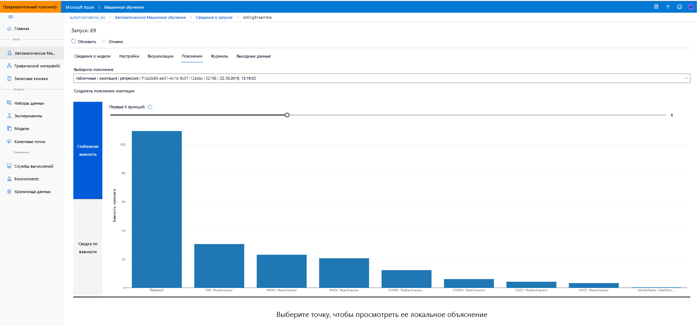

# <a name="model-interpretability-in-automated-machine-learning"></a>Интерпретируемость моделей в автоматизированном машинном обучении

[!INCLUDE [applies-to-skus](../../includes/aml-applies-to-basic-enterprise-sku.md)]

В этой статье вы узнаете, как включить функции интерпретации для автоматизированного машинного обучения (ML) в Azure Machine Learning. Автоматизированный ML поможет вам понять важность инженерных функций. 

Все версии SDK после 1.0.85 установлены `model_explainability=True` по умолчанию. В версии SDK 1.0.85 и `model_explainability=True` более `AutoMLConfig` ранних версиях пользователи должны установить в объекте для того, чтобы использовать интерпретацию модели. 

Вы узнаете, как выполнять следующие задачи:

- Выполняйте интерпретацию во время обучения для лучшей модели или любой модели.
- Включить визуализацию, чтобы помочь вам увидеть закономерности в данных и объяснениях.
- Реализация интерпретации во время выводов или забил.

## <a name="prerequisites"></a>Предварительные требования

- Особенности интерпретации. Бегите, `pip install azureml-interpret azureml-contrib-interpret` чтобы получить необходимые пакеты.
- Знание построения автоматизированных экспериментов ML. Для получения дополнительной информации о том, как использовать Azure Machine Learning SDK, заполните учебник модели [регрессии](tutorial-auto-train-models.md) или посмотрите, как [настроить автоматизированные эксперименты ML.](how-to-configure-auto-train.md)

## <a name="interpretability-during-training-for-the-best-model"></a>Интерпретация во время обучения для лучшей модели

Получить объяснение от `best_run`, который включает в себя объяснения для инженерных функций.

### <a name="download-engineered-feature-importance-from-artifact-store"></a>Скачать инженерию важности функции из магазина артефактов

Вы можете `ExplanationClient` использовать для загрузки инженерных объяснений `best_run`функции из магазина артефактов . 

```python
from azureml.explain.model._internal.explanation_client import ExplanationClient

client = ExplanationClient.from_run(best_run)
engineered_explanations = client.download_model_explanation(raw=False)
print(engineered_explanations.get_feature_importance_dict())
```

## <a name="interpretability-during-training-for-any-model"></a>Интерпретация во время обучения для любой модели 

При вычислении объяснений модели и визуализации их вы не ограничиваете существующим объяснением модели для автоматизированной модели ML. Вы также можете получить объяснение для вашей модели с различными тестовыми данными. Шаги в этом разделе показывают, как вычислить и визуализировать инженерию важности функции на основе тестовых данных.

### <a name="retrieve-any-other-automl-model-from-training"></a>Извлекайте любую другую модель AutoML из обучения

```python
automl_run, fitted_model = local_run.get_output(metric='accuracy')
```

### <a name="set-up-the-model-explanations"></a>Настройка объяснений модели

Используйте `automl_setup_model_explanations` для получения инженерных объяснений. Может `fitted_model` генерировать следующие элементы:

- Рекомендуемые данные из подготовленных или тестовых образцов
- Составленные списки имен функций
- Намечаемые классы в помеченной колонке в сценариях классификации

Содержит `automl_explainer_setup_obj` все структуры из списка выше.

```python
from azureml.train.automl.runtime.automl_explain_utilities import automl_setup_model_explanations

automl_explainer_setup_obj = automl_setup_model_explanations(fitted_model, X=X_train, 
                                                             X_test=X_test, y=y_train, 
                                                             task='classification')
```

### <a name="initialize-the-mimic-explainer-for-feature-importance"></a>Инициализация Мимитического Объяснения для важности функции

Для создания объяснения для моделей `MimicWrapper` AutoML используйте класс. Вы можете инициализировать MimicWrapper с этими параметрами:

- Объект установки объяснений
- Ваше рабочее пространство
- Модель LightGBM, которая выступает в `fitted_model` качестве суррогата для автоматизированной модели ML

MimicWrapper также принимает `automl_run` объект, где инженерии объяснения будут загружены.

```python
from azureml.explain.model.mimic.models.lightgbm_model import LGBMExplainableModel
from azureml.explain.model.mimic_wrapper import MimicWrapper

# Initialize the Mimic Explainer
explainer = MimicWrapper(ws, automl_explainer_setup_obj.automl_estimator, LGBMExplainableModel, 
                         init_dataset=automl_explainer_setup_obj.X_transform, run=automl_run,
                         features=automl_explainer_setup_obj.engineered_feature_names, 
                         feature_maps=[automl_explainer_setup_obj.feature_map],
                         classes=automl_explainer_setup_obj.classes)
```

### <a name="use-mimicexplainer-for-computing-and-visualizing-engineered-feature-importance"></a>Используйте MimicExplainer для вычислений и визуализации инженерных значений функций

Вы можете `explain()` вызвать метод в MimicWrapper с преобразованными образцами теста, чтобы получить значение функции для сгенерированных инженерных функций. Вы также `ExplanationDashboard` можете использовать для просмотра визуализации панели мониторинга значений значения значений значений значений значений значений сгенерированных инженерных функций с помощью автоматизированных ML featurizers.

```python
engineered_explanations = explainer.explain(['local', 'global'], eval_dataset=automl_explainer_setup_obj.X_test_transform)
print(engineered_explanations.get_feature_importance_dict())
```

### <a name="interpretability-during-inference"></a>Интерпретация во время выводов

В этом разделе вы узнаете, как операционную автоматизированную модель ML с помощью объяснителя, который использовался для вычисления объяснений в предыдущем разделе.

### <a name="register-the-model-and-the-scoring-explainer"></a>Регистрация модели и скоринга объяснить

Используйте `TreeScoringExplainer` для создания пояснения скоринга, который будет вычислять инженерные значения значения значения функциональности во время выводов. Вы инициализируете `feature_map` скоринг объяснение с тем, что было вычислено ранее. 

Сохранить скоринг объяснить, а затем зарегистрировать модель и скоринга объяснить с моделью управления службой управления. Выполните следующий код:

```python
from azureml.interpret.scoring.scoring_explainer import TreeScoringExplainer, save

# Initialize the ScoringExplainer
scoring_explainer = TreeScoringExplainer(explainer.explainer, feature_maps=[automl_explainer_setup_obj.feature_map])

# Pickle scoring explainer locally
save(scoring_explainer, exist_ok=True)

# Register trained automl model present in the 'outputs' folder in the artifacts
original_model = automl_run.register_model(model_name='automl_model', 
                                           model_path='outputs/model.pkl')

# Register scoring explainer
automl_run.upload_file('scoring_explainer.pkl', 'scoring_explainer.pkl')
scoring_explainer_model = automl_run.register_model(model_name='scoring_explainer', model_path='scoring_explainer.pkl')
```

### <a name="create-the-conda-dependencies-for-setting-up-the-service"></a>Создание зависимостей conda для настройки службы

Затем создайте необходимые зависимости среды в контейнере для развернутой модели. Обратите внимание, что по умолчанию azureml с версией >1.0.45 должны быть указаны как зависимость от пипсов, поскольку она содержит функциональность, необходимую для размещения модели в качестве веб-сервиса.

```python
from azureml.core.conda_dependencies import CondaDependencies

azureml_pip_packages = [
    'azureml-interpret', 'azureml-train-automl', 'azureml-defaults'
]

myenv = CondaDependencies.create(conda_packages=['scikit-learn', 'pandas', 'numpy', 'py-xgboost<=0.80'],
                                 pip_packages=azureml_pip_packages,
                                 pin_sdk_version=True)

with open("myenv.yml","w") as f:
    f.write(myenv.serialize_to_string())

with open("myenv.yml","r") as f:
    print(f.read())

```

### <a name="deploy-the-service"></a>Развертывание службы

Развертывайте службу с помощью файла conda и скорингового файла из предыдущих шагов.

```python
from azureml.core.webservice import Webservice
from azureml.core.webservice import AciWebservice
from azureml.core.model import Model, InferenceConfig
from azureml.core.environment import Environment

aciconfig = AciWebservice.deploy_configuration(cpu_cores=1,
                                               memory_gb=1,
                                               tags={"data": "Bank Marketing",  
                                                     "method" : "local_explanation"},
                                               description='Get local explanations for Bank marketing test data')
myenv = Environment.from_conda_specification(name="myenv", file_path="myenv.yml")
inference_config = InferenceConfig(entry_script="score_local_explain.py", environment=myenv)

# Use configs and models generated above
service = Model.deploy(ws,
                       'model-scoring',
                       [scoring_explainer_model, original_model],
                       inference_config,
                       aciconfig)
service.wait_for_deployment(show_output=True)
```

### <a name="inference-with-test-data"></a>Вывод с тестовыми данными

Вывод с некоторыми тестовыми данными, чтобы увидеть прогнозируемое значение от автоматизированной модели ML. Просмотр инженерного значения объекта для прогнозируемого значения.

```python
if service.state == 'Healthy':
    # Serialize the first row of the test data into json
    X_test_json = X_test[:1].to_json(orient='records')
    print(X_test_json)
    # Call the service to get the predictions and the engineered explanations
    output = service.run(X_test_json)
    # Print the predicted value
    print(output['predictions'])
    # Print the engineered feature importances for the predicted value
    print(output['engineered_local_importance_values'])
```

### <a name="visualize-to-discover-patterns-in-data-and-explanations-at-training-time"></a>Визуализация для обнаружения закономерностей в данных и объяснениях во время обучения

Врабочеой [студии Azure Machine Learning](https://ml.azure.com)можно визуализировать диаграмму важности функций в рабочей области. После завершения автоматического выполнения ML выберите **сведения о модели View** для просмотра определенного запуска. Выберите вкладку **«Объяснения»,** чтобы увидеть панель визуализации объяснений.

[](./media/how-to-machine-learning-interpretability-automl/automl-explainability.png#lightbox)

## <a name="next-steps"></a>Дальнейшие действия

Для получения дополнительной информации о том, как можно включить объяснения моделей и важность функций в [concept article on interpretability](how-to-machine-learning-interpretability.md)областях SDK машинного обучения Azure, помимо автоматизированного машинного обучения, см.
