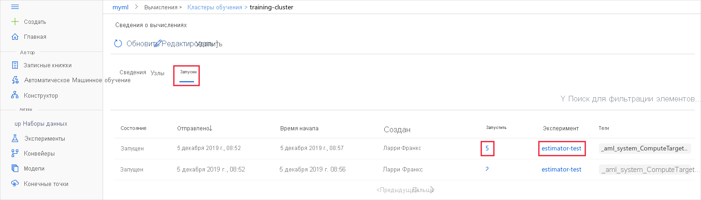

# <a name="monitor-and-view-ml-run-logs-and-metrics"></a>Мониторинг и просмотр журналов и метрик выполнения машинного обучения


В этой статье вы узнаете, как отслеживать запуски Машинное обучение Azure и просматривать их журналы. Прежде чем можно будет просматривать журналы, необходимо сначала включить их. Дополнительные сведения см. [в статье Включение ведения журнала в учебных курсах машинного обучения Azure](how-to-track-experiments.md).

Журналы могут помочь в диагностике ошибок и предупреждений или отслеживании метрик производительности, таких как параметры и точность модели. В этой статье вы узнаете, как просматривать журналы с помощью следующих методов.

> [!div class="checklist"]
> * Мониторинг запусков в студии
> * Мониторинг запусков с помощью мини-приложения Jupyter Notebook
> * Мониторинг запуска автоматизированного машинного обучения
> * Просмотр журналов вывода после завершения
> * Просмотр журналов вывода в студии

Общие сведения об управлении экспериментами см. в статье [Запуск, мониторинг и отмена обучающих запусков](how-to-manage-runs.md).

## <a name="monitor-runs-in-the-studio"></a>Мониторинг запусков в студии

Чтобы отслеживать запуски для определенного целевого объекта вычислений из браузера, выполните следующие действия.

1. В [машинное обучение Azure Studio](https://ml.azure.com/)выберите рабочую область, а затем в левой части страницы выберите пункт __вычислить__ .

1. Выберите __Кластеры обучения__, чтобы отобразить список целевых объектов вычислений, используемых для обучения. Выберите кластер.

    

1. Выберите __Запуски__. Отобразится список запусков, использующих этот кластер. Чтобы просмотреть сведения о конкретном запуске, нажмите соответствующую ссылку в столбце __Запуск__. Чтобы просмотреть сведения об эксперименте, используйте соответствующую ссылку в столбце __Эксперимент__.

    
    
    > [!TIP]
    > Поскольку целевые показатели для обучения являются общими ресурсами, они могут иметь несколько запусков в очереди или быть активными в определенный момент времени.
    > 
    > У запуска могут быть дочерние запуски, поэтому у одного задания обучения может быть несколько записей.

После завершения запуска он больше не будет отображаться на этой странице. Чтобы просмотреть сведения о завершенных запусках, перейдите в раздел студии __Эксперименты__, затем выберите эксперимент и запуск. Дополнительные сведения см. в разделе [Просмотр метрик для завершенных запусков](#view-the-experiment-in-the-web-portal).

## <a name="monitor-runs-using-the-jupyter-notebook-widget"></a>Мониторинг запусков с помощью мини-приложения записной книжки Jupyter

При использовании метода **скриптрунконфиг** для отправки запусков можно отслеживать ход выполнения с помощью мини-приложения [Jupyter](https://docs.microsoft.com/python/api/azureml-widgets/azureml.widgets?view=azure-ml-py&preserve-view=true). Подобно представлению запуска, мини-приложение является асинхронным и предоставляет обновления в реальном времени каждые 10–15 секунд до завершения задания.

Просмотрите мини-приложения Jupyter во время ожидания завершения выполнения.
    
```python
from azureml.widgets import RunDetails
RunDetails(run).show()
```


Ссылку на это же отображение можно получить и в рабочей области.

```python
print(run.get_portal_url())
```

## <a name="monitor-automated-machine-learning-runs"></a>Мониторинг запуска автоматизированного машинного обучения

Для автоматического выполнения машинного обучения для доступа к диаграммам из предыдущего запуска замените на `<<experiment_name>>` имя соответствующего эксперимента:

```python
from azureml.widgets import RunDetails
from azureml.core.run import Run

experiment = Experiment (workspace, <<experiment_name>>)
run_id = 'autoML_my_runID' #replace with run_ID
run = Run(experiment, run_id)
RunDetails(run).show()
```


## <a name="show-output-upon-completion"></a>Показывать выходные данные после завершения

При использовании **ScriptRunConfig** можно указать ```run.wait_for_completion(show_output = True)```, чтобы узнать, когда обучение модели будет завершено. Флаг ```show_output``` предоставляет подробные выходные данные. Дополнительные сведения см. в разделе Скриптрунконфиг, [посвященном включению ведения журнала](how-to-track-experiments.md#scriptrunconfig-logs).

<a id="queryrunmetrics"></a>
## <a name="query-run-metrics"></a>Запрос метрик выполнения

Метрики обученной модели можно просмотреть с помощью ```run.get_metrics()```. Например, с помощью приведенного выше примера можно определить наилучшую модель, выполнив поиск модели с наименьшим значением квадратной ошибки (MSE).

<a name="view-the-experiment-in-the-web-portal"></a>
## <a name="view-run-records-in-the-studio"></a>Просмотр записей запуска в студии

В [машинное обучение Azure Studio](https://ml.azure.com)можно просматривать завершенные записи о выполнении, включая зарегистрированные метрики.

Перейдите на вкладку **эксперименты** и выберите свой эксперимент. На панели мониторинга запуск эксперимента можно просмотреть метрики и журналы для каждого запуска. 

Выполните детализацию до определенного запуска, чтобы просмотреть его выходные данные или журналы, или Скачайте моментальный снимок эксперимента, чтобы вы могли поделиться папкой эксперимента с другими пользователями.

Можно также отредактировать таблицу список выполнения, чтобы выбрать несколько запусков и отобразить Последнее, минимальное или максимальное значение журнала для выполненных операций. Настройте диаграммы, чтобы сравнить зарегистрированные значения метрик и статистические выражения для нескольких запусков.


### <a name="format-charts-in-the-studio"></a>Форматирование диаграмм в студии

Используйте следующие методы в API ведения журнала, чтобы повлиять на визуализацию метрик в студии.

|Значение в журнале|Пример кода| Формат на портале|
|----|----|----|
|Массив числовых значений| `run.log_list(name='Fibonacci', value=[0, 1, 1, 2, 3, 5, 8, 13, 21, 34, 55, 89])`|График для одной переменной|
|Одно повторяющееся числовое значение с тем же именем метрики (например, в цикле for)| `for i in tqdm(range(-10, 10)):    run.log(name='Sigmoid', value=1 / (1 + np.exp(-i))) angle = i / 2.0`| График для одной переменной|
|Повторяющиеся строки с двумя числовыми столбцами|`run.log_row(name='Cosine Wave', angle=angle, cos=np.cos(angle))   sines['angle'].append(angle)      sines['sine'].append(np.sin(angle))`|Графики для двух переменных|
|Таблица с двумя числовыми столбцами|`run.log_table(name='Sine Wave', value=sines)`|Графики для двух переменных|


## <a name="next-steps"></a>Дальнейшие действия

Выполните следующие действия, чтобы узнать, как использовать Машинное обучение Azure.

* Сведения об [отслеживании экспериментов и включении журналов в конструкторе машинное обучение Azure](how-to-track-designer-experiments.md).

* Пример регистрации оптимальных моделей и их развертывания см. в руководстве [Руководство № 1. Обучение модели классификации изображений с помощью Машинного обучения Azure](tutorial-train-models-with-aml.md).

