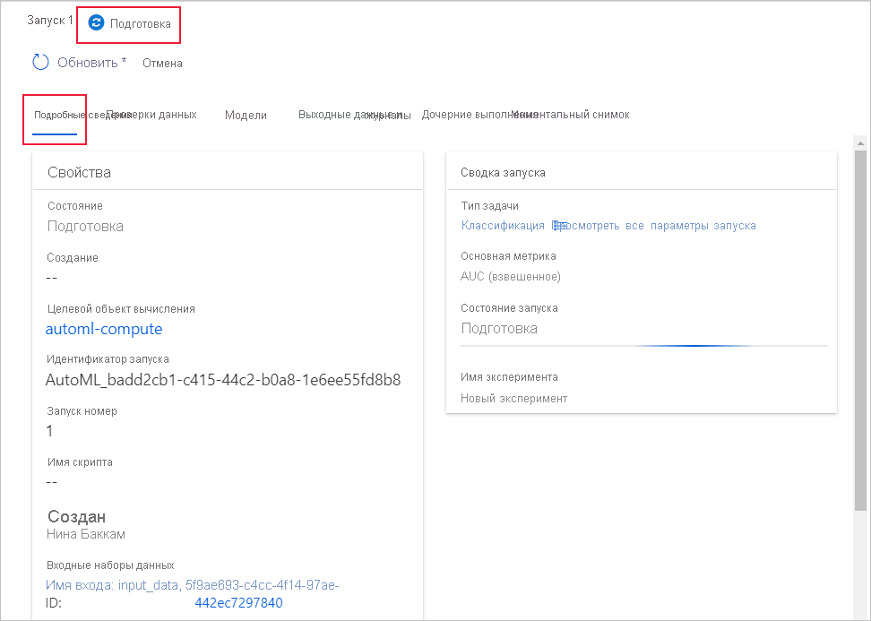

# Создание, проверка и развертывание моделей автоматизированного машинного обучения с помощью Машинного обучения Azure
[!INCLUDE [applies-to-skus](../../includes/aml-applies-to-enterprise-sku.md)]

Из этой статьи вы узнаете, как создавать, изучать и развертывать модели автоматизированного машинного обучения без единой строки кода в интерфейсе студии Машинного обучения Azure. Автоматизированное машинное обучение — это процесс выбора оптимального алгоритма машинного обучения для конкретных данных. Этот процесс позволяет быстро создавать модели машинного обучения. [Узнайте больше об автоматизированном машинном обучении](concept-automated-ml.md).
 
Полный пример см. в [учебнике по созданию модели классификации с помощью интерфейса автоматизированного ML в Машинном обучении Azure](tutorial-first-experiment-automated-ml.md). 

Чтобы воспользоваться функцией создания кода на Python, [настройте эксперименты машинного обучения](how-to-configure-auto-train.md) с помощью пакета SDK для Машинного обучения Azure.

## Предварительные требования

* Подписка Azure. Если у вас еще нет подписки Azure, создайте бесплатную учетную запись, прежде чем начинать работу. Опробуйте [бесплатную или платную версию Машинного обучения Azure](https://aka.ms/AMLFree) уже сегодня.

* Рабочая область Машинного обучения Azure типом **выпуска Enterprise**. См. сведения о [создании рабочей области машинного обучения Azure](how-to-manage-workspace.md).  Дополнительные сведения см. в статье об [обновлении имеющейся рабочей области до выпуска Enterprise ](how-to-manage-workspace.md#upgrade).

## Начало работы

1. Войдите в Машинное обучение Azure по адресу https://ml.azure.com. 

1. Выберите подписку и рабочую область. 

1. Перейдите в область слева. В разделе **Автор** выберите **Автоматизированное машинное обучение**.

 Если вы впервые создаете эксперимент, вы увидите пустой список и ссылки на документацию. 

В противном случае вы увидите список последних экспериментов для автоматизированного машинного обучения, включая созданные с помощью пакета SDK. 

## Создание и запуск эксперимента

1. Выберите **+ New automated ML run** (+ Новое выполнение автоматизированного машинного обучения) и заполните форму.

1. Выберите набор данных из контейнера хранилища или создайте новый набор данных. Наборы данных можно создавать на основе локальных файлов, URL-адресов в Интернете, хранилищ данных или открытых наборов данных Azure. 

    >[!Important]
    > Требования к данным для обучения:
    >* Данные должны иметь табличный формат.
    >* В данных должно присутствовать прогнозируемое значение (целевой столбец).

    1. Чтобы создать новый набор данных на основе файла на локальном компьютере, выберите **Обзор**, а затем выберите файл. 

    1. Присвойте набору данных уникальное имя и укажите дополнительное описание. 

    1. Нажмите **Далее**, чтобы открыть **форму выбора хранилища данных и файлов**. В этой форме следует выбрать, куда отправить набор данных: в контейнер хранилища по умолчанию, который автоматически создается вместе с рабочей областью, или другой контейнер хранилища, который вы хотите использовать для эксперимента. 

    1. Проверьте точность заполнения **формы параметров и предварительного просмотра**. Для формы применяется интеллектуальное заполнение на основе типа файла. 

        Поле| Описание
        ----|----
        Формат файла| Свойство определяет структуру и тип данных, хранящихся в файле.
        Разделитель| Один или несколько символов для указания границы между отдельными, независимыми регионами в виде простого текста или других потоков данных.
        Кодирование| Определяет, какой бит следует использовать в таблице схемы символов, чтобы считать набор данных.
        Заголовки столбцов| Указывает, как будут обрабатываться заголовки набора данных, если таковые имеются.
        Пропустить строки | Указывает, сколько строк, если таковые имеются, пропускается в наборе данных.
    
        Выберите **Далее**.

    1. Для **формы схемы** используется интеллектуальное заполнение с учетом выбора в **форме параметров и предварительного просмотра**. Здесь можно настроить тип данных для каждого столбца, проверить имена столбцов и выбрать столбцы, которые **не следует включать** в эксперимент. 
            
        Выберите **Далее**.

    1. В **форме подтверждения сведений** приведена сводка по данным, которые были ранее введены в формах **общих сведений** и **параметров и предварительного просмотра**. С помощью вычислений среды с поддержкой профилирования вы также можете создать профиль данных для набора данных. Подробная информация [о профилировании данных](#profile).

        Выберите **Далее**.
1. Выберите только что созданный набор данных, когда он появится в списке. Вы также можете воспользоваться предварительным просмотром набора данных и просмотреть пример статистики. 

1. В **форме настройки выполнения** введите уникальное имя эксперимента.

1. Выберите целевой столбец. Это столбец, по которому необходимо выполнить прогнозирование.

1. Выберите вычисление для задания обучения и профилирования данных. Список имеющихся вычислительных сред доступен в раскрывающемся списке. Чтобы создать вычислительную среду, следуйте инструкциям для шага 7.

1. Щелкните **Create a new compute** (Создать вычислительную среду) и настройте контекст вычислений для этого эксперимента.

    Поле|Описание
    ---|---
    Имя вычислительной среды| Введите уникальное имя для идентификации контекста вычислительной среды.
    размер виртуальной машины;| Выберите размер виртуальной машины для вычислительной среды.
    Минимальное и максимальное кол-во узлов (в дополнительных параметрах)| Для профилирования данных необходимо указать один или больше узлов. Введите максимальное число узлов для вычислительной среды. Значение по умолчанию — 6 узлов для вычислительной среды AML.
    
    Нажмите кнопку **создания**. Создание вычислительной среды может занять несколько минут.

    >[!NOTE]
    > По имени созданной или выбранной вычислительной среды можно определить, *поддерживает ли она профилирование*. (Дополнительные сведения см. в разделе о [профилировании данных](#profile).)

    Выберите **Далее**.

1. В **форме типа и параметров задачи** выберите тип задачи: классификация, регрессия или прогнозирование. Дополнительные сведения см. в разделе [Поддерживаемые типы задач](concept-automated-ml.md#when-to-use-automl-classify-regression--forecast) .

    1. Для классификации можно также включить глубокое обучение, которое используется для конструирования признаков текста.

    1. Для прогнозирования:
        1. Выберите столбец времени. Он содержит данные о времени, которые необходимо использовать.

        1. Выберите горизонт прогнозирования. Укажите, на сколько единиц времени (минут, часов, дней, недель, месяцев или лет) модель сможет прогнозировать будущее. Чем дальше будущее, которое должна прогнозировать модель, тем менее точной она будет. [Узнайте больше о прогнозе и горизонте прогнозирования](how-to-auto-train-forecast.md).

1. Необязательно. Просмотрите дополнительные параметры конфигурации, которые можно использовать для лучшего управления заданием обучения. В противном случае применяются значения по умолчанию, основанные на выборе эксперимента и данных. 

    Дополнительные конфигурации|Описание
    ------|------
    Основная метрика| Основная метрика, используемая для оценки модели. [Узнайте больше о метриках модели](how-to-configure-auto-train.md#explore-model-metrics).
    Автоматическое выделение признаков| Выберите этот параметр, чтобы включить или отключить добавление признаков, выполняемые автоматическим машинным обучением. Автоматический Добавление признаков включает автоматическую очистку данных, подготовку и преобразование для создания искусственных функций. Не поддерживается для задач типа "прогнозирование временных рядов". Дополнительные [сведения о Добавление признаков](how-to-configure-auto-features.md#featurization). 
    Пояснения для наилучшей модели | Выберите, чтобы включить или отключить отображение объяснения для рекомендуемой лучшей модели.
    Запрещенные алгоритмы| Выберите алгоритмы, которые вы хотите исключить из задания обучения.
    Критерий выхода| Если выполняется любое из этих условий, задание обучения останавливается.   *Training job time (hours)* (Время задания обучения (в часах)). Продолжительность выполнения задания обучения.   *Metric score threshold* (Порог оценки метрики).  Минимальный показатель метрики для всех конвейеров. Гарантирует, что при наличии определенной целевой метрики вы не потратите на задание обучения больше времени, чем это нужно.
    Проверка| Выберите один из вариантов перекрестной проверки, чтобы использовать его в задании обучения. [Узнайте больше о перекрестных проверках](how-to-configure-cross-validation-data-splits.md#prerequisites).
    Параллелизм| *Max concurrent iterations* (Максимальное число одновременных итераций). Максимальное количество конвейеров (итераций) для тестирования в задании обучения. Число итераций при выполнении задания не будет больше указанного числа.

1. Используемых Просмотреть параметры Добавление признаков: Если вы решили включить **Автоматическое добавление признаков** в форме **дополнительных параметров конфигурации** , применяются методики Добавление признаков по умолчанию. В окне **Просмотр параметров Добавление признаков** можно изменить эти значения по умолчанию и соответствующим образом настроить. Узнайте, как [настроить феатуризатионс](#customize-featurization). 

    

## Профилирование данных и сводная статистика

Вы можете получить обширную сводную статистику по набору данных, чтобы проверить, готов ли он к машинному обучению. Для нечисловых столбцов она включает только базовые статистические данные, например минимальное и максимальное значение, а также число ошибок. Для числовых столбцов можно также просмотреть статистические моменты и предполагаемые квантили. В частности, наш профиль данных включает в себя следующие компоненты.

>[!NOTE]
> Для признаков с неуместными типами отображаются пустые записи.

Статистика|Описание
------|------
Компонент| Имя столбца, по которому предоставляется сводка.
Профиль| Встроенная визуализация на основе выводимого типа. Например, для строк, логических значений и дат будут отображаться счетчики значений, а для десятичных (числовых значений) — аппроксимированные гистограммы. Это позволит быстро получить представление о распределении данных.
Распределение по типам| Встроенный счетчик значений для типов в столбце. Значения NULL имеют собственный тип, поэтому эта визуализация полезна для обнаружения необычных или отсутствующих значений.
Тип|Выводимый тип столбца. Возможные значения: строчные и логические значения, даты и десятичные числа.
Min| Минимальное значение в столбце. Пустые записи отображаются для признаков, относящихся к типам без возможности упорядочения (например, логических значений).
Max| Максимальное значение в столбце. 
Count| Общее число отсутствующих и присутствующих записей в столбце.
Присутствующее количество| Количество присутствующих записей в столбце. Пустые строки и ошибки обрабатываются как значения, поэтому они не будут учитываться при подсчете количества присутствующих записей.
Квантили| Аппроксимированные значения в каждом квантиле для создания подобия распределения данных.
Среднее значение| Среднее арифметическое или среднее значение столбца.
Стандартное отклонение| Величина дисперсии или вариации данных в этом столбце.
Variance| Мера того, насколько сильно отклоняются данные этого столбца от среднего значения. 
Асимметрия| Мера того, насколько отличаются данные этого столбца от нормального распределения.
Эксцесс| Мера того, насколько медленнее убывают данные этого столбца по сравнению с нормальным распределением.

## Настройка Добавление признаков

В форме **Добавление признаков** можно включить или отключить автоматическое добавление признаков и настроить параметры автоматического Добавление признаков для своего эксперимента. Чтобы открыть эту форму, см. шаг 10 в разделе [Создание и запуск эксперимента](#create-and-run-experiment) . 

В следующей таблице приведена сводка настроек, доступных в данный момент в студии. 

Столбец| Настройка
---|---
Включено | Указывает, какие столбцы следует включить в обучение.
Тип компонента| Изменение типа значения для выбранного столбца.
Аппроксимация с| Выберите, какое значение аппроксимация отсутствующие значения в данных.

## Запуск эксперимента и просмотр результатов

Выберите **Готово**, чтобы запустить эксперимент. Подготовка эксперимента может занять до 10 мин. Выполнение заданий обучения может занять еще 2–3 минуты для завершения работы каждого конвейера.

### Просмотр сведений об эксперименте

Откроется экран **Run Detail** (Сведения о запуске) на вкладке **Details** (Сведения). На этом экране отображается сводка по запуску эксперимента, в том числе строка состояния в верхней части рядом с количеством выполнений. 

Вкладка **Модели** содержит список созданных моделей в порядке оценки метрики. По умолчанию модель с наивысшей оценкой, полученной на основе выбранной метрики, будет в верхней части списка. По мере того как задание обучения использует дополнительные модели, они добавляются в список. Используйте это для быстрого сравнения метрик созданных моделей.

### Просмотр сведений о выполнении обучения

Детализируйте все завершенные модели, чтобы просмотреть сведения о выполнении обучения, например метрики запуска на вкладке **Сведения о модели** или диаграммы производительности на вкладке **Визуализации**. [Узнайте больше о диаграммах](how-to-understand-automated-ml.md).

## Развертывание модели

Теперь, когда у вас есть лучшая модель, можно развернуть ее как веб-службу для прогнозирования новых данных.

Автоматизированное машинное обучение позволяет с легкостью развернуть модель без написания кода.

1. Доступно несколько вариантов развертывания. 

    + Вариант 1. Чтобы развернуть лучшую модель (в соответствии с заданными критериями метрики), на вкладке **Сведения** нажмите кнопку **Deploy best model** (Развернуть лучшую модель).

    + Вариант 2. Чтобы развернуть определенную итерацию модели из этого эксперимента, детализируйте модель, чтобы открыть для нее вкладку **Сведения о модели**, и выберите **Развернуть модель**.

1. Заполните область **Развернуть модель**, как показано ниже.

    Поле| Значение
    ----|----
    Имя| Введите уникальное имя развертывания.
    Описание| Введите описание, чтобы лучше понять, для чего предназначено это развертывание.
    Тип вычисления| Выберите тип конечной точки для развертывания: *Azure Kubernetes Service (AKS)* или *экземпляр контейнера Azure (ACI)* .
    Имя вычислительной среды| *Применимо только к AKS.* Выберите имя кластера AKS для развертывания.
    Включить проверку подлинности | Выберите этот параметр, чтобы разрешить проверку подлинности на основе токенов или на основе ключей.
    Использовать настраиваемые ресурсы развертывания| Включите эту возможность, если хотите отправить собственный скрипт оценки и файл среды. [Узнайте больше о скриптах оценки](how-to-deploy-and-where.md#script).

    >[!Important]
    > Имена файлов должны быть длиной не более 32 символов, а также начинаться и заканчиваться буквой или цифрой. Они могут включать в себя дефисы, символы подчеркивания, точки, буквы и цифры. Пробелы недопустимы.

    В меню *Дополнительно* содержатся признаки развертывания по умолчанию, например [коллекция данных](how-to-enable-app-insights.md) и параметры использования ресурсов. Если вы хотите переопределить эти значения по умолчанию, это можно сделать в данном меню.

1. Выберите **Развернуть**. Развертывание может занять около 20 минут.
    После начала развертывания появится вкладка **сведения о модели** . Просмотрите ход развертывания в разделе **состояние развертывания** на панели **свойства** . 

Теперь у вас есть рабочая веб-служба для создания прогнозов! Вы можете проверить прогнозы, запросив соответствующую услугу с помощью [встроенной функции поддержки Машинного обучение Azure в Power BI](how-to-consume-web-service.md#consume-the-service-from-power-bi).

## Дальнейшие действия

* [Узнайте, как использовать веб-службу](https://docs.microsoft.com/azure/machine-learning/how-to-consume-web-service).
* [Ознакомьтесь с общими сведениями о результатах автоматизированного машинного обучения](how-to-understand-automated-ml.md).
* [Узнайте больше об автоматизированном машинном обучении](concept-automated-ml.md) и Машинном обучении Azure.
