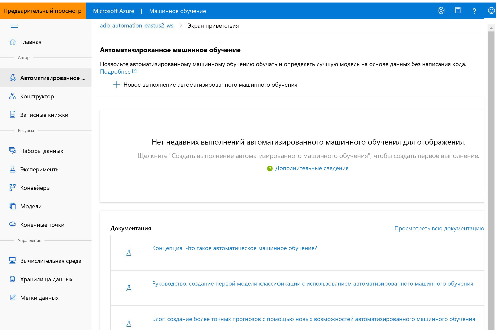

# Что такое студия Машинного обучения Azure

В этой статье вы узнаете о студии Машинного обучения Azure, веб-портале для разработчиков средств обработки и анализа данных в службе [Машинное обучение Azure](overview-what-is-azure-ml.md). Для инклюзивной платформы обработки и анализа данных в студии не требуется писать код или использовать подход Code First.

В этой статье раскрываются следующие темы.
>[!div class="checklist"]
> - [Разработка проектов машинного обучения](#author-machine-learning-projects) в студии.
> - [Управление активами и ресурсами](#manage-assets-and-resources) в студии.
> - Различия между [студией Машинного обучение Azure и Студией машинного обучения (классической)](#ml-studio-classic-vs-azure-machine-learning-studio).

## Разработка проектов машинного обучения

В зависимости от типа проекта и уровня взаимодействия с пользователем в студии предлагается несколько возможностей для разработки.

+ **Заметки**

  Пишите и запускайте собственный код на управляемых [серверах Jupyter Notebook](how-to-run-jupyter-notebooks.md), которые непосредственно интегрированы в студию. 

+ **Конструктор Машинного обучения Azure**

  Используйте конструктор для обучения и развертывания моделей машинного обучения без написания кода. Чтобы создать конвейеры машинного обучения, перетащите наборы данных и модули. Ознакомьтесь с [учебником по конструктору](tutorial-designer-automobile-price-train-score.md).

    

+ **Пользовательский интерфейс автоматизированного машинного обучения.**

  Узнайте, как создавать [эксперименты автоматизированного машинного обучения](tutorial-first-experiment-automated-ml.md) с помощью удобного интерфейса. 

  

+ **Маркировка данных**

    Используйте [маркировку данных Машинного обучения Azure](how-to-create-labeling-projects.md) для эффективного координирования проектов маркировки данных.

## Управление активами и ресурсами

Управляйте активами машинного обучения непосредственно в браузере. Для удобства работы активы доступны для совместного использования из пакета SDK и студии в одной рабочей области. С помощью студии можно управлять следующими элементами:

- Модели
- Наборы данных
- Хранилища данных
- Вычислительные ресурсы
- Записные книжки
- Эксперименты
- Журналы запуска
- Pipelines 
- Конечные точки конвейера

Даже если вы опытный разработчик, студия может упростить управление ресурсами рабочей области.

## Сравнение Студии машинного обучения Azure (классической) и студии Машинного обучения Azure

Выпущенная в 2015 году **Студия машинного обучения (классическая)**  — наш первый конструктор для машинного обучения с помощью мыши. Это автономная служба с визуальным интерфейсом. Студия (классическая) не взаимодействует со службой "Машинное обучение Azure".

**Машинное обучение Azure**  — это отдельная современная служба, которая предоставляет полную платформу обработки и анализа данных. Она поддерживает как методику Code First, так и подход с минимальной потребностью в создании кода.

**Студия Машинного обучения Azure**  — это веб-портал *в* службе "Машинное обучение Azure", обеспечивающий разработку проектов и управление активами с написанием минимального количества кода или без него. 

Новым пользователям мы рекомендуем выбрать **Машинное обучение Azure** , а не Студию машинного обучения (классическую), так как это даст им возможность использовать новейший набор средств обработки и анализа данных.

### Сравнение возможностей

В таблице ниже перечислены некоторые основные различия между Студией машинного обучения (классической) и службой "Машинное обучение Azure".

| Компонент | Студии машинного обучения (классической) | Машинное обучение Azure |
|---| --- | --- |
| Интерфейс перетаскивания | Классический интерфейс | Обновленный интерфейс — [конструктор Машинного обучения Azure](concept-designer.md)| 
| Пакеты SDK для кода | Не поддерживается | Полная интеграция с пакетами SDK [Машинного обучения Azure для Python](/python/api/overview/azure/ml/) и [R](tutorial-1st-r-experiment.md) |
| Эксперимент | Масштабируемый (ограничение на объем данных для обучения: 10 ГБ) | Масштабирование с помощью целевого объекта вычислений |
| Обучение целевых объектов вычислений | Собственный целевой объект, поддерживающий только ЦП | Обширный набор настраиваемых [целевых объектов вычислений для обучения](concept-compute-target.md#train). Включает поддержку GPU и ЦП. | 
| Развертывание целевых объектов вычислений | Собственный формат веб-службы, без возможности настройки | Обширный набор настраиваемых [целевых объектов вычислений для развертывания](concept-compute-target.md#deploy). Включает поддержку GPU и ЦП. |
| ML-конвейер | Не поддерживается | Создание гибких, модульных [конвейеров](concept-ml-pipelines.md) для автоматизации рабочих процессов |
| MLOps | Развертывание базовой модели и управление ею; развертывания с использованием только ЦП | Управление версиями сущностей (модель, данные, рабочие процессы), автоматизация рабочих процессов, интеграция с инструментами непрерывной интеграции и поставки, развертывания с использованием ЦП и GPU, [а также многие другие возможности](concept-model-management-and-deployment.md) |
| Формат модели | Собственный формат, только Студия (классическая) | Несколько поддерживаемых форматов в зависимости от типа задания обучения |
| Автоматизированное обучение моделей и настройка гиперпараметров |  Не поддерживается | [поддерживается](concept-automated-ml.md). Возможно использовать подход без написания кода или Code First. | 
| Обнаружение смещения данных | Не поддерживается | [Поддерживается](how-to-monitor-datasets.md) |
| Проект маркировки данных | Не поддерживается | [Поддерживается](how-to-create-labeling-projects.md) |

## Дальнейшие действия

Посетите [студию](https://ml.azure.com) или изучите различные варианты разработки по следующим учебникам:  

- + [Начало работы в собственной среде разработки](tutorial-1st-experiment-sdk-setup-local.md)
  + [Использование записных книжек Jupyter на вычислительном экземпляре для обучения и развертывании моделей](tutorial-1st-experiment-sdk-setup.md)
  + [Использование автоматизированного машинного обучения для обучения и развертывания моделей](tutorial-first-experiment-automated-ml.md)  
  + [Использование конструктора для обучения и развертывания моделей](tutorial-designer-automobile-price-train-score.md)