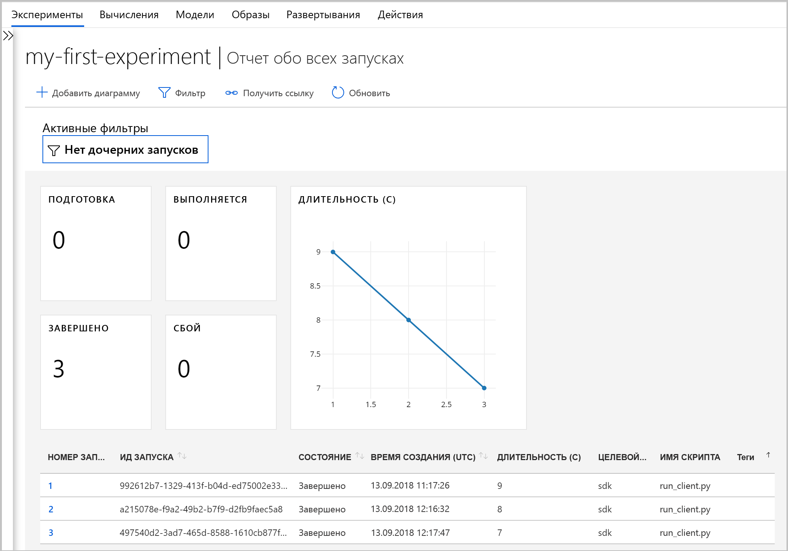
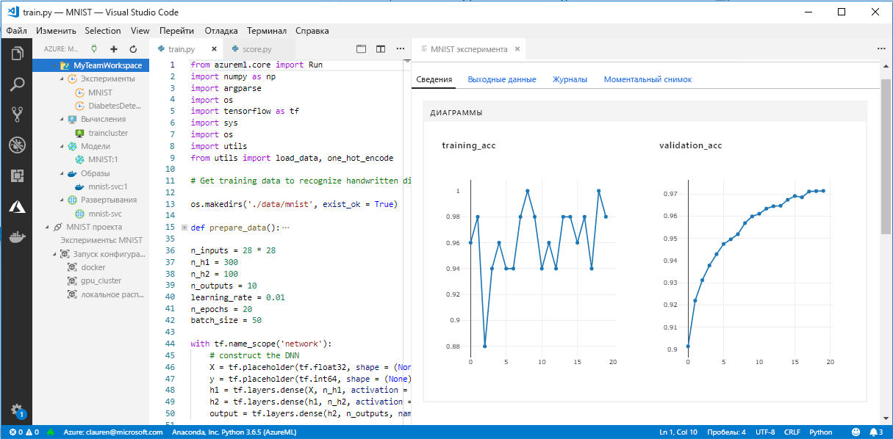

# <a name="what-happened-to-azure-machine-learning-workbench"></a>Что случилось с Azure Machine Learning Workbench?

Приложение Azure Machine Learning Workbench и некоторые другие ранние функции устарели и были заменены в выпуске за сентябрь 2018 г. в рамках процесса улучшения [архитектуры](concept-azure-machine-learning-architecture.md). 

Этот выпуск содержит множество существенных обновлений, внесенных с учетом отзывов клиентов для улучшения удобства работы. Изменения не коснулись основных функций службы, начиная от запуска эксперимента и кончая развертыванием модели. Но теперь в вашем распоряжении надежный <a href="https://aka.ms/aml-sdk" target="_blank">пакет SDK</a> и интерфейс [Azure CLI](reference-azure-machine-learning-cli.md) для выполнения задач и конвейеров машинного обучения.  

Большинство артефактов, которые были созданы в предыдущей версии Службы машинного обучения Azure, хранятся в вашем локальном или облачном хранилище. Эти артефакты не исчезнут.

В этой статье рассказывается, что было изменено и как эти изменения повлияют на уже существующие применения службы Azure Machine Learning Workbench и ее API.

>[!Warning]
>Эта статья не предназначена для пользователей студии машинного обучения Azure. Она предназначена для пользователей службы "Машинное обучение Azure", которые установили приложение Workbench (предварительная версия) и (или) обладают учетными записями для экспериментирования и управления моделями.


## <a name="what-changed"></a>Что изменилось?

Последний выпуск Машинного обучения Azure включает следующие возможности:
+ [Упрощенная модель ресурсов Azure](concept-azure-machine-learning-architecture.md).
+ [Новый пользовательский интерфейс портала](how-to-track-experiments.md) для управления экспериментами и целевыми объектами вычислений.
+ Новый, более функциональный <a href="https://aka.ms/aml-sdk" target="_blank">пакет SDK</a> для Python.
+ Обновленное и дополненное [расширение интерфейса командной строки Azure](reference-azure-machine-learning-cli.md) для машинного обучения

Переработанная [архитектура](concept-azure-machine-learning-architecture.md) для упрощения использования. Вместо нескольких ресурсов Azure и учетных записей требуется только [рабочая область Машинного обучения Azure](concept-azure-machine-learning-architecture.md#workspace). Новые рабочие области можно быстро создать на [портале Azure]((setup-create-workspace.md#portal). Рабочая область позволяет нескольким пользователя хранить целевые объекты вычислений для обучения и развертывания, экспериментов с моделями, образов Docker, развернутых моделей и т. д.

Текущий выпуск предоставляет обновленные и улучшенные клиенты для работы с интерфейсом командной строки и пакетом SDK, но само классическое приложение Workbench является устаревшим. В рабочей области панели мониторинга на портале Azure можно управлять экспериментами. Дополнительные сведения см. [здесь](how-to-track-experiments.md#view-the-experiment-in-the-azure-portal). Используйте панель мониторинга, чтобы просматривать историю эксперимента, управлять целевыми объектами вычислений, подключенными к рабочей области, управлять моделями и образами Docker и даже развертывать веб-службы.

<a name="timeline"></a>

## <a name="support-timeline"></a>Сроки поддержки

С 9 января 2019 г. прекращается поддержка Azure Machine Learning Workbench, Экспериментирования в Машинном обучении Azure, учетных записей Управления моделями, а также соответствующего интерфейса командной строки и пакета SDK. 

Все новейшие возможности доступны при использовании нового <a href="https://aka.ms/aml-sdk" target="_blank">пакета SDK</a>, [интерфейса командной строки](reference-azure-machine-learning-cli.md) и [портала](setup-create-workspace.md#portal).

## <a name="what-about-run-histories"></a>Что будет с журналами выполнения?

Старые журналы выполнения становятся недоступными. Вы можете просмотреть ваши запуски в последней версии. 

Теперь журналы выполнения называются **экспериментами**. Вы можете собрать эксперименты модели и исследовать их, используя пакет SDK, интерфейс командной строки или портал Azure.

Панель мониторинга для рабочей области на портале поддерживается только в браузерах Microsoft Edge, Chrome и Firefox.

[](./media/overview-what-happened-to-workbench/image001.png#lightbox)

Начните обучать свои модели и отслеживать журналы выполнения, используя новый интерфейс командной строки и новый пакет SDK. Чтобы узнать, как это делать, используйте [Руководство. Обучение моделей с помощью службы "Машинное обучение Azure"](tutorial-train-models-with-aml.md).

## <a name="can-i-still-prep-data"></a>Можно ли по-прежнему готовить данные?

Уже существующие файлы подготовки данных нельзя перенести в последнюю версию, так как приложение Machine Learning Workbench больше не поддерживается. Но по-прежнему вы можете подготовить набор данных любого размера для моделирования.   

Для наборов данных любых размеров можно использовать [пакет SDK для подготовки данных Службы машинного обучения Azure](https://aka.ms/data-prep-sdk), позволяющий быстро создать код Python для подготовки данных перед моделированием. 

См. дополнительные сведения о том, как [использовать пакет SDK для подготовки данных Службы машинного обучения Azure](tutorial-data-prep.md).

## <a name="will-projects-persist"></a>Сохранятся ли проекты?

Никакой код и никакие наработки не будут потеряны. В более ранней версии проекты являются объектами облака с локальным каталогом. В последней версии локальные каталоги привязываются к рабочей области Службы машинного обучения Azure с помощью локального файла конфигурации. Ознакомьтесь со [схемой актуальной архитектуры](concept-azure-machine-learning-architecture.md).

Большая часть содержимого проекта уже находится на локальном компьютере. Это означает, что для подключения к рабочей области осталось создать в этом каталоге файл конфигурации добавить в код ссылку для подключения к рабочей области. Чтобы продолжить использовать локальный каталог, содержащий файлы и скрипты, укажите имя каталога в команде Python ["experiment.submit"](https://docs.microsoft.com/python/api/azureml-core/azureml.core.experiment.experiment?view=azure-ml-py) или с помощью команды интерфейса командной строки `az ml project attach`.  Например: 
```python
run = exp.submit(source_directory = script_folder, script = 'train.py', run_config = run_config_system_managed)
```

[Создайте рабочую область](setup-create-workspace.md#portal), чтобы приступить к работе.

## <a name="what-about-my-registered-models-and-images"></a>Что будет с уже зарегистрированными моделями и образами?

Если нужно продолжить использование моделей, уже зарегистрированных в старом реестре моделей, их необходимо перенести в новую рабочую область. Чтобы перенести модели, скачайте их и повторно зарегистрируйте в новой рабочей области. 

Чтобы продолжить использование образов, созданных в старом реестре образов, их необходимо создать повторно в новой рабочей области. Эти образы можно заново [создать и настроить](how-to-deploy-and-where.md#configureimage). 

## <a name="what-about-deployed-web-services"></a>Что случится с развернутыми веб-службами?

По завершении поддержки старой версии интерфейса командной строки вы больше не сможете повторить развертывание моделей или управлять веб-службами, которые изначально были развернуты с помощью вашей учетной записи Управления моделями. Но эти веб-службы продолжат работать, пока будет поддерживаться служба контейнеров Azure (ACS).

В последней версии модели развертываются как веб-службы в экземпляры контейнеров Azure (ACI) или в кластеры службы Azure Kubernetes (AKS). Можно также выполнить развертывание в FPGA и Azure IoT Edge. 

Дополнительные сведения см. в следующих статьях:
+ [Развертывание моделей с помощью Службы машинного обучения Azure](how-to-deploy-and-where.md)
+ [Руководство Развертывание модели классификации изображений в Экземплярах контейнера Azure](tutorial-deploy-models-with-aml.md)

## <a name="what-about-the-old-sdk-and-cli"></a>Что будет со старым пакетом SDK и интерфейсом командной строки?

Они будут продолжать работать до января. См. описанный выше [график](#timeline). Мы рекомендуем уже сейчас создавать эксперименты и модели с помощью последнего пакета SDK или интерфейса командной строки.

Использование пакета SDK для Python из последнего выпуска позволяет взаимодействовать со Службой машинного обучения Azure в любой среде Python. Узнайте, как установить последний пакет <a href="https://aka.ms/aml-sdk" target="_blank">SDK</a>. Для взаимодействия со службой в любой среде командной строки, включая среду Cloud Shell портала Azure, можно также использовать [обновленное расширение машинного обучения интерфейса командной строки Azure](reference-azure-machine-learning-cli.md) с богатым набором команд `az ml`.

## <a name="what-about-visual-studio-code-tools-for-ai"></a>Что будет с Visual Studio Code Tools for AI?

В этом последнем выпуске расширение было переименовано в Машинное обучение Azure для Visual Studio Code, в нем были реализованы доработки и улучшения, чтобы обеспечить работу с вышеописанными новыми функциями.

[](./media/overview-what-happened-to-workbench/vscode-big.png#lightbox)

## <a name="what-about-domain-packages"></a>Что будет с пакетами домена?

Пакеты домена для компьютерного зрения, анализа текста и прогнозирования нельзя использовать с последней версией Службы машинного обучения Azure. Но вы по-прежнему можете создавать и обучать модели компьютерного зрения, текста и прогнозирования, используя последний <a href="https://aka.ms/aml-sdk" target="_blank">пакет SDK</a> для Python Службы машинного обучения Azure. Чтобы узнать, как перенести уже существующие модели, созданные с использованием пакетов компьютерного зрения, анализа текста и прогнозирования, обратитесь сюда: [AML-Packages@microsoft.com](mailto:AML-Packages@microsoft.com).

## <a name="next-steps"></a>Дополнительная информация

Сведения об [актуальной архитектуре Службы машинного обучения Azure](concept-azure-machine-learning-architecture.md). 

Обзор службы см. в статье [Что такое служба машинного обучения Azure](overview-what-is-azure-ml.md).

Сведения о том, как выполнить скрипт и просмотреть журнал выполнения скрипта с помощью последней версии службы "Машинное обучение Azure", см. в статье о [начале работы со службой "Машинное обучение Azure"](quickstart-run-cloud-notebook.md).

Для более глубокого понимания этого рабочего процесса изучите [полное руководство](tutorial-train-models-with-aml.md), содержащее подробные инструкции для обучения и развертывания моделей с помощью Службы машинного обучения Azure. 
