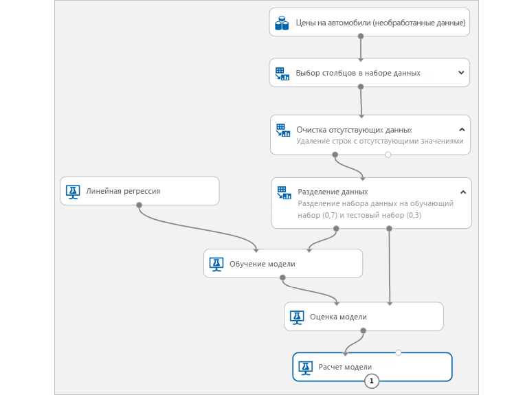

# Что такое служба "Машинное обучение Microsoft Azure"?

Служба машинного обучения Azure — это облачная служба, которая используется для обучения, развертывания, автоматизации моделей машинного обучения и управления ими в предоставляемом облаком широком масштабе.

## Что такое машинное обучение?

Машинное обучение — это способ обработки и анализа данных, который позволяет компьютерам использовать имеющиеся данные для прогнозирования будущего поведения, исходов и трендов. Используя машинное обучение, компьютеры учатся, не будучи явно запрограммированными.

Прогнозы машинного обучения позволяют сделать приложения и устройства эффективнее. Например, при покупках через Интернет машинное обучение помогает рекомендовать другие продукты, которые могут вам понравиться, на основе уже приобретенных вами товаров. При проведении кредитной карты через терминал машинное обучение сравнивает транзакцию с базой данных и позволяет обнаружить мошенничество. Когда робот-пылесос убирает комнату, машинное обучение позволяет определить, когда этот процесс окончен.

## Что такое служба "Машинное обучение Microsoft Azure"?

Машинное обучение предоставляет облачную среду, которую можно использовать для подготовки данных для моделей машинного обучения, их обучения, тестирования, развертывания и отслеживания, а также управления такими моделями. Начните обучение на локальном компьютере, а затем выполните развертывание в облаке. Служба полностью поддерживает такие технологии с открытым кодом, как PyTorch, TensorFlow и scikit-learn. Ее можно использовать для любого типа машинного обучения, начиная от классического машинного обучения и до глубокого обучения, которое может быть как контролируем так и неконтролируемым.

Изучайте и подготавливайте данные, обучайте и проводите проверку моделей и развертывайте их с помощью следующего большого набора средств:
+ [Графический интерфейс](ui-tutorial-automobile-price-train-score.md), в котором для создания экспериментов и развертывания моделей можно перетаскивать модули.
+ [Записные книжки Jupyter](https://jupyter.org), в которых используются [пакеты SDK](https://docs.microsoft.com/azure/machine-learning) для написания собственного кода, например для [этих примеров записных книжек](https://aka.ms/aml-notebooks).
+ [Расширение Visual Studio Code](how-to-vscode-tools.md)

> [!VIDEO https://channel9.msdn.com/Events/Connect/Microsoft-Connect--2018/D240/player]

## Что можно делать с помощью машинного обучения Azure?

Используйте <a href="https://docs.microsoft.com/python/api/overview/azure/ml/intro?view=azure-ml-py" target="_blank">пакет SDK Python для Машинного обучения Azure</a> с пакетами Python с открытым исходным кодом или [графический интерфейс (предварительная версия)](ui-tutorial-automobile-price-train-score.md), чтобы создавать и обучать высокоточные модели машинного и глубокого обучения в рабочей области Машинного обучения Azure.

Пакеты Python с открытым исходным кодом предлагают такие различные компоненты машинного обучения, как <a href="https://scikit-learn.org/stable/" target="_blank">Scikit-learn</a>, <a href="https://www.tensorflow.org" target="_blank">Tensorflow</a>, <a href="https://pytorch.org" target="_blank">PyTorch</a> и <a href="https://mxnet.io" target="_blank">MXNet</a>.

Если вы пишите код или пользуетесь графическим интерфейсом, во время эксперимента можно отслеживать множественные запуски. Это поможет найти лучшее решение и управлять развертыванием моделей.

### Модель сode-first

Начните обучение на локальном компьютере с помощью <a href="https://docs.microsoft.com/python/api/overview/azure/ml/intro?view=azure-ml-py" target="_blank">пакета SDK Python для Машинного обучения Azure</a>, а затем выполните развертывание в облаке. С большинством доступных [целевых объектов вычислений](how-to-set-up-training-targets.md), например вычислительной средой Машинного обучения Azure и [Azure Databricks](/azure/azure-databricks/what-is-azure-databricks), и с [расширенными службами настроек гиперпараметров](how-to-tune-hyperparameters.md) можно создавать более высокий уровень модели быстрее, используя мощные возможности облака.

Также с помощью пакета SDK можно [автоматизировать обучение и настройку модели](tutorial-auto-train-models.md).

### Решение с пользовательским интерфейсом и минимальным созданием кода

Для модели без кода попробуйте:

+ Создание [автоматических экспериментов Машинного обучения](tutorial-first-experiment-automated-ml.md) в удобном интерфейсе.
+ [Графический интерфейс для экспериментов с перетаскиванием](ui-tutorial-automobile-price-train-score.md).
  

### Практическое использование (MLOps)

Имея подходящую модель, вы легко сможете использовать ее в веб-службе, устройстве Интернета вещей или в Power BI. См. дополнительные сведения о [развертывании](how-to-deploy-and-where.md).

Для управления развернутыми моделями можно использовать [пакет SDK Машинного обучения Azure для Python](https://aka.ms/aml-sdk), [портал Azure](https://portal.azure.com/) или [целевую страницу рабочей области (предварительная версия)](https://ml.azure.com).

Эти модели могут использоваться, а также они могут возвращать прогнозы [в реальном времени](how-to-consume-web-service.md) или [асинхронно](how-to-run-batch-predictions.md) на больших объемах данных.

С расширенными [конвейерами машинного обучения](concept-ml-pipelines.md) можно совместно работать на каждом из этапов подготовки данных, обучения и оценки моделей с помощью развертывания. Конвейеры позволяют выполнять следующие задачи:

* автоматизировать полный цикл процесса машинного обучения в облаке;
* повторно использовать компоненты и только при необходимости повторно выполнять этапы;
* использовать разные вычислительные ресурсы на каждом этапе;
* выполнять задачи пакетной оценки.

Чтобы начать работу с Машинным обучением Azure, перейдите к разделу [Дальнейшие действия](#next-steps).

## Отличия Машинного обучения Azure от Студии

[Студия машинного обучения](../studio/what-is-ml-studio.md) — это визуальная рабочая область с возможностью перетаскивания элементов для совместной работы, в которой можно создавать, тестировать и развертывать решения машинного обучения без написания кода. Она использует предварительно созданные и настроенные алгоритмы машинного обучения и модули обработки данных, а также запатентованные вычислительные платформы.

Машинное обучение Azure предоставляет как пакеты SDK **, так и**  графический интерфейс (предварительную версию), позволяющие быстро подготавливать данные, а также обучать и развертывать модели машинного обучения. Этот графический интерфейс (предварительная версия) предоставляет аналогичный способ перетаскивания для Студии. Тем не менее, в отличие от собственной вычислительной платформы среды Студии, графический интерфейс использует ваши собственные вычислительные ресурсы и полностью интегрирован в Машинное обучение Azure.

Ниже приведена краткая сравнительная характеристика.

|| Студия машинного обучения | Машинное обучение Azure: Графический интерфейс|
|---| --- | --- |
|| Общедоступная версия (GA) | В предварительной версии|
|Модули для интерфейса| Много | Начальный набор популярных модулей|
|Обучение целевых объектов вычислений| Собственный целевой объект, поддерживающий только ЦП| Поддерживает вычисления Машинного обучения Azure, GPU или ЦП. (другие вычисления, поддерживаемые пакетом SDK)|
|Развертывание целевых объектов вычислений| Собственный формат веб-службы, без возможности настройки | Параметры корпоративной безопасности и служба Azure Kubernetes.  ([другие вычисления](how-to-deploy-and-where.md), поддерживаемые пакетом SDK) |
|Автоматизированное обучение моделей и настройка гиперпараметров | Нет | Пока отсутствует в графическом интерфейсе.   (Поддерживается пакетом SDK, на портале Azure и целевой странице рабочей области.) |

Ознакомьтесь с графическим интерфейсом (предварительной версией) с помощью [руководства прогнозированию цены на автомобили с помощью графического интерфейса](ui-tutorial-automobile-price-train-score.md).

> [!NOTE]
> Нельзя развертывать модели, созданные в Студии, или управлять ими через Машинное обучение Azure. Тем не менее, моделями, созданными и развертываемыми в графическом интерфейсе службы, можно управлять с помощью рабочей области Машинного обучения Azure.

## Бесплатная пробная версия

Если у вас еще нет подписки Azure, создайте бесплатную учетную запись Azure, прежде чем начинать работу. Опробуйте [бесплатную или платную версию Машинного обучения Azure](https://aka.ms/AMLFree) уже сегодня.

Вы получаете кредиты, которые можно потратить на службы Azure. После того, как кредиты израсходованы, ваша учетная запись не исчезнет. Вы сможете использовать ее для работы с [бесплатными службами Azure](https://azure.microsoft.com/free/). С вашей кредитной карты не будет взиматься плата, если вы явно не измените параметры и не попросите снимать плату. Кроме того, можно [активировать преимущества подписчика MSDN](https://azure.microsoft.com/pricing/member-offers/msdn-benefits-details/?WT.mc_id=A261C142F), которые каждый месяц приносят вам кредиты для оплаты служб Azure.

## Дополнительная информация

- [Create a Machine Learning service workspace](how-to-manage-workspace.md) (Создание рабочей области Cлужбы машинного обучения Azure).

- Исчерпывающие руководства:
  + [Создание рабочей области и обучение первой модели машинного обучения](tutorial-1st-experiment-sdk-setup.md)
  + [Руководство по обучению модели классификации изображений с помощью машинного обучения Azure](tutorial-train-models-with-aml.md)

- См. сведения о [конвейерах машинного обучения](/azure/machine-learning/service/concept-ml-pipelines), которые можно использовать для создания и оптимизации сценариев машинного обучения, а также управления ими.

- Изучите статью [Как работает машинное обучение Azure: архитектура и понятия](concept-azure-machine-learning-architecture.md).

- Дополнительные сведения см. в статье [Какие продукты для машинного обучения предлагает корпорация Майкрософт?](/azure/architecture/data-guide/technology-choices/data-science-and-machine-learning)
