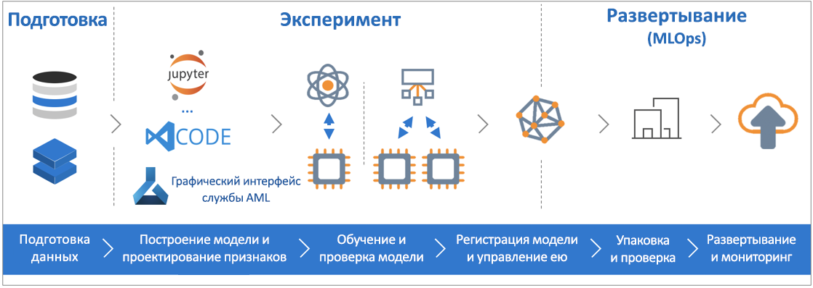

# Что такое служба машинного обучения Azure

Служба машинного обучения Azure — это облачная служба, которая используется для обучения, развертывания, автоматизации моделей машинного обучения и управления ими в предоставляемом облаком широком масштабе.

## Что такое машинное обучение?

Машинное обучение — это способ обработки и анализа данных, который позволяет компьютерам использовать имеющиеся данные для прогнозирования будущего поведения, исходов и трендов. Используя машинное обучение, компьютеры учатся, не будучи явно запрограммированными.

Прогнозы машинного обучения позволяют сделать приложения и устройства эффективнее. Например, при покупках через Интернет машинное обучение помогает рекомендовать другие продукты, которые могут вам понравиться, на основе уже приобретенных вами товаров. При проведении кредитной карты через терминал машинное обучение сравнивает транзакцию с базой данных и позволяет обнаружить мошенничество. Когда робот-пылесос убирает комнату, машинное обучение позволяет определить, когда этот процесс окончен.

## Что такое служба машинного обучения Azure

Служба машинного обучения предоставляет облачную среду, которую можно использовать для разработки, обучения, тестирования, развертывания и отслеживания моделей машинного обучения, а также управления такими моделями.

[  ] (./media/overview-what-is-azure-ml/aml.png#lightbox)

Служба машинного обучения Azure полностью поддерживает технологии с открытым исходным кодом. Вы можете применять десятки тысяч пакетов Python с открытым исходным кодом с компонентами машинного обучения. Примерами являются TensorFlow и scikit-learn.
Благодаря поддержке большого набора средств можно легко интерактивно изучать данные, преобразовывать их, а затем разрабатывать и тестировать модели. Примерами являются [записные книжки Jupyter](http://jupyter.org) или расширение [Машинное обучение Azure для Visual Studio Code](https://marketplace.visualstudio.com/items?itemName=ms-toolsai.vscode-ai#overview).
Служба машинного обучения Azure также включает функции, которые [автоматизируют создание и настройку моделей](tutorial-auto-train-models.md) и помогают создавать модели легко, эффективно и точно.

Служба машинного обучения Azure позволяет начать обучение на локальном компьютере, а затем развернуть его в облако. С большинством доступных [целевых объектов вычислений](how-to-set-up-training-targets.md), например вычислительной средой Машинного обучения Azure и [Azure Databricks](/azure/azure-databricks/what-is-azure-databricks), и с [расширенными службами настроек гиперпараметров](how-to-tune-hyperparameters.md) можно создавать более высокий уровень модели быстрее, используя мощные возможности облака.

Имея подходящую модель, вы легко сможете развернуть ее в такой контейнер как Docker. Поэтому можно легко развернуть модель в Экземпляры контейнеров Azure или Службу Azure Kubernetes. Кроме того, вы можете использовать контейнер в собственных развертываниях (локальных или облачных). Дополнительные сведения см. в статье [Развертывание моделей с помощью Службы машинного обучения Azure](how-to-deploy-and-where.md).

Экспериментируя в поисках оптимального решения, вы сможете управлять развернутыми моделями и отслеживать сразу несколько выполнений.
После развертывания модель может возвращать прогнозы в [режиме реального времени](how-to-consume-web-service.md) или [асинхронно](how-to-run-batch-predictions.md) на больших объемах данных.

С расширенными [конвейерами машинного обучения](concept-ml-pipelines.md) можно совместно работать на всех этапах подготовки данных, обучения и оценки модели и развертывания.

## Что можно делать с помощью службы машинного обучения Azure?

Служба машинного обучения Azure может автоматически обучать модели и настраивать их для вас.
Ознакомиться с примером можно в статье [Руководство. Создание регрессионной модели с помощью автоматического машинного обучения](tutorial-auto-train-models.md).

Используя пакет <a href="https://aka.ms/aml-sdk" target="_blank">SDK</a> службы "Машинное обучение Azure" для Python с пакетами Python с открытым кодом, вы сможете сами создавать и обучать высокоточные модели машинного и глубокого обучения в рабочей области этой службы.
Пакеты Python с открытым исходным кодом предлагают различные компоненты машинного обучения, такие как:

- <a href="https://scikit-learn.org/stable/" target="_blank">Scikit-learn</a>
- <a href="https://www.tensorflow.org" target="_blank">Tensorflow</a>
- <a href="https://pytorch.org" target="_blank">PyTorch</a>
- <a href="https://www.microsoft.com/en-us/cognitive-toolkit/" target="_blank">CNTK</a>
- <a href="http://mxnet.io" target="_blank">MXNet</a>

При наличии модели ее используют для создания контейнера (например, Docker), который можно развернуть локально для тестирования. После завершения тестирования вы можете развернуть модель в качестве веб-службы в рабочей среде в службе "Экземпляры контейнеров Azure" или в Службе Azure Kubernetes. Дополнительные сведения см. в статье [Развертывание моделей с помощью Службы машинного обучения Azure](how-to-deploy-and-where.md).

Для управления развернутыми моделями можно использовать [пакет SDK Машинного обучения Azure для Python](https://aka.ms/aml-sdk) или [портал Azure](https://portal.azure.com/).
Вы сможете оценивать метрики моделей, переобучать и повторно развертывать новые версии модели и одновременно отслеживать эксперименты с моделью.

Чтобы начать работу со Службой машинного обучения Azure, перейдите к разделу [Дальнейшие действия](#next-steps).

## Чем Служба машинного обучения Azure отличается от Студии машинного обучения?

Студия машинного обучения Azure — это интерактивное рабочее пространство для совместной работы, в котором можно создавать, тестировать и развертывать решения машинного обучения без написания кода. Она использует предварительно созданные и настроенные алгоритмы машинного обучения и модули обработки данных.

Используйте студию машинного обучения, если вас интересуют быстрые и простые эксперименты с моделями машинного обучения и для ваших решений достаточно встроенных алгоритмов машинного обучения.

Используйте студию машинного обучения, если вы работаете в среде Python и хотите более гибко управлять алгоритмами машинного обучения или использовать библиотеки машинного обучения с открытым исходным кодом.

> [!NOTE]
> Модели, созданные в Студии машинного обучения Azure, нельзя развертывать и использовать в Службе машинного обучения Azure.

## Бесплатная пробная версия

Если у вас еще нет подписки Azure, создайте бесплатную учетную запись Azure, прежде чем начинать работу. Опробуйте [бесплатную или платную версию Службы машинного обучения Azure](http://aka.ms/AMLFree).

Вы получаете кредиты, которые можно потратить на службы Azure. После того, как кредиты израсходованы, ваша учетная запись не исчезнет. Вы сможете использовать ее для работы с [бесплатными службами Azure](https://azure.microsoft.com/free/). С вашей кредитной карты не будет взиматься плата, если вы явно не измените параметры и не попросите снимать плату. Кроме того, можно [активировать преимущества подписчика MSDN](https://azure.microsoft.com/pricing/member-offers/msdn-benefits-details/?WT.mc_id=A261C142F), которые каждый месяц приносят вам кредиты для оплаты служб Azure.

## Дополнительная информация

- Инструкции по созданию рабочей области Службы машинного обучения см. в статьях [Краткое руководство. Начало работы со Службой машинного обучения Azure с помощью портала Azure](quickstart-get-started.md) или [Краткое руководство. Использование Python для начала работы со службой "Машинное обучение Azure"](quickstart-create-workspace-with-python.md).

- Изучите полномасштабную статью [Руководство по обучению модели классификации изображений с помощью Службы машинного обучения Azure](tutorial-train-models-with-aml.md).

- [Руководство. Создание регрессионной модели с помощью автоматического машинного обучения](tutorial-auto-train-models.md).

- Подготовьте данные с помощью [этого пакета SDK для службы "Машинное обучение Azure"](https://aka.ms/data-prep-sdk).

- См. сведения о [конвейерах машинного обучения](/azure/machine-learning/service/concept-ml-pipelines), которые можно использовать для создания и оптимизации сценариев машинного обучения, а также управления ими.

- Изучите статью [Как работает служба машинного обучения Azure: архитектура и понятия](concept-azure-machine-learning-architecture.md).

- Дополнительные сведения см. в статье [Какие продукты для машинного обучения предлагает корпорация Майкрософт?](./overview-more-machine-learning.md)

<!-- 

An intro to AML or an end-to-end quickstart video could go here.

In this 9-minute video, learn how you can benefit your app. You'll learn about key features and what a typical workflow looks like. 

>[!VIDEO https://channel9.msdn.com/Events/Connect/2016/138/player]
 
+ 0-3 minutes covers key features and use-cases.
+ 3-4 minutes covers service provisioning. 
+ 4-6 minutes covers Import Data wizard used to create an index using the built-in real estate dataset.

-->
