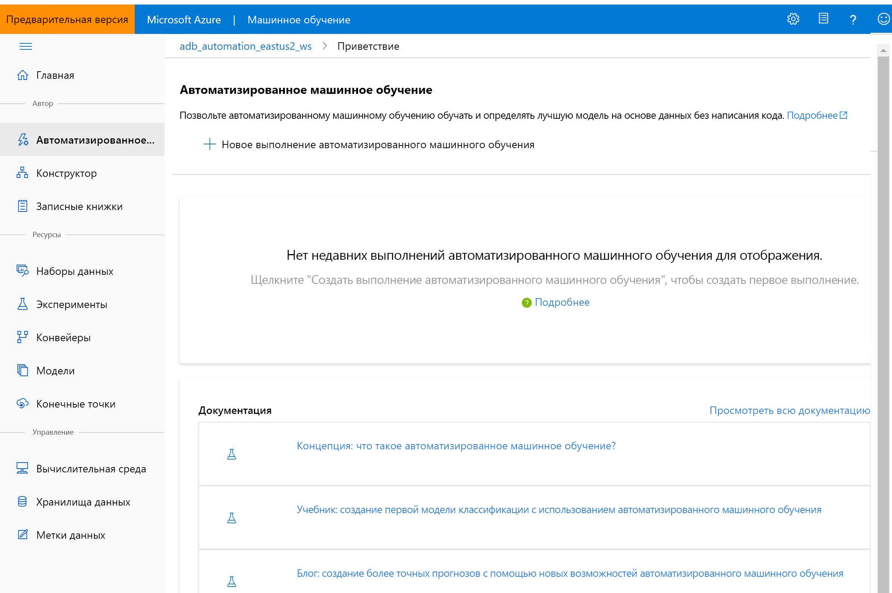

# Что такое служба "Машинное обучение Microsoft Azure"?

Из этой статьи вы узнаете о службе "Машинное обучение Microsoft Azure", облачной среде, которую можно использовать для обучения, развертывания, автоматизации и мониторинга моделей машинного обучения, а также управления ими. 

Службу "Машинное обучение Microsoft Azure" можно использовать для машинного обучения любого рода — от классического машинного обучения до глубокого обучения, контролируемого и неконтролируемого обучения. Если вы предпочитаете писать код Python или R или варианты без кода или с минимальным созданием кода, например [конструктор](ui-tutorial-automobile-price-train-score.md), вы можете создавать, изучать и отслеживать высокоточные модели машинного обучения и глубокого обучения в рабочей области машинного обучения Azure. 

Начните обучение на локальном компьютере, а затем выполните развертывание в облаке. 

Служба также взаимодействует с популярными средствами с открытым кодом, такими как PyTorch, TensorFlow и scikit-learn.

> [!VIDEO https://channel9.msdn.com/Events/Connect/Microsoft-Connect--2018/D240/player]

> [!Tip]
> **Бесплатная пробная версия!**  Если у вас еще нет подписки Azure, создайте бесплатную учетную запись Azure, прежде чем начинать работу. Опробуйте [бесплатную или платную версию Машинного обучения Azure](https://aka.ms/AMLFree) уже сегодня. Вы получаете кредиты, которые можно потратить на службы Azure. После того, как кредиты израсходованы, ваша учетная запись не исчезнет. Вы сможете использовать ее для работы с [бесплатными службами Azure](https://azure.microsoft.com/free/). С вашей кредитной карты не будет взиматься плата, если вы явно не измените параметры и не попросите снимать плату.

## Что такое машинное обучение?

Машинное обучение — это способ обработки и анализа данных, который позволяет компьютерам использовать имеющиеся данные для прогнозирования будущего поведения, исходов и трендов. Используя машинное обучение, компьютеры учатся, не будучи явно запрограммированными.

Прогнозы машинного обучения позволяют сделать приложения и устройства эффективнее. Например, при покупках через Интернет машинное обучение помогает рекомендовать другие продукты, которые могут вам понравиться, на основе уже приобретенных вами товаров. При проведении кредитной карты через терминал машинное обучение сравнивает транзакцию с базой данных и позволяет обнаружить мошенничество. Когда робот-пылесос убирает комнату, машинное обучение позволяет определить, когда этот процесс окончен.

## Средства машинного обучения для любой задачи 

Служба "Машинное обучение Microsoft Azure" предоставляет разработчикам и специалистам по обработке и анализу данных все средства, необходимые для рабочих процессов машинного обучения, в том числе:
+ [Конструктор Машинного обучения Azure](ui-tutorial-automobile-price-train-score.md) (предварительная версия). Перетащите модули, чтобы создать эксперименты, а затем разверните конвейеры.

+ Записные книжки Jupyter. Используйте наши [примеры записных книжек](https://aka.ms/aml-notebooks) или создайте свои записные книжки, чтобы использовать для машинного обучения наши примеры для <a href="https://docs.microsoft.com/python/api/overview/azure/ml/intro?view=azure-ml-py" target="_blank">пакета SDK для Python</a>. 

+ Скрипты R или записные книжки, в которых используется <a href="https://azure.github.io/azureml-sdk-for-r/reference/index.html" target="_blank">пакет SDK для R</a> для написания собственного кода, или модули R в конструкторе.

+ [Расширение Visual Studio Code](how-to-vscode-tools.md)

+ [Интерфейс командной строки для машинного обучения](reference-azure-machine-learning-cli.md)

+ Платформы с открытым кодом, например Python, PyTorch, TensorFlow, scikit-learn и многие другие.

Вы можете даже использовать [MLflow для мониторинга метрик и развертывания моделей](how-to-use-mlflow.md) или Kubeflow для [создания конвейеров сквозных рабочих процессов](https://www.kubeflow.org/docs/azure/).

## Создание моделей машинного обучения на языке Python или R

Начните обучение на локальном компьютере с помощью <a href="https://docs.microsoft.com/python/api/overview/azure/ml/intro?view=azure-ml-py" target="_blank">пакета SDK для Python</a> или <a href="https://azure.github.io/azureml-sdk-for-r/reference/index.html" target="_blank">пакета SDK для R</a> для службы "Машинное обучение Microsoft Azure". Затем можно выполнить развертывание в облаке. 

С большинством доступных [целевых объектов вычислений](how-to-set-up-training-targets.md), например вычислительной средой Машинного обучения Azure и [Azure Databricks](/azure/azure-databricks/what-is-azure-databricks), и с [расширенными службами настроек гиперпараметров](how-to-tune-hyperparameters.md) можно создавать более высокий уровень модели быстрее, используя мощные возможности облака.

Также с помощью пакета SDK можно [автоматизировать обучение и настройку модели](tutorial-auto-train-models.md).

## Создание моделей машинного обучения с помощью средств без кода

Для обучения и развертывания без кода или с минимальным созданием кода попробуйте использовать:

+ **Конструктор Машинного обучения Azure (предварительная версия).**

  Используйте конструктор для подготовки данных, обучения, тестирования, развертывания, мониторинга моделей машинного обучения и управления ими без написания кода. Никакое программирование не требуется. Выполните визуальное соединение наборов данных и модулей, чтобы создать модель.   Ознакомьтесь с [учебником по конструктору](tutorial-designer-automobile-price-train-score.md).

  Дополнительные сведения см. в [статье с обзором конструктора Машинного обучение Azure](concept-designer.md). 

  

+ **Пользовательский интерфейс автоматизированного машинного обучения.**

  Узнайте, как создать [эксперименты автоматизированного машинного обучения](tutorial-first-experiment-automated-ml.md) в удобном интерфейсе. 

  

## MLOps: развертывание и управление жизненным циклом
Имея подходящую модель, вы легко сможете использовать ее в веб-службе, устройстве Интернета вещей или в Power BI. См. дополнительные сведения о [развертывании](how-to-deploy-and-where.md).

Для управления развернутыми моделями можно использовать [пакет SDK Машинного обучения Azure для Python](https://aka.ms/aml-sdk), [Студию машинного обучения Azure](https://ml.azure.com) или [CLI машинного обучения](reference-azure-machine-learning-cli.md).

Эти модели могут использоваться, а также они могут возвращать прогнозы [в реальном времени](how-to-consume-web-service.md) или [асинхронно](how-to-run-batch-predictions.md) на больших объемах данных.

С расширенными [конвейерами машинного обучения](concept-ml-pipelines.md) можно совместно работать на каждом из этапов подготовки данных, обучения и оценки моделей с помощью развертывания. Конвейеры позволяют выполнять следующие задачи:

* автоматизировать полный цикл процесса машинного обучения в облаке;
* повторно использовать компоненты и только при необходимости повторно выполнять этапы;
* использовать разные вычислительные ресурсы на каждом этапе;
* выполнять задачи пакетной оценки.

Если вы хотите автоматизировать рабочий процесс машинного обучения с помощью скриптов, можно использовать [CLI машинного обучения](reference-azure-machine-learning-cli.md), который предоставляет средства командной строки, выполняющие стандартные задачи, такие как отправка запуска на выполнение обучения или развертывание модели.

Чтобы начать работу с Машинным обучением Azure, перейдите к разделу [Дальнейшие действия](#next-steps).

## Выпуски "Базовый" и "Корпоративный"

Служба "Машинное обучение Microsoft Azure" предлагает два выпуска, предназначенных для ваших потребностей машинного обучения:
+ "Базовый" (общедоступная версия);
+ "Корпоративный" (предварительная версия).

Эти выпуски определяют, какие средства машинного обучения доступны разработчикам и специалистам по обработке и анализу данных в рабочей области.   

В рабочих областях выпуска "Базовый" можно продолжить использовать службу "Машинное обучение Microsoft Azure" и платить только за ресурсы Azure, потребляемые во время процесса машинного обучения. В рабочих областях выпуска "Корпоративный" будет взиматься плата только за использование службы Azure, пока выпуск находится на этапе предварительной версии. Узнайте больше о доступных возможностях в [обзоре выпусков и цен](https://azure.microsoft.com/pricing/details/machine-learning/) для службы "Машинное обучение Microsoft Azure". 

Выпуск назначается при каждом создании рабочей области. Ранее созданные рабочие области преобразованы в выпуск "Базовый". Выпуск "Базовый" содержит все функции, которые уже общедоступны по состоянию на октябрь 2019 г. Все эксперименты в этих рабочих областях, созданные с помощью функций выпуска "Корпоративный", будут доступны вам только для чтения до тех пор, пока не будет выполнено обновление до выпуска "Корпоративный". Узнайте, как [обновить рабочую область уровня "Базовый" до выпуска "Корпоративный"](how-to-manage-workspace.md#upgrade). 

Клиенты несут ответственность за затраты на вычисление и другие ресурсы Azure в течение этого времени.

## Дополнительная информация

- Создайте свой первый эксперимент предпочитаемым способом:
  + [Использование записных книжек Python для обучения и развертывания моделей машинного обучения](tutorial-1st-experiment-sdk-setup.md).
  + [Использование R Markdown для обучения и развертывания моделей машинного обучения](tutorial-1st-r-experiment.md). 
  + [Использование автоматизированного машинного обучения для обучения и развертывания моделей](  tutorial-first-experiment-automated-ml.md). 
  + [Использование возможностей перетаскивания конструктора для обучения и развертывания](tutorial-designer-automobile-price-train-score.md). 
  + [Использование CLI машинного обучения для обучения и развертывания модели](tutorial-train-deploy-model-cli.md).

- См. сведения о [конвейерах машинного обучения](/azure/machine-learning/service/concept-ml-pipelines), которые можно использовать для создания и оптимизации сценариев машинного обучения, а также управления ими.

- Изучите статью [Как работает машинное обучение Azure: архитектура и понятия](concept-azure-machine-learning-architecture.md).
