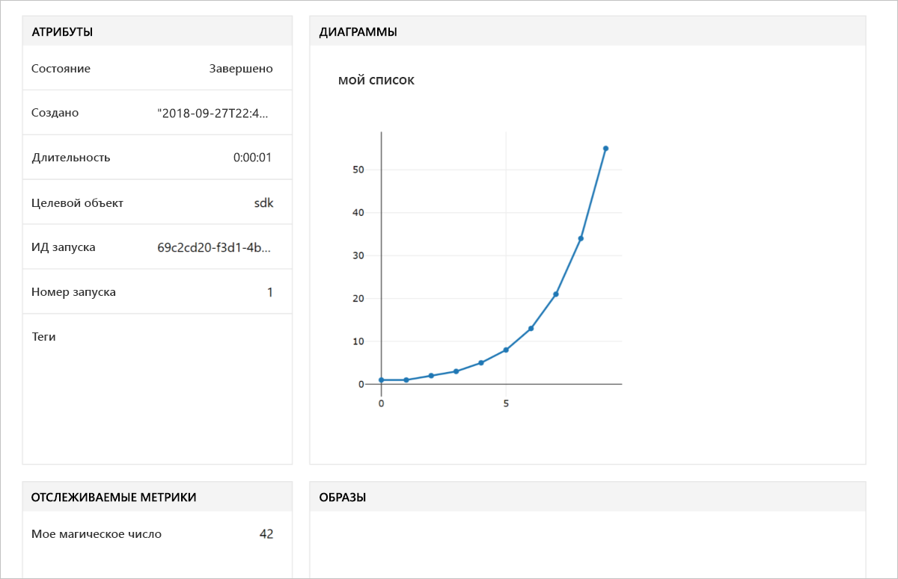

# <a name="quickstart-use-the-python-sdk-to-get-started-with-azure-machine-learning"></a>Краткое руководство. Начало работы со службой "Машинное обучение Azure" с использованием пакета SDK для Python

В рамках этой статьи будет использоваться пакет SDK для Машинного обучения Azure для Python для создания и применения [рабочей области](concept-azure-machine-learning-architecture.md) Службы машинного обучения Azure. Эта рабочая область — основной блок в облаке для экспериментов, обучения и развертывания моделей машинного обучения с помощью Машинного обучения Azure. 

Вы начнете с настройки собственного окружения Python и сервера Jupyter Notebook. Сведения о запуске без установки см. в статье [Краткое руководство. Начало работы со Службой машинного обучения Azure с помощью портала Azure](quickstart-get-started.md).

> [!VIDEO https://www.microsoft.com/en-us/videoplayer/embed/RE2G9N6]

Работая с этой статьей, вы выполните следующие задачи:
* установите пакет SDK для Python;
* Создавать рабочую область в своей подписке Azure.
* создадите файл конфигурации для той рабочей области, которая будет использоваться позже в других записных книжках и скриптах;
* запишите код, который будет записывать в журнал значения внутри рабочей области;
* просмотрите записанные значения в рабочей области.

Вы создаете рабочую область и ее файл конфигурации, которые можно использовать как необходимые компоненты для работы с другими руководствами и статьями с инструкциями по Машинному обучению. Как в случае с другими службами Azure, со службой "Машинное обучение Azure" связаны определенные ограничения и квоты. [Узнайте больше о квотах и способах отправки запросов на получение дополнительных квот.](how-to-manage-quotas.md)

Следующие ресурсы Azure добавляются автоматически в рабочую область, если они доступны в вашем регионе:
 
- [Реестр контейнеров Azure](https://azure.microsoft.com/services/container-registry/)
- [Хранилище Azure](https://azure.microsoft.com/services/storage/)
- [Azure Application Insights](https://azure.microsoft.com/services/application-insights/) 
- [Хранилище ключей Azure](https://azure.microsoft.com/services/key-vault/)

Если у вас еще нет подписки Azure, создайте бесплатную учетную запись Azure, прежде чем начинать работу. Опробуйте [бесплатную или платную версию Службы машинного обучения Azure](http://aka.ms/AMLFree).

## <a name="install-the-sdk"></a>Установка пакета SDK

> [!IMPORTANT]
> Пропустите этот раздел, если вы используете виртуальную машину для обработки и анализа данных, созданную после 27 сентября 2018 г.
> Виртуальные машины для обработки и анализа, созданные после этой даты, поставляются с уже установленным пакетом SDK для Python.

Для выполнения кода из этой статьи требуется пакет SDK для службы "Машинное обучение Azure" версии 1.0.2.

Прежде чем устанавливать пакет SDK, сначала рекомендуется создать изолированную среду Python. Хотя в этой статье используется [Miniconda](https://docs.conda.io/en/latest/miniconda.html), также можно использовать полностью установленное средство [Anaconda](https://www.anaconda.com/) или [Python virtualenv](https://virtualenv.pypa.io/en/stable/).

### <a name="install-miniconda"></a>Установка Miniconda

[Скачайте и установите Miniconda](https://conda.io/miniconda.html). Выберите Python 3.7 или более поздней версии. Не выбирайте версию Python 2.x.

### <a name="create-an-isolated-python-environment"></a>Создание изолированной среды Python 

1. Откройте окно командной строки и создайте среду conda с именем *myenv*, используя Python 3.6.

    ```shell
    conda create -n myenv -y Python=3.6
    ```

1. Активируйте среду.

    ```shell
    conda activate myenv
    ```

### <a name="install-the-sdk"></a>Установка пакета SDK

В активированной среде conda установите пакет SDK. Этот код устанавливает основные компоненты пакета SDK для Машинного обучения. Он также устанавливает сервер Jupyter Notebook в среду conda. Установка занимает несколько минут в зависимости от конфигурации компьютера.

```shell
# Install Jupyter
conda install nb_conda

# Install the base SDK and Jupyter Notebook
pip install azureml-sdk[notebooks]
```

Для установки других компонентов пакета SDK можно использовать дополнительные ключевые слова:

```shell
# Install the base SDK and auto ml components
pip install azureml-sdk[automl]

# Install the base SDK and the model explainability component
pip install azureml-sdk[explain]

# Install the base SDK and experimental components
pip install azureml-sdk[contrib]
```

В среде Azure Databricks выполните вместо этого [шаги установки Databricks](how-to-configure-environment.md#azure-databricks
).


## <a name="create-a-workspace"></a>Создание рабочей области

1. Чтобы запустить Jupyter Notebook, введите эту команду:

    ```shell
    jupyter notebook
    ```

1. В окне браузера создайте записную книжку с использованием стандартного ядра `Python 3`. 

1. Чтобы просмотреть версию пакета SDK, введите следующий код Python в ячейку записной книжки и выполните его.

   [!code-python[](~/aml-sdk-samples/ignore/doc-qa/quickstart-create-workspace-with-python/quickstart.py?name=import)]

1. Найдите значение для параметра `<azure-subscription-id>` в [списке подписок на портале Azure](https://ms.portal.azure.com/#blade/Microsoft_Azure_Billing/SubscriptionsBlade). Используйте любую подписку, в которой вам предоставлена роль владельца или участника.

   ```python
   from azureml.core import Workspace
   ws = Workspace.create(name='myworkspace',
                         subscription_id='<azure-subscription-id>', 
                         resource_group='myresourcegroup',
                         create_resource_group=True,
                         location='eastus2' # Or other supported Azure region   
                        )
   ```

   При выполнении кода вам может быть предложено войти в учетную запись Azure. Когда вы войдете в систему, маркер проверки подлинности будет кэширован локально.

1. Чтобы просмотреть сведения о рабочей области, например связанное хранилище, реестр контейнеров и хранилище ключей, введите следующий код.

    [!code-python[](~/aml-sdk-samples/ignore/doc-qa/quickstart-create-workspace-with-python/quickstart.py?name=getDetails)]


## <a name="write-a-configuration-file"></a>Запись файла конфигурации

Сохраните сведения рабочей области в файле конфигурации в текущем каталоге. Этот файл называется *aml_config\config.json*.  

Вызов API `write_config()` позволяет создать файл конфигурации в текущем каталоге. Файл *config.json* содержит следующее:

```json
{
    "subscription_id": "<azure-subscription-id>",
    "resource_group": "myresourcegroup",
    "workspace_name": "myworkspace"
}
```

Этот файл конфигурации рабочей области упрощает дальнейшую загрузку этой же рабочей области. Вы можете загрузить ее с помощью других записных книжек и скриптов в том же каталоге или подкаталоге. 

[!code-python[](~/aml-sdk-samples/ignore/doc-qa/quickstart-create-workspace-with-python/quickstart.py?name=writeConfig)]


## <a name="use-the-workspace"></a>Используйте рабочую область

Напишите код, использующий базовые интерфейсы API пакета SDK для отслеживания нескольких экспериментальных запусков.

[!code-python[](~/aml-sdk-samples/ignore/doc-qa/quickstart-create-workspace-with-python/quickstart.py?name=useWs)]

## <a name="view-logged-results"></a>Просмотр зарегистрированных результатов
После завершения выполнения сведения об экспериментальном запуске можно просмотреть на портале Azure. Чтобы вывести URL-адрес расположения с результатами последнего запуска, используйте следующий код.

```python
print(run.get_portal_url())
```

Используйте ссылку, чтобы просмотреть в браузере зарегистрированные в журнале значения на портале Azure.



## <a name="clean-up-resources"></a>Очистка ресурсов 
>[!IMPORTANT]
>Созданные ресурсы могут использоваться в качестве необходимых компонентов при работе с другими руководствами по Машинному обучению Azure.

Если вы не планируете использовать ресурсы, созданные в этой статье, удалите их, чтобы плата не взималась.

[!code-python[](~/aml-sdk-samples/ignore/doc-qa/quickstart-create-workspace-with-python/quickstart.py?name=delete)]

## <a name="next-steps"></a>Дополнительная информация

В этой статье вы создали ресурсы для экспериментирования и развертывания моделей. Кроме того, вы запускали код в записной книжке и изучали журнал выполнения из этого кода в вашей рабочей области в облаке.

Для использования кода при работе с руководствами по Машинному обучению вам понадобится несколько пакетов в среде.

1. Закройте записную книжку в браузере.
1. В окне командной строки используйте клавиши CTRL+C, чтобы остановить работу сервера Jupyter Notebook.
1. Установите дополнительные пакеты.  Если вы не установили `azureml-sdk[automl]` в одном из предыдущих шагов, обязательно сделайте это сейчас.

    ```shell
    conda install -y cython matplotlib scikit-learn pandas numpy
    pip install azureml-sdk[automl]
    ```

После установки этих пакетов следуйте инструкциям в руководствах по обучению и развертыванию моделей. 

> [!div class="nextstepaction"]
> [Руководство Обучение модели классификации изображений](tutorial-train-models-with-aml.md)

Вы также можете изучить [более сложные примеры на GitHub](https://aka.ms/aml-notebooks).
