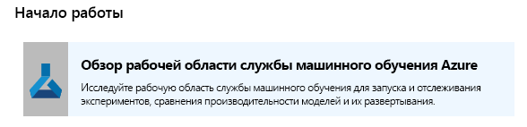
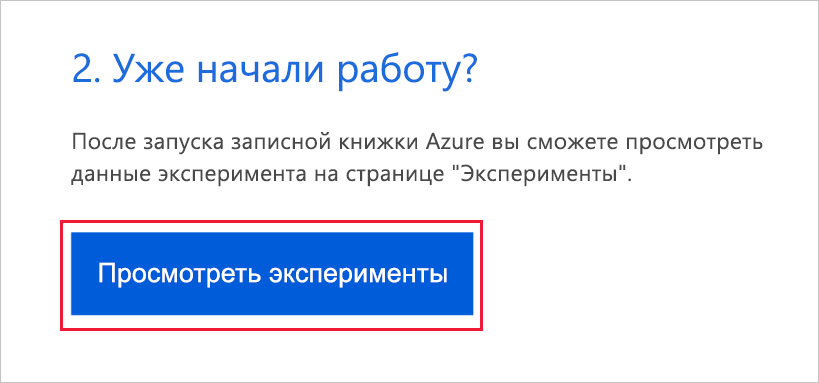
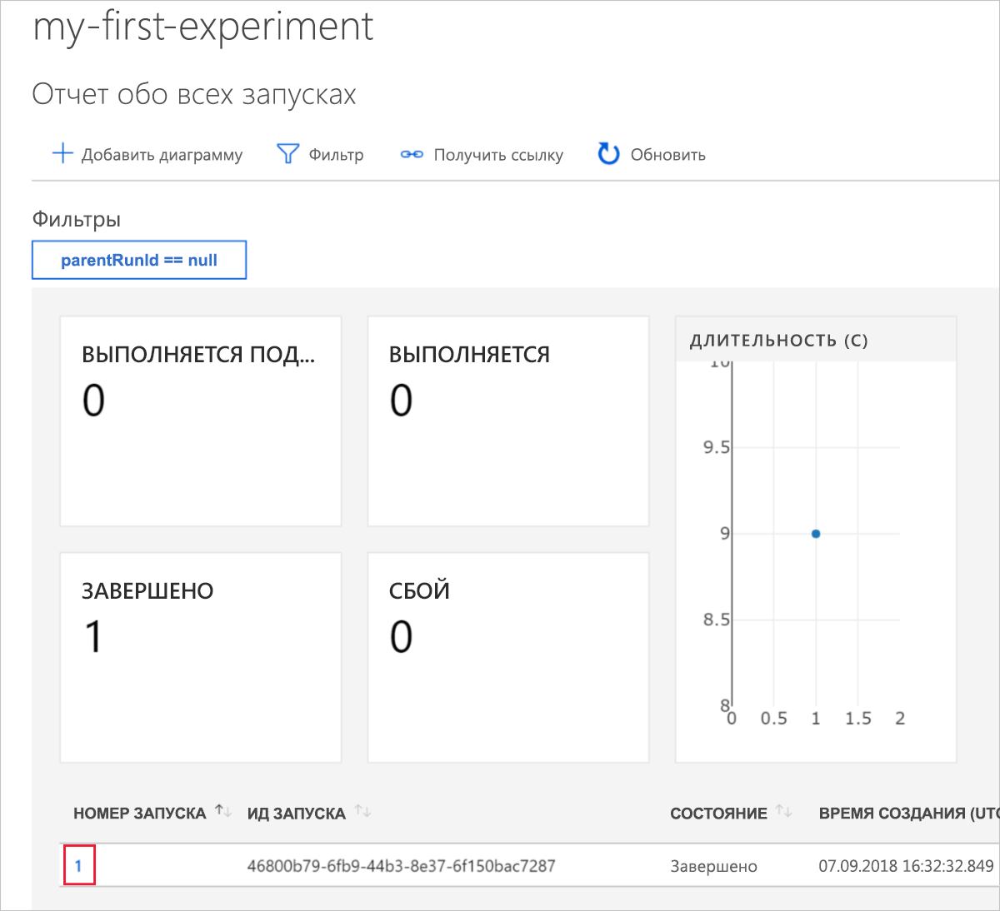
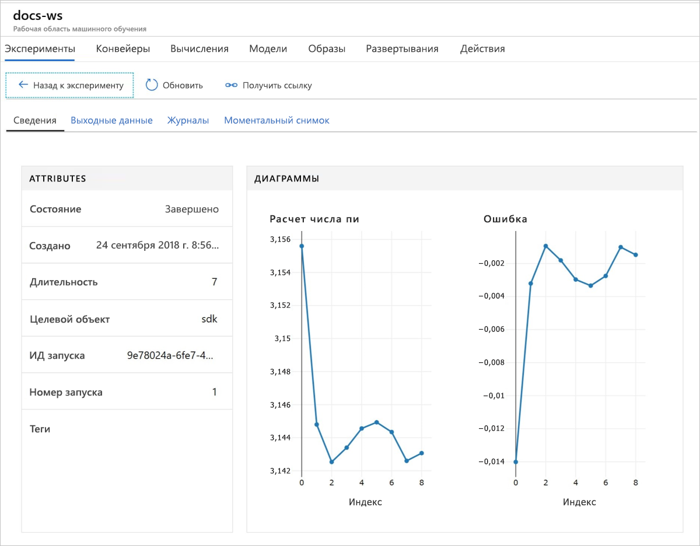

# Краткое руководство. Начало работы со Службой машинного обучения Azure с помощью портала Azure

В этом кратком руководстве вы используете портал Azure для создания рабочей области "Машинное обучение Azure". Эта рабочая область — основной блок в облаке для экспериментов, обучения и развертывания моделей машинного обучения с помощью Машинного обучения Azure. В этом кратком руководстве используются ресурсы облака. Установка не требуется. Для настройки собственного сервера Jupyter Notebook, выполните инструкции, приведенные в [Краткое руководство по началу работы со службой "Машинное обучение Azure" с использованием Python](quickstart-create-workspace-with-python.md).  
 
> [!VIDEO https://www.microsoft.com/en-us/videoplayer/embed/RE2F9Ad]

В этом кратком руководстве вы выполните следующие действия:

* Создавать рабочую область в своей подписке Azure.
* Попробуете использовать ее с Python в записной книжке Azure и запишите значения из нескольких итераций.
* просмотрите записанные значения в рабочей области.

Следующие ресурсы Azure добавляются автоматически в рабочую область, если они доступны в вашем регионе:

  - [Реестр контейнеров Azure](https://azure.microsoft.com/services/container-registry/)
  - [Хранилище Azure](https://azure.microsoft.com/services/storage/)
  - [Azure Application Insights](https://azure.microsoft.com/services/application-insights/) 
  - [Хранилище ключей Azure](https://azure.microsoft.com/services/key-vault/)

Созданные ресурсы могут использоваться в качестве необходимых компонентов для других руководств и статей с практическими рекомендациями по Службе машинного обучения. Как и в других службах Azure, существуют ограничения на некоторые ресурсы, связанные со Службой машинного обучения. Например, размер вычислительного кластера. Дополнительные сведения см. в статье [Управление квотами для ресурсов Azure и их запрашивание](how-to-manage-quotas.md).

Если у вас еще нет подписки Azure, создайте бесплатную учетную запись Azure, прежде чем начинать работу. Попробуйте [бесплатную или платную версию Службы машинного обучения Azure](http://aka.ms/AMLFree).

## Создание рабочей области 

[!INCLUDE [aml-create-portal](../../../includes/aml-create-in-portal.md)]

На странице рабочей области выберите `Explore your Azure Machine Learning service Workspace`.

 

## Используйте рабочую область

Теперь познакомьтесь с тем, как рабочая область помогает управлять сценариями машинного обучения. Ниже перечислены действия, которые вы выполните в этом разделе.

* Откроете записную книжку в Записных книжках Azure.
* Запустите код, который создает записанные значения.
* Просмотрите записанные значения в рабочей области.

Этот пример демонстрирует, как рабочая область может помочь вам отследить информацию, создаваемую в сценарии. 

### Откройте записную книжку 

Записные книжки Azure предоставляют бесплатную облачную платформу для записных книжек Jupyter, предварительно настроенную для запуска машинного обучения.  

Выберите `Open Azure Notebooks`, чтобы опробовать первый эксперимент.

 

Ваша организация может требовать [согласия администратора](https://notebooks.azure.com/help/signing-up/work-or-school-account/admin-consent) для входа.

Войдите в записные книжки Azure, используя ту же учетную запись, что и на портале Azure.  После входа откроется вкладка и отобразится подсказка `Clone Library`. Выберите `Clone`.

### Запустите записную книжку

Рядом с двумя записными книжками вы увидите файл `config.json`. Этот файл конфигурации содержит сведения о рабочей области, которую вы создали.  

Выберите `01.run-experiment.ipynb`, чтобы открыть записную книжку.

Чтобы запускать ячейки по очереди, используйте Shift+Enter. Вы также можете выбрать `Cells` > `Run All`, чтобы запустить всю записную книжку. Ячейка запускается, если рядом с ней отображается звездочка, __*__. Когда код для этой ячейки будет выполнен, появится номер. 

После завершения запуска всех ячеек в записной книжке можно просмотреть зарегистрированные значения в рабочей области.

## Просмотр зарегистрированных в журнале значений

После заполнения всех ячеек в записной книжке вернитесь на страницу портала.  

Выберите `View Experiments`.

Закройте всплывающее окно `Reports`.

Выберите `my-first-experiment`.

См. сведения о запуске, который вы только что выполнили. Прокрутите страницу вниз до таблицы выполнения. Выберите ссылку с номером выполнения.

 

Вы увидите графики, которые были автоматически созданы из записанных значений: При каждой регистрации нескольких значений с одним и тем же параметром name график создается автоматически.

   

Так как код для приблизительного расчета числа Пи использует случайные значения, на графиках будут отображаться разные значения.  

## Очистка ресурсов 

[!INCLUDE [aml-delete-resource-group](../../../includes/aml-delete-resource-group.md)]

Вы также можете сохранить группу ресурсов, но удалить одну рабочую область. Отобразите свойства рабочей области и нажмите кнопку **Удалить**.

## Дополнительная информация

Вы создали необходимые ресурсы для экспериментирования и развертывания моделей. Вы также запустили код в записной книжке и изучили журнал выполнения из этого кода в вашей рабочей области в облаке.

Чтобы узнать больше о рабочем процессе, изучите инструкции по обучению и развертыванию модели в руководствах по Машинному обучению:  

> [!div class="nextstepaction"]
> [Руководство Обучение модели классификации изображений](tutorial-train-models-with-aml.md)
