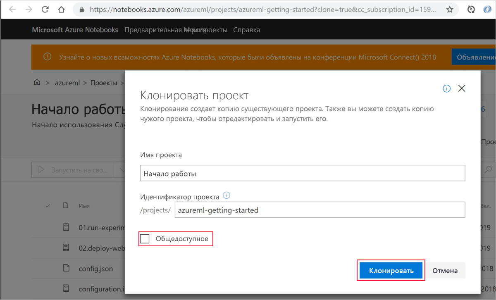
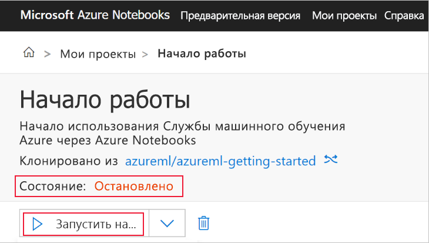
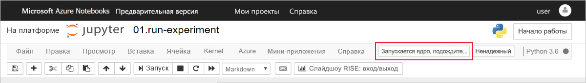
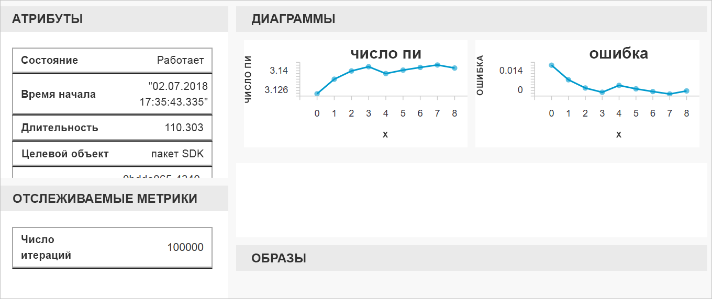

# Краткое руководство. Начало работы со Службой машинного обучения Azure с помощью портала Azure

Для создания рабочей области "Машинное обучение Azure" используйте портал Azure. Эта рабочая область — основной блок в облаке для экспериментов, обучения и развертывания моделей машинного обучения с помощью Машинного обучения Azure. В этом кратком руководстве используются ресурсы облака. Установка не требуется. Для настройки собственного сервера Jupyter Notebook, выполните инструкции, приведенные в [Краткое руководство по началу работы со службой "Машинное обучение Azure" с использованием Python](quickstart-create-workspace-with-python.md).  
 
В этом кратком руководстве вы выполните следующие действия:

* Создавать рабочую область в своей подписке Azure.
* Попробуете использовать ее с Python в записной книжке Jupyter и запишете значения из нескольких итераций.
* просмотрите записанные значения в рабочей области.

Следующие ресурсы Azure добавляются автоматически в рабочую область, если они доступны в вашем регионе:

  - [Реестр контейнеров Azure](https://azure.microsoft.com/services/container-registry/)
  - [Хранилище Azure](https://azure.microsoft.com/services/storage/)
  - [Azure Application Insights](https://azure.microsoft.com/services/application-insights/) 
  - [Хранилище ключей Azure](https://azure.microsoft.com/services/key-vault/)

Созданные ресурсы могут использоваться в качестве необходимых компонентов для других руководств и статей с практическими рекомендациями по Службе машинного обучения. Как и в других службах Azure, существуют ограничения на некоторые ресурсы, связанные со Службой машинного обучения. Например, размер вычислительного кластера. Дополнительные сведения см. в статье [Управление квотами для ресурсов Azure и их запрашивание](how-to-manage-quotas.md).

Если у вас еще нет подписки Azure, создайте бесплатную учетную запись Azure, прежде чем начинать работу. Попробуйте [бесплатную или платную версию Службы машинного обучения Azure](http://aka.ms/AMLFree).

## Создание рабочей области 

[!INCLUDE [aml-create-portal](../../../includes/aml-create-in-portal.md)]

## Используйте рабочую область

> [!VIDEO https://www.microsoft.com/en-us/videoplayer/embed/RE2F9Ad]

Теперь ознакомьтесь с тем, как рабочая область помогает управлять сценариями машинного обучения. Ниже перечислены действия, которые вы выполните в этом разделе.

* Откроете записную книжку в Записных книжках Azure.
* Запустите код, который создает записанные значения.
* Просмотрите записанные значения в рабочей области.

Этот пример демонстрирует, как рабочая область может помочь вам отследить информацию, создаваемую в сценарии. 

### Откройте записную книжку 

[Записные книжки Azure](https://notebooks.azure.com) предоставляют бесплатную облачную платформу для записных книжек Jupyter, предварительно настроенную для запуска Машинного обучения. Из своей рабочей области вы можете запустить эту платформу, чтобы начать использовать рабочую область Службы машинного обучения Azure.

1. На странице рабочей области выберите **Обзор рабочей области службы машинного обучения Azure**.

 

1. Выберите **Откройте Записные книжки Azure**, чтобы провести первый эксперимент в Записных книжках Azure.  Записные книжки Azure — это отдельная служба, которая позволяет бесплатно запускать записные книжки Jupyter в облаке.  Когда вы используете эту ссылку на службу, информация о том, как подключиться к вашему рабочему пространству, будет добавлена в библиотеку, которую вы создаете в Записных книжках Azure.

 

1. Войдите в Записные книжки Azure.  Убедитесь, что для входа вы используете ту же учетную запись, что и на портале Azure. Ваша организация может требовать [согласия администратора](https://notebooks.azure.com/help/signing-up/work-or-school-account/admin-consent) для входа.

1. После входа откроется вкладка и отобразится подсказка `Clone Library`. Клонирование этой библиотеки приведет к загрузке набора записных книжек и других файлов в вашу учетную запись Записных книжек Azure.  Эти файлы помогут вам изучить возможности Машинного обучения Azure.

1. Снимите флажок **Общедоступный**, чтобы не делиться информацией о своей рабочей области с другими.

1. Выберите **Клонировать**.

 

1. Если вы видите, что состояние проекта остановлено, щелкните **Run on Free Computer** (Запустить на бесплатном компьютере), чтобы использовать бесплатный сервер записных книжек.

    

### Запустите записную книжку

В списке файлов для этого проекта находится файл `config.json`. Этот файл конфигурации содержит сведения о рабочей области, которую вы создали на портале Azure.  Он позволяет вашему коду подключаться и добавлять информацию в рабочую область.

1. Выберите **01.run-experiment.ipynb**, чтобы открыть записную книжку.

1. Область состояния просит подождать, пока ядро не запустится.  Это сообщение исчезнет, как только ядро будет готово.

    

1. После запуска ядра запускайте ячейки по одной, используя сочетание клавиш **Shift+Enter**. Или выберите **Ячейки** > **Запустить все**, чтобы запустить всю записную книжку. Ячейка все еще работает, если рядом с ней отображается звездочка, __*__. Когда код для этой ячейки будет выполнен, появится номер. 

1. Следуйте инструкциям в записной книжке для проверки подлинности подписки Azure.

После завершения запуска всех ячеек в записной книжке можно просмотреть зарегистрированные значения в рабочей области.

## Просмотр зарегистрированных в журнале значений

1. Выходные данные из ячейки `run` содержат ссылку на портал Azure для просмотра результатов эксперимента в рабочей области. 

    

1. Щелкните **ссылку на портал Azure** для просмотра сведений о запуске в рабочей области.  Эта ссылка открывает рабочую область на портале Azure.

1. Отображающиеся графики зарегистрированных значений были автоматически созданы в рабочей области. При каждой регистрации нескольких значений с одним и тем же параметром name график создается автоматически.

   

Так как код для приблизительного расчета числа Пи использует случайные значения, на графиках будут отображаться разные значения.  

## Очистка ресурсов 

[!INCLUDE [aml-delete-resource-group](../../../includes/aml-delete-resource-group.md)]

Вы также можете сохранить группу ресурсов, но удалить одну рабочую область. Отобразите свойства рабочей области и нажмите кнопку **Удалить**.

## Дополнительная информация

Вы создали необходимые ресурсы для экспериментирования и развертывания моделей. Вы также запустили код в записной книжке и изучили журнал выполнения из этого кода в вашей рабочей области в облаке.

Чтобы узнать больше о рабочем процессе, изучите инструкции по обучению и развертыванию модели в руководствах по Машинному обучению:  

> [!div class="nextstepaction"]
> [Руководство Обучение модели классификации изображений](tutorial-train-models-with-aml.md)
