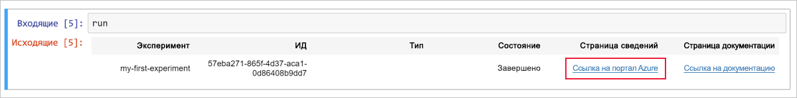
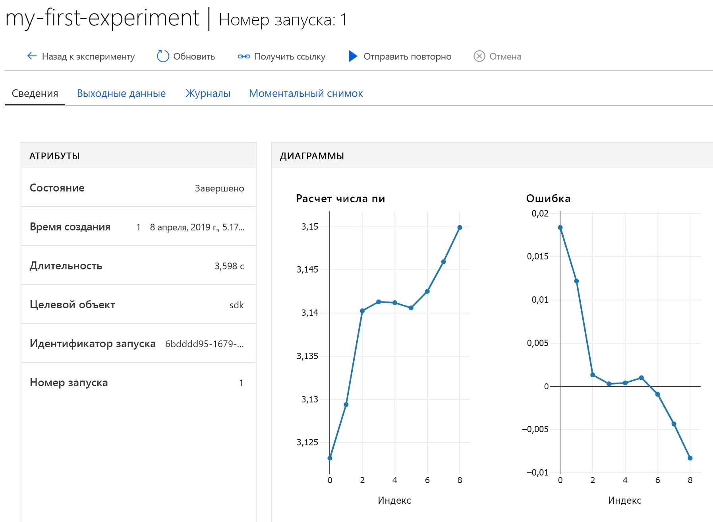

# Краткое руководство. Использование облачного сервера записных книжек для начала работы со службой "Машинное обучение Azure"

Установка не требуется.  Приступайте к работе со Службой машинного обучения Azure с использованием управляемого сервера записных книжек в облаке. Если вместо этого вы хотите установить пакет SDK в своей среде Python, выполните инструкции, приведенные в статье [Краткое руководство. кратком руководстве](quickstart-run-local-notebook.md).

Из этого краткого руководства вы узнаете, как с помощью [рабочей области Службы машинного обучения Azure](concept-azure-machine-learning-architecture.md) отслеживать эксперименты машинного обучения.  Вы создадите [виртуальную машину записных книжек (предварительная версия)](how-to-configure-environment.md#notebookvm) — безопасную облачную рабочую станцию Azure, которая предоставляет сервер записных книжек Jupyter, JupyterLab и полностью подготовленную среду ML. Затем вы запустите на этой виртуальной машине записную книжку Python для записи значений в рабочую область.

В этом кратком руководстве вы выполните следующие действия:

* Создание рабочей области
* Создание виртуальной машины записных книжек в рабочей области.
* запустили веб-интерфейс Jupyter;
* открыли записную книжку, которая содержит код для оценки числа пи и записывает ошибки при каждой итерации;
* запустили записную книжку;
* Просмотрите записанные ошибочные значения в рабочей области. Этот пример демонстрирует, как рабочая область может помочь вам отследить информацию, создаваемую в сценарии.

Если у вас еще нет подписки Azure, создайте бесплатную учетную запись Azure, прежде чем начинать работу. Попробуйте [бесплатную или платную версию Службы машинного обучения Azure](https://aka.ms/AMLFree).

## Создание рабочей области

Если у вас есть рабочая область Службы машинного обучения Azure, перейдите к [следующему разделу](#create-notebook). В противном случае создайте ее прямо сейчас.

[!INCLUDE [aml-create-portal](../../../includes/aml-create-in-portal.md)]

## Создание виртуальной машины записных книжек

 Создайте облачный ресурс в своей рабочей области, чтобы начать работу с записными книжками Jupyter. Этот ресурс предоставляет облачную платформу со всеми предварительными настройками, необходимыми для запуска Службы машинного обучения Azure.

1. Откройте рабочую область на [портале Azure](https://portal.azure.com/).  Если вы не знаете, как найти свою рабочую область на портале, см. [эту статью](how-to-manage-workspace.md#view).

1. На странице своей рабочей области портала Azure выберите **Виртуальные машины записных книжек** в левой части.

1. Щелкните **+Создать**, чтобы создать виртуальную машину записной книжки.

     

1. Задайте имя виртуальной машине. Щелкните **Создать**.

    > [!NOTE]
    > Длина виртуальной машины Notebook должна составлять от 2 до 16 символов. Допустимые символы: буквы, цифры и дефис.  Имя должно быть уникальным в подписке Azure.

    

1. Подождите 4–5 минут, пока состояние не изменится на **Выполняется**.

## Запуск веб-интерфейса Jupyter

После запуска виртуальной машины, чтобы запустить веб-интерфейс Jupyter, используйте раздел **Виртуальные машины записных книжек**.

1. Выберите **Jupyter** для виртуальной машины в столбце **URI**.  

    

    Ссылка запускает сервер записных книжек и открывает веб-страницу записных книжек Jupyter в новой вкладке браузера.  Эта ссылка будет работать только для пользователя, создавшего виртуальную машину.

1. На веб-странице записной книжки Jupyter верхнее имя папки представляет ваше имя пользователя.  Выберите эту папку.

1. Имя папки с примерами включает номер версии, например **samples-1.0.33.1**.  Выберите папку с примерами.

1. Выберите записную книжку для **быстрого запуска**.

## Запустите записную книжку

Запустите записную книжку, которая оценивает число пи и регистрирует ошибку в вашей рабочей области.

1. Выберите **01.run-experiment.ipynb**, чтобы открыть записную книжку.

1. Щелкните первую ячейку кода и выберите **Запуск**.

    > [!NOTE]
    > Перед ячейками кода стоят скобки. Если скобки пустые ( __[  ]__ ), код не был выполнен. Во время выполнения кода будет отображаться символ звездочки ( __[*]__ ). После выполнения кода отобразится число **[1]** .  Номер указывает порядок выполнения ячеек.
    >
    > Для быстрого запуска ячейки нажмите клавиши **SHIFT+ВВОД**.

    

1. Запустите вторую ячейку кода. Если вы видите инструкции по проверке подлинности, скопируйте код и перейдите по ссылке, чтобы войти. После выполнения входа браузер запомнит этот параметр.  

    

1. После выполнения отобразится номер ячейки __[2]__ .  Если вы выполняли вход, отобразится сообщение об успешной проверке подлинности.   Если вам не пришлось выполнять вход, никаких выходных данных в этой ячейке не будет. Отобразится только число, указывающее, что ячейка выполнена успешно.

    

1. Запустите остальные ячейки кода.  После завершения выполнения каждой ячейки отобразится ее номер. Только в последней ячейке будут содержаться дополнительные выходные данные.  

    В самой большой ячейке кода вы увидите, что `run.log` было использовано в нескольких местах. Каждая команда `run.log` добавляет свое значение в рабочую область.

## Просмотр зарегистрированных в журнале значений

1. Выходные данные из ячейки `run` содержат ссылку на портал Azure для просмотра результатов эксперимента в рабочей области.

    

1. Щелкните **ссылку на портал Azure** для просмотра сведений о запуске в рабочей области.  Эта ссылка открывает рабочую область на портале Azure.

1. Отображающиеся графики зарегистрированных значений были автоматически созданы в рабочей области. При каждой регистрации нескольких значений с одним и тем же параметром name график создается автоматически.

   

Так как код для приблизительного расчета числа Пи использует случайные значения, на графиках будут отображаться разные значения.  

## Очистка ресурсов

### Остановка работы виртуальной машины записных книжек

Чтобы снизить расходы, остановите работу виртуальной машины записных книжек, если она не используется.  

1. Выберите в своей рабочей области **Виртуальные машины записных книжек**.

   

1. Выберите пользователя из списка.

1. Выберите **Остановить**.

1. Когда вам снова понадобится использовать сервер, выберите **Запустить**.

### Удаление всех ресурсов

[!INCLUDE [aml-delete-resource-group](../../../includes/aml-delete-resource-group.md)]

Вы также можете сохранить группу ресурсов, но удалить одну рабочую область. Отобразите свойства рабочей области и нажмите кнопку **Удалить**.

## Дополнительная информация

В этом кратком руководстве вы выполнили такие задачи:

* Создание рабочей области
* создали виртуальную машину записных книжек;
* запустили веб-интерфейс Jupyter;
* открыли записную книжку, которая содержит код для оценки числа пи и записывает ошибки при каждой итерации;
* запустили записную книжку;
* Просмотрите записанные ошибочные значения в рабочей области.  Этот пример демонстрирует, как рабочая область может помочь вам отследить информацию, создаваемую в сценарии. 

На веб-странице Jupyter Notebook просмотрите другие записные книжки в папке с примерами, чтобы узнать больше о Службе машинного обучения Azure.

Чтобы узнать больше о рабочем процессе, изучите инструкции по обучению и развертыванию модели в руководствах по Машинному обучению:  

> [!div class="nextstepaction"]
> [Руководство. Обучение модели классификации изображений](tutorial-train-models-with-aml.md)
