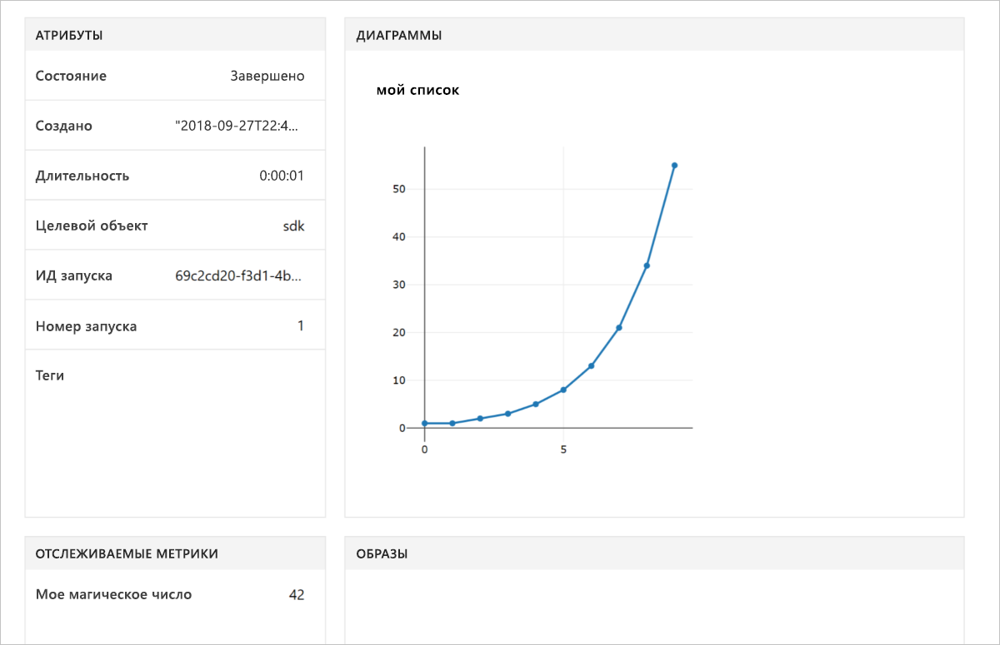

# <a name="quickstart-use-your-own-notebook-server-to-get-started-with-azure-machine-learning"></a>Краткое руководство. Использование собственного сервера записных книжек для начала работы с Машинным обучением Azure

Использование собственных среды Python и сервера Jupyter Notebook для начала работы с Машинным обучением Azure.  Сведения о запуске без установки пакета SDK см. в статье [Краткое руководство. Использование облачного сервера записных книжек для начала работы с Машинным обучением Azure](quickstart-run-cloud-notebook.md).

Из этого краткого руководства вы узнаете, как с помощью [рабочей области Службы машинного обучения Azure](concept-azure-machine-learning-architecture.md) отслеживать эксперименты машинного обучения. Вы выполните код Python, который регистрирует значения в рабочей области.

Просмотрите видеоверсию этого краткого руководства:

> [!VIDEO https://www.microsoft.com/en-us/videoplayer/embed/RE2G9N6]

Если у вас еще нет подписки Azure, создайте бесплатную учетную запись Azure, прежде чем начинать работу. Опробуйте [бесплатную или платную версию Службы машинного обучения Azure](https://aka.ms/AMLFree).

## <a name="prerequisites"></a>Предварительные требования

* Сервер записных книжек Python 3.6 с установленным пакетом SDK Машинного обучения Azure.
* Рабочая область службы машинного обучения Azure.
* Файл конфигурации рабочей области ( **.azureml/config.json** ).

Все эти предварительные требования описаны в руководстве по [созданию рабочей области Машинного обучения Azure](setup-create-workspace.md#portal).


## <a name="use-the-workspace"></a>Используйте рабочую область

Создайте скрипт или запустите записную книжку в каталоге, в котором расположен файл конфигурации рабочей области. Запустите код, использующий базовые интерфейсы API пакета SDK для отслеживания нескольких экспериментальных запусков.

1. Создайте эксперимент в рабочей области.
1. Введите одно значение в эксперимент.
1. Введите список значений в эксперимент.

[!code-python[](~/aml-sdk-samples/ignore/doc-qa/quickstart-create-workspace-with-python/quickstart.py?name=useWs)]

## <a name="view-logged-results"></a>Просмотр зарегистрированных результатов

После завершения выполнения сведения об экспериментальном запуске можно просмотреть на портале Azure. Чтобы вывести URL-адрес расположения с результатами последнего запуска, используйте следующий код.

```python
print(run.get_portal_url())
```

Этот код возвращает ссылку, по которой можно просмотреть в браузере зарегистрированные в журнале значения на портале Azure.



## <a name="clean-up-resources"></a>Очистка ресурсов 

>[!IMPORTANT]
>Созданные ресурсы могут использоваться в качестве необходимых компонентов при работе с другими руководствами по Машинному обучению Azure.

Если вы не планируете использовать ресурсы, созданные в этой статье, удалите их, чтобы плата не взималась.

[!code-python[](~/aml-sdk-samples/ignore/doc-qa/quickstart-create-workspace-with-python/quickstart.py?name=delete)]

## <a name="next-steps"></a>Дополнительная информация

В этой статье вы создали ресурсы для экспериментирования и развертывания моделей. Кроме того, вы запускали код в записной книжке и изучали журнал выполнения из этого кода в вашей рабочей области в облаке.

> [!div class="nextstepaction"]
> [Руководство. Обучение модели классификации изображений](tutorial-train-models-with-aml.md)

Вы также можете изучить [более сложные примеры на GitHub](https://aka.ms/aml-notebooks) или ознакомиться с [руководством пользователя для этого пакета SDK](https://docs.microsoft.com/python/api/overview/azure/ml/intro?view=azure-ml-py).
