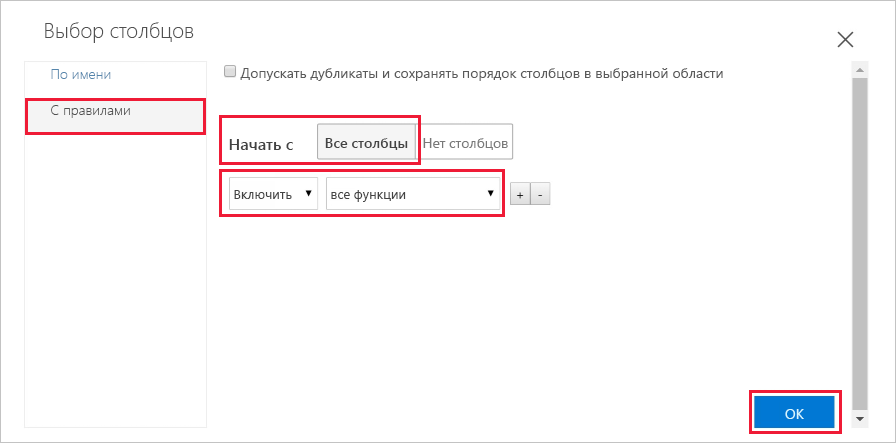
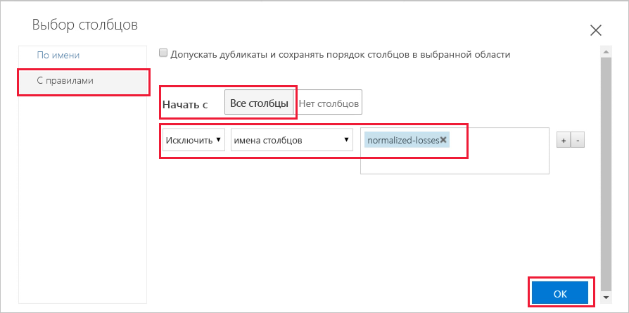
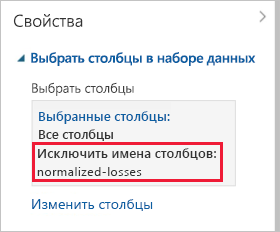
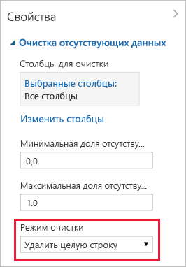

# Краткое руководство. Подготовка и визуализация данных без написания кода

Выполняйте подготовку и визуализацию данных с помощью пользовательского интерфейса перетаскивания. Данные, которые вы будете использовать, охватывают информацию о разных автомобилях, включая сведения о производителе, модели, технических характеристиках и цене.  

В этом кратком руководстве вы изучите и подготовите данные, выполнив следующие задачи:

- Создание эксперимента для добавления и просмотра данных.
- Подготовка данных путем удаления недостающих значений.
- Выполнение эксперимента
- Визуализация полученных данных.

Если вы еще не знакомы с машинным обучением, просмотрите серию видеороликов об [обработке и анализе данных для начинающих](https://docs.microsoft.com/azure/machine-learning/studio/data-science-for-beginners-the-5-questions-data-science-answers).

## Предварительные требования

Если у вас еще нет подписки Azure, создайте бесплатную учетную запись Azure, прежде чем начинать работу. Попробуйте [бесплатную или платную версию Службы машинного обучения Azure](https://aka.ms/AMLFree).

### Создание рабочей области

Если у вас есть рабочая область Службы машинного обучения Azure, перейдите к [следующему разделу](#start). В противном случае создайте ее прямо сейчас.

[!INCLUDE [aml-create-portal](../../../includes/aml-create-in-portal.md)]

##  Открытие веб-страницы графического интерфейса

1. Откройте рабочую область на [портале Azure](https://portal.azure.com/).  

1. В своей рабочей области выберите **Графический интерфейс**.  Затем нажмите кнопку **Запустить графический интерфейс**.  
 
    

    Веб-страница интерфейса откроется в новой странице браузера.  

## Создание первого эксперимента

Инструмент графического интерфейса предоставляет интерактивное визуальное пространство, упрощающее создание, тестирование и выполнение итераций модели прогнозной аналитики. Вы перетаскиваете наборы данных и модули анализа на интерактивный холст и соединяете их вместе, чтобы создать _эксперимент_.  Создайте свой первый эксперимент прямо сейчас.

1. В нижнем левом углу выберите **Создать**.

1. Выберите **Blank Experiment** (Пустой эксперимент).

1. Вашему эксперименту будет присвоено имя по умолчанию. Выделите этот текст и замените его на Quickstart-explore data. Имя не должно быть уникальным.

1. **Мини-карта**, расположенная внизу экрана, позволяет просматривать большие эксперименты.  Щелкните стрелку вверху, чтобы свернуть мини-карту, так как в этом кратком руководстве она вам не понадобится.  

    

## Добавление данных

Для машинного обучения нам прежде всего нужны данные. Этот интерфейс включает несколько примеров наборов данных. Кроме того, данные можно импортировать из других источников. Для данного примера вы будете использовать пример набора данных **Automobile price data (Raw)** (Данные о ценах на автомобили (необработанные)). 

1. В левой части области эксперимента расположена выборка данных и модулей. Щелкните **Saved Datasets** (Сохраненные наборы данных), а затем выберите **Примеры**, чтобы просмотреть доступные примеры наборов данных.

1. Выберите набор данных **Automobile price data (raw)** (Данные о ценах на автомобили (необработанные)) и перетащите его на холст.

   

## Выбор столбцов

Выберите необходимые столбцы данных.  Для начала настройте модуль на отображение всех доступных столбцов.

> [!TIP]
> Если вы знаете имя нужных вам данных или модуля, используйте панель поиска в верхней части палитры для быстрого поиска.  Этот быстрый метод будет использоваться для выполнения дальнейших действий в рамках этого краткого руководства.

1. Введите **Select** (Выбор) в поле поиска, чтобы найти модуль **Select Columns in Dataset** (Выбор столбцов в наборе данных).

1. Щелкните и перетащите модуль **Select Columns in Dataset** (Выбор столбцов в наборе данных) на холст. Поместите модуль под добавленным ранее набором данных.

1. Присоедините набор данных к модулю **Select Columns in Dataset** (Выбор столбцов в наборе данных). Для этого щелкните выходной порт набора данных, перетащите его на входной порт модуля **Select Columns in Dataset** (Выбор столбцов в наборе данных), а затем отпустите кнопку мыши. Набор данных и модуль остаются подключенными даже при их перемещении на холсте.

    > [!TIP]
    > У наборов данных и модулей есть входные и выходные порты, представленные маленькими кружками. Входные порты всегда расположены вверху, а выходные — внизу. При присоединении выходного порта одного модуля ко входному порту другого, вы создаете поток данных через эксперимент.
    >
    > Если у вас возникли проблемы с соединением модулей, попробуйте полностью перетащить их в узел, к которому вы присоединяетесь.

     

    Красный восклицательный знак указывает на то, что для этого модуля еще не заданы свойства. Поэтому вы сделаете это сейчас.
   
1. Выберите модуль **Select Columns in Dataset** (Выбор столбцов в наборе данных).

1. В области **Свойства** справа от холста щелкните **Launch column selector** (Запустить средство выбора столбцов).

    В диалоговом окне **Выбрать столбцы** щелкните **ВСЕ СТОЛБЦЫ** и включите **все признаки**. Диалоговое окно должно выглядеть следующим образом:

     

1. Нажмите кнопку "ОК" (с зеленым флажком) внизу справа, чтобы закрыть средство выбора столбцов.

## Выполнение эксперимента

Щелкните выходной порт набора данных или модуля, чтобы увидеть, как выглядят данные в этой точке потока данных.  Если параметр **Визуализировать** отключен, сначала нужно запустить эксперимент.  Поэтому вы сделаете это сейчас.

[!INCLUDE [aml-ui-create-training-compute](../../../includes/aml-ui-create-training-compute.md)]

Выполнение эксперимента начнется после того, как целевой объект вычислений станет доступным. После завершения выполнения возле каждого модуля появляется зеленая галочка.

## Предварительный просмотр данных

После выполнения начального эксперимента вы можете визуализировать данные, чтобы подробнее изучить сведения, с которыми будете работать.

1. Выберите выходной порт в нижней части модуля **Select Columns in Dataset** (Выбор столбцов в наборе данных), а затем щелкните **Визуализировать**.

1. Щелкните разные столбцы в окне данных, чтобы просмотреть сведения о них.  

    В этом наборе данных каждая строка представляет автомобиль, а переменные, обозначающие их характеристики, представлены в виде столбцов.    В этом наборе данных содержится 205 строк и 26 столбцов.

     Каждый раз, когда вы щелкаете столбец данных, в разделе слева отображаются сведения о **статистике** и изображение **визуализации**.  Например, щелкнув столбец **num-of-doors** (Количество дверей), вы увидите, что он содержит 2 уникальных значения и 2 недостающих значения.  Прокрутите вниз, чтобы увидеть значения: две и четыре двери.

     

1. Щелкните каждый столбец, чтобы ознакомиться с подробными сведениями о наборе данных.

## Подготовка данных

Перед анализом, как правило, требуется определенная предварительная обработка набора данных. Вы могли заметить, что в столбцах некоторых строк отсутствуют значения. Чтобы модель смогла правильно проанализировать данные, необходимо очистить эти недостающие значения. Удалите все строки, в которых есть недостающие значения. В столбце **normalized-losses** (Нормированные потери) также есть значительная доля недостающих значений, поэтому исключите весь этот столбец из модели.

> [!TIP]
> Удаление недостающих значений из входных данных является необходимым условием для использования большинства модулей.  

### Удаление столбца

Сначала полностью удалите столбец **normalized-losses** (Нормированные потери).

1. Выберите модуль **Select Columns in Dataset** (Выбор столбцов в наборе данных).

1. В области **Свойства** справа от холста щелкните **Launch column selector** (Запустить средство выбора столбцов).

    * Оставьте выбранными параметры **With rules** (С правилами) и **ВСЕ СТОЛБЦЫ**.

    * В раскрывающихся списках выберите **Исключить** и **Имена столбцов**, а затем щелкните внутри текстового поля. Введите **normalized-losses**.

    * Нажмите кнопку "ОК" (с зеленым флажком) внизу справа, чтобы закрыть средство выбора столбцов.

    
        
    Теперь область свойств модуля Select Columns in Dataset (Выбор столбцов в наборе данных) показывает, что модуль будет передавать все столбцы набора данных, за исключением столбца **normalized-losses** (Нормированные потери).
        
    На панели свойств мы видим, что столбец **normalized-losses** (Нормированные потери) исключен.
        
    
        
    Дважды щелкните модуль и введите текст, чтобы добавить комментарий. Это поможет вам увидеть описание модуля и его действие в рамках эксперимента. 

1. Дважды щелкните модуль **Select Columns in Dataset** (Выбор столбцов в наборе данных) и введите комментарий об исключении столбца нормированных потерь. 
    
    Затем щелкните мышкой за пределами модуля.  Отобразится стрелка вниз, показывающая, что модуль содержит комментарий.

1. Щелкните ее, чтобы отобразить комментарий.

    Теперь в модуле появится стрелка вверх, позволяющая скрыть комментарий.
        
    

### Очистка недостающих данных

Затем добавьте еще один модуль, который удаляет все остальные строки, в которых есть недостающие значения.

1. Введите **Clean** (Очистка) в поле поиска, чтобы найти модуль **Clean Missing Data** (Очистка недостающих данных).

1. Перетащите на холст эксперимента модуль **Clean Missing Data** (Очистка недостающих данных) и присоедините его к модулю **Select Columns in Dataset** (Выбор столбцов в наборе данных). 

1. В области свойств выберите значение **Remove entire row** (Удалить всю строку) для параметра **Cleaning mode** (Режим очистки).

    Этот параметр указывает модулю **Clean Missing Data** (Очистка недостающих данных) полностью удалять те строки, в которых есть недостающие значения.

1. Дважды щелкните модуль и введите комментарий "Удаление строк с недостающими значениями".
 
    

    Теперь ваш эксперимент должен выглядеть следующим образом:
    
    

## Визуализация результатов

Так как вы изменили модули в своем эксперименте, в разделе состояния указано In draft (Черновик).  Чтобы визуализировать новые очищенные данные, сначала необходимо снова выполнить эксперимент.

1. Выберите **Выполнить** в нижней части окна, чтобы запустить эксперимент.

    На этот раз вы можете повторно использовать созданный ранее целевой объект вычислений.  

1. Выберите **Выполнить** в диалоговом окне.

   

1. После завершения выполнения щелкните правой кнопкой мыши модуль **Clean Missing Data** (Очистка недостающих данных), чтобы визуализировать новые очищенные данные.  

    

1. Щелкните разные столбцы в окне очищенных данных, чтобы увидеть, как изменились данные.  

    

    Теперь в наборе данных содержится 193 строки и 25 столбцов.

    Щелкнув столбец **num-of-doors** (Количество дверей), вы увидите, что он по-прежнему содержит 2 уникальных значения и теперь уже 0 недостающих значений.  

## Очистка ресурсов

[!INCLUDE [aml-ui-cleanup](../../../includes/aml-ui-cleanup.md)]

## Дополнительная информация

Из этого руководства вы узнали, как выполнить следующие действия:

- Создание эксперимента для добавления и просмотра данных.
- Подготовка данных путем удаления недостающих значений.
- Визуализация полученных данных.

Перейдите к изучению следующего руководства, чтобы использовать эти данные для прогнозирования цены автомобиля.

> [!div class="nextstepaction"]
> [Руководство по прогнозированию цены автомобиля с помощью графического интерфейса](ui-tutorial-automobile-price-train-score.md)
