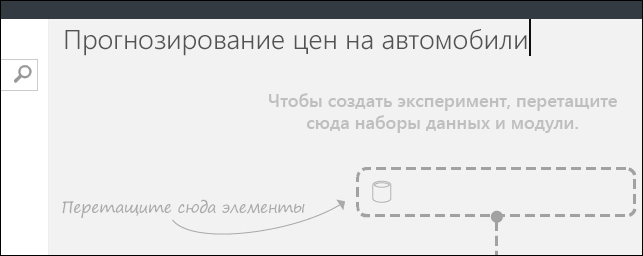
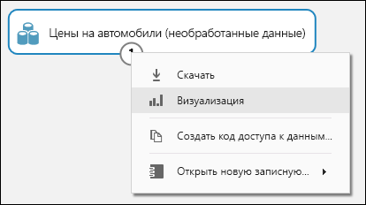
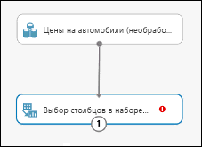
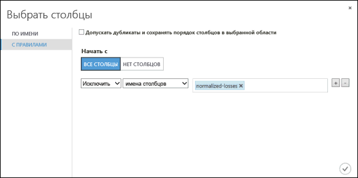
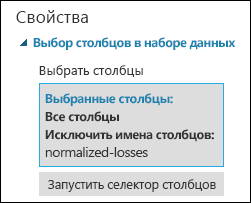
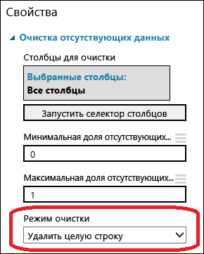
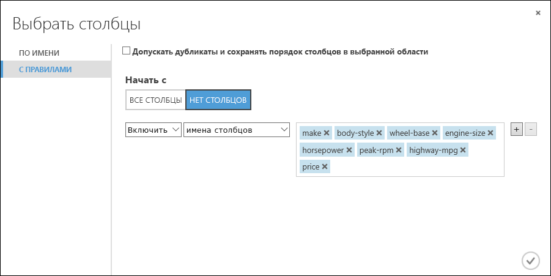
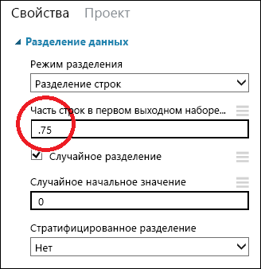
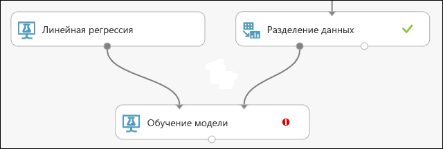
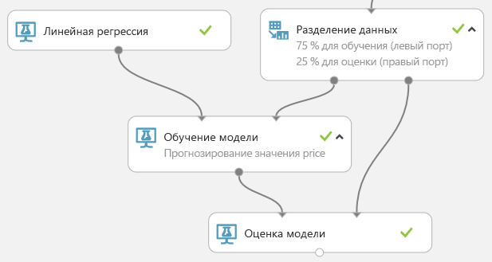

# Краткое руководство. Создание первого эксперимента по обработке и анализу данных в Студии машинного обучения Azure (классической)

[!INCLUDE [Designer notice](../../../includes/designer-notice.md)]

С помощью этого краткого руководства вы создадите в [Студии машинного обучения Azure (классической)](what-is-ml-studio.md) эксперимент по машинному обучению, который будет прогнозировать цену на автомобили с учетом различных переменных, например марки и технических спецификаций.

Если вы еще не знакомы с машинным обучением, в серии видеороликов [Обработка и анализ данных для начинающих](data-science-for-beginners-the-5-questions-data-science-answers.md) простым языком объясняются базовые принципы машинного обучения.

В этом руководстве для эксперимента используется рабочий процесс по умолчанию:

1. **Создание модели**
    - [Получение данных]
    - [Подготовка данных]
    - [Определение признаков]
1. **Обучение модели**
    - [Выбор и применение алгоритма]
1. **Оценка и тестирование модели**
    - [Прогнозирование цен на новые автомобили]

[Получение данных]: #get-the-data
[Подготовка данных]: #prepare-the-data
[Определение признаков]: #define-features
[Выбор и применение алгоритма]: #choose-and-apply-an-algorithm
[Прогнозирование цен на новые автомобили]: #predict-new-automobile-prices

## Получение данных

Для машинного обучения нам прежде всего нужны данные.
Классическая версия Студии включает несколько примеров наборов данных. Данные также можно импортировать из других источников. Для этого примера мы воспользуемся примером набора данных **Automobile price data (Raw)** (Данные о ценах на автомобили (необработанные)), который доступен в вашем рабочем пространстве.
В этом наборе данных содержится информация о разных автомобилях, включая сведения о производителе, модели, технических характеристиках и цене.

> [!TIP]
> Рабочую копию этого эксперимента вы можете найти в [коллекции решений Azure AI](https://gallery.azure.ai). Перейдите по ссылке **[Ваш первый эксперимент по анализу данных. Прогнозирование цен на автомобили](https://gallery.azure.ai/Experiment/Your-first-data-science-experiment-Automobile-price-prediction-1)** , затем щелкните **Open in Studio** (Открыть в студии), чтобы загрузить в рабочее пространство классической версии Студии копию этого эксперимента.

Теперь мы узнаем, как поместить этот набор данных в эксперимент.

1. Создайте эксперимент, щелкнув **+NEW** (+Создать) в нижней части окна классической версии Студии машинного обучения. Выберите **EXPERIMENT** >  **Blank Experiment** (Эксперимент > Пустой эксперимент).

1. Эксперименту будет присвоено имя по умолчанию, которое отображается в верхней части холста. Щелкните этот текст и измените его на любое удобное для вас имя, например **Прогнозирование цен на автомобили**. Имя не должно быть уникальным.

    

1. В левой части области эксперимента расположена выборка данных и модулей. Введите значение **автомобили** в поле поиска в верхней части палитры и найдите набор данных с названием **Данные о ценах на автомобили (необработанные)** . Перетащите набор данных на холст эксперимента.

    

Чтобы просмотреть, как выглядят эти данные, щелкните порт вывода в нижней части набора данных об автомобилях и выберите **Visualize** (Визуализировать).

> [!TIP]
> У наборов данных и модулей есть входные и выходные порты, представленные маленькими кружками. Входные порты всегда расположены вверху, а выходные — внизу.
Чтобы создать поток данных через эксперимент, подключите выходной порт одного модуля ко входному порту другого.
Вы можете щелкнуть выходной порт набора данных или модуля, чтобы увидеть, как выглядят данные в этой точке потока данных.

В этом наборе данных каждая строка представляет автомобиль, а переменные, обозначающие их характеристики, представлены в виде столбцов. Мы спрогнозируем цену автомобиля по представленным характеристикам и отобразим ее в крайнем правом столбце (столбец 26 с названием price (Цена)).

Закройте окно визуализации, нажав «**x**» в правом верхнем углу.

## Подготовка данных

Перед анализом, как правило, требуется определенная предварительная обработка набора данных. Вы могли заметить, что в столбцах некоторых строк отсутствуют значения. Чтобы модель смогла правильно проанализировать данные, необходимо очистить эти недостающие значения. Мы удалим все строки, в которых есть недостающие значения. В столбце **Нормированные потери** также есть значительная доля недостающих значений, поэтому мы исключим весь этот столбец из модели.

> [!TIP]
> Удаление недостающих значений из входных данных является необходимым условием для использования большинства модулей.

Сначала мы добавим модуль, который полностью удаляет столбец **normalized-losses** (Нормированные потери). Затем мы добавим еще один модуль, который удаляет строки, в которых есть недостающие значения.

1. Введите **select column** в поле поиска в верхней части палитры модулей, чтобы найти модуль [Select Columns in Dataset][select-columns] (Выбор столбцов в наборе данных). Перетащите этот модуль на холст эксперимента. Этот модуль позволяет выбрать, какие столбцы данных нужно включить в модель или исключить из нее.

1. Соедините выходной порт набора данных **Automobile price data (Raw)** (Данные о ценах на автомобили (необработанные) с входным портом модуля Select Columns in Dataset (Выбор столбцов в наборе данных).

    

1. Выберите модуль [Select Columns in Dataset][select-columns] (Выбор столбцов в наборе данных) и нажмите **Launch column selector** (Запустить средство выбора столбцов) в области **Свойства**.

   - Слева щелкните **With rules**
   - В разделе **Begin With** (Начинаются с) нажмите кнопку **All columns** (Все столбцы). Такие правила укажут модулю [Select Columns in Dataset][select-columns] (Выбор столбцов в наборе данных) обрабатывать все столбцы (кроме тех, которые мы собираемся исключить).
   - В раскрывающихся списках выберите **Исключить** и **Имена столбцов**, а затем щелкните внутри текстового поля. Отобразится список столбцов. Выберите элемент **normalized-losses** (нормированные потери), чтобы добавить его в текстовое поле.
   - Нажмите кнопку ОК (с зеленым флажком) внизу справа, чтобы закрыть средство выбора столбцов.

     

     Теперь область свойств модуля **Select Columns in Dataset** (Выбор столбцов в наборе данных) показывает, что модуль будет передавать все столбцы набора данных, за исключением столбца **normalized-losses**.

     

     > [!TIP] 
     > Дважды щелкните модуль и введите текст, чтобы добавить комментарий. Это поможет вам увидеть описание модуля и его действие в рамках эксперимента. В этом случае дважды щелкните модуль [Select Columns in Dataset][select-columns] (Выбор столбцов в наборе данных) и введите комментарий об исключении столбца нормированных потерь.

     

1. Перетащите на холст эксперимента модуль [Clean Missing Data][clean-missing-data] (Очистка недостающих данных) и присоедините его к модулю [Select Columns in Dataset][select-columns] (Выбор столбцов в наборе данных). В панели **Properties** (Свойства) выберите значение **Remove entire row** (Удалить всю строку) для параметра **Cleaning mode** (Режим очистки). Этот параметр указывает модулю [Clean Missing Data][clean-missing-data] (Очистка недостающих данных) полностью удалять те строки, в которых есть недостающие значения. Дважды щелкните модуль и введите комментарий "Удаление строк с недостающими значениями".

    

1. Запустите эксперимент, щелкнув кнопку **запуска** в нижней части страницы.

    После завершения эксперимента у всех модулей должен появиться зеленый флажок, означающий успешное выполнение. Обратите также внимание на состояние **Работа завершена** в правом верхнем углу.

    

> [!TIP]
> Для чего мы сейчас запускаем эксперимент? После запуска эксперимента все определения столбцов из нашего набора данных передаются в модуль [Select Columns in Dataset][select-columns] (Выбор столбцов в наборе данных) и проходят через него к модулю [Clean Missing Data][clean-missing-data] (Очистка недостающих данных). Теперь все модули, которые мы подключим к модулю [Clean Missing Data][clean-missing-data] (Очистка недостающих данных), смогут получить эту информацию.

Мы получили очищенные данные. Чтобы просмотреть очищенный набор данных, щелкните левый выходной порт модуля [Clean Missing Data][clean-missing-data] (Очистка набора данных) и выберите **Visualize** (Визуализировать). Обратите внимание, что столбца **нормированных потерь** больше нет. Кроме того, теперь нет недостающих значений.

После очистки данных мы готовы к заданию свойств, которые будут использоваться в прогнозной модели.

## Определение признаков

В машинном обучении *признаки* — это отдельные измеримые свойства интересующих объектов. В нашем наборе данных каждая строка представляет собой один автомобиль, а каждый столбец — его признак.

Чтобы подобрать подходящий набор признаков для создания прогнозной модели, нужно разбираться в проблеме, которую необходимо решить, и провести ряд экспериментов. Некоторые свойства лучше подходят для прогнозирования цели, чем другие. Некоторые признаки совпадают с другими, и часть из них можно удалить. Например, свойства city-mpg и highway-mpg действуют почти одинаково, и мы можем удалить любое из них без существенного ухудшения прогноза.

Давайте создадим модель, которая использует подмножество свойств в нашей выборке. Вы можете вернуться сюда позже и выбрать различные свойства, заново запустить эксперимент и оценить результаты. Но для начала давайте попробуем следующие возможности.

    make, body-style, wheel-base, engine-size, horsepower, peak-rpm, highway-mpg, price

1. Перетащите на холст эксперимента еще один модуль [Select Columns in Dataset][select-columns] (Выбор столбцов в наборе данных). Подключите левый выходной порт модуля [Clean Missing Data][clean-missing-data] (Очистка недостающих данных) к входу модуля [Select Columns in Dataset][select-columns] (Выбор столбцов в наборе данных).

    

1. Дважды щелкните модуль и введите: "Выбор признаков для прогнозирования".

1. В области **Свойства** щелкните **Launch column selector** (Запустить средство выбора столбцов).

1. Щелкните **With rules**(С правилами).

1. В разделе **Begin With** (Начальное состояние) нажмите кнопку **No columns** (Нет столбцов). В строке фильтра выберите **Include** (Включить) и **column names** (Имена столбцов), а затем выберите в текстовом поле созданный список столбцов. Этот фильтр указывает модулю не пропускать столбцы (признаки), кроме выбранных.

1. Щелкните значок с изображением флажка (кнопка "ОК").

    

В результате мы получим отфильтрованный набор данных, содержащий только те признаки, которые мы хотим передать в обучающий алгоритм на следующем шаге. Позже вы сможете вернуться назад и заново попробовать выбрать другой набор признаков.

## Выбор и применение алгоритма

Теперь, когда данные готовы, процесс построения прогнозной модели состоит из обучения и тестирования. Сначала мы используем имеющиеся данные для обучения модели, а затем протестируем ее, чтобы увидеть, насколько точно она может прогнозировать цены.
<!-- For now, don't worry about *why* we need to train and then test a model.-->

Есть два типа алгоритмов контролируемого машинного обучения — *классификация* и *регрессия*. Классификация используется, чтобы сформировать прогноз по заданному набору категорий, таких как цвет (красный, синий, или зеленый). Регрессия используется для прогнозирования числа.

Мы хотим предсказать цену, которая является числом, поэтому будем использовать модель регрессии. В нашем примере мы воспользуемся моделью *линейной регрессии*.

Для обучения модели мы передаем ей набор данных, содержащий цены. Модель сканирует эти данные и ищет зависимости между свойствами автомобиля и его ценой. После этого мы тестируем модель, то есть передаем ей набор свойств известных нам автомобилей и проверяем, насколько точно модель прогнозирует известные нам цены.

Наш набор данных мы разделим на два набора, один из которых применим для обучения модели, а второй — для тестирования.

1. Выберите и перетащите в область эксперимента модуль [Split Data][split] (Разделение данных), а затем подключите его к последнему модулю [Select Columns in Dataset][select-columns] (Выбор столбцов в наборе данных).

1. Щелчком выберите модуль [Split Data][split] (Разделение данных). В панели **Properties** (Свойства) справа от холста найдите параметр **Fraction of rows in the first output dataset** (Доля строк в первом выходном наборе данных) и установите для него значение 0,75. Таким образом, мы используем 75 процентов данных для обучения модели и оставим 25 процентов для тестирования.

    

    > [!TIP]
    > Изменяя параметр **Псевдослучайные числа**, вы можете создавать различные случайные выборки для обучения и тестирования. Этот параметр задает начальное значение для генератора псевдослучайных чисел.

1. Запустите эксперимент. После выполнения эксперимента модули [Select Columns in Dataset][select-columns] (Выбор столбцов в наборе данных) и [Split Data][split] (Разделение данных) смогут передать определения столбцов следующим модулям, которые мы добавим позже.  

1. Для выбора алгоритма обучения разверните категорию **Машинное обучение** на палитре модулей слева на холсте эксперимента, а затем разверните **Initialize Model** (Инициализировать модель). Появится несколько категорий модулей, которые можно использовать для инициализации алгоритма обучения. Для этого эксперимента выберите модуль [Linear Regression][linear-regression] (Линейная регрессия) из категории **Regression** (Регрессия) и перетащите его на холст. (Можно также найти модуль, введя "linear regression" в поле поиска палитры.)

1. Найдите и переместите модуль [Train Model][train-model] (Обучение модели) на холст эксперимента. Соедините выход модуля [Linear Regression][linear-regression] (Линейная регрессия) с левым входом модуля [Train Model][train-model] (Обучение модели), а затем соедините выход (левый порт) модуля [Split Data][split] (Разделение данных) с правым входом модуля [Train Model][train-model] (Обучение модели).

    

1. Выберите модуль [Train Model][train-model] (Обучение модели), щелкните **Launch column selector** (Запустить средство выбора столбцов) в области **Properties** (Свойства) и выберите столбец **price** (цена). **Price** (Цена) — это значение, которое спрогнозирует наша модель.

    Чтобы выбрать столбец **price** (Цена) в средстве выбора столбцов, переместите его из списка **Available columns** (Доступные столбцы) в список **Selected columns** (Выбранные столбцы).

    

1. Запустите эксперимент.

Теперь у нас есть обученная регрессионная модель, которую можно использовать для оценки новых данных об автомобилях с целью прогнозирования цен.

## Прогнозирование цен на новые автомобили

После того как мы обучили модель, использовав 75 процентов наших данных, ее можно использовать для оценки оставшихся 25 процентов данных, чтобы проверить, насколько хорошо она работает.

1. Найдите модуль [Score Model][score-model] (Оценка модели) и перетащите его на холст эксперимента. Соедините выход модуля [Train Model][train-model] (Обучение модели) с левым входным портом модуля [Score Model][score-model] (Оценка модели). Соедините выход тестовых данных (правый порт) модуля [Split Data][split] (Разделение данных) с правым входным портом [Score Model][score-model] (Оценка модели).

    

1. Запустите эксперимент и проверьте выходные данные модуля [Score Model][score-model] (Оценка модели), щелкнув порт вывода модуля [Score Model][score-model] (Оценка модели) и выбрав **Visualize** (Визуализировать). На порту вывода будут показаны прогнозируемые значения цены вместе с известными значениями проверочных данных.  

    

1. Теперь мы готовы проверить качество результатов. Выберите модуль [Evaluate Model][evaluate-model] (Анализ модели) и перетащите его на холст эксперимента, а затем соедините выход модуля [Score Model][score-model] (Оценка модели) с левым входом модуля [Evaluate Model][evaluate-model] (Анализ модели). Окончательная схема нашего эксперимента должна выглядеть следующим образом:

    

1. Запустите эксперимент.

Чтобы проверить выходные данные модуля [Evaluate Model][evaluate-model] (Анализ модели), щелкните порт вывода и выберите элемент **Visualize** (Визуализировать).

Для нашей модели будет выведена следующая статистика.

- **Средняя абсолютная погрешность**. Среднее значение абсолютной погрешности (*погрешность* — это разница между спрогнозированным и фактическим значением).
- **Среднеквадратичное отклонение**. Квадратный корень из среднего значения возведенных в квадрат арифметических отклонений спрогнозированных значений тестового набора данных.
- **Относительное арифметическое отклонение**. Среднее арифметическое отклонение по отношению к абсолютной разнице между фактическими значениями и средним арифметическим всех фактических значений.
- **Относительное среднеквадратичное отклонение**. Среднее арифметическое среднеквадратичных отклонений по отношению к абсолютной разнице между фактическими значениями и средним арифметическим всех фактических значений.
- **Коэффициент смешанной корреляции** (**R в квадрате**). Статистический показатель, который оценивает соответствие модели данным.

Чем меньше значение каждой погрешности, тем лучше. Меньшее значение указывает на то, что прогноз лучше соответствует фактическим значениям. Для показателя **коэффициент смешанной корреляции**чем ближе его значение к единице (1,0), тем точнее прогноз.

## Очистка ресурсов

[!INCLUDE [machine-learning-studio-clean-up](../../../includes/machine-learning-studio-clean-up.md)]

## Дополнительная информация

В этом кратком руководстве описано, как создать простой эксперимент с использованием примера набора данных. Чтобы узнать больше о создании и развертывании модели, перейдите к руководству по прогнозному решению.

> [!div class="nextstepaction"]
> [Руководство. Разработка прогнозного решения в Студии (классической)](tutorial-part1-credit-risk.md)

<!-- Module References -->
[evaluate-model]: https://msdn.microsoft.com/library/azure/927d65ac-3b50-4694-9903-20f6c1672089/
[linear-regression]: https://msdn.microsoft.com/library/azure/31960a6f-789b-4cf7-88d6-2e1152c0bd1a/
[clean-missing-data]: https://msdn.microsoft.com/library/azure/d2c5ca2f-7323-41a3-9b7e-da917c99f0c4/
[select-columns]: https://msdn.microsoft.com/library/azure/1ec722fa-b623-4e26-a44e-a50c6d726223/
[score-model]: https://msdn.microsoft.com/library/azure/401b4f92-e724-4d5a-be81-d5b0ff9bdb33/
[split]: https://msdn.microsoft.com/library/azure/70530644-c97a-4ab6-85f7-88bf30a8be5f/
[train-model]: https://msdn.microsoft.com/library/azure/5cc7053e-aa30-450d-96c0-dae4be720977/
