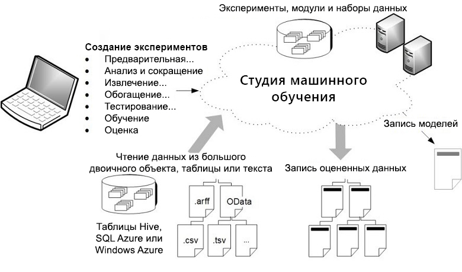

# Что такое Студия машинного обучения Azure
Студия машинного обучения Microsoft Azure — это инструмент для совместной работы, поддерживающий функцию перетаскивания объектов и предназначенный для создания, тестирования и развертывания решений для прогнозного анализа данных. Студия машинного обучения публикует модели как веб-службы, которые затем можно использовать в пользовательских приложениях и средствах бизнес-аналитики (например, в Excel).

Студия машинного обучения — это место, где пересекаются обработка и анализ данных, прогнозная аналитика, облачные ресурсы и данные клиента.

## Интерактивная рабочая область Студии машинного обучения
Для разработки модели прогнозной аналитики обычно используются данные из одного или нескольких источников. Для получения набора результатов эти данные преобразуются и анализируются с помощью различных операций и статистических функций. Такая разработка модели — это итеративный процесс. Путем изменения разных функций и их параметров выполняется сведение результатов, пока не будет получена подготовленная и эффективная модель.

**Студия машинного обучения Azure** предоставляет интерактивное визуальное рабочее пространство, упрощающее создание, тестирование и выполнение итераций модели прогнозной аналитики. Вы перетаскиваете ***наборы данных*** и ***модули анализа*** на интерактивный холст и связываете их вместе, чтобы создать ***эксперимент***, который затем выполняется в Студии машинного обучения. Для выполнения итераций в макете модели следует отредактировать эксперимент, при необходимости сохранить копию и выполнить его снова. Когда вы будете готовы, ***обучающий эксперимент*** можно преобразовать в ***прогнозный***, а затем опубликовать его как ***веб-службу***, чтобы модель стала доступна другим пользователям.

Никакое программирование не требуется, выполняется только визуальное соединение наборов данных и модулей, чтобы создать модель прогнозной аналитики.

## Скачивание обзорной схемы Студии машинного обучения
Скачайте схему **Обзор возможностей Студии машинного обучения Microsoft Azure** и получите высокоуровневое представление о возможностях Студии машинного обучения. Чтобы держать схему под рукой, распечатайте ее в формате 11 x 17 дюймов (27,94 x 43,18 см).

**Скачайте схему здесь: [Обзор возможностей Студии машинного обучения Microsoft Azure](https://download.microsoft.com/download/C/4/6/C4606116-522F-428A-BE04-B6D3213E9E52/ml_studio_overview_v1.1.pdf)**

## Начало работы со Студией машинного обучения
При первом входе в [Студию машинного обучения](https://studio.azureml.net) вы увидите **главную** страницу. На ней можно просмотреть документацию, видеоматериалы, вебинары и найти другие полезные ресурсы.

Щелкните меню  слева вверху, и вы увидите несколько пунктов.
### Студия машинного обучения Azure
Можно перейти на **домашнюю страницу**, с которой вы начали, или выбрать пункт **Студия**.

Щелкнув **Студия**, вы перейдете к **Студии машинного обучения Azure**. Вам будет предложено войти в учетную запись Майкрософт с использованием вашей рабочей или учебной учетной записи. После входа в систему вы увидите следующие вкладки слева:

* **ПРОЕКТЫ** — коллекции экспериментов, наборов данных, записных книжек и других ресурсов, составляющих единый проект;
* **Эксперименты** — эксперименты, которые создаются, запускаются или сохраняются как черновики;
* **ВЕБ-СЛУЖБЫ** — веб-службы, которые вы развернули из своих экспериментов;
* **ЗАПИСНЫЕ КНИЖКИ** — записные книжки Jupyter, которые вы создали;
* **НАБОРЫ ДАННЫХ** — наборы данных, которые вы загрузили в Студию;
* **ОБУЧЕННЫЕ МОДЕЛИ** — модели, которые вы обучили в экспериментах и сохранили в Студии;
* **ПАРАМЕТРЫ** — набор параметров, которые можно использовать для настройки учетной записи и ресурсов.

### Коллекция
Щелкните **Коллекция**, чтобы перейти к **[коллекции решений Azure AI](https://gallery.azure.ai/)**. Коллекция — это место, где разработчики и специалисты по данным могут обмениваться решениями, созданными с помощью компонентов Cortana Intelligence Suite.

Дополнительные сведения о коллекции см. в руководстве по [поиску и совместному использованию решений в коллекции решений Azure AI](gallery-how-to-use-contribute-publish.md).

## Компоненты эксперимента
Эксперимент состоит из наборов данных, предоставляющих данные для модулей аналитики, которые соединяются вместе для создания модели прогнозной аналитики. В частности, правильный эксперимент имеет следующие характеристики.

* У эксперимента по крайней мере один набор данных и один модуль.
* Наборы данных могут быть связаны только с модулями.
* Модули могут быть связаны либо с наборами данных, либо с другими модулями.
* Все входные порты для модулей должны иметь связь с потоком данных.
* Все необходимые параметры для каждого модуля должны быть установлены.

Эксперимент можно создать с нуля или на основе существующего эксперимента в качестве шаблона. Дополнительные сведения см. в статье [Использование примеров экспериментов для создания новых экспериментов машинного обучения](sample-experiments.md).

Пример создания простого эксперимента см. в статье [Создание простого эксперимента в Студии машинного обучения Azure](create-experiment.md).

Подробное пошаговое руководство по созданию решения прогнозной аналитики см. в статье [Руководство 1. Прогнозирование кредитного риска — Студия машинного обучения Azure](tutorial-part1-credit-risk.md).

### Наборы данных
Набор данных — это данные, отправленные в Студию машинного обучения для использования в процессе моделирования. В Студию машинного обучения включено несколько наборов данных, чтобы с ними можно было экспериментировать. Кроме того, можно отправлять дополнительные наборы данных по мере необходимости. Ниже приведены некоторые примеры включенных наборов данных.

* **Данные MPG для разных автомобилей** — данные по пробегу в милях на галлон топлива для автомобилей в зависимости от числа цилиндров, мощности в лошадиных силах и т. п.
* **Данные по раку молочной железы** — данные по диагностике рака молочной железы.
* **Данные по лесным пожарам** — объемы лесных пожаров на северо-востоке Португалии.

При построении эксперимента можно выбрать один из наборов данных из списка, расположенного на холсте слева.

Список примеров наборов данных, включенных в состав Студии машинного обучения, см. в статье [Использование образцов наборов данных в Студии машинного обучения Azure](use-sample-datasets.md).

### модули
Модуль — это алгоритм, который можно выполнять с данными. В Студии машинного обучения имеется ряд модулей, начиная с функций ввода данных для процессов обучения, оценки и проверки. Ниже приведены примеры включенных модулей.

* [Преобразование в ARFF][convert-to-arff] — преобразует упорядоченный набор данных .NET в формат ARFF.
* [Вычисление элементарной статистики][elementary-statistics] — выполняет элементарные статистические вычисления, такие как получение математического ожидания, среднеквадратичного отклонения и др.
* [Линейная регрессия][linear-regression] — создает интерактивный линейно-регрессионный анализ на основе градиентного спуска.
* [Модель оценки][score-model] — выполняет оценку обученной модели классификации или регрессии.

При построении эксперимента можно выбрать один из модулей из списка, расположенного на холсте слева.

Модуль может иметь ряд параметров, которые можно использовать для настройки внутренних алгоритмов модуля. При выборе модуля на холсте его параметры отображаются на панели **Свойства** в правой части холста. Подстройка модели осуществляется изменением параметров в этой области.

Разобраться в огромной библиотеке доступных алгоритмов машинного обучения вам поможет статья [Выбор алгоритмов Студии машинного обучения Azure](algorithm-choice.md).

## Развертывание веб-службы прогнозной аналитики
После подготовки модели прогнозной аналитики можно развернуть ее как веб-службу непосредственно из Студии машинного обучения. Дополнительные сведения о том, как это сделать, см. в статье [Развертывание веб-службы машинного обучения Azure](publish-a-machine-learning-web-service.md).

## Чем Студия машинного обучения Azure отличается от Службы машинного обучения Azure?

[Служба машинного обучения Azure](../service/overview-what-is-azure-ml.md) предоставляет пакеты SDK и службы, позволяющие быстро подготавливать данные, а также обучать и развертывать модели машинного обучения. Повышайте эффективность и сокращайте затраты, используя автомасштабируемые вычисления и конвейеры. Использовать эти возможности можно с помощью платформ Python с открытым кодом, например PyTorch, TensorFlow и scikit-learn. 

Используйте студию машинного обучения, если вас интересуют быстрые и простые эксперименты с моделями машинного обучения и для ваших решений достаточно встроенных алгоритмов машинного обучения.

Используйте студию машинного обучения, если вы работаете в среде Python и хотите более гибко управлять алгоритмами машинного обучения или использовать библиотеки машинного обучения с открытым исходным кодом.

> [!NOTE]
> Модели, созданные в Студии машинного обучения Azure, нельзя развертывать и использовать в Службе машинного обучения Azure.

## Бесплатная пробная версия

[!INCLUDE [machine-learning-free-trial](../../../includes/machine-learning-free-trial.md)]

## Дополнительная информация
Сведения о базовых принципах прогнозной аналитики и машинного обучения см. в статье [Руководство. Создание первого эксперимента по обработке и анализу данных в студии машинного обучения Azure](create-experiment.md) и [Создание экспериментов Студии машинного обучения на основе рабочих примеров из Коллекции решений ИИ Azure](sample-experiments.md).

<!-- Module References -->
[convert-to-arff]: https://msdn.microsoft.com/library/azure/62d2cece-d832-4a7a-a0bd-f01f03af0960/
[elementary-statistics]: https://msdn.microsoft.com/library/azure/3086b8d4-c895-45ba-8aa9-34f0c944d4d3/
[linear-regression]: https://msdn.microsoft.com/library/azure/31960a6f-789b-4cf7-88d6-2e1152c0bd1a/
[score-model]: https://msdn.microsoft.com/library/azure/401b4f92-e724-4d5a-be81-d5b0ff9bdb33/
