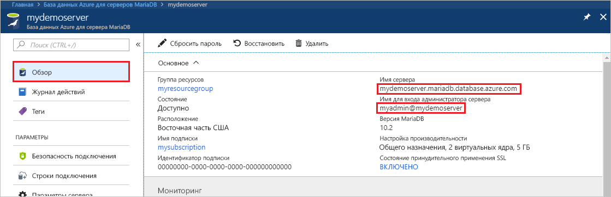
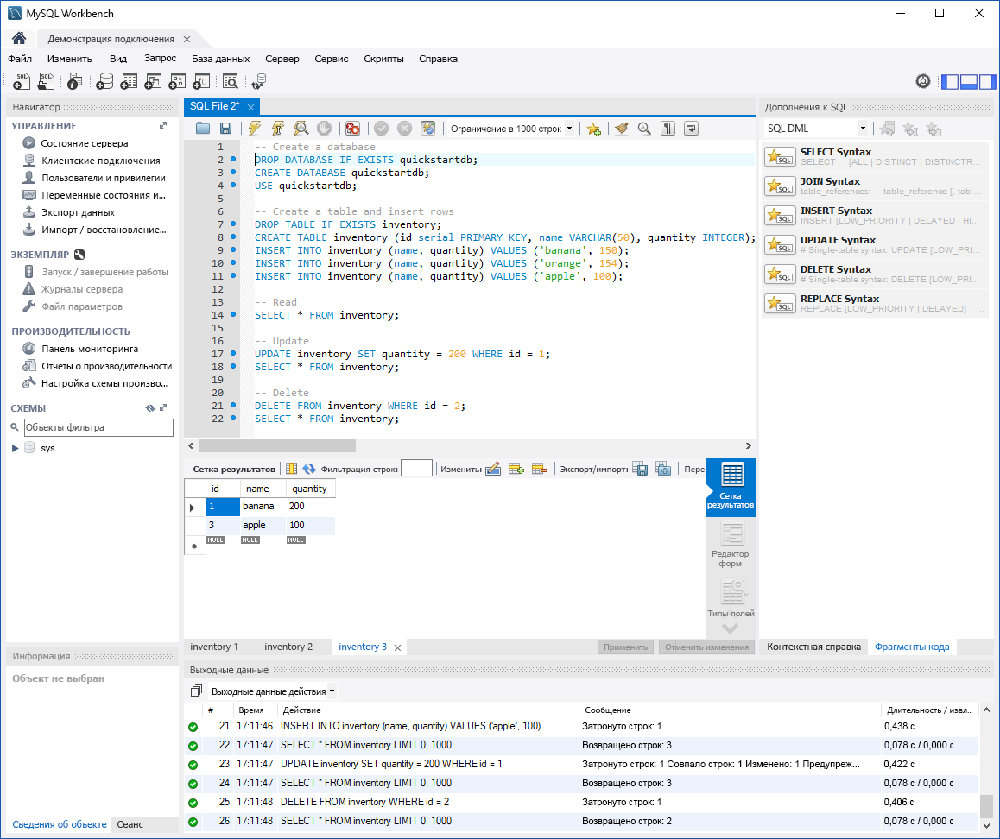

# <a name="azure-database-for-mariadb-use-mysql-workbench-to-connect-and-query-data"></a>База данных Azure для MariaDB: подключение и запрос данных с помощью MySQL Workbench

В этом кратком руководстве показано, как подключиться к экземпляру Базы данных Azure для MariaDB с помощью MySQL Workbench. 

## <a name="prerequisites"></a>Предварительные требования

В качестве отправной точки в этом кратком руководстве используются ресурсы, созданные в соответствии со следующими руководствами:

- [Создание сервера Базы данных Azure для MariaDB с помощью портала Azure](./quickstart-create-mariadb-server-database-using-azure-portal.md)
- [Создание сервера Базы данных Azure для MariaDB с помощью Azure CLI](./quickstart-create-mariadb-server-database-using-azure-cli.md)

## <a name="install-mysql-workbench"></a>Установка MySQL Workbench

[Скачайте приложение MySQL Workbench](https://dev.mysql.com/downloads/workbench/) и установите его на компьютер.

## <a name="get-connection-information"></a>Получение сведений о подключении

Получите сведения о подключении, необходимые для подключения к экземпляру Базы данных Azure для MariaDB. Вам потребуется полное имя сервера и учетные данные для входа.

1. Войдите на [портале Azure](https://portal.azure.com/).

2. На портале Azure в меню слева щелкните **Все ресурсы**. Затем найдите созданный сервер (например, **mydemoserver**).

3. Выберите имя сервера.

4. На странице **Обзор** сервера запишите значения **Имя сервера** и **Имя для входа администратора сервера**. Если вы забыли свой пароль, его можно сбросить на этой странице.

 

## <a name="connect-to-the-server-by-using-mysql-workbench"></a>Подключение к серверу с помощью MySQL Workbench

Чтобы подключиться к серверу Базы данных Azure для MariaDB с помощью MySQL Workbench, выполните следующие действия:

1.  Откройте MySQL Workbench на компьютере. 

2.  В диалоговом окне **Настройка нового подключения** на вкладке **Параметры** введите следующие сведения:

    | Параметр | Рекомендуемое значение | Описание поля |
    |---|---|---|
    |   Имя подключения | **Подключение demo** | Укажите метку для этого подключения. |
    | Способ подключения | **Standard (TCP/IP)** (Стандартный способ (по протоколу TCP/IP)) | Стандартный способ (по протоколу TCP/IP) соответствует требованиям. |
    | имя узла; | *имя сервера* | Укажите значение имени сервера, которое вы использовали при создании экземпляра Базы данных Azure для MariaDB. В нашем примере используется такое имя сервера — **mydemoserver.mariadb.database.azure.com**. Используйте полное доменное имя (\*.mariadb.database.azure.com), как показано в примере. Если вы не помните имя своего сервера, выполните действия из предыдущего раздела, чтобы получить сведения о подключении.  |
    | Порт | **3306** | Всегда используйте порт 3306 при подключении к Базе данных Azure для MariaDB. |
    | Имя пользователя |  *имя для входа администратора сервера* | Имя для входа администратора сервера, которое вы использовали при создании экземпляра Базы данных Azure для MariaDB. В нашем примере используется имя **myadmin@mydemoserver**. Если вы не помните имя для входа администратора сервера, выполните действия из предыдущего раздела, чтобы получить сведения о подключении. Используйте формат *username@servername*.
    | Пароль | *ваш пароль* | Чтобы сохранить пароль, щелкните **Store in Vault** (Сохранить в хранилище). |

    

3.   Щелкните **Проверить подключение**, чтобы проверить, все ли параметры настроены правильно. 

4.   Затем нажмите кнопку **ОК**, чтобы сохранить подключение. 

5.   В разделе **MySQL Connections** (Подключения MySQL) выберите элемент, соответствующий серверу. Подождите, пока соединение будет установлено.

    Откроется новая вкладка SQL с пустым окном редактора, в котором можно вводить запросы.
    
    > [!NOTE]
    > По умолчанию защита SSL-подключения является обязательной и применяется к серверу Базы данных Azure для MariaDB. Обычно для подключения MySQL Workbench к вашему серверу не требуется никаких дополнительных настроек с использованием сертификатов SSL. Но мы рекомендуем привязать SSL-сертификат ЦС к MySQL Workbench. Чтобы отключить протокол SSL, на странице обзора сервера на портале Azure выберите **Безопасность подключения** в меню. Для параметра **Принудительно использовать SSL-соединение** выберите **Отключено**.

## <a name="create-table-and-insert-read-update-and-delete-data"></a>Создание таблиц, вставка, чтение, обновление и удаление данных

1. Скопируйте и вставьте следующий пример кода SQL в пустую вкладку SQL для иллюстрации примера данных.

    Этот код создает пустую базу данных с именем **quickstartdb**. Затем он создает пример таблицы с именем **inventory**. Код добавляет несколько строк, а затем считывает эти строки. Он изменяет данные с помощью инструкции update, а затем еще раз считывает строки. Наконец, он удаляет одну строку и еще раз считывает строки.
    
    ```sql
    -- Create a database
    -- DROP DATABASE IF EXISTS quickstartdb;
    CREATE DATABASE quickstartdb;
    USE quickstartdb;
    
    -- Create a table and insert rows
    DROP TABLE IF EXISTS inventory;
    CREATE TABLE inventory (id serial PRIMARY KEY, name VARCHAR(50), quantity INTEGER);
    INSERT INTO inventory (name, quantity) VALUES ('banana', 150);
    INSERT INTO inventory (name, quantity) VALUES ('orange', 154);
    INSERT INTO inventory (name, quantity) VALUES ('apple', 100);
    
    -- Read
    SELECT * FROM inventory;
    
    -- Update
    UPDATE inventory SET quantity = 200 WHERE id = 1;
    SELECT * FROM inventory;
    
    -- Delete
    DELETE FROM inventory WHERE id = 2;
    SELECT * FROM inventory;
    ```

    На снимке экрана показан пример кода SQL в MySQL Workbench и выходные данные после его выполнения.
    
    

2. Чтобы выполнить пример кода SQL, щелкните значок молнии на панели инструментов вкладки **Файл SQL**.
3. Обратите внимание на три вкладки с результатами, которые отображаются в разделе **Сетка результатов** посередине страницы. 
4. Обратите внимание на список **Выходные данные** внизу страницы. Показано состояние каждой команды. 

В этом кратком руководстве вы подключились к Базе данных Azure для MariaDB с помощью MySQL Workbench и запросили данные с помощью языка SQL.

<!--
## Next steps
> [!div class="nextstepaction"]
> [Migrate your database using Export and Import](./concepts-migrate-import-export.md)
-->
