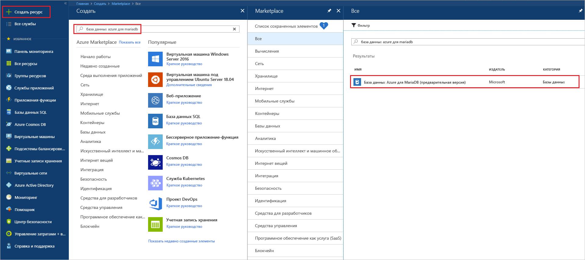
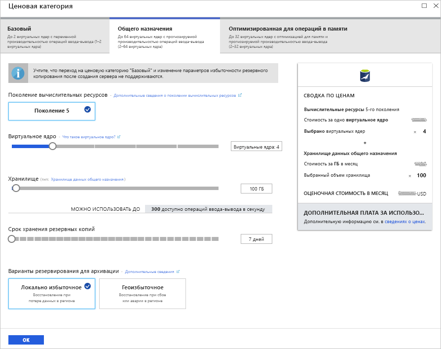
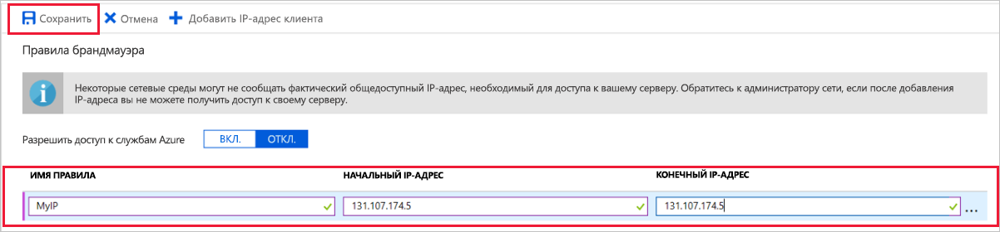
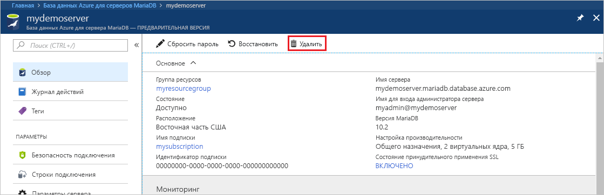

# <a name="create-an-azure-database-for-mariadb-server-by-using-the-azure-portal"></a>Создание сервера Базы данных Azure для MariaDB с помощью портала Azure

База данных Azure для MariaDB — это управляемая служба, которая позволяет запускать, администрировать и масштабировать высокодоступные базы данных MariaDB в облаке. В этом кратком руководстве описывается, как за пять минут создать сервер Базы данных Azure для MariaDB с помощью портала Azure.  

Если у вас еще нет подписки Azure, создайте [бесплатную учетную запись](https://azure.microsoft.com/free/) Azure, прежде чем начинать работу.

## <a name="sign-in-to-the-azure-portal"></a>Вход на портал Azure

В веб-браузере перейдите на [портал Azure](https://portal.azure.com/). Введите свои учетные данные для входа на портал. Панель мониторинга службы является представлением по умолчанию.

## <a name="create-an-azure-database-for-mariadb-server"></a>Создание сервера Базы данных Azure для MariaDB

Сервер Базы данных Azure для MariaDB создается с определенным набором [вычислительных ресурсов и ресурсов хранения](concepts-pricing-tiers.md). Он создается в [группе ресурсов Azure](../azure-resource-manager/resource-group-overview.md).

Чтобы создать сервер Базы данных Azure для MariaDB, сделайте следующее:

1. Нажмите кнопку **Создать ресурс** (+) в левом верхнем углу окна портала.

2. Выберите **Базы данных** > **База данных Azure для MariaDB**. Чтобы найти службу, вы также можете ввести в поле поиска **MariaDB**.

   

3. Введите или выберите следующие сведения о сервере.
   
   

    Параметр | Рекомендуемое значение | Описание
    ---|---|---
    Имя сервера | *уникальное имя сервера* | Выберите уникальное имя, идентифицирующее сервер Базы данных Azure для MariaDB. Например, **mydemoserver**. Имя домена *mariadb.database.azure.com* добавляется к введенному имени сервера. Имя сервера может содержать только строчные буквы, цифры и знак дефиса (-). Оно должно содержать от 3 до 63 символов.
    Subscription | *ваша подписка* | Выберите подписку Azure, которую вы хотите использовать для сервера. Если у вас есть несколько подписок, выберите ту, в которой взимается плата за использование ресурса.
    группа ресурсов. | **myresourcegroup** | Введите имя новой группы ресурсов или выберите имеющуюся. 
    Выбор источника | **Пустой** | Чтобы создать сервер с нуля, выберите **Пустой**. (Выберите **Резервное копирование** при создании сервера из геоизбыточного хранилища резервных копий имеющегося сервера Базы данных Azure для MariaDB.)
    учетные данные администратора сервера для входа; | **myadmin** | Учетная запись для входа, используемая при подключении к серверу. Не используйте для имени учетной записи администратора такие варианты: **azure_superuser**, **admin**, **administrator**, **root**, **guest** или **public**.
    Пароль | *по своему выбору* | Введите новый пароль учетной записи администратора сервера. Пароль должен содержать от 8 до 128 символов. Пароль должен содержать символы из таких трех категорий: прописные латинские буквы, строчные латинские буквы, цифры (0–9) и небуквенно-цифровые знаки (!, $, #, % и т. д.).
    Подтверждение пароля. | *по своему выбору*| Подтвердите пароль учетной записи администратора.
    Location | *ближайший к пользователям регион*| Выберите расположение, наиболее близкое к пользователям или другим приложениям Azure.
    Version (версия) | *последняя версия*| Последняя версия (если нет особых требований использовать другую версию).
    Ценовая категория | См. описание. | Конфигурации вычислительных ресурсов, хранилища и резервного копирования для нового сервера. Выберите **Ценовая категория** > **Общего назначения**. Оставьте значения по умолчанию для следующих параметров:<br><ul><li>**Поколение вычислительных ресурсов** (поколение 5);</li><li>**Виртуальное ядро** (4 виртуальных ядра);</li><li>**Хранилище** (100 ГБ);</li><li>**Срок хранения резервных копий** (7 дней).</li></ul><br>Чтобы включить резервное копирование сервера в геоизбыточном хранилище, выберите **Геоизбыточное хранилище** в разделе **Варианты резервирования для архивации**. <br><br>Щелкните **ОК**, чтобы сохранить ценовую категорию. На следующем снимке экрана показаны выбранные параметры.
  
   > [!NOTE]
   > Используйте ценовую категорию "Базовый", если для вашей рабочей нагрузки не требуется большое количество вычислительных ресурсов и операций ввода-вывода. Обратите внимание, что серверы, созданные в ценовой категории "Базовый", нельзя масштабировать до ценовых категорий "Общего назначения" или "Оптимизировано для памяти". Дополнительные сведения см. на [странице с ценами](https://azure.microsoft.com/pricing/details/mariadb/).
   > 

   

4.  Щелкните **Создать**, чтобы подготовить сервер. Этот процесс может занять до 20 минут.
   
5.  На панели инструментов щелкните **Уведомления** (значок колокольчика), чтобы отслеживать процесс развертывания.
   
По умолчанию на сервере создаются следующие базы данных: **information_schema**, **mysql**, **performance_schema** и **sys**.


## <a name="configure-firewall-rule"></a>Настройка правила брандмауэра на уровне сервера

База данных Azure для службы MariaDB создает брандмауэр на уровне сервера. Он не позволяет внешним приложениям и средствам подключаться к серверу и к любой базе данных на сервере, если не создано правило брандмауэра, открывающее брандмауэр для определенных IP-адресов. 

Чтобы создать правило брандмауэра на уровне сервера, сделайте следующее:

1. После завершения развертывания найдите свой сервер. Для этого при необходимости можно выполнить поиск. Например, в меню слева выберите **Все ресурсы**. Введите имя сервера. Например, введите **mydemoserver**, чтобы найти созданный сервер. Выберите имя сервера в списке результатов поиска. Откроется страница **обзора** сервера. Дополнительные параметры на этой странице можно изменить.

2. На странице обзора сервера выберите **Безопасность подключения**.

3. В разделе **Правила брандмауэра** щелкните пустое текстовое поле в столбце **Имя правила**, чтобы создать правило брандмауэра. Укажите точный диапазон IP-адресов клиентов, которые будут подключаться к этому серверу.
   
   

4. На верхней панели инструментов на странице **Безопасность подключения** щелкните **Сохранить**. Прежде чем продолжить, подождите, пока не появится уведомление о том, что обновление успешно завершено. 

   > [!NOTE]
   > Подключитесь к Базе данных Azure для MariaDB через порт 3306. Если вы пытаетесь подключиться из корпоративной сети, исходящий трафик через порт 3306 может быть запрещен. В этом случае, чтобы подключиться к серверу, ваш ИТ-отдел должен открыть порт 3306.
   > 

## <a name="get-connection-information"></a>Получение сведений о подключении

Чтобы подключиться к серверу базы данных, вам потребуются учетные данные администратора для входа и полное имя сервера. Скорее всего, вы уже записали эти значения раньше. Если нет, вы можете легко найти данные для входа на странице **Обзор** сервера или на странице **Свойства** на портале Azure.

1. Откройте страницу сервера **Обзор**. Запишите значения **имени сервера** и **имени для входа администратора сервера**. 

2. Чтобы скопировать нужные значения, наведите указатель мыши на поле, которое требуется скопировать. Справа от текста отобразится значок копирования. Щелкните значок копирования, чтобы скопировать нужные значения.

В нашем примере серверу присвоено имя **mydemoserver.mariadb.database.azure.com**, а имя для входа администратора сервера — **myadmin\@mydemoserver**.

## <a name="connect-to-azure-database-for-mariadb-by-using-the-mysql-command-line"></a>Подключение к Базе данных Azure для MariaDB с помощью командной строки mysql

К серверу Базы данных Azure для MariaDB можно подключиться с помощью нескольких приложений.

Сначала воспользуемся программой командной строки [mysql](https://dev.mysql.com/doc/refman/5.7/en/mysql.html) для демонстрации подключения к серверу. Веб-браузер и Azure Cloud Shell можно также использовать без установки программного обеспечения. Если на вашем компьютере установлена служебная программа mysql, вы можете подключиться с него.

1. Запустите Azure Cloud Shell с помощью значка терминала ( **>_** ) в верхней правой части панели инструментов портала Azure.
   

2. В браузере откроется Azure Cloud Shell. В Cloud Shell можно использовать команды оболочки Bash.

   

3. Чтобы подключиться к серверу Базы данных Azure для MariaDB, введите команду mysql в командной строке Cloud Shell.

    Чтобы подключиться к серверу Базы данных Azure для MariaDB с помощью служебной программы mysql, используйте следующий формат.

    ```bash
    mysql --host <fully qualified server name> --user <server admin login name>@<server name> -p
    ```

    Например, следующая команда позволяет подключиться к нашему серверу, используемому для примера:

    ```azurecli-interactive
    mysql --host mydemoserver.mariadb.database.azure.com --user myadmin@mydemoserver -p
    ```

    параметр mysql |Рекомендуемое значение|ОПИСАНИЕ
    ---|---|---
    --host | *имя сервера* | Значение имени сервера, которое вы использовали при создании сервера Базы данных Azure для MariaDB. В нашем примере используется такое имя сервера — **mydemoserver.mariadb.database.azure.com**. Используйте полное доменное имя ( **\*.mariadb.database.azure.com**), как показано в примере. Если вы не помните имя своего сервера, выполните действия из предыдущего раздела, чтобы получить сведения о подключении.
    --user | *имя для входа администратора сервера* |Имя для входа администратора сервера, которое вы использовали при создании сервера Базы данных Azure для MariaDB. Если вы не помните имя для входа, выполните действия из предыдущего раздела, чтобы получить сведения о подключении. Формат *имя пользователя\@имя сервера*.
    -p | *ваш пароль*<br>(дождитесь появления запроса) |При появлении запроса введите пароль, который использовался для создания сервера. Символы введенного пароля не будут отображаться в строке Bash при их вводе. После того как вы введете пароль, нажмите клавишу ВВОД.

   После подключения служебной программы mysql появится командная строка `mysql>`. В этой командной строке можно ввести команды. 

   Ниже приведен пример выходных данных mysql:

    ```bash
    Welcome to the MySQL monitor.  Commands end with ; or \g.
    Your MySQL connection id is 65505
    Server version: 5.6.39.0 MariaDB Server
    
    Copyright (c) 2000, 2017, Oracle and/or its affiliates. All rights reserved.
    
    Oracle is a registered trademark of Oracle Corporation and/or its
    affiliates. Other names may be trademarks of their respective
    owners.

    Type 'help;' or '\h' for help. Type '\c' to clear the current input statement.
    
    mysql>
    ```
    
    > [!TIP]
    > Если в брандмауэре не настроено разрешение IP-адресов Azure Cloud Shell, возникнет следующая ошибка:
    >
    >   ERROR 2003 (28000). Для клиента с IP-адресом 123.456.789.0 доступ к серверу не разрешен.
    >
    > Чтобы устранить эту ошибку, убедитесь, что конфигурация сервера соответствует шагам, описанным в статье [Создание сервера Базы данных Azure для MariaDB с помощью портала Azure](#configure-firewall-rule).

4. Чтобы проверить подключение, введите **status** в программе командной строки `mysql>` для проверки состояния сервера.

    ```sql
    status
    ```

   > [!TIP]
   > Дополнительные команды см. в [разделе 4.5.1 справочного руководства по MySQL 5.7](https://dev.mysql.com/doc/refman/5.7/en/mysql.html).

5. Создайте пустую базу данных. Для этого в командной строке `mysql>` введите следующую команду:

   ```sql
   CREATE DATABASE quickstartdb;
   ```
   Выполнение команды может занять несколько минут. 

   На сервере Базы данных Azure для MariaDB можно создать одну или несколько баз данных. Можно создать по одной базе данных на каждом сервере, чтобы использовать все ресурсы, или несколько баз данных, чтобы предоставить общий доступ к ресурсам. Число создаваемых баз данных не ограничено, но все они совместно используют одни и те же ресурсы сервера. 

6. Выведите список баз данных в командной строке `mysql>`, введя следующую команду:

    ```sql
    SHOW DATABASES;
    ```

7. Введите **\q** и нажмите клавишу ВВОД, чтобы выйти из средства mysql. Теперь Azure Cloud Shell можно закрыть.

Итак, вы подключились к серверу Базы данных Azure для MariaDB и создали пустую пользовательскую базу данных. В следующем разделе вы подключитесь к тому же серверу с помощью другого популярного средства — MySQL Workbench.

## <a name="connect-to-the-server-by-using-mysql-workbench"></a>Подключение к серверу с помощью MySQL Workbench

Чтобы подключиться к серверу с помощью MySQL Workbench, сделайте следующее:

1. Откройте MySQL Workbench на клиентском компьютере. Скачать и установить MySQL Workbench вы можете [здесь](https://dev.mysql.com/downloads/workbench/).

2. Чтобы создать подключение, щелкните значок плюса ( **+** ) рядом с заголовком **Подключения MySQL**.

3. В диалоговом окне **Setup New Connection** (Настройка нового подключения) на вкладке **Параметры** введите сведения о подключении сервера. Значения заполнителей показаны в качестве примера. Замените **имя узла**, **имя пользователя** и **пароль** собственными значениями.

   

    |Параметр |Рекомендуемое значение|Описание поля|
    |---|---|---|
     Имя подключения | **Подключение demo** | Метка для этого подключения. |
    Способ подключения | **Standard (TCP/IP)** (Стандартный способ (по протоколу TCP/IP)) | Стандартный способ (по протоколу TCP/IP) соответствует требованиям. |
    имя узла; | *имя сервера* | Значение имени сервера, которое вы использовали при создании сервера Базы данных Azure для MariaDB. В нашем примере используется такое имя сервера — **mydemoserver.mariadb.database.azure.com**. Используйте полное доменное имя ( **\*.mariadb.database.azure.com**), как показано в примере. Если вы не помните имя своего сервера, выполните действия из предыдущего раздела, чтобы получить сведения о подключении.|
     Порт | 3306 | Порт, используемый при подключении к серверу Базы данных Azure для MariaDB. |
    Имя пользователя |  *имя для входа администратора сервера* | Сведения об имени для входа администратора сервера, которое вы использовали при создании сервера Базы данных Azure для MariaDB. В нашем примере используется имя пользователя **myadmin\@mydemoserver**. Если вы не помните имя пользователя, выполните действия из предыдущего раздела, чтобы получить сведения о подключении. Формат *имя пользователя\@имя сервера*.
    Пароль | *ваш пароль* | Чтобы сохранить пароль, щелкните **Store in Vault** (Сохранить в хранилище). |

4. Щелкните **Проверить подключение**, чтобы проверить, все ли параметры настроены правильно. Затем нажмите кнопку **ОК**, чтобы сохранить подключение. 

    > [!NOTE]
    > На сервере по умолчанию применяется протокол SSL. Чтобы подключиться, его нужно дополнительно настроить. Дополнительные сведения см. в статье [Настройка SSL-подключений в приложении для безопасного подключения к базе данных Azure для MariaDB](./howto-configure-ssl.md). Чтобы отключить протокол SSL для работы с этим кратким руководством, на странице обзора сервера на портале Azure выберите в меню **Безопасность подключения**. Для параметра **Принудительно использовать SSL-соединение** выберите **Отключено**.
    >

## <a name="clean-up-resources"></a>Очистка ресурсов

Вы можете удалить ресурсы, созданные в ходе работы с этим руководством, двумя способами. Вы можете удалить [группу ресурсов Azure](../azure-resource-manager/resource-group-overview.md). При этом удаляются все ресурсы в группе ресурсов. Если же вы хотите сохранить другие ресурсы, удалите только один ресурс сервера.

> [!TIP]
> Другие краткие руководства в этой коллекции созданы на основе этого документа. Если вы планируете продолжать работу с этими краткими руководствами, посвященными Базе данных Azure для MariaDB, не удаляйте созданные ресурсы. Если вы не планируете продолжать работу, удалите все созданные в ходе работы с этим руководством ресурсы, выполнив следующие действия.
>

Чтобы удалить группу ресурсов, в том числе только что созданный сервер, сделайте следующее:

1.  Найдите группу ресурсов на портале Azure. В меню слева щелкните **Группы ресурсов**, а затем выберите имя группы ресурсов (в нашем примере это **myresourcegroup**).

2.  На странице группы ресурсов щелкните **Удалить**. Затем введите имя своей группы ресурсов (в нашем примере — **myresourcegroup**), чтобы подтвердить удаление. Нажмите кнопку **Удалить**.

Чтобы удалить только что созданный сервер, сделайте следующее:

1. Найдите сервер на портале Azure, если он у вас не открыт. В меню слева выберите **Все ресурсы**. Затем найдите созданный сервер.

2. На странице **Обзор** выберите **Удалить**. 

   

3. Подтвердите имя сервера, который вы хотите удалить. Появится список баз данных, которые будут затронуты при удалении. Введите имя сервера (в нашем примере — **mydemoserver**) для подтверждения удаления. Нажмите кнопку **Удалить**.

## <a name="next-steps"></a>Дополнительная информация

- [Проектирование первой Базы данных Azure для MariaDB](./tutorial-design-database-using-portal.md)
