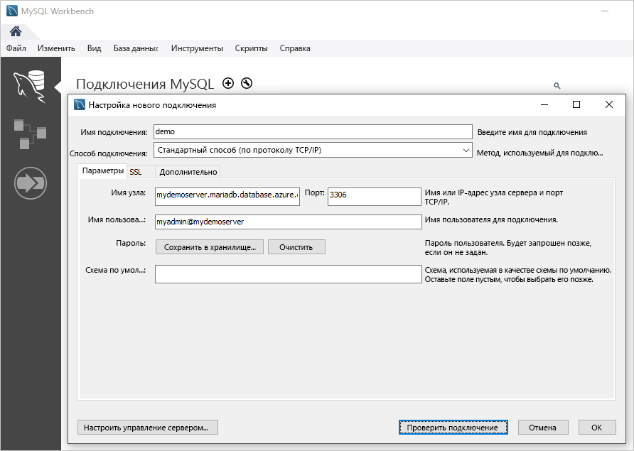

# <a name="quickstart-create-an-azure-database-for-mariadb-server-using-powershell"></a>Краткое руководство. Создание сервера Базы данных Azure для MariaDB с помощью PowerShell

В этом кратком руководстве показано, как создать сервер Базы данных Azure для MariaDB в группе ресурсов Azure с помощью PowerShell. С помощью Azure PowerShell можно создавать и администрировать ресурсы Azure интерактивно или с помощью скриптов.

## <a name="prerequisites"></a>Предварительные требования

Если у вас еще нет подписки Azure, создайте [бесплатную](https://azure.microsoft.com/free/) учетную запись, прежде чем начинать работу.

Если вы решили использовать PowerShell локально, для работы с этой статьей установите модуль PowerShell Az и подключитесь к учетной записи Azure с помощью командлета [Connect-AzAccount](https://docs.microsoft.com/powershell/module/az.accounts/connect-azaccount). См. сведения об [установке модуля Azure PowerShell](https://docs.microsoft.com/powershell/azure/install-az-ps).

> [!IMPORTANT]
> Так как модуль PowerShell Az.MariaDb предоставляется в предварительной версии, его нужно установить отдельно от модуля Az PowerShell с помощью команды `Install-Module -Name Az.MariaDb -AllowPrerelease`.
> Как только модуль PowerShell Az.MariaDb станет общедоступным, он будет включен в один из будущих выпусков модуля Az PowerShell и встроен в Azure Cloud Shell.

Если вы впервые используете службу "База данных Azure для MariaDB", необходимо зарегистрировать поставщик ресурсов **Microsoft.DBforMariaDB**.

```azurepowershell-interactive
Register-AzResourceProvider -ProviderNamespace Microsoft.DBforMariaDB
```

[!INCLUDE [cloud-shell-try-it](../../includes/cloud-shell-try-it.md)]

Если вы используете несколько подписок Azure, выберите ту, за ресурсы в которой будут выставляться счета. Выберите идентификатор требуемой подписки с помощью командлета [Set-AzContext](https://docs.microsoft.com/powershell/module/az.accounts/set-azcontext).

```azurepowershell-interactive
Set-AzContext -SubscriptionId 00000000-0000-0000-0000-000000000000
```

## <a name="create-a-resource-group"></a>Создание группы ресурсов

Создайте [группу ресурсов Azure](https://docs.microsoft.com/azure/azure-resource-manager/resource-group-overview) с помощью командлета [New-AzResourceGroup](https://docs.microsoft.com/powershell/module/az.resources/new-azresourcegroup). Группа ресурсов — это логический контейнер, в котором ресурсы Azure развертываются и администрируются как группа.

В следующем примере создается группа ресурсов с именем **myresourcegroup** в регионе **Западная часть США**.

```azurepowershell-interactive
New-AzResourceGroup -Name myresourcegroup -Location westus
```

## <a name="create-an-azure-database-for-mariadb-server"></a>Создание сервера Базы данных Azure для MariaDB

Создайте сервер Базы данных Azure для MariaDB с помощью командлета `New-AzMariaDbServer`. Сервер может управлять несколькими базами данных. Как правило, для каждого проекта и для каждого пользователя используется отдельная база данных.

В следующей таблице приводится список часто используемых параметров и примеры значений для командлета `New-AzMariaDbServer`.

|        **Параметр**         | **Пример значения** |                                                                                                                                                             **Описание**                                                                                                                                                              |
| -------------------------- | ---------------- | ---------------------------------------------------------------------------------------------------------------------------------------------------------------------------------------------------------------------------------------------------------------------------------------------------------------------------------------- |
| Имя                       | mydemoserver     | Выберите глобально уникальное имя в Azure для сервера Базы данных Azure для MariaDB. Имя сервера может содержать только буквы, цифры и дефис (-). Все символы в верхнем регистре при создании будут автоматически преобразованы в нижний регистр. Его длина должна составлять от 3 до 63 символов. |
| ResourceGroupName          | myresourcegroup  | Укажите имя группы ресурсов Azure.                                                                                                                                                                                                                                                                                            |
| Sku                        | GP_Gen5_2        | Имя номера SKU. Сокращенная запись соответствует соглашению: **ценовая-категория\_поколение-вычислительных-ресурсов\_число-виртуальных-ядер**. Под этой таблицей приведены дополнительные сведения о параметре SKU.                                                                                                                                           |
| BackupRetentionDay         | 7                | Срок хранения резервной копии. Указывается в днях. Можно указать от 7 до 35 дней.                                                                                                                                                                                                                                                                       |
| GeoRedundantBackup         | Активировано          | Позволяет включить или отключить создание геоизбыточных резервных копий для этого сервера. Это значение нельзя использовать для серверов ценовой категории "Базовый", а также изменять после создания сервера. Допустимые значения: Enabled, Disabled.                                                                                                      |
| Расположение                   | westus           | Регион Azure для сервера.                                                                                                                                                                                                                                                                                                         |
| SslEnforcement             | Активировано          | Позволяет включить или отключить SSL для этого сервера. Допустимые значения: Enabled, Disabled.                                                                                                                                                                                                                                                 |
| StorageInMb                | 51 200            | Объем хранилища сервера (в мегабайтах). StorageInMb имеет минимальное значение 5120 МБ, которое увеличивается на 1024 МБ. См. сведения об ограничениях размера хранилища в описании [ценовых категорий Базы данных Azure для MariaDB](./concepts-pricing-tiers.md).                                                                               |
| Версия                    | 5.7              | Основной номер версии MariaDB.                                                                                                                                                                                                                                                                                                                 |
| AdministratorUserName      | myadmin          | Имя для входа администратора. Не может иметь значение **azure_superuser**, **admin**, **administrator**, **root**, **guest** или **public**.                                                                                                                                                                                            |
| AdministratorLoginPassword | `<securestring>` | Пароль администратора в виде защищенной строки. Пароль должен содержать от 8 до 128 символов. Пароль должен содержать символы из таких трех категорий: прописные латинские буквы, строчные латинские буквы, цифры и небуквенно-цифровые знаки.                                       |

Значение параметра **SKU** соответствует формату **ценовая-категория\_поколение-вычислительных-ресурсов\_количество-виртуальных-ядер**, как показано в примерах ниже.

- `-Sku B_Gen5_1` — "Базовый", поколение 5, 1 виртуальное ядро; Это номер SKU наименьший по размеру из доступных.
- `-Sku GP_Gen5_32` — "Общего назначения", поколение 5, 32 виртуальных ядра;
- `-Sku MO_Gen5_2` — "Оптимизированная для операций в памяти", поколение 5, 2 виртуальных ядра.

См. сведения о допустимых значениях **SKU** по регионам и ценовым категориям в описании [ценовых категорий Базы данных Azure для MariaDB](./concepts-pricing-tiers.md).

В следующем примере в регионе **Западная часть США** создается сервер MariaDB с именем **mydemoserver** в группе ресурсов **myresourcegroup** с администратором сервера с именем **myadmin**. Это сервер 5-го поколения ценовой категории "Общего назначения" с двумя виртуальными ядрами и геоизбыточным резервным копированием. Запишите пароль, указанный в первой строке примера, так как это пароль для учетной записи администратора сервера MariaDB.

> [!TIP]
> Имя сервера сопоставляется с DNS-именем и должно быть глобально уникальным в Azure.

```azurepowershell-interactive
$Password = Read-Host -Prompt 'Please enter your password' -AsSecureString
New-AzMariaDbServer -Name mydemoserver -ResourceGroupName myresourcegroup -Sku GP_Gen5_2 -GeoRedundantBackup Enabled -Location westus -AdministratorUsername myadmin -AdministratorLoginPassword $Password
```

Используйте ценовую категорию "Базовый", если для вашей рабочей нагрузки не требуется большое количество вычислительных ресурсов и операций ввода-вывода.

> [!IMPORTANT]
> Серверы, созданные в ценовой категории "Базовый", не удастся позже масштабировать до ценовых категорий "Общего назначения" или "Оптимизировано для памяти" и к ним нельзя применить георепликацию.

## <a name="configure-a-firewall-rule"></a>Настройка правила брандмауэра

Создайте правило брандмауэра для сервера Базы данных Azure для MariaDB, используя командлет `New-AzMariaDbFirewallRule`. Правило брандмауэра на уровне сервера позволяет внешним приложениям, таким как программа командной строки `mysql` или MariaDB Workbench, подключаться к серверу через брандмауэр службы "База данных Azure для MariaDB".

В приведенном ниже примере создается правило брандмауэра с именем **AllowMyIP**, которое разрешает подключения с определенного IP-адреса (192.168.0.1). Замените его IP-адресом или диапазоном IP-адресов, которые применяются для того расположения, из которого вы подключаетесь.

```azurepowershell-interactive
New-AzMariaDbFirewallRule -Name AllowMyIP -ResourceGroupName myresourcegroup -ServerName mydemoserver -StartIPAddress 192.168.0.1 -EndIPAddress 192.168.0.1
```

> [!NOTE]
> Подключитесь к Базе данных Azure для MariaDB через порт 3306. Если вы пытаетесь подключиться из корпоративной сети, исходящий трафик через порт 3306 может быть запрещен. В этом сценарии вы сможете подключиться к серверу, только если ИТ-отдел откроет для вас порт 3306.

## <a name="configure-ssl-settings"></a>Настройка параметров SSL

По умолчанию между сервером и клиентскими приложениями применяется SSL-соединение. Это обеспечивает защиту данных _при перемещении_ за счет шифрования потока данных через Интернет. В этом руководстве отключите SSL-соединения для вашего сервера. Дополнительные сведения см. в статье [Настройка SSL-подключений в приложении для безопасного подключения к базе данных Azure для MariaDB](./howto-configure-ssl.md).

> [!WARNING]
> Мы не рекомендуем так делать для рабочих серверов.

Следующий пример отключает SSL на сервере Базы данных Azure для MariaDB.

```azurepowershell-interactive
Update-AzMariaDbServer -Name mydemoserver -ResourceGroupName myresourcegroup -SslEnforcement Disabled
```

## <a name="get-the-connection-information"></a>Получение сведений о подключении

Чтобы подключиться к серверу, необходимо указать сведения об узле и учетные данные для доступа. Чтобы получить сведения о подключении, используйте следующий пример. Запишите значения **FullyQualifiedDomainName** и **AdministratorLogin**.

```azurepowershell-interactive
Get-AzMariaDbServer -Name mydemoserver -ResourceGroupName myresourcegroup |
  Select-Object -Property FullyQualifiedDomainName, AdministratorLogin
```

```Output
FullyQualifiedDomainName                    AdministratorLogin
------------------------                    ------------------
mydemoserver.mariadb.database.azure.com       myadmin
```

## <a name="connect-to-the-server-using-the-mysql-command-line-tool"></a>Подключение к серверу с помощью средства командной строки mysql

Подключитесь к серверу с помощью средства командной строки `mysql`. Скачать его можно [здесь](https://dev.mysql.com/downloads/shell/). Вы можете также получить доступ к предустановленной версии средства командной строки `mysql` из Azure Cloud Shell, нажав кнопку **Попробовать** в примере кода в этой статье. Azure Cloud Shell также можно открыть, нажав кнопку **>_** на панели инструментов вверху справа на портале Azure или перейдя по адресу [shell.azure.com](https://shell.azure.com/).

1. Подключитесь к серверу с помощью средства командной строки `mysql`.

   ```azurepowershell-interactive
   mysql -h <servername>.mariadb.database.azure.com -u myadmin@<servername> -p
   ```

1. Просмотрите состояние сервера.

   ```sql
   mysql> status
   ```

   ```Output
   C:\Users\>mysql -h mydemoserver.mariadb.database.azure.com -u myadmin@mydemoserver -p
   Enter password: *************
   Welcome to the MySQL monitor.  Commands end with ; or \g.
   Your MySQL connection id is 64793
   Server version: 5.6.42.0 MariaDB Server

   Copyright (c) 2000, 2020, Oracle and/or its affiliates. All rights reserved.

   Oracle is a registered trademark of Oracle Corporation and/or its
   affiliates. Other names may be trademarks of their respective
   owners.

   Type 'help;' or '\h' for help. Type '\c' to clear the current input statement.

   mysql> status
   --------------
   /usr/bin/mysql  Ver 14.14 Distrib 5.7.29, for Linux (x86_64) using  EditLine wrapper

   Connection id:          64793
   Current database:
   Current user:           myadmin@myipaddress
   SSL:                    Cipher in use is ECDHE-RSA-AES256-GCM-SHA384
   Current pager:          stdout
   Using outfile:          ''
   Using delimiter:        ;
   Server version:         5.6.42.0 MariaDB Server
   Protocol version:       10
   Connection:             mydemoserver.mariadb.database.azure.com via TCP/IP
   Server characterset:    latin1
   Db     characterset:    latin1
   Client characterset:    utf8
   Conn.  characterset:    utf8
   TCP port:               3306
   Uptime:                 17 min 4 sec

   Threads: 19  Questions: 482  Slow queries: 0  Opens: 50  Flush tables: 3  Open tables: 12  Queries per second avg: 0.470
   --------------

   mysql>
   ```

Дополнительные команды см. в [разделе 4.5.1 справочного руководства по MySQL 5.7](https://dev.mysql.com/doc/refman/5.7/en/mysql.html).

## <a name="connect-to-the-server-using-mariadb-workbench"></a>Подключение к серверу с помощью MariaDB Workbench

1. Запустите приложение MySQL Workbench на клиентском компьютере. Скачать MySQL Workbench для установки вы можете [отсюда](https://dev.mysql.com/downloads/workbench/).

1. В диалоговом окне **Настройка нового подключения** на вкладке **Параметры** введите следующие сведения:

   

    |    **Параметр**    |            **Рекомендуемое значение**            |                      **Описание**                       |
    | ----------------- | ----------------------------------------- | ---------------------------------------------------------- |
    | Имя подключения   | Мое подключение                             | Определение метки для этого подключения                        |
    | Способ подключения | Стандартный способ (по протоколу TCP/IP)                         | Используйте протокол TCP/IP для подключения к Базе данных Azure для MariaDB. |
    | Имя узла          | `mydemoserver.mariadb.database.azure.com` | Имя сервера, которое вы записали ранее                           |
    | Порт              | 3306                                      | Порт MariaDB по умолчанию                                 |
    | Имя пользователя          | myadmin@mydemoserver                      | Имя для входа администратора сервера, которое вы записали ранее                |
    | Пароль          | *************                             | Используйте пароль учетной записи администратора, настроенный ранее      |

1. Щелкните **Проверить подключение**, чтобы проверить, все ли параметры настроены правильно.

1. Выберите подключение для соединения с сервером.

## <a name="clean-up-resources"></a>Очистка ресурсов

Если созданные в этом кратком руководстве ресурсы не нужны вам для другого руководства, их можно удалить с помощью команды из следующего примера.

> [!CAUTION]
> Следующий пример удаляет указанную группу ресурсов и все содержащиеся в ней ресурсы.
> Если в указанной группе ресурсов существуют другие ресурсы, кроме созданных для этого краткого руководства, они также будут удалены.

```azurepowershell-interactive
Remove-AzResourceGroup -Name myresourcegroup
```

Чтобы удалить только тот сервер, который вы создали с помощью этого краткого руководства, но сохранить группу ресурсов, используйте командлет `Remove-AzMariaDbServer`.

```azurepowershell-interactive
Remove-AzMariaDbServer -Name mydemoserver -ResourceGroupName myresourcegroup
```

## <a name="next-steps"></a>Дальнейшие действия

> [!div class="nextstepaction"]
> [Проектирование Базы данных Azure для MariaDB с помощью PowerShell](tutorial-design-database-using-powershell.md)
