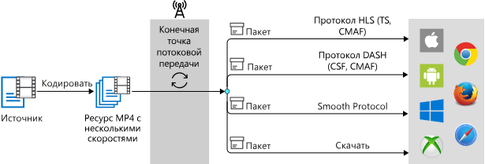
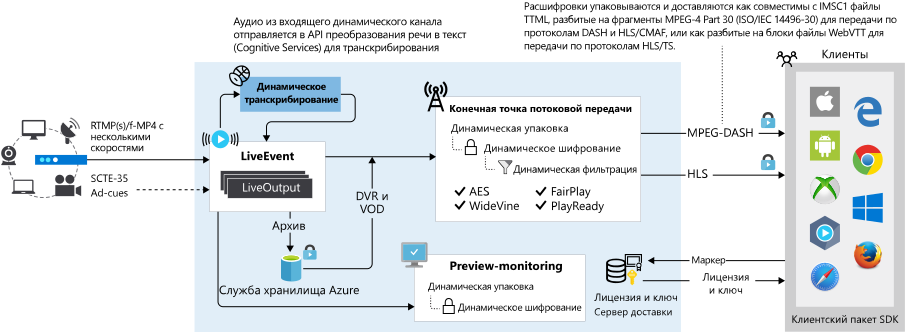

# Основные понятия служб мультимедиа

В этом разделе приводится краткий обзор терминологии и концепций служб мультимедиа Azure. В этой статье также приводятся ссылки на статьи с подробным описанием концепций и функциональных возможностей служб мультимедиа версии 3. 

Прежде чем приступать к разработке, необходимо ознакомиться со следующими основными понятиями.

> [!NOTE]
> В настоящее время вы не можете использовать портал Azure для управления ресурсами версии 3. Используйте [REST API](https://aka.ms/ams-v3-rest-ref), [CLI](https://aka.ms/ams-v3-cli-ref) или один из поддерживаемых [пакетов SDK](media-services-apis-overview.md#sdks).

## Термины

В этом разделе показано, как некоторые распространенные термины отрасли сопоставляются с API служб мультимедиа v3.

### Прямая трансляция с мероприятия

**Динамическое событие** представляет собой конвейер для приема, перекодирования (необязательно) и упаковки динамических потоков видео, аудио и метаданных в реальном времени.

Для клиентов, выполняющих миграцию из API-интерфейсов служб мультимедиа версии 2, **динамическое событие** заменяет сущность **Channel** в v2. Дополнительные сведения см. [в разделе Переход с версии v2 на v3](migrate-from-v2-to-v3.md).

### Конечная точка потоковой передачи (упаковка и происхождение)

**Конечная точка потоковой передачи** представляет собой динамическую (JIT) упаковку и службу-источник, которые могут предоставлять содержимое в реальном времени и по запросу непосредственно в клиентское приложение, используя один из распространенных протоколов потокового мультимедиа (HLS или тире). Кроме того, **Конечная точка потоковой передачи** обеспечивает динамическое (JIT) шифрование для ведущих DRM в отрасли.

В отрасли потоковой передачи мультимедиа эта служба обычно называется **упаковщиком** или **источником**.  Другими распространенными терминами для этой возможности являются ЖИТП (JIT-диспетчер) или ЖИТЕ (JIT-шифрование). 
 
## Передача в облако и хранение

Чтобы начать управление, шифрование, кодирование, анализ и потоковую передачу мультимедийного содержимого в Azure, необходимо создать учетную запись служб мультимедиа и передать ваши цифровые файлы в **ресурсы**.

- [Передача в облако и хранение](storage-account-concept.md)
- [Концепция активов](assets-concept.md)

## Сервис кодирования

После отправки высококачественных цифровых файлов мультимедиа в активы можно закодировать их в форматы, которые можно воспроизводить в различных браузерах и устройствах. 

Для кодирования с помощью служб мультимедиа v3 необходимо создать **преобразования** и **задания**.

- [Преобразования и задания](transforms-jobs-concept.md)
- [Кодирование с помощью служб мультимедиа](encoding-concept.md)

## Аналитика мультимедиа

Для анализа видео-и звуковых файлов также необходимо создать **преобразования** и **задания**.

- [Анализ видео и звуковых файлов](analyzing-video-audio-files-concept.md)

## Упаковка, доставка и защита

После кодирования содержимого можно воспользоваться **динамической упаковкой**. В службах мультимедиа **Конечная точка потоковой передачи**/Оригин — это служба динамической упаковки, используемая для доставки мультимедийных данных на клиентские проигрыватели. Чтобы сделать видео в выходном ресурсе доступными для воспроизведения клиентами, необходимо создать **указатель потоковой передачи** , а затем построить URL-адреса потоковой передачи. 

При создании **указателя потоковой передачи**в дополнение к имени ресурса необходимо указать **политику потоковой передачи**. **Политики потоковой передачи** позволяют определять протоколы потоковой передачи и параметры шифрования (если они есть) для **указателей потоковой передачи**.

Динамическая упаковка используется независимо от того, выполняется ли потоковая передача содержимого в реальном времени или по запросу. На следующей схеме показан потоковая передача по требованию с помощью рабочего процесса динамической упаковки.

С помощью служб мультимедиа вы можете предоставить содержимое Live и по запросу, зашифрованное динамически с помощью AES (AES-128) или/и любой из трех основных систем управления цифровыми правами (DRM): Microsoft PlayReady, Google Widevine и Apple FairPlay. Они также обеспечивают службу доставки ключей AES и лицензий DRM (PlayReady, Widevine и FairPlay) авторизованным клиентам.

При указании параметров шифрования в потоке создайте **политику ключа содержимого** и свяжите ее с **указателем потоковой передачи**. **Политика ключа содержимого** позволяет настроить способ доставки ключа содержимого конечным клиентам.

На следующем рисунке показан рабочий процесс защиты содержимого Служб мультимедиа: 

&#42;динамическое шифрование поддерживает AES-128 "Clear Key", CBCS и CENC. 

**Динамические манифесты** служб мультимедиа можно использовать для потоковой передачи только определенного представления или подклипов видео. В следующем примере использовался кодировщик для кодирования промежуточного актива в семь MP4-видеофайлов стандарта ISO (с разрешением от 180p до 1080p). Закодированный ресурс можно динамически упаковать в любой из следующих потоковых протоколов: HLS, MPEG DASH и Smooth.  В верхней части схемы показан манифест HLS манифеста для актива без фильтров (он содержит все семь представлений).  В левом нижнем углу показан манифест HLS, к которому был применен фильтр с именем ott. Фильтр ott предписывает удалить все варианты скорости потока ниже 1 Мбит/с, что ведет к исключению двух нижних уровней качества. В правом нижнем углу показан манифест HLS, к которому был применен фильтр с именем mobile. Фильтр mobile предписывает удалить представления, где разрешение больше 720p, что ведет к исключению двух представлений с разрешением 1080p.

- [динамическую упаковку](dynamic-packaging-overview.md)
- [Конечные точки потоковой передачи](streaming-endpoint-concept.md)
- [Указатели потоковой передачи](streaming-locators-concept.md)
- [Политики потоковой передачи](streaming-policy-concept.md)
- [Политики ключа содержимого](content-key-policy-concept.md)
- [Защита содержимого](content-protection-overview.md)
- [Динамические манифесты](filters-dynamic-manifest-overview.md)
- [Фильтры](filters-concept.md)

> [!NOTE]
> Widevine — это служба, предоставляемая Google Inc. и подпадает под условия обслуживания и политики конфиденциальности Google, Inc.

## Потоковая передача в реальном времени

Службы мультимедиа Azure дают возможность предоставлять клиентам события прямой трансляции в облаке Azure. **События потоковой трансляции** отвечают за прием и обработку видеопотоков. При создании **интерактивного события**создается входная конечная точка, которую можно использовать для отправки сигнала в реальном времени с удаленного кодировщика. Когда поток переводится в **интерактивное событие**, вы можете начать потоковую передачу события, создав **ресурс**, **динамический выход**и **указатель потоковой передачи**. В **режиме реального времени** поток будет архивирован в **ресурс** и станет доступным для просмотра через **конечную точку потоковой передачи**. **Событие в реальном времени** может быть одним из двух типов: **сквозная** и **Динамическая кодировка**.

На следующем рисунке показан рабочий процесс сквозного типа:

- [Потоковая трансляция в Службах мультимедиа Azure версии 3](live-streaming-overview.md)
- [События и выходные данные потоковой трансляции](live-events-outputs-concept.md)

## Мониторинг

### Служба "Сетка событий Azure"

Чтобы просмотреть ход выполнения задания, следует использовать **сетку событий**. Службы мультимедиа также создают динамические типы событий. С помощью службы "Сетка событий Azure" приложения могут ожидать передачи данных и реагировать на события, поступающие буквально из всех служб Azure и пользовательских источников. 

- [Обработка событий сетки событий](reacting-to-media-services-events.md)
- [Схемы](media-services-event-schemas.md)

### Azure Monitor

Отслеживайте метрики и журналы диагностики, которые помогут понять, как работают приложения с Azure Monitor.

- [Метрики и журналы диагностики](media-services-metrics-diagnostic-logs.md)
- [Схемы журналов диагностики](media-services-diagnostic-logs-schema.md)

## Клиенты в Проигрывателе

Проигрыватель мультимедиа Azure можно использовать для воспроизведения мультимедийного содержимого, потоковая передача которых выполняется службами мультимедиа, на различных браузерах и устройствах. Проигрыватель мультимедиа Azure использует такие отраслевые стандарты, как HTML5, Media Source Extensions (MSE) и Encrypted Media Extensions (EME), для оптимальной адаптивной потоковой передачи. 

- [Общие сведения о Проигрывателе мультимедиа Azure](use-azure-media-player.md)

## Получение справки, отправка отзывов, получение обновлений

Прочитайте статью [сообщества Служб мультимедиа Azure](media-services-community.md), чтобы узнать, как задавать вопросы, оставлять отзывы и получать новости о Службах мультимедиа.

## Дальнейшие действия

* [Кодирование удаленных файлов и потокового видео — REST](stream-files-tutorial-with-rest.md)
* [Кодирование отправленных файлов и потокового видео — .NET](stream-files-tutorial-with-api.md)
* [Потоковая передача в реальном времени — .NET](stream-live-tutorial-with-api.md)
* [Анализ видео — .NET](analyze-videos-tutorial-with-api.md)
* [Динамическое шифрование AES-128 — .NET](protect-with-aes128.md)
* [Encrypt dynamically with multi-DRM - .NET](protect-with-drm.md) (Динамическое шифрование с помощью DRM и службы доставки лицензий) 
