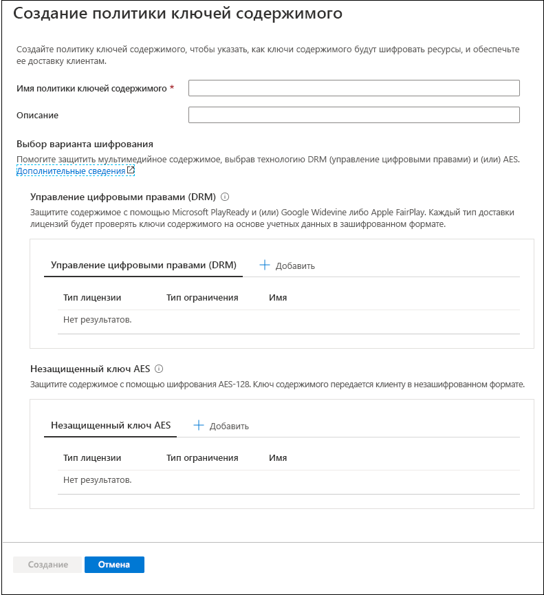
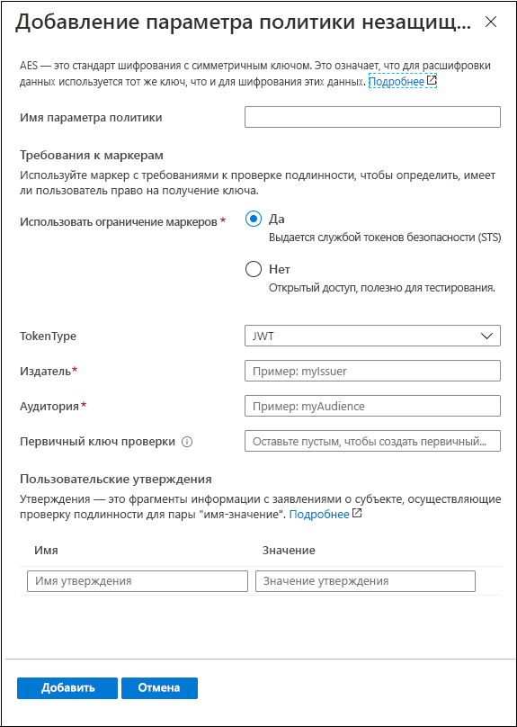
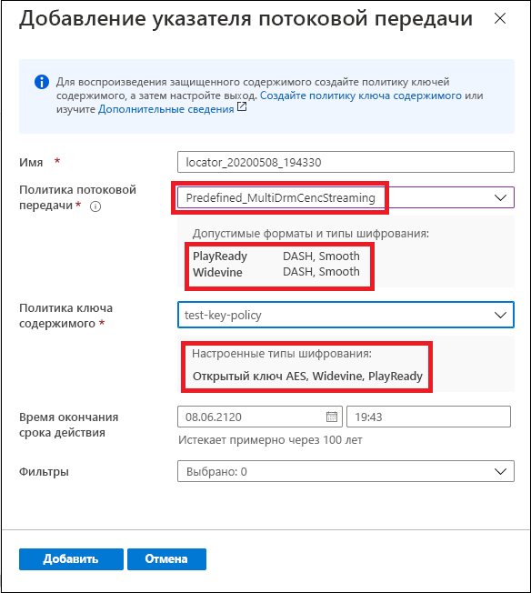

# Краткое руководство. Шифрование содержимого с помощью портала

[!INCLUDE [media services api v3 logo](./includes/v3-hr.md)]

Службы мультимедиа Azure помогут вам защитить данные мультимедиа, покидающие ваш компьютер, на всех этапах хранения, обработки и доставки, а также доставлять в режиме реального времени и по требованию содержимое, зашифрованное динамически с помощью Advanced Encryption Standard (AES-128) или трех основных систем управления цифровыми правами (DRM): Microsoft PlayReady, Google Widevine и Apple FairPlay. Они также обеспечивают службу доставки ключей AES и лицензий DRM (PlayReady, Widevine и FairPlay) авторизованным клиентам. 
 
Чтобы задать параметры шифрования для потока, примените **политику потоковой передачи** и свяжите ее с указателем потоковой передачи. Создаваемая **политика ключа содержимого** позволяет настроить способ доставки ключа содержимого (который обеспечивает безопасный доступ к **ресурсам**) клиентам. Необходимо настроить требования (ограничения) для политики ключа содержимого, которые должны соблюдаться для доставки ключей с указанной конфигурацией. 

> [!NOTE]
> Политика ключа содержимого не требуется при незащищенной потоковой передаче или скачивании.

Когда поток запрашивается проигрывателем, Службы мультимедиа используют указанный ключ для динамического шифрования содержимого с помощью незащищенного ключа AES или DRM. Чтобы расшифровать поток, проигрыватель запросит ключ у службы доставки ключей служб мультимедиа или в указанной вами службе доставки ключей. Чтобы определить, есть ли у пользователя право на получение ключа, служба оценивает **политику ключа содержимого**, которую вы задали для ключа.

В этом кратком руководстве показано, как создать политику ключа содержимого с указанием шифрования, которое нужно применять к ресурсу при его потоковой передаче. Также в этом кратком руководстве показано, как связать настроенное шифрование с ресурсом.

### Рекомендуемые материалы для предварительного ознакомления

* [Динамическое шифрование и доставка ключей](content-protection-overview.md)
* [Указатели потоковой передачи](streaming-locators-concept.md)
* [Политики потоковой передачи](streaming-policy-concept.md)
* [Политики ключа содержимого](content-key-policy-concept.md)

## Предварительные требования

Отправьте и обработайте содержимое, как описано в статье [об управлении ресурсами на портале Azure](manage-assets-quickstart.md).

## Создание политики ключа содержимого

Создайте **политику ключа содержимого**, чтобы настроить способ доставки ключа содержимого (который обеспечивает безопасный доступ к **ресурсам**) клиентам.

1. Войдите на [портал Azure](https://portal.azure.com/).
1. Найдите учетную запись Служб мультимедиа и выберите ее.
1. Выберите **Политики ключей содержимого (новое)** .
1. Щелкните **+ Add content key policy** (Добавить политику ключа содержимого) в верхней части окна. 

Откроется окно **Create a content key policy** (Создание политики ключа содержимого). В этом окне вы можете выбрать параметры шифрования. Для защиты мультимедийного содержимого можно выбрать технологию DRM (управление цифровыми правами) и (или) AES.  

Если вы выберете хотя бы один из вариантов (DRM или незащищенный ключ AES-128), вам будет предложено выбрать способ настройки ограничений. Можно установить ограничение "открытого типа" или "по маркеру". Подробное описание см. в разделе [Управление доступом к содержимому](content-protection-overview.md#controlling-content-access).

### Добавление ключа содержимого DRM

В качестве средства защиты содержимого вы можете выбрать Microsoft PlayReady и (или) Google Widevine либо Apple FairPlay. Каждый тип доставки лицензий будет проверять ключи содержимого на основе учетных данных в зашифрованном формате.

#### Шаблоны лицензий

Дополнительные сведения о шаблонах лицензий см. в статье:

* [Шаблон лицензии Google Widevine](widevine-license-template-overview.md)

    > [!NOTE]
    > Можно создать пустой шаблон лицензии без значений, который содержит только "{}". Затем будет создан шаблон лицензии со значениями по умолчанию. Значения по умолчанию подходят для большинства случаев.
* [Требования и конфигурация лицензии Apple FairPlay](fairplay-license-overview.md)
* [Шаблон лицензии PlayReady](playready-license-template-overview.md)

### Добавление незащищенного ключа AES

Вы также можете добавить шифрование содержимого незащищенным ключом AES-128. Ключ содержимого передается клиенту в незашифрованном формате.

## Создание указателя потоковой передачи для ресурса

1. Найдите учетную запись Служб мультимедиа и выберите ее.
1. Выберите **Assets (new)** (Ресурсы (новое)).
1. В списке ресурсов выберите тот, который нужно зашифровать.  
1. В разделе **Указатель потоковой передачи** для выбранного ресурса нажмите **+ Добавить указатель потоковой передачи**. 
1. Выберите **политику потоковой передачи**, которая лучше всего подходит для настроенной **политики ключа содержимого**.

    В статье [Политики потоковой передачи](streaming-policy-concept.md) есть сведения о том, какая политика потоковой передачи соответствует политике ключа содержимого.
1. Выбрав подходящую политику потоковой передачи, выберите также политику ключа содержимого из раскрывающегося списка.
1. Щелкните **Добавить**, чтобы добавить в ресурс указатель потоковой передачи.

    Это действие запускает публикацию ресурса и создание URL-адресов потоковой передачи.

## Очистка ресурсов

Если вы планируете поработать и с другими краткими руководствами, созданные ресурсы следует сохранить. В противном случае зайдите на портал Azure, откройте список групп ресурсов, выберите группу, в которой работали с этим кратким руководством, и удалите все ресурсы.

## Дальнейшие действия

[Управление ресурсами](manage-assets-quickstart.md)
