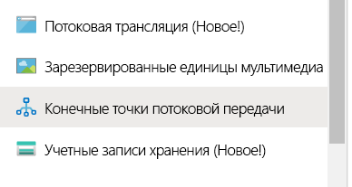
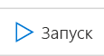
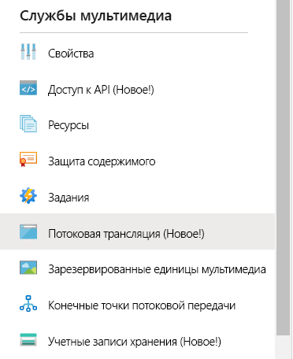
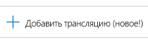
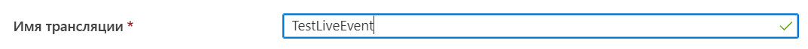
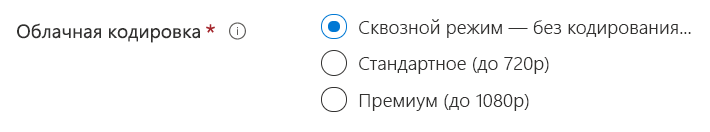
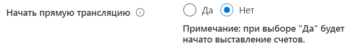
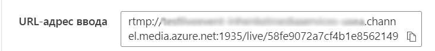

# Создание прямой трансляции в Службах мультимедиа Azure с помощью OBS

[!INCLUDE [media services api v3 logo](./includes/v3-hr.md)]

Из этого краткого руководства вы узнаете, как создать прямую трансляцию в Службах мультимедиа Azure с помощью портала Azure и Open Broadcasting Studio (OBS). Далее предполагается, что у вас есть подписка Azure и создана учетная запись Служб мультимедиа Azure.

В этом кратком руководстве мы рассмотрим следующие процессы:

- настройка локального кодировщика с помощью OBS;
- настройка прямой трансляции;
- настройка выходных потоков прямой трансляции;
- активация конечной точки прямой передачи по умолчанию;
- применение Проигрывателя мультимедиа Azure для просмотра прямой трансляции и вывода по запросу.

## Предварительные требования

Если у вас еще нет подписки Azure, [создайте бесплатную учетную запись](https://azure.microsoft.com/free/), прежде чем начинать работу.

## Вход на портал Azure

Откройте веб-браузер и перейдите на [портал Microsoft Azure](https://portal.azure.com/). Введите свои учетные данные для входа на портал. Панель мониторинга службы является представлением по умолчанию.

## Настройка локального кодировщика с помощью OBS

1. Скачайте с [веб-сайта Open Broadcaster Software (OBS)](https://obsproject.com/) и установите версию OBS для используемой операционной системы.
1. Запустите приложение и не закрывайте его.

## Активация стандартной конечной точки потоковой передачи

1. В Службах мультимедиа выберите **Конечные точки потоковой передачи** в списке.

   
1. Если стандартная конечная точка потоковой передачи находится в состоянии "Остановлена", выберите ее. После этого откроется страница конечной точки.
1. Щелкните **Запуск**.

   

## Настройка прямой трансляции в Службах мультимедиа Azure

1. Перейдите к учетной записи Служб мультимедиа Azure на портале и выберите **Потоковая трансляция** из списка **Службы мультимедиа**.

   
1. Выберите **Добавить трансляцию**, чтобы создать событие потоковой трансляции.

   
1. Введите имя нового события, например *TestLiveEvent*, в поле **Имя трансляции**.

   
1. Введите необязательное описание события в поле **Описание**.
1. Выберите вариант **Сквозной режим — без кодирования в облаке**.

   
1. Выберите вариант **RTMP**.
1. Чтобы избежать оплаты за трансляцию до того, как она будет готова, установите значение **Нет** для параметра **Начать прямую трансляцию**. (Начисление оплаты начнется после запуска трансляции.)

   
1. Нажмите кнопку **Просмотр и создание**, чтобы проверить параметры.
1. Нажмите кнопку **Создать**, чтобы создать трансляцию. Вы вернетесь к представлению списка трансляций.
1. Щелкните ссылку на только что созданную трансляцию. Обратите внимание, что событие остановлено.
1. Не закрывайте эту страницу в браузере. Мы вернемся к нему позже.

## Настройка прямой трансляции с помощью OBS Studio

OBS начинает работу со сцены по умолчанию, для которой не выбраны никакие входные данные.

   

### Добавление источника видео

1. На панели **Источники** щелкните **значок добавления**, чтобы выбрать новое исходное устройство. Откроется меню **Источники**.

1. Выберите **устройство видеозахвата** из меню исходных устройств. Откроется меню **создания и выбора источников**.

   

1. Выберите переключатель **Добавить существующий** и нажмите кнопку **OK**. Откроется меню **свойств для видеоустройства**.

   

1. В раскрывающемся списке **Устройство** выберите источник видео, который хотите использовать для трансляции. Остальные параметры пока не изменяйте, а просто нажмите кнопку **ОК**. Источник входных данных будет добавлен на панель **Источники**, а в области **Предварительный просмотр** появится представление входных видеоданных.

   

### Добавление источника звука

1. На панели **Источники** щелкните **значок добавления**, чтобы выбрать новое исходное устройство. Откроется меню "Исходное устройство".

1. Выберите **Захват звукового входа** из меню исходных устройств. Откроется меню **создания и выбора источников**.

   

1. Выберите переключатель **Добавить существующий** и нажмите кнопку **OK**. Откроется меню **свойств для захвата звукового входа**.

   

1. В раскрывающемся списке **Устройство** выберите устройство захвата звука, которое вы хотите использовать для трансляции. Остальные параметры пока не изменяйте, а просто нажмите кнопку ОК. Устройство захвата звука будет добавлено на панель микшера.

   

### Настройка потоковой передачи в OBS

В следующей процедуре вы вернетесь к Службам мультимедиа Azure в браузере, чтобы скопировать входной URL-адрес и вставить его в раздел параметров вывода.

1. На странице Служб мультимедиа Azure на портале щелкните **Запуск**, чтобы запустить прямую трансляцию. (С этого момента начинается тарификация.)

   
1. Установите переключатель **RTMP** в положение **RTMPS**.
1. В поле **URL-адрес ввода** скопируйте URL-адрес в буфер обмена.

   

1. Переключитесь на приложение OBS.

1. Нажмите кнопку **Параметры** на панели **Элементы управления**. Откроется страница "Параметры".

   

1. Выберите элемент **Поток** в меню **Параметры**.

1. В раскрывающемся списке **Служба** выберите элемент "Показать все", а затем — элемент **Настраиваемый...**

1. В поле **Сервер** вставьте URL-адрес RTMPS, который вы ранее скопировали в буфер обмена.

1. Введите что-нибудь в поле **Ключ потока**.  Это значение является обязательным, но может быть любым.

    

1. Выберите **Вывод** в меню **Параметры**.

1. Введите *2* в поле **Keyframe interval** (Интервал опорного кадра). Будет задана длина фрагмента в 2 секунды. Чтобы создать поток прямой доставки с меньшей задержкой, укажите значение в 1 секунду.

1. НЕОБЯЗАТЕЛЬНО. Для параметра **CPU Usage Preset** (Предустановка использования ЦП) укажите значение *veryfast* (Очень быстро), если используется компьютер с низкой вычислительной мощностью. При необходимости можно указать меньшее значение в Кбит/с, если условия работы сети оставляют желать лучшего.

   

1. Остальные параметры пока не изменяйте, а просто нажмите кнопку **ОК**.

### Запуск потоковой передачи

1. На панели **Элементы управления** щелкните **Запуск потоковой передачи**.

    

2. Перейдите в браузере на экран трансляции событий в реальном времени в Службах мультимедиа Azure и щелкните ссылку **Перезагрузить проигрыватель**. Вы увидите свой поток в проигрывателе предварительного просмотра.

## Настройка выходных потоков

В этой части рассказывается о том, как настроить выводы и обеспечить возможность сохранения записи прямой трансляции.  

> [!NOTE]
> Для выполнения потоковой передачи этих выходных потоков должна быть активна конечная точка потоковой передачи. Подробные сведения см. далее в разделе [Активация конечной точки потоковой передачи по умолчанию](#run-the-default-streaming-endpoint).

1. Щелкните ссылку **Create Outputs** (Создать выходной поток) под средством просмотра видео **Outputs** (Выходные потоки).
1. При необходимости измените имя выходного потока в поле **имени** на понятное пользователю, чтобы его можно было легко найти позже.

   
1. Остальные поля пока оставьте без изменений.
1. Затем щелкните **Next** (Далее), чтобы добавить указатель потоковой передачи.
1. При желании вы можете присвоить этому указателю более понятное имя.

   
1. Все остальное на этом экране оставьте пока без изменений.
1. Нажмите кнопку **создания**.

## Воспроизведение транслируемых выходных потоков с помощью Проигрывателя мультимедиа Azure

1. Скопируйте URL-адрес потоковой передачи в разделе **Output** (Вывод) для видеопроигрывателя.
1. В веб-браузере откройте [демонстрационную страницу Проигрывателя мультимедиа Azure](https://ampdemo.azureedge.net/azuremediaplayer.html).
1. Вставьте URL-адрес потоковой передачи в поле **URL-адрес** Проигрывателя мультимедиа Azure.
1. Нажмите кнопку **Update Player** (Обновить проигрыватель).
1. Щелкните значок **воспроизведения** на видео, чтобы открыть прямую трансляцию.

## Остановка трансляции

Завершив трансляцию нужного содержимого, остановите ее.

1. На портале щелкните **Остановить**.

1. В OBS нажмите кнопку **Остановить потоковую передачу** на панели **Элементы управления**. Это действие прекращает трансляцию из OBS.

## Воспроизведение выходного потока по запросу с помощью Проигрывателя мультимедиа Azure

Созданные ранее выходные данные теперь будут доступны для потокового воспроизведения по запросу, пока активна соответствующая конечная точка потоковой передачи.

1. Перейдите к списку Служб мультимедиа и выберите **Assets** (Файлы).
1. Найдите созданные ранее выходные данные события и щелкните ссылку на файл. Откроется страница вывода файла.
1. Скопируйте URL-адрес потоковой передачи под видеопроигрывателем для файла.
1. Снова откройте Проигрыватель мультимедиа Azure в браузере и вставьте URL-адрес потоковой передачи в соответствующее поле.
1. Выберите **Update Player** (Обновить проигрыватель).
1. Щелкните значок **воспроизведения** на видео, чтобы просмотреть файл по запросу.

## Очистка ресурсов

> [!IMPORTANT]
> Остановите службы! Выполнив шаги, описанные в этом кратком руководстве, обязательно остановите трансляцию и конечную точку потоковой передачи, чтобы не пришлось оплачивать бесполезное время их работы. Сведения о том, как остановить трансляцию, см. в разделе [Остановка трансляции](#stop-the-broadcast) (шаги 2 и 3).

Чтобы остановить конечную точку потоковой передачи, сделайте следующее:

1. В списке служб мультимедиа выберите **Streaming endpoints** (Конечные точки потоковой передачи).
2. Щелкните активированную ранее стандартную конечную точку потоковой передачи. Откроется страница этой конечной точки.
3. Выберите **Остановить**.

> [!TIP]
> Если вы не хотите хранить файлы этой трансляции, не забудьте их удалить, чтобы не оплачивать занятое ими место в хранилище.

## Дальнейшие действия

> [!div class="nextstepaction"]
> [События и выходные данные прямой трансляции в Службах мультимедиа](./live-events-outputs-concept.md)
