# Создание прямой трансляции в Службах мультимедиа Azure

[!INCLUDE [media services api v3 logo](./includes/v3-hr.md)]

Из этого краткого руководства вы узнаете, как создать прямую трансляцию в Службах мультимедиа Azure с помощью портала Azure и Telestream Wirecast. Далее предполагается, что у вас есть подписка Azure и создана учетная запись Служб мультимедиа Azure.

Если у вас еще нет подписки Azure, [создайте бесплатную учетную запись](https://azure.microsoft.com/free/), прежде чем начинать работу.

## Вход на портал Azure

Откройте веб-браузер и перейдите на [портал Microsoft Azure](https://portal.azure.com/). Введите свои учетные данные для входа на портал. Панель мониторинга службы является представлением по умолчанию.

В этом кратком руководстве мы рассмотрим следующие процессы:

- настройка локального кодировщика с бесплатной пробной версией Telestream Wirecast;
- настройка прямой трансляции;
- настройка выходных потоков прямой трансляции;
- активация конечной точки прямой передачи по умолчанию;
- применение Проигрывателя мультимедиа Azure для просмотра прямой трансляции и вывода по запросу.

Для простоты мы будем использовать в Wirecast предустановку кодирования для Служб мультимедиа Azure, сквозную облачную кодировку и RTMP.

## Настройка локального кодировщика с помощью Wirecast

1. Скачайте с [веб-сайта Telestream](https://www.telestream.net) и установите Wirecast для используемой операционной системы.
1. Запустите приложение и используйте предпочтительный адрес электронной почты для регистрации продукта. Оставьте приложение открытым.
1. В полученном сообщении электронной почты проверьте адрес электронной почты. После этого приложение начнет использование бесплатной пробной версии.
1. Рекомендация: Просмотрите видеоучебник на экране открытия приложения.

## Настройка прямой трансляции в Службах мультимедиа Azure

1. Перейдите к учетной записи Служб мультимедиа Azure на портале и выберите **Потоковая трансляция** из списка **Службы мультимедиа**.

   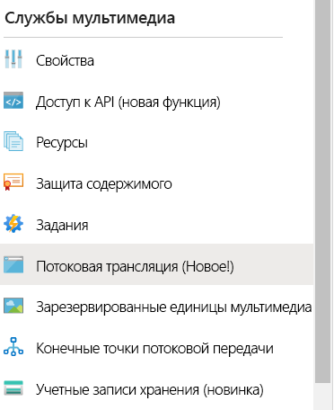
1. Выберите **Добавить трансляцию**, чтобы создать событие потоковой трансляции.

   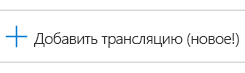
1. Введите имя нового события, например *TestLiveEvent*, в поле **Имя трансляции**.

   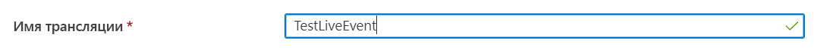
1. Введите необязательное описание события в поле **Описание**.
1. Выберите вариант **Сквозной режим — без кодирования в облаке**.

   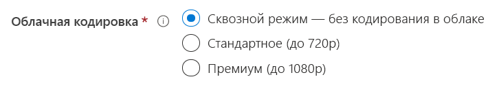
1. Выберите вариант **RTMP**.
1. Чтобы избежать оплаты за трансляцию до того, как она будет готова, установите значение **Нет** для параметра **Начать прямую трансляцию**. (Начисление оплаты начнется после запуска трансляции.)

   
1. Нажмите кнопку **Просмотр и создание**, чтобы проверить параметры.
1. Нажмите кнопку **Создать**, чтобы создать трансляцию. Вы вернетесь к представлению списка трансляций.
1. Щелкните ссылку на только что созданную трансляцию. Обратите внимание, что событие остановлено.
1. Не закрывайте эту страницу в браузере. Мы вернемся к нему позже.

## Настройка прямой трансляции с помощью Wirecast Studio

1. В главном меню приложения Wirecast выберите **Create Empty Document** (Создать пустой документ), а затем щелкните **Continue** (Продолжить).

   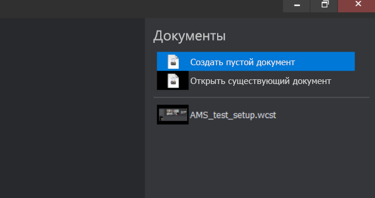
1. Наведите указатель мыши на первый слой в области **Wirecast layers** (Слои Wirecast).  Щелкните появившийся значок **Add** (Добавить) и выберите входные видеоданные, которые вы намерены транслировать.

   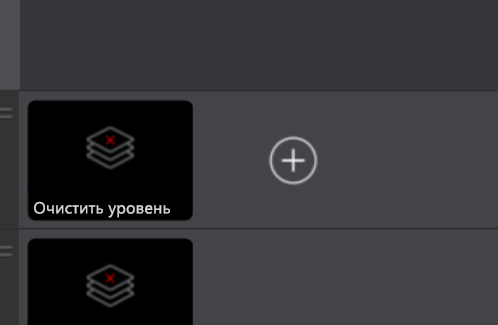

   Откроется диалоговое окно **Master Layer 1** (Главный слой 1).
1. В меню выберите **Video capture** (Запись видео), а затем выберите нужную камеру.

   

   В области предварительного просмотра появится изображение с камеры.
1. Наведите указатель мыши на второй слой в области **Wirecast layers** (Слои Wirecast). Щелкните появившийся значок **Add** (Добавить) и выберите входные аудиоданные, которые вы намерены транслировать. Откроется диалоговое окно **Master Layer 2** (Главный слой 2).
1. В меню выберите **Audio capture** (Запись звука), а затем выберите нужный аудиовход.

   
1. В главном меню выберите **Output settings** (Параметры вывода). Откроется диалоговое окно **Select an Output Destination** (Выбор назначения для вывода).
1. Выберите **Azure Media Services** (Службы мультимедиа Azure) из раскрывающегося списка **Destination** (Назначение). При выборе Служб мультимедиа Azure автоматически заполнятся *большинство* параметров вывода.

   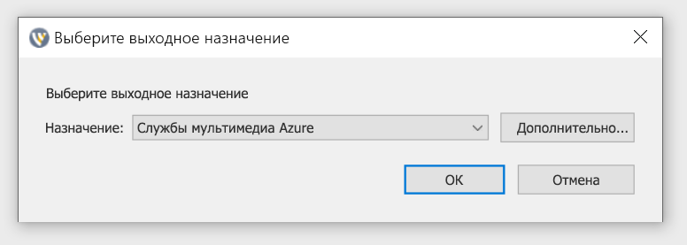

В следующей процедуре вы вернетесь к Службам мультимедиа Azure в браузере, чтобы скопировать входной URL-адрес и вставить его в раздел параметров вывода.

1. На странице Служб мультимедиа Azure на портале щелкните **Запуск**, чтобы запустить прямую трансляцию. (С этого момента начинается тарификация.)

   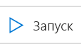
2. Переведите переключатель **Безопасно/Небезопасно** в положение **Небезопасно**. После этого будет выбран протокол RTMP вместо RTMPS.
3. В поле **URL-адрес ввода** скопируйте URL-адрес в буфер обмена.

   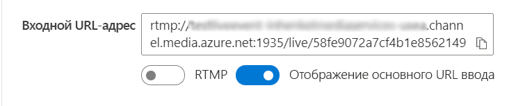
4. Перейдите в приложение Wirecast и вставьте **URL-адрес ввода** в поле **Address** (Адрес) в параметрах вывода.

   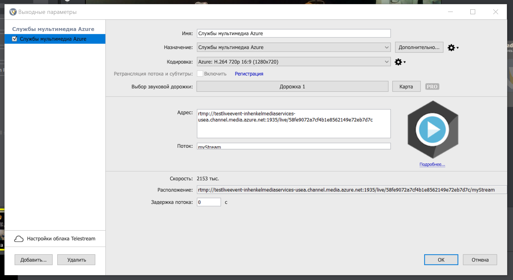
5. Щелкните **ОК**.

## Настройка выходных потоков

В этой части рассказывается о том, как настроить выводы и обеспечить возможность сохранения записи прямой трансляции.  

> [!NOTE]
> Для выполнения потоковой передачи этих выходных потоков должна быть активна конечная точка потоковой передачи. Подробные сведения см. далее в разделе [Активация конечной точки потоковой передачи по умолчанию](#run-the-default-streaming-endpoint).

1. Щелкните ссылку **Create Outputs** (Создать выходной поток) под средством просмотра видео **Outputs** (Выходные потоки).
1. При необходимости измените имя выходного потока в поле **Name** (Имя) на понятное пользователю, чтобы его можно было легко найти позже.
   
   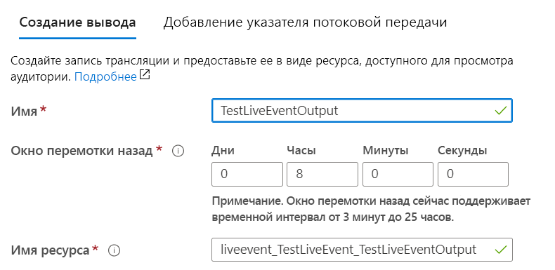
1. Остальные поля пока оставьте без изменений.
1. Затем щелкните **Next** (Далее), чтобы добавить указатель потоковой передачи.
1. Присвойте этому указателю более понятное имя, если хотите.
   
   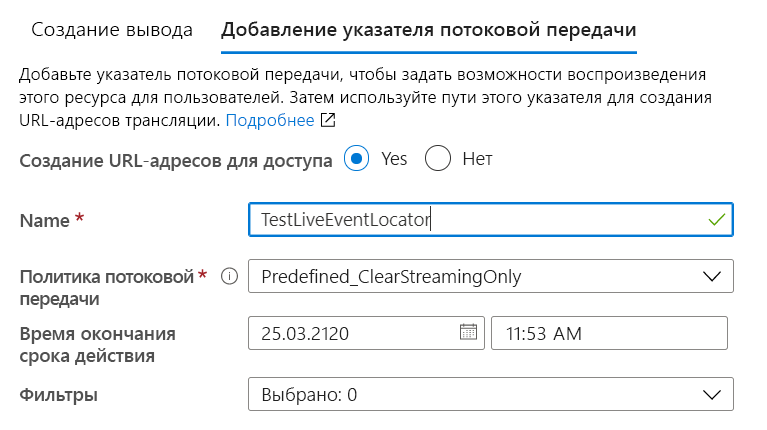
1. Все остальное на этом экране оставьте пока без изменений.
1. Нажмите кнопку **создания**.

## Запуск трансляции

1. В главном меню Wirecast выберите **Output** > **Start / Stop broadcasting** > **Start Azure Media Services: Azure Media Services** (Вывод > Начало/окончание трансляции > Запуск Служб мультимедиа Azure: Службы мультимедиа Azure).

   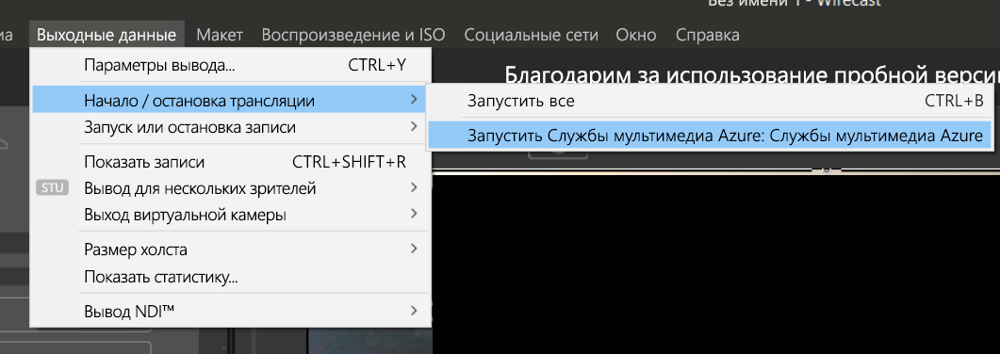

   При отправке потока для трансляции в видеопроигрывателе в Wirecast на странице трансляции в Службах мультимедиа Azure отображается окно **Live** (Трансляция).

1. Нажмите кнопку **Go** (Перейти) в окне предварительного просмотра, чтобы начать транслировать видео и звук, выбранные для слоев Wirecast.

   

   > [!TIP]
   > Если произойдет ошибка, попробуйте перезагрузить проигрыватель, щелкнув ссылку **Reload player** (Перезагрузить проигрыватель) над проигрывателем.

## Активация стандартной конечной точки потоковой передачи

1. В Службах мультимедиа выберите **Конечные точки потоковой передачи** в списке.

   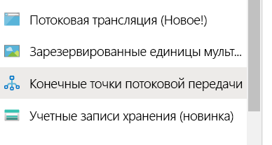
1. Если стандартная конечная точка потоковой передачи находится в состоянии "Остановлена", выберите ее. После этого откроется страница конечной точки.
1. Щелкните **Запуск**.
   
   

## Воспроизведение транслируемых выходных потоков с помощью Проигрывателя мультимедиа Azure

1. Скопируйте URL-адрес потоковой передачи в разделе **Output** (Вывод) для видеопроигрывателя.
1. В веб-браузере откройте [демонстрационную страницу Проигрывателя мультимедиа Azure](https://ampdemo.azureedge.net/azuremediaplayer.html).
1. Вставьте URL-адрес потоковой передачи в поле **URL-адрес** Проигрывателя мультимедиа Azure.
1. Нажмите кнопку **Update Player** (Обновить проигрыватель).
1. Щелкните значок **воспроизведения** на видео, чтобы открыть прямую трансляцию.

## Остановка трансляции

Завершив трансляцию нужного содержимого, остановите ее.

1. В Wirecast нажмите кнопку **Broadcast** (Транслировать). После этого прекратится трансляция из Wirecast.
1. На портале щелкните **Остановить**. Вы получите предупреждающее сообщение о том, что прямая трансляция будет остановлена, а файл с выходными данными будет доступен по запросу.
1. Щелкните **Остановить** в этом предупреждающем сообщении. Кроме того, в Проигрывателе мультимедиа Azure отобразится сообщение об ошибке, так как прямая трансляция станет недоступна.

## Воспроизведение выходного потока по запросу с помощью Проигрывателя мультимедиа Azure

Созданные ранее выходные данные теперь будут доступны для потокового воспроизведения по запросу, пока активна соответствующая конечная точка потоковой передачи.

1. Перейдите к списку Служб мультимедиа и выберите **Assets** (Файлы).
1. Найдите созданные ранее выходные данные события и щелкните ссылку на файл. Откроется страница вывода файла.
1. Скопируйте URL-адрес потоковой передачи под видеопроигрывателем для файла.
1. Снова откройте Проигрыватель мультимедиа Azure в браузере и вставьте URL-адрес потоковой передачи в соответствующее поле.
1. Выберите **Update Player** (Обновить проигрыватель).
1. Щелкните значок **воспроизведения** на видео, чтобы просмотреть файл по запросу.

## Очистка ресурсов

> [!IMPORTANT]
> Остановите службы! Выполнив шаги, описанные в этом кратком руководстве, обязательно остановите трансляцию и конечную точку потоковой передачи, чтобы не пришлось оплачивать бесполезное время их работы. Сведения о том, как остановить трансляцию, см. в разделе [Остановка трансляции](#stop-the-broadcast) (шаги 2 и 3).

Чтобы остановить конечную точку потоковой передачи, сделайте следующее:

1. В списке служб мультимедиа выберите **Streaming endpoints** (Конечные точки потоковой передачи).
2. Щелкните активированную ранее стандартную конечную точку потоковой передачи. Откроется страница этой конечной точки.
3. Выберите **Остановить**.

> [!TIP]
> Если вы не хотите хранить файлы этой трансляции, не забудьте их удалить, чтобы не оплачивать занятое ими место в хранилище.

## Дальнейшие действия
> [!div class="nextstepaction"]
> [События и выходные данные прямой трансляции в Службах мультимедиа](./live-events-outputs-concept.md)
