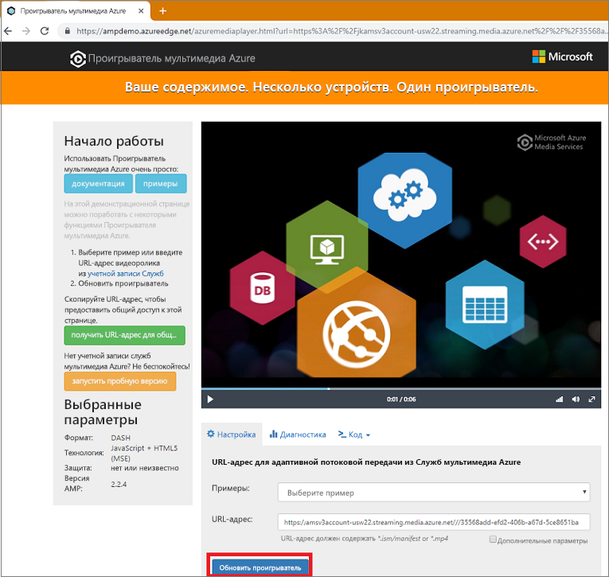

# <a name="quickstart-stream-video-files---nodejs"></a>Краткое руководство. Потоковая передача видеофайлов с помощью Node.js

Это краткое руководство показывает, как можно легко кодировать и начинать потоковую передачу видео в разных браузерах и на разных устройствах с помощью Служб мультимедиа Azure. Содержимое входных данных можно указывать с помощью URL-адресов протоколов HTTP, URL-адресов SAS или путей к файлам, находящимся в хранилище BLOB-объектов Azure.
Пример в этой статье предназначен для кодирования содержимого, которое доступно через URL-адрес HTTPS. Обратите внимание, что в настоящее время AMS версии 3 не поддерживает кодирование блочной передачи по URL-адресам HTTPS.

Изучив это краткое руководство, вы сможете выполнить потоковую передачу видео.  



[!INCLUDE [quickstarts-free-trial-note](../../../includes/quickstarts-free-trial-note.md)]

## <a name="prerequisites"></a>Предварительные требования

- Установите [Node.js](https://nodejs.org/en/download/)
- [Создание учетной записи Служб мультимедиа](create-account-cli-how-to.md).<br/>Запишите значения, которые вы использовали в качестве имени группы ресурсов и имени учетной записи Служб мультимедиа.
- Выполните действия, описанные в статье [Доступ к API Служб мультимедиа Azure с помощью Azure CLI](access-api-cli-how-to.md), и сохраните учетные данные. Эти данные понадобятся для доступа к API.

## <a name="download-and-configure-the-sample"></a>Скачивание и настройка примера

Клонируйте репозиторий GitHub, содержащий пример потоковой передачи данных Node.js, на компьютер с помощью следующей команды:  

 ```bash
 git clone https://github.com/Azure-Samples/media-services-v3-node-tutorials.git
 ```

Этот пример находится в папке [StreamFilesSample](https://github.com/Azure-Samples/media-services-v3-node-tutorials/tree/master/AMSv3Samples/StreamFilesSample).

Откройте файл [index.js](https://github.com/Azure-Samples/media-services-v3-node-tutorials/blob/master/AMSv3Samples/StreamFilesSample/index.js#L25) в скачанном проекте. Замените значения `endpoint config` учетными данными, которые вы получили, выполнив действия из руководства по [получению доступа к API](access-api-cli-how-to.md).

Этот пример выполняет следующие действия:

1. Создает **преобразование** (сначала проверяет, существует ли указанное преобразование). 
2. Создает выходной **ресурс**, который используется в качестве выходных данных **задания** кодирования.
3. Создает входные данные для **задания**, основанные на URL-адресе HTTPS.
4. Отправляет **задание** кодирования с использованием входных и выходных данных, созданных ранее.
5. проверка состояния задания;
6. Создает **указатель потоковой передачи**.
7. компиляция URL-адресов потоковой передачи.

## <a name="run-the-sample-app"></a>Запуск примера приложения

1. Это приложение скачивает закодированные файлы. Создайте папку для выходных файлов и измените значение переменной **outputFolder** в файле [index.js](https://github.com/Azure-Samples/media-services-v3-node-tutorials/blob/master/AMSv3Samples/StreamFilesSample/index.js#L39).
1. Откройте **командную строку**, перейдите в каталог с примером и выполните следующие команды.

    ```
    npm install 
    node index.js
    ```

Вы должны увидеть примерно такой результат:


## <a name="test-with-azure-media-player"></a>Тестирование с помощью Проигрывателя мультимедиа Azure

Для тестирования потоковой передачи в этой статье используется Проигрыватель мультимедиа Azure. 

> [!NOTE]
> Если проигрыватель размещен на сайте HTTPS, обновите URL-адрес до HTTPS.

1. Откройте браузер и перейдите по ссылке [https://aka.ms/azuremediaplayer/](https://aka.ms/azuremediaplayer/).
2. В поле **URL:** (URL-адрес:) вставьте одно из значений URL-адресов потоковой передачи, полученных при работе приложения. 
 
     URL-адрес можно указать в формате HLS, Dash или Smooth, а Проигрыватель мультимедиа Azure автоматически выберет соответствующий протокол потоковой передачи для воспроизведения на устройстве.
3. Щелкните **Update Player** (Обновить проигрыватель).

Проигрыватель мультимедиа Azure можно использовать для тестирования, но его нельзя применять в рабочей среде. 

## <a name="clean-up-resources"></a>Очистка ресурсов

Если вам больше не нужны ресурсы в группе ресурсов, включая Службы мультимедиа и учетные записи хранения, созданные в рамках этого краткого руководства, удалите группу ресурсов.

Выполните следующую команду CLI:

```azurecli
az group delete --name amsResourceGroup
```

## <a name="see-also"></a>См. также

[Коды ошибок задания](https://docs.microsoft.com/rest/api/media/jobs/get#joberrorcode).

## <a name="next-steps"></a>Дополнительная информация

> [!div class="nextstepaction"]
> [Основные понятия служб мультимедиа Azure](concepts-overview.md)
