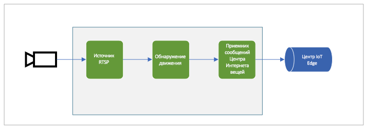

# Анализ динамического видео без записи

## Рекомендуемые материалы для предварительного ознакомления 

* [Понятие графа мультимедиа](media-graph-concept.md)
* [Запись видео на основе событий](event-based-video-recording-concept.md)

## Обзор  

Вы можете использовать граф мультимедиа для анализа видео в реальном времени без записи каких-либо частей видео в файл или ресурс. Показанные ниже графы мультимедиа аналогичны тем, которые описаны в статье о [записи видео на основе событий](event-based-video-recording-concept.md), но без узла приемника ресурса или узла приемника файла.

### Обнаружение движения

Показанный ниже граф мультимедиа состоит из узла [источника данных RTSP](media-graph-concept.md#rtsp-source) , узла [процессора для обнаружения движения](media-graph-concept.md#motion-detection-processor) и узла [приемника сообщений центра Интернета вещей](media-graph-concept.md#iot-hub-message-sink) . Представление JSON топологии графа такого графа мультимедиа можно найти [здесь](https://github.com/Azure/live-video-analytics/blob/master/MediaGraph/topologies/motion-detection/topology.json). Эта диаграмма позволяет обнаруживать движение во входящем потоке живого видео и передавать события движения в другие приложения и службы через узел приемника сообщений центра Интернета вещей. Внешние приложения или службы могут активировать оповещение или отправить уведомление соответствующим сотрудникам.

### Анализ видео с помощью пользовательской модели представления 

Показанный ниже граф мультимедиа позволяет анализировать поток динамического видео с помощью пользовательской модели представления, упакованной в отдельный модуль. Представление JSON топологии графа такого графа мультимедиа можно найти [здесь](https://github.com/Azure/live-video-analytics/blob/master/MediaGraph/topologies/httpExtension/topology.json). Некоторые примеры можно увидеть в [статье](https://github.com/Azure/live-video-analytics/tree/master/utilities/video-analysis) о переносе моделей в IOT Edge модули, которые выполняются в качестве службы вывода.

В этом графе мультимедиа узел обработчика фильтра кадров понижает частоту кадров входящего потока видео перед его отправкой в узел [обработчика расширений HTTP](media-graph-concept.md#http-extension-processor) , который отправляет кадры изображения (в форматах JPEG, BMP или PNG) во внешнюю службу вывода. Результаты внешней службы вывода извлекаются узлом расширения HTTP и ретранслируются в центр IoT Edge через узел приемника сообщений центра Интернета вещей. Этот тип графа мультимедиа можно использовать для создания решений для различных сценариев, например для понимания распределения временных рядов транспортных средств на пересечении, понимания шаблона трафика потребителя в розничном магазине и т. д.

Усовершенствованием этого примера является использование процессора детектора движения перед узлом обработчика фильтра частоты кадров. Это снизит нагрузку на службу вывода, так как она используется только при наличии в видео действий перемещения.

## Дальнейшие шаги

[Непрерывная запись видео](continuous-video-recording-concept.md)
