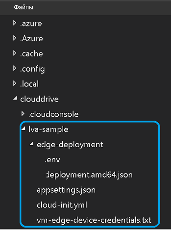
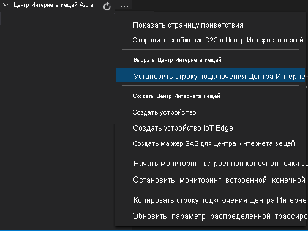
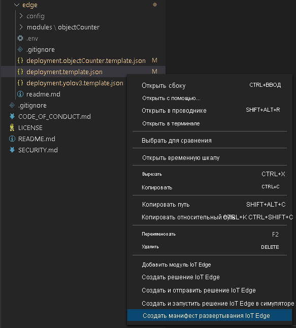
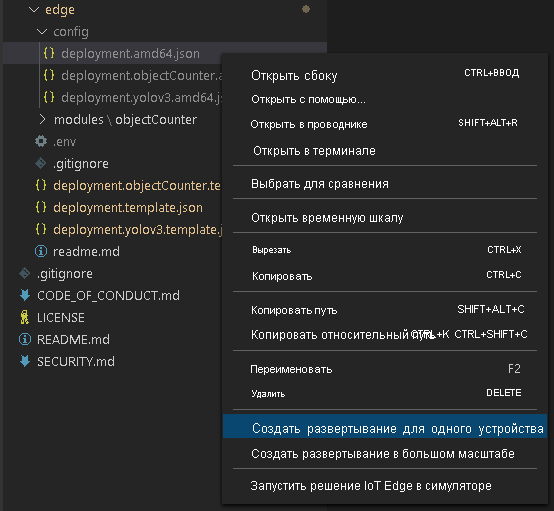

# <a name="tutorial-continuous-video-recording-to-the-cloud-and-playback-from-the-cloud"></a>Руководство по Непрерывная запись видео в облако и его воспроизведение

Из этого руководства мы узнаем, как с помощью службы Аналитики видеотрансляций в Azure IoT Edge осуществлять [непрерывную запись видео](continuous-video-recording-concept.md) в облако и транслировать произвольные фрагменты этого видео в режиме потоковой передачи с помощью Служб мультимедиа. Эта возможность полезна в сценариях безопасности и соответствия требованиям, когда требуется хранить архивные материалы с камеры в течение нескольких дней или недель. 

Изучив данный учебник, вы научитесь:

> [!div class="checklist"]
> * Настроите необходимые ресурсы.
> * Проверять код, который выполняет непрерывную запись видео
> * Запустите пример кода.
> * Проверите результаты и просмотрите видео.

[!INCLUDE [quickstarts-free-trial-note](../../../includes/quickstarts-free-trial-note.md)]

## <a name="suggested-pre-reading"></a>Рекомендуемые материалы для предварительного ознакомления  

Перед началом ознакомьтесь со следующими статьями:

* [Аналитика видеотрансляций в IoT Edge: обзор](overview.md)
* [Аналитика видеотрансляции в IoT Edge: терминология](terminology.md)
* [Граф мультимедиа: основные понятия](media-graph-concept.md) 
* [Сценарии непрерывной записи видео](continuous-video-recording-concept.md)

## <a name="prerequisites"></a>Предварительные требования

Обязательные компоненты для работы с этим руководством:

* [Visual Studio Code](https://code.visualstudio.com/) на компьютере для разработки с расширениями [Azure IoT Tools](https://marketplace.visualstudio.com/items?itemName=vsciot-vscode.azure-iot-tools) и [C#](https://marketplace.visualstudio.com/items?itemName=ms-dotnettools.csharp).

    > [!TIP]
    > Может появиться запрос на установку Docker. Проигнорируйте его.
* Установите [SDK .NET Core 3.1](https://dotnet.microsoft.com/download/dotnet-core/thank-you/sdk-3.1.201-windows-x64-installer) на компьютере, на котором ведется разработка.
* Выполните [скрипт подготовки ресурсов аналитики видеотрансляции](https://github.com/Azure/live-video-analytics/tree/master/edge/setup).

После выполнения этой процедуры вы получите соответствующие ресурсы Azure, доступные в вашей подписке Azure:

* Центр Интернета вещей Azure
* Учетная запись хранения Azure
* Учетная запись Служб мультимедиа Azure
* Виртуальная машина Linux в Azure с установленной [средой выполнения IoT Edge](../../iot-edge/how-to-install-iot-edge-linux.md)

## <a name="concepts"></a>Основные понятия

Как описано в статье о [концепции графа мультимедиа](media-graph-concept.md), граф мультимедиа позволяет определить:

- Откуда следует записывать мультимедиа.
- Как следует его обрабатывать.
- Куда следует доставлять результаты. 
 
 Процесс непрерывной записи видео заключается в захвате видео с камеры с поддержкой протокола RTSP и его непрерывной записи в [ресурс Служб мультимедиа Azure](terminology.md#asset). На схеме представлено изображение графа мультимедиа.

> [!div class="mx-imgBorder"]
> :::image type="content" source="./media/continuous-video-recording-tutorial/continuous-video-recording-overview.svg" alt-text="Граф мультимедиа":::

В этом руководстве для эмуляции RTSP-камеры мы будем использовать модуль Edge, созданный с помощью [мультимедийного сервера Live555](https://github.com/Azure/live-video-analytics/tree/master/utilities/rtspsim-live555). В графе мультимедиа мы используем узел [источника RTSP](media-graph-concept.md#rtsp-source) для приема трансляции из канала и отправляем полученное видео на [узел приемника](media-graph-concept.md#asset-sink), который записывает его в актив.

## <a name="set-up-your-development-environment"></a>Настройка среды разработки

Прежде чем приступать к работе, убедитесь, что вы выполнили 3-й пункт из раздела [Предварительные требования](#prerequisites). После того, как скрипт подготовки ресурсов завершит свою работу, выберите фигурные скобки, чтобы раскрыть структуру папок. В каталоге ~/clouddrive/lva-sample будет создано несколько файлов.



В этом руководстве нас интересуют нижеперечисленные файлы:

* **~/clouddrive/lva-sample/edge-deployment/.env**: Содержит свойства, которые Visual Studio Code использует для развертывания модулей на пограничном устройстве.
* **~/clouddrive/lva-sample/appsettings.json**: Используется Visual Studio Code для запуска примера кода.

Для выполнения этих действий потребуются файлы.

1. Клонируйте репозиторий из ссылки GitHub https://github.com/Azure-Samples/live-video-analytics-iot-edge-csharp.
1. Запустите Visual Studio Code и откройте папку, в которую загружен репозиторий.
1. В Visual Studio Code перейдите в папку src/cloud-to-device-console-app и создайте файл **appsettings.json**. Этот файл содержит параметры, необходимые для выполнения программы.
1. Скопируйте содержимое файла ~/clouddrive/lva-sample/appsettings.json. Текст должен выглядеть так:
    ```
    {  
        "IoThubConnectionString" : "HostName=xxx.azure-devices.net;SharedAccessKeyName=iothubowner;SharedAccessKey=XXX",  
        "deviceId" : "lva-sample-device",  
        "moduleId" : "lvaEdge"  
    }
    ```
    Строка подключения к Центру Интернета вещей позволяет использовать Visual Studio Code для отправки команд модулям Edge через Центр Интернета вещей Azure.
    
1. Затем перейдите в папку src/edge и создайте файл с именем **.env**.
1. Скопируйте содержимое файла ~/clouddrive/lva-sample/.env. Текст должен выглядеть так:

    ```
    SUBSCRIPTION_ID="<Subscription ID>"  
    RESOURCE_GROUP="<Resource Group>"  
    AMS_ACCOUNT="<AMS Account ID>"  
    IOTHUB_CONNECTION_STRING="HostName=xxx.azure-devices.net;SharedAccessKeyName=iothubowner;SharedAccessKey=xxx"  
    AAD_TENANT_ID="<AAD Tenant ID>"  
    AAD_SERVICE_PRINCIPAL_ID="<AAD SERVICE_PRINCIPAL ID>"  
    AAD_SERVICE_PRINCIPAL_SECRET="<AAD SERVICE_PRINCIPAL ID>"  
    INPUT_VIDEO_FOLDER_ON_DEVICE="/home/lvaadmin/samples/input"  
    OUTPUT_VIDEO_FOLDER_ON_DEVICE="/home/lvaadmin/samples/output"  
    APPDATA_FOLDER_ON_DEVICE="/var/local/mediaservices"
    CONTAINER_REGISTRY_USERNAME_myacr="<your container registry username>"  
    CONTAINER_REGISTRY_PASSWORD_myacr="<your container registry username>"      
    ```

## <a name="examine-the-sample-files"></a>Изучение примеров файлов

Откройте в Visual Studio Code файл src/edge/deployment.template.json. Этот шаблон определяет, какие модули Edge мы будем развертывать на пограничном устройстве (виртуальной машине Azure Linux). В разделе **modules** есть две записи со следующими названиями:

* **lvaEdge**: Это модуль аналитики видеотрансляции в IoT Edge.
* **rtspsim**: Это симулятор RTSP.

Теперь перейдите в папку src/cloud-to-device-console-app. Здесь мы найдем файл appsettings.json, который вы создали, и еще несколько файлов:

* **c2d-console-app.csproj**: Файл проекта для Visual Studio Code.
* **operations.json**: Это файл со списком различных операций, которые будут выполняться.
* **Program.cs**: Пример программного кода, который:
    * загружает параметры приложения;
    * вызывает прямые методы, представляемые модулем Аналитики видеотрансляции в IoT Edge (с помощью модуля можно анализировать потоки видеотрансляции, вызывая его [прямые методы](direct-methods.md));
    * приостанавливает выполнение, позволяя вам проанализировать выходные данные программы в окне **ТЕРМИНАЛ** и сгенерированные модулем события в окне **ВЫХОДНЫЕ ДАННЫЕ**;
    * вызывает прямые методы для очистки ресурсов.

## <a name="generate-and-deploy-the-iot-edge-deployment-manifest"></a>Создание и развертывание манифеста развертывания IoT Edge 

Манифест развертывания определяет, какие именно модули развертываются на пограничном устройстве, а также содержит параметры конфигурации для этих модулей. Выполните перечисленные ниже действия, чтобы создать манифест на базе файла шаблона, а затем развернуть его на пограничном устройстве.

1. Запустите Visual Studio Code.
1. Задайте строку подключения к Центру Интернета вещей, щелкнув значок **Дополнительные действия** рядом с областью **ЦЕНТР ИНТЕРНЕТА ВЕЩЕЙ AZURE** в левом нижнем углу. Строку подключения можно скопировать из файла src/cloud-to-device-console-app/appsettings.json. 

    
1. Щелкните правой кнопкой мыши файл src/edge/deployment.template.json и выберите **Generate IoT Edge Deployment Manifest** (Создать манифест развертывания IoT Edge). Visual Studio Code заменяет переменные в шаблоне развертывания значениями из файла .env. Это действие создает файл манифеста с именем **deployment.amd64.json** в папке src/edge/config.

   
1. Щелкните правой кнопкой мыши файл src/edge/config/deployment.amd64.json и выберите пункт **Создать развертывание для отдельного устройства**.

   
1. После этого вам будет предложено **Выбрать устройство Центра Интернета вещей**. Выберите устройство lva-sample-device из раскрывающегося списка.
1. В течение примерно 30 секунд обновите центр Интернета вещей Azure в левом нижнем углу. Вы увидите, что на пограничном устройстве развернуты следующие модули:
    * Аналитика видеотрансляции в IoT Edge (модуль **lvaEdge**)
    * Симулятор RTSP (модуль **rtspsim**)
 
    

## <a name="prepare-to-monitor-the-modules"></a>Подготовка к мониторингу модулей 

Во время записи потоковой видеотрансляции с помощью модуля аналитики видеотрансляции в IoT Edge в Центр Интернета вещей отправляются события. Чтобы просмотреть эти события, выполните указанные ниже действия.

1. Откройте область обозревателя в Visual Studio Code и найдите **Центр Интернета вещей Azure** в левом нижнем углу.
1. Разверните узел **Devices** (Устройства).
1. Щелкните правой кнопкой мыши на файл lva-sample-device и выберите **Start Monitoring Built-in Event Endpoint** (Запуск мониторинга встроенной конечной точки события).

    

## <a name="run-the-program"></a>Запуск программы 

1. В Visual Studio Code откройте вкладку **Расширения** (или нажмите клавиши CTRL+SHIFT+X) и найдите центр Интернета вещей Azure.
1. Щелкните правой кнопкой мыши и выберите **Параметры расширения**.

    > [!div class="mx-imgBorder"]
    > :::image type="content" source="./media/run-program/extensions-tab.png" alt-text="Граф мультимедиа" (Показывать подробное сообщение).

    > [!div class="mx-imgBorder"]
    > :::image type="content" source="./media/run-program/show-verbose-message.png" alt-text="Граф мультимедиа"
           }
         ]
       }
     }
     ```
   * Вызов GraphInstanceActivate для запуска экземпляра графа и видеопотока
   * Второй вызов GraphInstanceList должен указывать, что экземпляр графа находится в состоянии выполнения 
1. Вывод данных в окне **ТЕРМИНАЛ** будет приостановлен с предложением **Нажать клавишу ВВОД для продолжения**. Не нажимайте **ВВОД** на этом этапе. Прокрутите экран вверх, чтобы увидеть полезные данные ответов JSON на вызванные нами прямые методы.
1. Если теперь переключиться в окно **ВЫХОДНЫЕ ДАННЫЕ** в Visual Studio Code, вы увидите сообщения, отправляемые в Центр Интернета вещей модулем Аналитики видеотрансляции в IoT Edge.

   Эти сообщения рассматриваются в следующем разделе.
1. Экземпляр графы продолжит работу и запись видео. Симулятор RTSP будет продолжать циклический перебор исходного видео. Чтобы остановить запись, вернитесь в окно **ТЕРМИНАЛ** и нажмите клавишу **ВВОД**. Следующая серия вызовов производится для очистки ресурсов используя:

   * Вызов GraphInstanceDeactivate для деактивации экземпляра графа.
   * Вызов GraphInstanceDelete для удаления экземпляра.
   * Вызов GraphTopologyDelete для удаления топологии.
   * Окончательный вызов GraphTopologyList, чтобы продемонстрировать, что список пуст.

## <a name="interpret-the-results"></a>Интерпретация результатов 

После запуска графа мультимедиа модуль аналитики видеотрансляции в IoT Edge отправляет в концентратор IoT Edge определенные диагностические и операционные события. Эти события являются сообщениями, отображаемыми в окне **ВЫХОДНЫЕ ДАННЫЕ** Visual Studio Code. Они содержат разделы body и applicationProperties. Сведения о назначении этих разделов см. в статье [Создание и чтение сообщений Центра Интернета вещей](../../iot-hub/iot-hub-devguide-messages-construct.md).

В приведенных сообщениях свойства приложений и содержимое раздела body определяются модулем Аналитики видеотрансляции.

## <a name="diagnostics-events"></a>События диагностики 

### <a name="mediasession-established-event"></a>Событие MediaSession Established

После активации экземпляра графа узел источника RTSP пытается подключиться к серверу TRSP, работающему в модуле rtspsim. В случае успеха это событие выводится на печать.

```
[IoTHubMonitor] [9:42:18 AM] Message received from [lvaedgesample/lvaEdge]:
{
  "body": {
    "sdp": "SDP:\nv=0\r\no=- 1586450538111534 1 IN IP4 XXX.XX.XX.XX\r\ns=Matroska video+audio+(optional)subtitles, streamed by the LIVE555 Media Server\r\ni=media/camera-300s.mkv\r\nt=0 0\r\na=tool:LIVE555 Streaming Media v2020.03.06\r\na=type:broadcast\r\na=control:*\r\na=range:npt=0-300.000\r\na=x-qt-text-nam:Matroska video+audio+(optional)subtitles, streamed by the LIVE555 Media Server\r\na=x-qt-text-inf:media/camera-300s.mkv\r\nm=video 0 RTP/AVP 96\r\nc=IN IP4 0.0.0.0\r\nb=AS:500\r\na=rtpmap:96 H264/90000\r\na=fmtp:96 packetization-mode=1;profile-level-id=4D0029;sprop-parameter-sets=XXXXXXXXXXXXXXXXXXXXXX\r\na=control:track1\r\n"
  },
  "applicationProperties": {
    "dataVersion": "1.0",
    "topic": "/subscriptions/{subscriptionID}/resourceGroups/{name}/providers/microsoft.media/mediaservices/hubname",
    "subject": "/graphInstances/Sample-Graph-1/sources/rtspSource",
    "eventType": "Microsoft.Media.MediaGraph.Diagnostics.MediaSessionEstablished",
    "eventTime": "2020-04-09T09:42:18.1280000Z"
  }
}
```

* Сообщение является Событием диагностики (MediaSessionEstablished). Он указывает, что исходный узел RTSP (субъект) установил подключение к симулятору RTSP и начал получать (имитировать) динамический канал.
* Раздел субъекта в разделе свойств приложения applicationProperties обозначает узел в топологии графа, сгенерировавший сообщение. В этом случае сообщение исходит от узла источника RTSP.
* Раздел eventType в applicationProperties указывает, что событие является диагностическим.
* Раздел eventTime указывает время события.
* Раздел body содержит информацию о диагностическом событии: в этом случае это данные [SDP](https://en.wikipedia.org/wiki/Session_Description_Protocol).

## <a name="operational-events"></a>Операционные события 

### <a name="recordingstarted-event"></a>Событие RecordingStarted

Когда узел приемника ресурса начинает записывать видео, он генерирует событие типа Microsoft.Media.Graph.Operational.RecordingStarted.

```
[IoTHubMonitor] [9:42:38 AM] Message received from [lva-sample-device/lvaEdge]:
{
  "body": {
    "outputType": "assetName",
    "outputLocation": "sampleAsset-CVRToAMSAsset-Sample-Graph-1"
  },
  "applicationProperties": {
    "topic": "/subscriptions/{subscriptionID}/resourceGroups/{resource-group-name}/providers/microsoft.media/mediaservices/{ams-account-name}",
    "subject": "/graphInstances/Sample-Graph-1/sinks/assetSink",
    "eventType": "Microsoft.Media.Graph.Operational.RecordingStarted",
    "eventTime": "2020-04-09T09:42:38.1280000Z",
    "dataVersion": "1.0"
  }
}
```

Раздел subject в разделе свойств приложения applicationProperties обозначает узел приемника ресурса в графе, сгенерировавший это сообщение.

В разделе body содержатся сведения о расположении выходных данных. В этом случае, видео записывается в имя ресурса служб мультимедиа Azure. Запишите это значение.

### <a name="recordingavailable-event"></a>Событие RecordingAvailable

Когда начинается запись видео, отправляется событие RecordingStarted, однако при этом видеоданные могут быть еще не загружены в ресурс. После того как узел приемника ресурса загружает видеоданные в ресурс, он генерирует событие типа Microsoft.Media.Graph.Operational.RecordingAvailable.

```
[IoTHubMonitor] [[9:43:38 AM] Message received from [lva-sample-device/lvaEdge]:
{
  "body": {
    "outputType": "assetName",
    "outputLocation": "sampleAsset-CVRToAMSAsset-Sample-Graph-1"
  },
  "applicationProperties": {
    "topic": "/subscriptions/{subscriptionID}/resourceGroups/{resource-group-name}/providers/microsoft.media/mediaservices/{ams-account-name}",
    "subject": "/graphInstances/Sample-Graph-1/sinks/assetSink",
    "eventType": "Microsoft.Media.Graph.Operational.RecordingAvailable",
    "eventTime": "2020-04-09T09:43:38.1280000Z",
    "dataVersion": "1.0"
  }
}
```

Это событие означает, что в ресурс записано уже достаточно данных для того, чтобы на проигрывателях или клиентах можно было начать воспроизведение видео.

Раздел subject в разделе свойств приложения applicationProperties определяет узел AssetSink в графе, сгенерировавший это сообщение.

В разделе body содержатся сведения о расположении выходных данных. В этом случае, видео записывается в имя ресурса служб мультимедиа Azure.

### <a name="recordingstopped-event"></a>Событие RecordingStopped

При деактивации экземпляра графа узел приемника ресурса останавливает запись видео в ресурс. Он выдает событие типа Microsoft.Media.Graph.Operational.RecordingStopped:

```
[IoTHubMonitor] [11:33:31 PM] Message received from [lva-sample-device/lvaEdge]:
{
  "body": {
    "outputType": "assetName",
    "outputLocation": "sampleAsset-CVRToAMSAsset-Sample-Graph-1"
  },
  "applicationProperties": {
    "topic": "/subscriptions/{subscriptionID}/resourceGroups/{resource-group-name}/providers/microsoft.media/mediaservices/{ams-account-name}",
    "subject": "/graphInstances/Sample-Graph-1/sinks/assetSink",
    "eventType": "Microsoft.Media.Graph.Operational.RecordingStopped",
    "eventTime": "2020-04-10T11:33:31.051Z",
    "dataVersion": "1.0"
  }
}
```

Это событие означает, что запись прекращена.

Раздел subject в разделе свойств приложения applicationProperties определяет узел AssetSink в графе, сгенерировавший это сообщение.

Раздел body содержит сведения о месте вывода данных: в нашем случае это название ресурса Службы мультимедиа Azure, в который осуществляется запись видео.

## <a name="media-services-asset"></a>Актив Служб мультимедиа  

Чтобы проверить ресурс Служб мультимедиа, созданный графом мультимедиа, войдите на портал Azure и просмотрите видео.

1. В браузере откройте [портал Azure](https://portal.azure.com/). Введите свои учетные данные для входа на портал. Панель мониторинга службы является представлением по умолчанию.
1. Найдите свою учетную запись Служб мультимедиа среди ресурсов в составе вашей подписки и откройте ее панель.
1. Выберите **ресурсы** в списке **Служб мультимедиа**.

    
1. В списке вы найдете ресурс с именем sampleAsset-CVRToAMSAsset-Sample-Graph-1. Это шаблон именования, выбранный в файле топологии графа.
1. Выберите ресурс.
1. На странице подробных сведений о ресурсе выберите команду **Создать** под текстовым полем **URL-адрес потоковой передачи**.

    

1. В открывшемся мастере примите параметры по умолчанию и выберите **Добавить**. Дополнительные сведения см. в статье о [воспроизведении видео](video-playback-concept.md).

    > [!TIP]
    > Убедитесь, что [конечная точка потоковой передачи запущена](../latest/streaming-endpoint-concept.md).
1. Проигрыватель должен загрузить видео. Выберите **Воспроизвести**, чтобы просмотреть его.

> [!NOTE]
> Поскольку источник видео представлял собой контейнер, имитирующий поток данных с камеры, метки времени в видео обозначают моменты активации и деактивации экземпляра графа. Чтобы узнать, как просмотреть многодневную запись или фрагменты этого архива, см. [руководство по воспроизведению записей, сделанных в течение нескольких дней](playback-multi-day-recordings-tutorial.md). В этом учебнике в отображаемом на экране видео вы также видите метки времени.

## <a name="clean-up-resources"></a>Очистка ресурсов

Если вы планируете поработать и с другими руководствами, созданные ресурсы следует сохранить. В противном случае зайдите на портал Azure, откройте список групп ресурсов, выберите группу, в которой работали с этим руководством, и удалите ее.

## <a name="next-steps"></a>Дальнейшие действия

* Вместо симулятора RTSP используйте [IP-камеру](https://en.wikipedia.org/wiki/IP_camera) с поддержкой RTSP. Подобрать RTSP-совместимую IP-камеру можно на странице [продуктов, соответствующих спецификации ONVIF](https://www.onvif.org/conformant-products/): ищите устройства, совместимые с профилем G, S или T.
* Используйте устройство AMD64 или X64 на базе Linux (вместо виртуальной машины Linux в Azure). Устройство должно находиться в той же сети, что и IP-камера. Выполните инструкции из статьи [Install Azure IoT Edge runtime on Linux](../../iot-edge/how-to-install-iot-edge-linux.md) (Установка среды выполнения Azure IoT Edge в системах Linux на основе Debian). Потом следуйте инструкциям из краткого руководства [Развертывание первого модуля IoT Edge на виртуальном устройстве Linux](../../iot-edge/quickstart-linux.md), чтобы зарегистрировать устройство в Центре Интернета вещей Azure.
