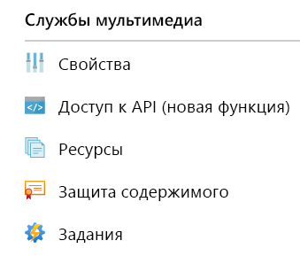
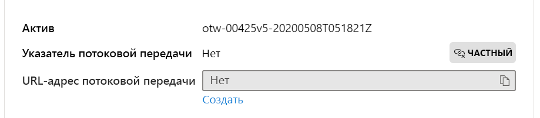

# <a name="quickstart-detect-motion-record-video-to-media-services"></a>Краткое руководство. Запись видео в Cлужбы мультимедиа при обнаружении движения

В этой статье описано, как использовать Аналитику видеотрансляции в IoT Edge для [записи на основе событий](event-based-video-recording-concept.md). Здесь используется имитация видеотрансляции и виртуальная машина Linux в Azure в качестве устройства IoT Edge. Эта видеотрансляция анализируется на наличие движущихся объектов. При обнаружении движения события отправляются в Центр Интернета вещей Azure, а соответствующий отрезок видеотрансляции записывается в качестве актива в Службы мультимедиа Azure.

Перед изучением этой статьи ознакомитесь со статьей [Начало работы, краткое руководство](get-started-detect-motion-emit-events-quickstart.md).

## <a name="prerequisites"></a>Предварительные требования

* Учетная запись Azure с активной подпиской. [Создайте учетную запись](https://azure.microsoft.com/free/?WT.mc_id=A261C142F) бесплатно.
* [Visual Studio Code](https://code.visualstudio.com/) на компьютере с [расширением Azure IoT Tools](https://marketplace.visualstudio.com/items?itemName=vsciot-vscode.azure-iot-tools).
* Если вы ранее не выполняли инструкции из статьи [Начало работы, краткое руководство](get-started-detect-motion-emit-events-quickstart.md), выполните указанные ниже действия.
    * [Настройка ресурсов Azure](get-started-detect-motion-emit-events-quickstart.md#set-up-azure-resources)
    * [Развертывание модулей](get-started-detect-motion-emit-events-quickstart.md#deploy-modules-on-your-edge-device)
    * [Настройка Visual Studio Code](get-started-detect-motion-emit-events-quickstart.md#configure-the-azure-iot-tools-extension)

## <a name="review-the-sample-video"></a>Просмотр примера видео

В рамках описанных выше действий по настройке ресурсов Azure (короткое) видео с изображением стоянки автомашин будет скопировано на виртуальную машину Linux в Azure, используемую в качестве устройства IoT Edge. Этот видеофайл будет использован для имитации прямой трансляции во время работы с этим руководством.

Можно использовать приложение, например [проигрыватель VLC](https://www.videolan.org/vlc/): запустите его, нажмите клавиши `Ctrl+N` и вставьте [ссылку на пример видео с изображением стоянки автомашин](https://lvamedia.blob.core.windows.net/public/lots_015.mkv), чтобы начать воспроизведение. Примерно на 5-секундной отметке белый автомобиль движется по стоянке.

Выполняя указанные ниже действия, вы будете использовать Аналитику видеотрансляции в IoT Edge для обнаружения движения автомобиля и записи видеоролика, начиная с 5-секундной отметки. Приведенная ниже схема является визуальным представлением общего потока.

> [!div class="mx-imgBorder"]
> :::image type="content" source="./media/quickstarts/topology.svg" alt-text="Запись видео на основе событий в активы на основе событий движения":::

## <a name="use-direct-method-calls"></a>Использование вызовов прямых методов

С помощью модуля можно анализировать потоки видеотрансляции, вызывая его прямые методы. Ознакомитесь со статьей [Прямые методы для Аналитики видеотрансляции в IoT Edge](direct-methods.md), чтобы узнать о всех прямых методах, обеспечиваемых модулем. 

1. В Visual Studio Code откройте вкладку **Расширения** (или нажмите клавиши CTRL+SHIFT+X) и найдите Центр Интернета вещей Azure.
1. Щелкните правой кнопкой мыши и выберите **Параметры расширения**.

    > [!div class="mx-imgBorder"]
    > :::image type="content" source="./media/run-program/extensions-tab.png" alt-text="Запись видео на основе событий в активы на основе событий движения" (Показывать подробное сообщение).

    > [!div class="mx-imgBorder"]
    > :::image type="content" source="./media/run-program/show-verbose-message.png" alt-text="Запись видео на основе событий в активы на основе событий движения"::: (Показывать подробное сообщение)

### <a name="invoke-graphtopologylist"></a>Вызов GraphTopologyList
В этом шаге перечислены все [топологии графа](media-graph-concept.md#media-graph-topologies-and-instances) в модуле.

1. Щелкните модуль lvaEdge правой кнопкой мыши и выберите "Вызов прямого метода модуля" из контекстного меню.
1. Вы увидите всплывающее поле ввода в верхней средней части окна Visual Studio Code. Введите GraphTopologyList в поле ввода и нажмите клавишу ВВОД.
1. Затем скопируйте и вставьте приведенные ниже полезные данные JSON в поле редактирования и нажмите клавишу ВВОД.
    
```
{
    "@apiVersion" : "1.0"
}
```

Через несколько секунд появится окно вывода во всплывающем окне Visual Studio Code со следующим ответом:
    
```
[DirectMethod] Invoking Direct Method [GraphTopologyList] to [lva-sample-device/lvaEdge] ...
[DirectMethod] Response from [lva-sample-device/lvaEdge]:
{
  "status": 200,
  "payload": {
    "value": []
  }
}
```
    
Должен появится указанный выше ответ, так как топологии графов не были созданы.

### <a name="invoke-graphtopologyset"></a>Вызов GraphTopologySet

С помощью шагов, описанных для вызова GraphTopologyList, можно вызвать GraphTopologySet, чтобы задать [топологию графа](media-graph-concept.md#media-graph-topologies-and-instances), используя в качестве полезных данных следующий формат JSON. Будет создана топология графа под именем EVRtoAssetsOnMotionDetection.

```
{
    "@apiVersion": "1.0",
    "name": "EVRtoAssetsOnMotionDetection",
    "properties": {
      "description": "Event-based video recording to Assets based on motion events",
      "parameters": [
        {
            "name": "rtspUserName",
            "type": "String",
            "description": "rtsp source user name.",
            "default": "dummyUserName"
        },
        {
            "name": "rtspPassword",
            "type": "String",
            "description": "rtsp source password.",
            "default" : "dummyPassword"
        },
        {
            "name": "rtspUrl",
            "type": "String",
            "description": "rtsp Url"
        },
        {
            "name": "motionSensitivity",
            "type": "String",
            "description": "motion detection sensitivity",
            "default" : "medium"
        },
        {
            "name": "hubSinkOutputName",
            "type": "String",
            "description": "hub sink output name",
            "default" : "iothubsinkoutput"
        }                              
    ],         

      "sources": [
        {
          "@type": "#Microsoft.Media.MediaGraphRtspSource",
          "name": "rtspSource",
          "endpoint": {
            "@type": "#Microsoft.Media.MediaGraphUnsecuredEndpoint",
            "url": "${rtspUrl}",
            "credentials": {
              "@type": "#Microsoft.Media.MediaGraphUsernamePasswordCredentials",
              "username": "${rtspUserName}",
              "password": "${rtspPassword}"
            }
          }
        }
      ],
      "processors": [
        {
          "@type": "#Microsoft.Media.MediaGraphMotionDetectionProcessor",
          "name": "motionDetection",
          "sensitivity": "${motionSensitivity}",
          "inputs": [
            {
              "nodeName": "rtspSource"
            }
          ]
        },
        {
          "@type": "#Microsoft.Media.MediaGraphSignalGateProcessor",
          "name": "signalGateProcessor",
          "inputs": [
            {
              "nodeName": "motionDetection"
            },
            {
              "nodeName": "rtspSource"
            }
          ],
          "activationEvaluationWindow": "PT1S",
          "activationSignalOffset": "PT0S",
          "minimumActivationTime": "PT30S",
          "maximumActivationTime": "PT30S"
        }
      ],
      "sinks": [
        {
          "@type": "#Microsoft.Media.MediaGraphAssetSink",
          "name": "assetSink",
          "assetNamePattern": "sampleAssetFromEVR-LVAEdge-${System.DateTime}",
          "segmentLength": "PT0M30S",
          "localMediaCacheMaximumSizeMiB": "2048",
          "localMediaCachePath": "/var/lib/azuremediaservices/tmp/",
          "inputs": [
            {
              "nodeName": "signalGateProcessor"
            }
          ]
        },
        {
          "@type": "#Microsoft.Media.MediaGraphIoTHubMessageSink",
          "name": "hubSink",
          "hubOutputName": "${hubSinkOutputName}",
          "inputs": [
            {
              "nodeName": "motionDetection"
            }
          ]
        }
      ]
    }
}
```

Указанные выше полезные данные JSON приводят к созданию топологии графа, которая определяет пять параметров (для четырех из которых установлены значения по умолчанию). Топология имеет один узел источника ([источник RTSP](media-graph-concept.md#rtsp-source)), два узла обработчиков ([обработчик обнаружения движения](media-graph-concept.md#motion-detection-processor) и [обработчик сигнального шлюза](media-graph-concept.md#signal-gate-processor)) и два узла приемников (приемник Центра Интернета вещей и [приемник актива](media-graph-concept.md#asset-sink)). Визуальное представление топологии показано выше.

Через несколько секунд появится окно вывода со следующим ответом:

```
[DirectMethod] Invoking Direct Method [GraphTopologySet] to [lva-sample-device/lvaEdge] ...
[DirectMethod] Response from [lva-sample-device/lvaEdge]:
{
  "status": 201,
  "payload": {
    "systemData": {
      "createdAt": "2020-05-12T22:05:31.603Z",
      "lastModifiedAt": "2020-05-12T22:05:31.603Z"
    },
    "name": "EVRtoAssetsOnMotionDetection",
    "properties": {
      "description": "Event-based video recording to assets based on motion events",
      "parameters": [
        {
          "name": "rtspUserName",
          "type": "String",
          "description": "rtsp source user name.",
          "default": "dummyUserName"
        },
        {
          "name": "rtspPassword",
          "type": "String",
          "description": "rtsp source password.",
          "default": "dummyPassword"
        },
        {
          "name": "rtspUrl",
          "type": "String",
          "description": "rtsp Url"
        },
        {
          "name": "motionSensitivity",
          "type": "String",
          "description": "motion detection sensitivity",
          "default": "medium"
        },
        {
          "name": "hubSinkOutputName",
          "type": "String",
          "description": "hub sink output name",
          "default": "iothubsinkoutput"
        }
      ],
      "sources": [
        {
          "@type": "#Microsoft.Media.MediaGraphRtspSource",
          "name": "rtspSource",
          "transport": "Tcp",
          "endpoint": {
            "@type": "#Microsoft.Media.MediaGraphUnsecuredEndpoint",
            "url": "${rtspUrl}",
            "credentials": {
              "@type": "#Microsoft.Media.MediaGraphUsernamePasswordCredentials",
              "username": "${rtspUserName}",
              "password": "${rtspPassword}"
            }
          }
        }
      ],
      "processors": [
        {
          "@type": "#Microsoft.Media.MediaGraphMotionDetectionProcessor",
          "sensitivity": "${motionSensitivity}",
          "name": "motionDetection",
          "inputs": [
            {
              "nodeName": "rtspSource",
              "outputSelectors": []
            }
          ]
        },
        {
          "@type": "#Microsoft.Media.MediaGraphSignalGateProcessor",
          "activationEvaluationWindow": "PT1S",
          "activationSignalOffset": "PT0S",
          "minimumActivationTime": "PT30S",
          "maximumActivationTime": "PT30S",
          "name": "signalGateProcessor",
          "inputs": [
            {
              "nodeName": "motionDetection",
              "outputSelectors": []
            },
            {
              "nodeName": "rtspSource",
              "outputSelectors": []
            }
          ]
        }
      ],
      "sinks": [
        {
          "@type": "#Microsoft.Media.MediaGraphAssetSink",
          "localMediaCachePath": "/var/lib/azuremediaservices/tmp/",
          "localMediaCacheMaximumSizeMiB": "2048",
          "segmentLength": "PT0M30S",
          "assetNamePattern": "sampleAssetFromEVR-LVAEdge-${System.DateTime}",
          "name": "assetSink",
          "inputs": [
            {
              "nodeName": "signalGateProcessor",
              "outputSelectors": []
            }
          ]
        },
        {
          "@type": "#Microsoft.Media.MediaGraphIoTHubMessageSink",
          "hubOutputName": "${hubSinkOutputName}",
          "name": "hubSink",
          "inputs": [
            {
              "nodeName": "motionDetection",
              "outputSelectors": []
            }
          ]
        }
      ]
    }
  }
}
```

Возвращенное состояние — 201, что означает создание новой топологии графа. Далее используйте указанные ниже прямые методы.

* Снова вызовите GraphTopologySet и убедитесь, что возвращен код состояния 200. Код состояния 200 указывает, что существующая топология графа успешно обновлена.
* Снова вызовите GraphTopologySet, но измените строку описания. Убедитесь, что код состояния в ответе — 200, а описание обновлено до нового значения.
* Вызовите GraphTopologyList, как описано в предыдущем разделе, и убедитесь, что теперь в возвращенных полезных данных отображается топология графа EVRtoAssetsOnMotionDetection.

### <a name="invoke-graphtopologyget"></a>Вызов GraphTopologyGet

Теперь вызовите GraphTopologyGet со следующими полезными данными
```

{
    "@apiVersion" : "1.0",
    "name" : "EVRtoAssetsOnMotionDetection"
}
```

Через несколько секунд в окне вывода появится следующий ответ

```
[DirectMethod] Invoking Direct Method [GraphTopologyGet] to [lva-sample-device/lvaEdge] ...
[DirectMethod] Response from [lva-sample-device/lvaEdge]:
{
  "status": 200,
  "payload": {
    "systemData": {
      "createdAt": "2020-05-12T22:05:31.603Z",
      "lastModifiedAt": "2020-05-12T22:05:31.603Z"
    },
    "name": "EVRtoAssetsOnMotionDetection",
    "properties": {
      "description": "Event-based video recording to Assets based on motion events",
      "parameters": [
        {
          "name": "rtspUserName",
          "type": "String",
          "description": "rtsp source user name.",
          "default": "dummyUserName"
        },
        {
          "name": "rtspPassword",
          "type": "String",
          "description": "rtsp source password.",
          "default": "dummyPassword"
        },
        {
          "name": "rtspUrl",
          "type": "String",
          "description": "rtsp Url"
        },
        {
          "name": "motionSensitivity",
          "type": "String",
          "description": "motion detection sensitivity",
          "default": "medium"
        },
        {
          "name": "hubSinkOutputName",
          "type": "String",
          "description": "hub sink output name",
          "default": "iothubsinkoutput"
        }
      ],
      "sources": [
        {
          "@type": "#Microsoft.Media.MediaGraphRtspSource",
          "name": "rtspSource",
          "transport": "Tcp",
          "endpoint": {
            "@type": "#Microsoft.Media.MediaGraphUnsecuredEndpoint",
            "url": "${rtspUrl}",
            "credentials": {
              "@type": "#Microsoft.Media.MediaGraphUsernamePasswordCredentials",
              "username": "${rtspUserName}",
              "password": "${rtspPassword}"
            }
          }
        }
      ],
      "processors": [
        {
          "@type": "#Microsoft.Media.MediaGraphMotionDetectionProcessor",
          "sensitivity": "${motionSensitivity}",
          "name": "motionDetection",
          "inputs": [
            {
              "nodeName": "rtspSource",
              "outputSelectors": []
            }
          ]
        },
        {
          "@type": "#Microsoft.Media.MediaGraphSignalGateProcessor",
          "activationEvaluationWindow": "PT1S",
          "activationSignalOffset": "PT0S",
          "minimumActivationTime": "PT30S",
          "maximumActivationTime": "PT30S",
          "name": "signalGateProcessor",
          "inputs": [
            {
              "nodeName": "motionDetection",
              "outputSelectors": []
            },
            {
              "nodeName": "rtspSource",
              "outputSelectors": []
            }
          ]
        }
      ],
      "sinks": [
        {
          "@type": "#Microsoft.Media.MediaGraphAssetSink",
          "localMediaCachePath": "/var/lib/azuremediaservices/tmp/",
          "localMediaCacheMaximumSizeMiB": "2048",
          "segmentLength": "PT0M30S",
          "assetNamePattern": "sampleAssetFromEVR-LVAEdge-${System.DateTime}",
          "name": "assetSink",
          "inputs": [
            {
              "nodeName": "signalGateProcessor",
              "outputSelectors": []
            }
          ]
        },
        {
          "@type": "#Microsoft.Media.MediaGraphIoTHubMessageSink",
          "hubOutputName": "${hubSinkOutputName}",
          "name": "hubSink",
          "inputs": [
            {
              "nodeName": "motionDetection",
              "outputSelectors": []
            }
          ]
        }
      ]
    }
  }
}
```

Обратите внимание на указанные ниже свойства полезных данных ответа.

* Код состояния — 200, что означает успешное выполнение.
* Полезные данные имеют метки времени "created" и "lastModified".

### <a name="invoke-graphinstanceset"></a>Вызов GraphInstanceSet

Затем создайте экземпляр графа, который ссылается на указанную выше топологию графа. Как объясняется [здесь](media-graph-concept.md#media-graph-topologies-and-instances), экземпляры графа позволяют анализировать видеопотоки с нескольких камер с одинаковой топологией графа.

Теперь вызовите прямой метод GraphInstanceSet со следующими полезными данными:

```
{
    "@apiVersion" : "1.0",
    "name" : "Sample-Graph-2",
    "properties" : {
        "topologyName" : "EVRtoAssetsOnMotionDetection",
        "description" : "Sample graph description",
        "parameters" : [
            { "name" : "rtspUrl", "value" : "rtsp://rtspsim:554/media/lots_015.mkv" }
        ]
    }
}
```

Следует отметить следующее.

* В полезных данных выше указано имя топологии графа (EVRtoAssetsOnMotionDetection), для которой необходимо создать экземпляр графа.
* Полезные данные содержат значение для параметра rtspUrl, для которого отсутствует значение по умолчанию в полезных данных топологии.

Через несколько секунд в окне вывода отобразится следующий ответ:

```
[DirectMethod] Invoking Direct Method [GraphInstanceSet] to [lva-sample-device/lvaEdge] ...
[DirectMethod] Response from [lva-sample-device/lvaEdge]:
{
  "status": 201,
  "payload": {
    "systemData": {
      "createdAt": "2020-05-12T23:30:20.666Z",
      "lastModifiedAt": "2020-05-12T23:30:20.666Z"
    },
    "name": "Sample-Graph-2",
    "properties": {
      "state": "Inactive",
      "description": "Sample graph description",
      "topologyName": "EVRtoAssetsOnMotionDetection",
      "parameters": [
        {
          "name": "rtspUrl",
          "value": "rtsp://rtspsim:554/media/lots_015.mkv"
        }
      ]
    }
  }
}
```

Обратите внимание на указанные ниже свойства полезных данных ответа.

* Код состояния — 201, т. е. был создан новый экземпляр.
* Состояние — Inactive (Неактивный), т. е экземпляр графа был создан, но не активирован. Дополнительные сведения см. в разделе с описанием состояний [графа мультимедиа](media-graph-concept.md).

Далее используйте указанные ниже прямые методы.

* Снова вызовите GraphInstanceSet с теми же полезными данными и обратите внимание, что возвращенный код состояния теперь 200.
* Вызовите GraphInstanceSet еще раз, но с другим описанием, и обратите внимание на обновленное описание в полезных данных ответа, указывающее на то, что экземпляр графа успешно обновлен.
* Вызовите GraphInstanceSet, но измените имя на Sample-Graph-3 и просмотрите полезные данные ответа. Обратите внимание, что создан новый экземпляр графа (т. е. код состояния — 201). По завершении работы с кратким руководством удалите эти дубликаты экземпляров.

### <a name="prepare-for-monitoring-events"></a>Подготовка к мониторингу событий

Созданный граф мультимедиа использует узел обработчика обнаружения движения для обнаружения движения, и эти события ретранслируются в Центр Интернета вещей. Чтобы подготовиться к наблюдению за этими событиями, выполните указанные ниже действия.

1. Откройте область обозревателя в Visual Studio Code и найдите Центр Интернета вещей Azure в левом нижнем углу.
1. Разверните узел Devices (Устройства).
1. Щелкните правой кнопкой мыши устройство lva-sample-device и выберите команду "Запуск мониторинга встроенной конечной точки события"

    
    
    Через несколько секунд появится окно вывода со следующим сообщением:

```
[IoTHubMonitor] Start monitoring message arrived in built-in endpoint for all devices ...
[IoTHubMonitor] Created partition receiver [0] for consumerGroup [$Default]
[IoTHubMonitor] Created partition receiver [1] for consumerGroup [$Default]
[IoTHubMonitor] Created partition receiver [2] for consumerGroup [$Default]
[IoTHubMonitor] Created partition receiver [3] for consumerGroup [$Default]
```

### <a name="invoke-graphinstanceactivate"></a>Вызов GraphInstanceActivate

Теперь активируйте экземпляр графа, который запускает поток видеотрансляции через модуль. Вызовите прямой метод GraphInstanceActivate со следующими полезными данными:

```
{
    "@apiVersion" : "1.0",
    "name" : "Sample-Graph-2"
}
```

Через несколько секунд в окне вывода появится следующий ответ

```
[DirectMethod] Invoking Direct Method [GraphInstanceActivate] to [lva-sample-device/lvaEdge] ...
[DirectMethod] Response from [lva-sample-device/lvaEdge]:
{
  "status": 200,
  "payload": null
}
```

Код состояния 200 в полезных данных ответа указывает на то, что экземпляр графа успешно активирован.

### <a name="invoke-graphinstanceget"></a>Вызов GraphInstanceGet

Теперь вызовите прямой метод GraphInstanceGet со следующими полезными данными:

```
{
    "@apiVersion" : "1.0",
    "name" : "Sample-Graph-2"
}
```

Через несколько секунд в окне вывода появится следующий ответ

```
[DirectMethod] Invoking Direct Method [GraphInstanceGet] to [lva-sample-device/lvaEdge] ...
[DirectMethod] Response from [lva-sample-device/lvaEdge]:
{
  "status": 200,
  "payload": {
    "systemData": {
      "createdAt": "2020-05-12T23:30:20.666Z",
      "lastModifiedAt": "2020-05-12T23:30:20.666Z"
    },
    "name": "Sample-Graph-2",
    "properties": {
      "state": "Active",
      "description": "Sample graph description",
      "topologyName": "EVRtoAssetsOnMotionDetection",
      "parameters": [
        {
          "name": "rtspUrl",
          "value": "rtsp://rtspsim:554/media/lots_015.mkv"
        }
      ]
    }
  }
}
```

Обратите внимание на указанные ниже свойства полезных данных ответа.

* Код состояния — 200, что означает успешное выполнение.
* Состояние — Active (активный), т. е. экземпляр графа теперь находится в активированном состоянии.

## <a name="observe-results"></a>Просмотр результатов

Экземпляр графа, созданный и активированный как описано выше, использует узел обработчика обнаружения движения для обнаружения движения во входящем потоке видеотрасляции и отправляет события в приемник Центра Интернета вещей. Затем эти события передаются в Центр Интернета вещей, и их можно просмотреть. В окне вывода отобразятся следующие сообщения.

```
[IoTHubMonitor] [4:33:04 PM] Message received from [lva-sample-device/lvaEdge]:
{
  "body": {
    "sdp": "SDP:\nv=0\r\no=- 1589326384077235 1 IN IP4 XXX.XX.XX.XXX\r\ns=Matroska video+audio+(optional)subtitles, streamed by the LIVE555 Media Server\r\ni=media/lots_015.mkv\r\nt=0 0\r\na=tool:LIVE555 Streaming Media v2020.04.12\r\na=type:broadcast\r\na=control:*\r\na=range:npt=0-73.000\r\na=x-qt-text-nam:Matroska video+audio+(optional)subtitles, streamed by the LIVE555 Media Server\r\na=x-qt-text-inf:media/lots_015.mkv\r\nm=video 0 RTP/AVP 96\r\nc=IN IP4 0.0.0.0\r\nb=AS:500\r\na=rtpmap:96 H264/90000\r\na=fmtp:96 packetization-mode=1;profile-level-id=640028;sprop-parameter-sets=XXXXXXXXXXXXXXXXXXXXXXXXXXXXXXXXXXX\r\na=control:track1\r\n"
  },
  "applicationProperties": {
    "topic": "/subscriptions/{subscriptionId}/resourceGroups/{resourceGroupName}/providers/microsoft.media/mediaservices/{amsAccountName}",
    "subject": "/graphInstances/Sample-Graph-2/sources/rtspSource",
    "eventType": "Microsoft.Media.Graph.Diagnostics.MediaSessionEstablished",
    "eventTime": "2020-05-12T23:33:04.077Z",
    "dataVersion": "1.0"
  }
}
[IoTHubMonitor] [4:33:09 PM] Message received from [lva-sample-device/lvaEdge]:
{
  "body": {
    "timestamp": 143039375044290,
    "inferences": [
      {
        "type": "motion",
        "motion": {
          "box": {
            "l": 0.48954,
            "t": 0.140741,
            "w": 0.075,
            "h": 0.058824
          }
        }
      }
    ]
  },
  "applicationProperties": {
    "topic": "/subscriptions/{subscriptionId}/resourceGroups/{resourceGroupName}/providers/microsoft.media/mediaservices/{amsAccountName}",
    "subject": "/graphInstances/Sample-Graph-2/processors/md",
    "eventType": "Microsoft.Media.Graph.Analytics.Inference",
    "eventTime": "2020-05-12T23:33:09.381Z",
    "dataVersion": "1.0"
  }
}
```

Обратите внимание на следующие свойства в приведенных выше сообщениях

* Каждое сообщение содержит раздел текста body и раздел свойств приложения applicationProperties. Сведения о назначении этих разделов см. в статье [Создание и чтение сообщений Центра Интернета вещей](../../iot-hub/iot-hub-devguide-messages-construct.md).
* Первое сообщение представляет собой диагностическое событие MediaSessionEstablished, в котором говорится, что узлу источника RTSP (параметру subject) удалось установить подключение к симулятору RTSP и начать прием потока данных (эмулируемого).
* Параметр субъекта subject в разделе свойств приложения applicationProperties обозначает узел в топологии графа, сгенерировавший сообщение. В этом случае сообщение исходит от узла источника RTSP.
* Параметр типа события eventType в разделе applicationProperties указывает, что событие является диагностическим.
* Параметр времени события eventTime указывает время события.
* Раздел текста body содержит данные о диагностическом событии — это сообщение [SDP](https://en.wikipedia.org/wiki/Session_Description_Protocol).
* Второе сообщение — это аналитическое событие. Можно убедиться, что оно отправляется примерно через 5 секунд после сообщения MediaSessionEstablished, что соответствует задержке между началом видео и моментом, когда автомобиль начинает движение по стоянке.
* Параметр субъекта subject в разделе свойств приложения applicationProperties обозначает узел обработчика обнаружения движения в графе, сгенерировавший это сообщение.
* Это событие является событием вывода, поэтому раздел body содержит данные параметров timestamp и inferences.
* В разделе inferences указано, что у параметра type значение motion, он также содержит дополнительные данные о событии motion.

Далее появится следующее сообщение.

```
[IoTHubMonitor] [4:33:10 PM] Message received from [lva-sample-device/lvaEdge]:
{
  "body": {
    "outputType": "assetName",
    "outputLocation": "sampleAssetFromEVR-LVAEdge-20200512T233309Z"
  },
  "applicationProperties": {
    "topic": "/subscriptions/{subscriptionId}/resourceGroups/{resourceGroupName}/providers/microsoft.media/mediaservices/{amsAccountName}",
    "subject": "/graphInstances/Sample-Graph-2/sinks/assetSink",
    "eventType": "Microsoft.Media.Graph.Operational.RecordingStarted",
    "eventTime": "2020-05-12T23:33:10.392Z",
    "dataVersion": "1.0"
  }
}
```

* Третье сообщение — это операционное событие. Можно убедиться, что оно отправляется практически сразу после сообщения об обнаружении движения, которое действует как триггер для начала записи.
* Параметр субъекта subject в разделе свойств приложения applicationProperties обозначает узел приемника актива в графе, сгенерировавший это сообщение.
* Раздел body содержит сведения о месте вывода данных: в нашем случае это название актива Службы мультимедиа Azure, в который осуществляется запись видео. Обратите внимание на это значение — оно понадобится позже при работе с кратким руководством.

В топологии время активации для узла обработчика сигнального шлюза установлено на 30 секунд, т. е. топология графа будет записывать в актив видео продолжительностью примерно 30 секунд. Во время записи видео узел обработчика обнаружения движения продолжает создавать события вывода, которые будут отображаться в окне вывода. Через некоторое время появится следующее сообщение:

```
[IoTHubMonitor] [4:33:31 PM] Message received from [lva-sample-device/lvaEdge]:
{
  "body": {
    "outputType": "assetName",
    "outputLocation": "sampleAssetFromEVR-LVAEdge-20200512T233309Z"
  },
  "applicationProperties": {
    "topic": "/subscriptions/{subscriptionId}/resourceGroups/{resourceGroupName}/providers/microsoft.media/mediaservices/{amsAccountName}",
    "subject": "/graphInstances/Sample-Graph-2/sinks/assetSink",
    "eventType": "Microsoft.Media.Graph.Operational.RecordingAvailable",
    "eventTime": "2020-05-12T23:33:31.051Z",
    "dataVersion": "1.0"
  }
}
```

* Это сообщение также является операционным событием. Событие RecordingAvailable означает, что в актив записано уже достаточно данных для того, чтобы можно было начать воспроизведение видео в проигрывателе или на клиенте.
* Параметр субъекта subject в разделе свойств приложения applicationProperties обозначает узел приемника актива в графе, сгенерировавший это сообщение.
* Раздел body содержит сведения о месте вывода данных: в нашем случае это название актива Службы мультимедиа Azure, в который осуществляется запись видео.

Если вы продолжите выполнение экземпляра графа, появится следующее сообщение:

```
[IoTHubMonitor] [4:33:40 PM] Message received from [lva-sample-device/lvaEdge]:
{
  "body": {
    "outputType": "assetName",
    "outputLocation": "sampleAssetFromEVR-LVAEdge-20200512T233309Z"
  },
  "applicationProperties": {
    "topic": "/subscriptions/{subscriptionId}/resourceGroups/{resourceGroupName}/providers/microsoft.media/mediaservices/{amsAccountName}",
    "subject": "/graphInstances/Sample-Graph-2/sinks/assetSink",
    "eventType": "Microsoft.Media.Graph.Operational.RecordingStopped",
    "eventTime": "2020-05-12T23:33:40.014Z",
    "dataVersion": "1.0"
  }
}
```

* Это сообщение также является операционным событием. Событие RecordingStopped указывает, что запись остановлена.
* Обратите внимание, что с момента возникновения события RecordingStarted прошло примерно 30 секунд, что соответствует значению времени активации в узле обработчика сигнального шлюза.
* Параметр субъекта subject в разделе свойств приложения applicationProperties обозначает узел приемника актива в графе, сгенерировавший это сообщение.
* Раздел body содержит сведения о месте вывода данных: в нашем случае это название актива Службы мультимедиа Azure, в который осуществляется запись видео.

Если вы продолжите выполнение экземпляра графа, симулятор RTSP достигнет конца видеофайла и остановится либо отключится. Затем узел источника RTSP снова подключится к симулятору, и процесс повторится.
    
## <a name="invoke-additional-direct-method-calls-to-clean-up"></a>Вызов дополнительных прямых методов для очистки

Теперь вызовем прямые методы для деактивации и удаления экземпляра графа (в указанном порядке).

### <a name="invoke-graphinstancedeactivate"></a>Вызов GraphInstanceDeactivate

Вызовите прямой метод GraphInstanceDeactivate со следующими полезными данными:

```
{
    "@apiVersion" : "1.0",
    "name" : "Sample-Graph-2"
}
```

Через несколько секунд в окне вывода появится следующий ответ.

```
[DirectMethod] Invoking Direct Method [GraphInstanceDeactivate] to [lva-sample-device/lvaEdge] ...
[DirectMethod] Response from [lva-sample-device/lvaEdge]:
{
  "status": 200,
  "payload": null
}
```

Код состояния 200 указывает на то, что экземпляр графа успешно деактивирован.

В качестве следующего шага выполните такое действие:

* Вызовите GraphInstanceGet, как указано в предыдущих разделах, и обратите внимание на значение параметра состояния state.

### <a name="invoke-graphinstancedelete"></a>Вызов GraphInstanceDelete

Вызовите прямой метод GraphInstanceDelete со следующими полезными данными:

```
{
    "@apiVersion" : "1.0",
    "name" : "Sample-Graph-2"
}
```

Через несколько секунд в окне вывода появится следующий ответ:

```
[DirectMethod] Invoking Direct Method [GraphInstanceDelete] to [lva-sample-device/lvaEdge] ...
[DirectMethod] Response from [lva-sample-device/lvaEdge]:
{
  "status": 200,
  "payload": null
}
```

Код состояния 200 в ответе указывает на то, что экземпляр графа был успешно удален.

### <a name="invoke-graphtopologydelete"></a>Вызов GraphTopologyDelete

Вызовите прямой метод GraphTopologyDelete со следующими полезными данными:

```
{
    "@apiVersion" : "1.0",
    "name" : "EVRtoAssetsOnMotionDetection"
}
```

Через несколько секунд в окне вывода появится следующий ответ

```
[DirectMethod] Invoking Direct Method [GraphTopologyDelete] to [lva-sample-device/lvaEdge] ...
[DirectMethod] Response from [lva-sample-device/lvaEdge]:
{
  "status": 200,
  "payload": null
}
```

Код состояния 200 означает, что топология MediaGraph успешно удалена.

Далее используйте указанные ниже прямые методы.

* Вызовите GraphTopologyList и убедитесь, что в модуле отсутствуют топологии графов.
* Вызовите GraphInstanceList с полезными данными, указанными в GraphTopologyList, и убедитесь, что экземпляры графа не перечислены.

## <a name="playing-back-the-recorded-video"></a>Воспроизведение записанного видео

Далее можно воспроизвести записанное видео на портале Azure.

1. Войдите на [портал Azure](https://portal.azure.com/) и введите "Службы мультимедиа" в поле поиска.
1. Выберите свою учетную запись Служб мультимедиа Azure и откройте ее.
1. Выберите поле Assets (Активы) в списке Служб мультимедиа.

    
1. Если это краткое руководство является вашим первым использованием Служб мультимедиа Azure, будут перечислены только те активы, которые были созданы в этом кратком руководстве, и вы сможете выбрать самый ранний.
1. В противном случае используйте имя актива, указанное в качестве outputLocation в операционных событиях выше.
1. На открывшейся странице сведений нажмите ссылку Create new (Создать новый), расположенную непосредственно под текстовым полем Streaming URL (URL-адрес потоковой передачи).

    
1. В области, открывшейся для параметра Add streaming locator (Добавление указателя потоковой передачи), подтвердите значения по умолчанию и нажмите кнопку Add (Добавить) в нижней части окна.
1. Теперь на странице сведений об активе первый кадр видео должен загрузиться в видеопроигрыватель, и можно нажать кнопку воспроизведения. Убедитесь, что вы видите тот отрезок видео, в котором автомобиль движется по стоянке.

    

> [!NOTE]
> Так как имитация видеотрансляции начинается с момента активации графа, значения времени суток несущественны и не отображаются с помощью ярлыка проигрывателя. В руководстве по непрерывной записи и воспроизведению видео описано, как можно отобразить метки времени.

## <a name="clean-up-resources"></a>Очистка ресурсов

Если вы не собираетесь использовать это приложение в дальнейшем, удалите ресурсы, созданные в этом кратком руководстве.

## <a name="next-steps"></a>Дальнейшие действия

* Узнайте, как вызвать Аналитику видеотрансляции в IoT Edge с помощью [прямых методов](direct-methods.md) программным способом.
* Узнайте больше о диагностических сообщениях.    
