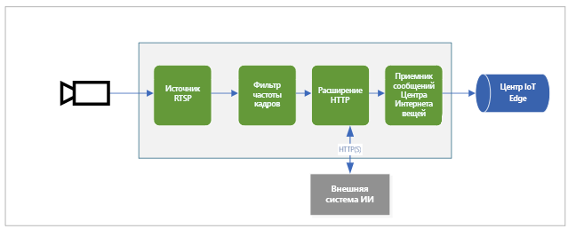

На схеме показан порядок передачи сигналов в этом кратком руководстве. [Пограничный модуль](https://github.com/Azure/live-video-analytics/tree/master/utilities/rtspsim-live555) имитирует IP-камеру, на которой находится RTSP-сервер. Узел [источника RTSP](../../../media-graph-concept.md#rtsp-source) извлекает видеопоток с этого сервера и отправляет видеокадры на узел [обработчика фильтра частоты кадров](../../../media-graph-concept.md#frame-rate-filter-processor). Этот обработчик ограничивает частоту кадров видеопотока при достижении узла [обработчика расширения HTTP](../../../media-graph-concept.md#http-extension-processor). 

Узел расширения HTTP играет роль прокси-сервера. Он преобразует видеокадры в изображения указанного типа. Затем с использованием REST он передает изображение на другой пограничный модуль, выполняющий модель искусственного интеллекта на конечной точке HTTP. В этом примере этот пограничный модуль строится с помощью модели [YOLOv3](https://github.com/Azure/live-video-analytics/tree/master/utilities/video-analysis/yolov3-onnx), которая может обнаруживать объекты множества типов. Узел обработчика расширений HTTP собирает результаты обнаружения и публикует события в узле [приемника Центра Интернета вещей](../../../media-graph-concept.md#iot-hub-message-sink). Затем узел отправляет эти события в [центр IoT Edge](../../../../../iot-edge/iot-edge-glossary.md#iot-edge-hub).

В этом кратком руководстве вы выполните указанные ниже задачи.

1. Создание и развертывание графа мультимедиа.
1. Интерпретация результатов.
1. Очистка ресурсов.
