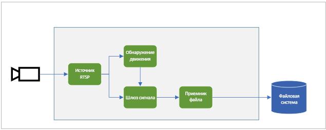

На предыдущей схеме показан порядок передачи сигналов в этом кратком руководстве. [Пограничный модуль](https://github.com/Azure/live-video-analytics/tree/master/utilities/rtspsim-live555) имитирует IP-камеру, на которой находится RTSP-сервер. Узел [RTSP-источника](../../../media-graph-concept.md#rtsp-source) получает видеосигнал с этого сервера и передает видеокадры на узел [обработчика обнаружения движения](../../../media-graph-concept.md#motion-detection-processor). RTSP-источник отправляет эти же видеокадры на узел [шлюза обработчика сигнала](../../../media-graph-concept.md#signal-gate-processor), который остается закрытым до тех пор, пока его не активирует событие.

Когда обработчик обнаружения движения определяет движение в видео, он отправляет событие на узел шлюза обработчика сигнала, тем самым активируя его. Шлюз открывается и остается открытым в течение заданного времени, отправляя видеокадры на узел [приемника файлов](../../../media-graph-concept.md#file-sink). Этот узел приемника записывает видео в формате MP4 в локальную файловую систему пограничного устройства. Файл сохраняется в заданном расположении.

В этом кратком руководстве вы выполните указанные ниже задачи.

1. Создание и развертывание графа мультимедиа.
1. Интерпретация результатов.
1. Очистка ресурсов.
