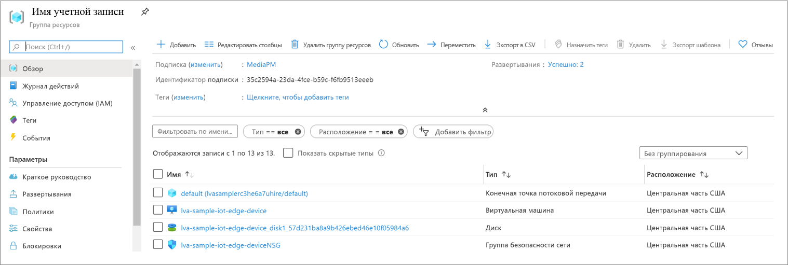
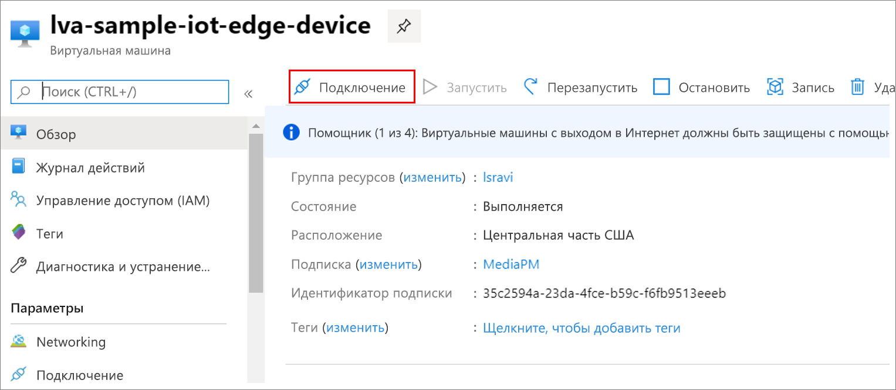

MP4-файлы записываются в каталог на пограничном устройстве, указанном в файле *.env* с помощью ключа OUTPUT_VIDEO_FOLDER_ON_DEVICE. Если использовано значение по умолчанию, результаты должны находиться в папке */var/media/* .

Чтобы воспроизвести MP4-файл:

1. Перейдите к группе ресурсов, найдите виртуальную машину, а затем подключитесь с помощью Бастиона Azure.

    
    
    
1. Войдите, используя учетные данные, созданные при [настройке ресурсов Azure](../../../detect-motion-emit-events-quickstart.md#set-up-azure-resources). 
1. В командной строке перейдите в соответствующий каталог. Расположение по умолчанию — */var/media*. В каталоге должны отобразиться файлы MP4.

     

1. Используйте [безопасное копирование (SCP)](../../../../../virtual-machines/linux/copy-files-to-linux-vm-using-scp.md) для копирования файлов на локальный компьютер. 
1. Воспроизведите файлы с помощью [проигрывателя мультимедиа VLC](https://www.videolan.org/vlc/) или любого другого проигрывателя, поддерживающего формат MP4.
