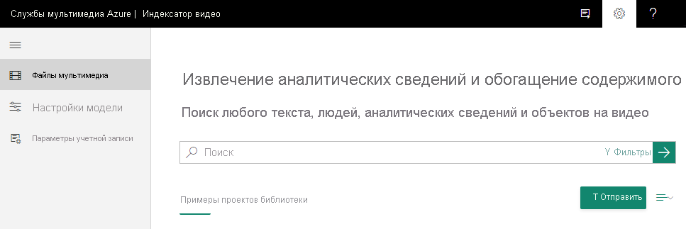

# Краткое руководство. Как зарегистрироваться и отправить видео

В этом руководстве по началу работы показано, как войти на веб-сайт Индексатора видео и отправить первое видео.

При создании учетной записи Индексатора видео можно выбрать бесплатную пробную учетную запись (с определенным количеством бесплатных минут индексирования) или платную (без ограничивающих квот). В бесплатной пробной учетной записи Индексатора видео предоставляется до 600 минут бесплатной индексации для пользователей веб-сайта и до 2400 минут бесплатной индексации для пользователей API. Платный вариант подразумевает создание учетной записи Индексатора видео, [подключенной к подписке Azure и учетной записи Служб мультимедиа Azure](connect-to-azure.md). Вы оплачиваете проиндексированные минуты, а также несете сопутствующие расходы, связанные с учетной записью Служб мультимедиа Azure. 

## Регистрация в Индексаторе видео

Чтобы начать разработку с помощью Индексатора видео, откройте веб-сайт службы [Индексатор видео](https://www.videoindexer.com) и зарегистрируйтесь на нем.

## Отправка видео с помощью веб-сайта Индексатора видео

1. Войдите на веб-сайт [Индексатора видео](https://www.videoindexer.ai/).
2. Чтобы отправить видео, нажмите кнопку **Отправить** или щелкните ссылку.

    

    После отправки видео Индексатор видео запускает индексирование и анализ видео.

     

    Когда Индексатор видео завершит анализ, вы получите уведомление, содержащее ссылку на ваше видео и краткое описание того, что в нем обнаружено. Например, люди, разделы, распознавание текста.

## Дополнительная информация

Теперь вы можете использовать веб-сайт [Индексатора видео](video-indexer-view-edit.md) или [портал разработчика Индексатора видео](video-indexer-use-apis.md), чтобы просмотреть аналитические сведения о видео. 

## См. также

[Общие сведения об Индексаторе видео](video-indexer-overview.md)

[Начало использования API](video-indexer-use-apis.md).

