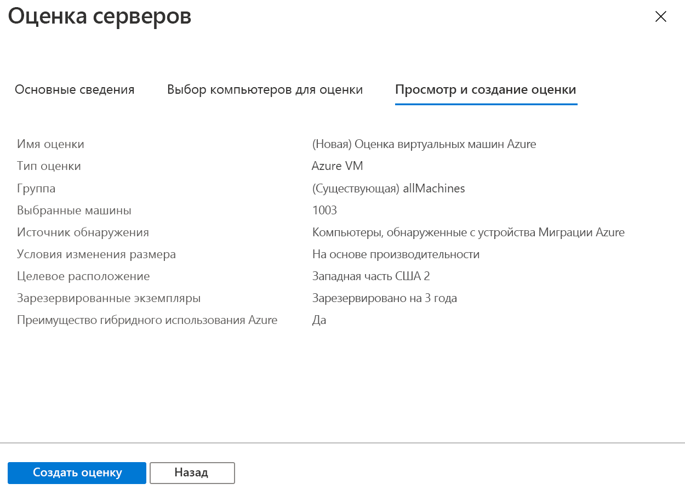

# <a name="assess-vmware-vms-with-azure-migrate-server-assessment"></a>Оценка виртуальных машин VMware с помощью средства "Оценка серверов" службы "Миграция Azure"

В этой статье описывается, как оценивать локальные виртуальные машины VMware с помощью средства "Оценка серверов" службы "Миграция Azure".

Служба [Миграция Azure](migrate-services-overview.md) объединяет в себе инструменты, которые используются для поиска, оценки и переноса приложений, инфраструктуры и рабочих нагрузок в Microsoft Azure. Она включает в себя инструменты Миграции Azure и предложения независимых поставщиков программного обеспечения.


Это руководство является вторым в серии, в которой показано, как оценивать и переносить виртуальные машины VMware в Azure. Из этого руководства вы узнаете, как выполнять следующие задачи:
> [!div class="checklist"]
> * Настройка проекта службы "Миграция Azure".
> * Настройка устройства службы "Миграция Azure", работающего локально, для оценки виртуальных машин.
> * Запуск непрерывного обнаружения локальных виртуальных машин. Устройство отправляет данные конфигурации и производительности для обнаруженных виртуальных машин в Azure.
> * Группирование обнаруженных виртуальных машин и оценка группы виртуальных машин.
> * Просмотр оценки.


> [!NOTE]
> В руководствах показан простейший путь развертывания сценария, использование которого позволяет быстро настроить проверку концепции. В руководствах по возможности используются параметры по умолчанию и показаны не все возможные параметры и пути. Для получения подробных инструкций ознакомьтесь со статьями с инструкциями.

Если у вас еще нет подписки Azure, [создайте бесплатную учетную запись Azure](https://azure.microsoft.com/pricing/free-trial/), прежде чем начинать работу.


## <a name="prerequisites"></a>Предварительные требования

- [Завершите](tutorial-prepare-vmware.md) работу с первым руководством в этой серии. Если этого не сделать, инструкции в этом руководстве не будут работать.
- В первом руководстве вы должны были выполнить следующие действия.
    - [Настройка разрешений Azure](tutorial-prepare-vmware.md#prepare-azure) для службы "Миграция Azure".
    - [Подготовка VMware](tutorial-prepare-vmware.md#prepare-for-vmware-vm-assessment) для оценки. Необходимо проверить параметры VMware, а также требуется наличие разрешений для создания виртуальной машины VMware с помощью шаблона OVA. Необходимо также настроить учетную запись для обнаружения виртуальных машин. Требуемые порты должны быть доступны, а также необходимо знать URL-адреса, которые нужны для доступа к Azure.


## <a name="set-up-an-azure-migrate-project"></a>Настройка проекта службы "Миграция Azure"

Настройте новый проект службы "Миграция Azure" следующим образом.

1. На портал Azure выберите **Все службы** и найдите службу **Миграция Azure**.
2. В разделе **Службы** выберите **Миграция Azure**.
3. В разделе **Обзор** в области **Обнаружение, оценка и перенос серверов** щелкните **Оценка и миграция серверов**.

    

4. В разделе **Приступая к работе** щелкните **Добавить инструменты**.
5. В разделе **Проект миграции** выберите подписку Azure и создайте группу ресурсов, если у вас ее нет.     
6. В разделе **Сведения о проекте** укажите имя проекта и регион для создания проекта. Поддерживаются такие регионы: Азия, Европа, Соединенное Королевство и США.

    - Географический регион проекта используется только для хранения обнаруженных метаданных локальных виртуальных машин.
    - При выполнении миграции можно выбрать любой целевой регион.

    


7. Щелкните **Далее**.
8. В области **Выберите инструмент оценки** выберите **Azure Migrate: Server Assessment (Миграция Azure: оценка сервера)**  > **Далее**.

    

9. В области **Выберите инструмент миграции** выберите **Пропустить добавление инструмента миграции** > **Далее**.
10. В области **Review + add tools** (Проверка и добавление инструментов) проверьте параметры и щелкните **Add tools** (Добавить инструменты).
11. Развертывание проекта службы "Миграция Azure" может занять несколько минут. После этого откроется страница проекта. Если проект не отображается, доступ к нему можно получить в разделе **Серверы** на панели мониторинга службы "Миграция Azure".


## <a name="set-up-the-appliance-vm"></a>Настройка виртуальной машины устройства

Средство "Оценка серверов" службы "Миграция Azure" запускает упрощенное устройство виртуальной машины VMware.

- Это устройство выполняет обнаружение виртуальных машин и инициирует отправку метаданных и данных производительности в средство "Оценка серверов" службы "Миграция Azure".
- Чтобы настроить устройство, сделайте следующее.
    - Скачайте файл шаблона OVA и импортируйте его в vCenter Server.
    - Создайте устройство и убедитесь, что оно может подключиться к средству оценки сервера в службе "Миграция Azure".
    - Настройте устройство в первый раз и зарегистрируйте его в проекте службы "Миграция Azure".
- Для одного проекта службы "Миграция Azure" можно настроить несколько устройств. На всех устройствах поддерживается обнаружение до 35 000 виртуальных машин. На одном устройстве может быть обнаружено максимум 10 000 серверов.

### <a name="download-the-ova-template"></a>Скачивание шаблона OVA

1. Последовательно выберите разделы **Цели миграции** > **Серверы** > **Azure Migrate: Server Assessment (Миграция Azure: оценка серверов)** и щелкните **Обнаружение**.
2. В разделе **Обнаружение компьютеров** > **Ваши компьютеры виртуализированы?** щелкните **Да, с VMware vSphere Hypervisor**.
3. Щелкните **Скачать**, чтобы скачать файл шаблона .OVA.

    


### <a name="verify-security"></a>Проверка безопасности

Прежде чем развертывать OVA-файл, убедитесь, что он не поврежден.

1. На компьютере, на который был скачан файл, откройте командное окно с правами администратора.
2. Выполните следующую команду, чтобы создать хэш OVA-файла.
    - ```C:\>CertUtil -HashFile <file_location> [Hashing Algorithm]```
    - Пример использования: ```C:\>CertUtil -HashFile C:\AzureMigrate\AzureMigrate.ova SHA256```
3. Для версии 1.19.06.27 созданный хэш должен соответствовать этим значениям: 

  **Алгоритм** | **Значение хэша**
  --- | ---
  MD5 | 605d208ac5f4173383f616913441144e
  SHA256 | 447d16bd55f20f945164a1189381ef6e98475b573d6d1c694f3e5c172cfc30d4


### <a name="create-the-appliance-vm"></a>Создание виртуальной машины устройства

Импортируйте скачанный файл и создайте виртуальную машину.

1. В консоли клиента vSphere щелкните **File** (Файл)  >  **Deploy OVF Template** (Развернуть шаблон OVF).

    

2. В мастере развертывания шаблона OVF выберите **Source** (Источник) и укажите расположение OVA-файла.
3. В полях **Name** (Имя) и **Location** (Расположение) укажите понятное имя для виртуальной машины. Выберите объект инвентаризации, в котором будет размещена эта виртуальная машина.
5. В поле **Host/Cluster** (Узел или кластер) укажите узел или кластер, в котором будет работать виртуальная машина.
6. В поле **Storage** (Хранилище) укажите место хранения данных виртуальной машины.
7. В поле **Disk Format** (Формат диска) укажите тип и размер диска.
8. В поле **Network Mapping** (Сетевое сопоставление) укажите сеть, к которой будет подключена виртуальная машина. Этой сети требуется подключение к Интернету для отправки метаданных в средство "Оценка серверов" службы "Миграция Azure".
9. Просмотрите и подтвердите параметры, а затем нажмите кнопку **Finish** (Готово).


### <a name="verify-appliance-access-to-azure"></a>Проверка доступа устройства к Azure

Убедитесь, что виртуальная машина устройства может подключиться к [URL-адресам Azure](migrate-support-matrix-vmware.md#assessment-url-access-requirements).


### <a name="configure-the-appliance"></a>Настройка устройства

Настройте устройство, выполнив следующие действия.

1. В консоли клиента vSphere щелкните правой кнопкой мыши виртуальную машину и выберите **Open Console** (Открыть консоль).
2. Укажите язык, часовой пояс и пароль для устройства.
3. Откройте браузер на любом компьютере, который может подключиться к виртуальной машине, и откройте URL-адрес веб-приложения устройства: **https://*имя устройства или IP-адрес*: 44368**.

   Кроме того, вы можете открыть приложение с рабочего стола устройства, щелкнув ярлык приложения.
4. В веб-приложении выберите **Настройка необходимых компонентов** и выполните приведенные ниже действия.
    - **Лицензия**. Примите условия лицензии и прочитайте информацию от сторонних производителей.
    - **Возможность подключения**. Приложение проверит наличие доступа к Интернету у виртуальной машины. Если виртуальная машина использует прокси, выполните приведенные ниже действия.
        - Щелкните **Proxy settings** (Параметры прокси-сервера) и укажите адрес и порт прослушивания прокси-сервера в виде http://ProxyIPAddress или http://ProxyFQDN.
        - Укажите учетные данные, если для прокси-сервера требуется аутентификация.
        - Поддерживается только прокси-сервер HTTP.
    - **Синхронизация времени**. Время на устройстве должно быть синхронизировано со временем в Интернете для правильной работы обнаружения.
    - **Установка обновлений**. Устройство обеспечивает установку последних обновлений.
    - **Установка VDDK**. Устройство проверяет, установлено ли VMware vSphere Virtual Disk Development Kit (VDDK).
        - Средство "Миграция серверов" службы "Миграция Azure" использует VDDK для репликации компьютеров во время миграции на Azure.
        - Скачайте VDDK 6.7 из VMware и извлеките скачанное содержимое ZIP-файла в указанное расположение на устройстве.

### <a name="register-the-appliance-with-azure-migrate"></a>Регистрация устройства с помощью службы "Миграция Azure"

1. Щелкните **Войти в систему**. Если этот параметр не отображается, убедитесь, что в браузере отключена блокировка всплывающих окон.
2. На новой вкладке выполните вход с использованием учетных данных Azure.
    - Войдите с использованием имени пользователя и пароля.
    - Вход с помощью PIN-кода не поддерживается.
3. После успешного входа вернитесь к веб-приложению.
2. Выберите подписку, в которой был создан проект службы "Миграция Azure", а затем выберите проект.
3. Укажите имя для устройства. Это имя должно содержать буквы и цифры, не более 14 символов.
4. Щелкните **Зарегистрировать**.


## <a name="start-continuous-discovery"></a>Запуск непрерывного обнаружения

Теперь подключитесь с устройства к vCenter Server и запустите обнаружение.

1. В разделе **Укажите сведения о vCenter Server** укажите полное доменное имя или IP-адрес сервера vCenter Server. Вы можете оставить порт по умолчанию или указать пользовательский порт, который прослушивает vCenter Server.
2. В полях **Имя пользователя** и **Пароль** укажите данные учетной записи только для чтения, которые устройство будет использовать для обнаружения виртуальных машин на сервере vCenter Server. Убедитесь, что в учетной записи есть [необходимые разрешения для обнаружения](migrate-support-matrix-vmware.md#assessment-vcenter-server-permissions). Вы можете обозначить область обнаружения, ограничив доступ к учетной записи vCenter соответствующим образом. Дополнительные сведения об обозначении области обнаружения см. [здесь](tutorial-assess-vmware.md#scoping-discovery).
3. Щелкните **Проверить подключение**, чтобы убедиться, что устройство может подключаться к vCenter Server.
4. После установки подключения щелкните **Сохранить и начать обнаружение**.

Запустится обнаружение. Чтобы метаданные обнаруженных виртуальных машин отобразились на портале, потребуется около 15 минут.

### <a name="scoping-discovery"></a>Определение области обнаружения

Для обнаружения можно ограничить доступ учетной записи vCenter, которая используется для этой операции. Вы можете задать область для центров данных vCenter Server, кластеров, папок кластеров, узлов, папок узлов или отдельных виртуальных машин. 

> [!NOTE]
> В настоящее время при оценке сервера невозможно обнаружить виртуальные машины, если доступ к учетной записи vCenter предоставлен на уровне папок виртуальных машин vCenter. Если вы хотите определить область обнаружения по папкам виртуальных машин, это можно сделать, обеспечив для учетной записи vCenter доступ только для чтения, назначенный на уровне виртуальной машины.  Ниже приведены инструкции о том, как это можно сделать.
>
> 1. Назначьте разрешения только для чтения для всех виртуальных машин в папках, в которых вы хотите определить область обнаружения. 
> 2. Предоставьте доступ только для чтения всем родительским объектам, где размещены виртуальные машины. Все родительские объекты (узел, папка узлов, кластер, папка кластеров) в иерархии до центра обработки данных должны быть включены. Вам не нужно распространять разрешения на все дочерние объекты.
> 3. Используйте учетные данные для обнаружения, выбрав центр данных в качестве *области сбора данных*. Благодаря настройке RBAC пользователи vCenter будут иметь доступ только к виртуальным машинам своих клиентов.
>
> Обратите внимание, что поддерживается папка узлов и кластеров.

### <a name="verify-vms-in-the-portal"></a>Проверка виртуальных машин на портале

После обнаружения вы можете убедиться, что виртуальные машины отображаются на портале Azure.

1. Откройте панель мониторинга службы "Миграция Azure".
2. На странице **Azure Migrate — Servers** > **Azure Migrate: Server Assessment** (Миграция Azure — серверы > Миграция Azure: оценка сервера) щелкните значок, отображающий количество **обнаруженных серверов**.

## <a name="set-up-an-assessment"></a>Настройка оценки

Существует два типа оценки, которые можно создать с помощью средства "Оценка серверов" службы "Миграция Azure".

**Оценка** | **Дополнительные сведения** | **Данные**
--- | --- | ---
**На основе производительности** | Оценки на основе собранных данных производительности | **Рекомендуемый размер виртуальной машины**: на основе данных об использовании ЦП и памяти.<br/><br/> **Рекомендуемый тип диска (управляемый диск цен. категории "Стандартный" или "Премиум")** : на основе операций ввода-вывода в секунду и пропускной способности локальных дисков.
**Как в локальной среде** | Оценки на основе определения размера в локальной среде. | **Рекомендуемый размер виртуальной машины**: на основе размера локальной виртуальной машины.<br/><br> **Рекомендуемый тип диска**: на основе параметра типа хранилища, выбранного для оценки.


### <a name="run-an-assessment"></a>Запуск оценки

Запустите оценку следующим образом:

1. Просмотрите [рекомендации](best-practices-assessment.md) для создания оценок.
2. На вкладке **Серверы** на плитке **Azure Migrate: Server Assessment** (Миграция Azure: оценка сервера) щелкните **Оценка**.

    

2. В разделе **Оценка серверов** укажите имя для оценки.
3. Щелкните **Просмотреть все**, чтобы просмотреть свойства оценки.

    

3. В разделе **Создание или выбор группы** выберите **Создать** и укажите имя группы. Группа собирает одну или несколько виртуальных машин для оценки.
4. В разделе **Добавление компьютеров в группу** выберите виртуальные машины, которые необходимо добавить в группу.
5. Щелкните **Создать оценку**, чтобы создать группу и запустить оценку.

    

6. После создания оценки просмотрите ее, выбрав **Серверы** > **Azure Migrate: Server Assessment** >  (Миграция Azure: оценка сервера) **Оценки**.
7. Щелкните **Экспорт оценки**, чтобы скачать оценку в виде файла Excel.


## <a name="review-an-assessment"></a>Проверка оценки

В результатах оценки описывается:

- **готовность к работе в Azure**: подходят ли виртуальные машины для миграции в Azure;
- **примерную ежемесячную стоимость**: оценочную месячная стоимость вычислений и хранения для работы виртуальных машин в Azure;
- **примерную стоимость хранилища в месяц**: расчетную стоимость хранилища дисков после миграции.

### <a name="view-an-assessment"></a>Просмотр оценки

1. В разделе **Цели миграции** >  **Серверы** щелкните **Оценки** в области **Azure Migrate: Server Assessment** (Миграция Azure: оценка сервера).
2. В разделе **Оценки** щелкните оценку, чтобы открыть сведения о ней.

    

### <a name="review-azure-readiness"></a>Проверка готовности к работе в Azure

1. В разделе **Готовность к работе в Azure** проверьте, готовы ли виртуальные машины к миграции в Azure.
2. Проверьте состояние виртуальной машины:
    - **Готово к работе в Azure**: служба "Миграция Azure" рекомендует размер и стоимость виртуальных машин в оценке.
    - **Готово при выполнении условий**: отображает проблемы и предлагаемые способы исправления.
    - **Не готово для Azure**: отображает проблемы и предлагаемые способы исправления.
    - **Уровень готовности неизвестен**: используется, когда служба "Миграция Azure" не может оценить готовность из-за проблем с доступностью данных.

2. Щелкните состояние **Готовность к работе в Azure**. Вы можете просмотреть сведения о готовности виртуальной машины и сведения о самой виртуальной машине, включая вычисления, хранилище и параметры сети.


### <a name="review-cost-details"></a>Просмотр сведений о затратах

В этом представлении отображается оценочная стоимость вычислений и хранения для запуска виртуальных машин в Azure.

1. Просмотрите ежемесячные затраты на вычисления и хранение. Затраты объединяются для всех виртуальных машин в оцениваемой группе.

    - Оценки стоимости основаны на рекомендациях по размеру компьютера, его дисков и свойств.
    - Показана расчетная месячная стоимость вычислений и хранения.
    - Оценка затрат предназначена для запуска локальных виртуальных машин в качестве виртуальных машин IaaS. Средство "Оценка серверов" службы "Миграция Azure" не учитывает затраты на PaaS или SaaS.

2. Вы можете просмотреть примерную стоимость хранилища в месяц. В этом представлении показаны совокупные затраты на хранение для оцениваемой группы, распределенные по дискам хранения разных типов.
3. Вы можете воспользоваться детализацией для просмотра сведений об определенных виртуальных машинах.


### <a name="review-confidence-rating"></a>Просмотр рейтинга достоверности

При запуске оценок на основе производительности для них назначается оценка достоверности.


- Можно получить оценку от 1 звезды (самая низкая) до 5 звезд (самая высокая).
- Оценка достоверности помогает определить надежность рекомендаций по выбору размера, предоставленных оценкой.
- Оценка достоверности назначается на основе доступности точек данных, необходимых для вычисления оценки.

Ниже приведены оценки достоверности.

**Доступность точки данных** | **Оценка достоверности**
--- | ---
0–20 % | 1 звезда
21–40 % | 2 звезды
41–60 % | 3 звезды
61–80 % | 4 звезды
81–100 % | 5 звезд

Дополнительные сведения о рекомендациях для оценки достоверности см. [здесь](best-practices-assessment.md#best-practices-for-confidence-ratings).


## <a name="next-steps"></a>Дополнительная информация

Изучив это руководство, вы:

> [!div class="checklist"]
> * настроили устройство службы "Миграция Azure";
> * создали и проверили оценку.

Перейдите к третьему руководству из этой серии, чтобы узнать, как перенести виртуальные машины VMware в Azure с помощью средства "Миграция сервера" службы "Миграция Azure".

> [!div class="nextstepaction"]
> [Migrate VMware VMs to Azure (agentless)](./tutorial-migrate-vmware.md) (Перенос виртуальных машин VMware (без агента))
