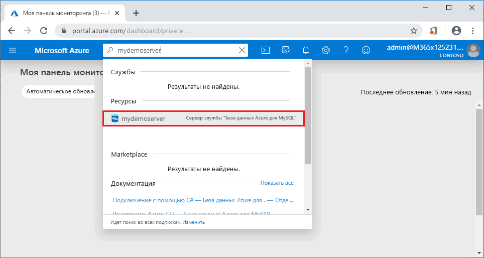
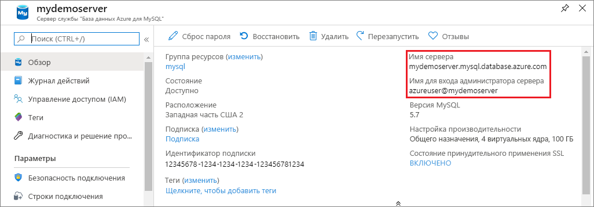

# <a name="quickstart-use-python-to-connect-and-query-data-with-azure-database-for-mysql"></a>Краткое руководство. Использование Python для подключения к данным и отправки запросов к ним с помощью Базы данных Azure для MySQL
Это краткое руководство демонстрирует, как использовать [Python](https://python.org) для подключения к базе данных Azure для MySQL. Инструкции SQL можно использовать для запроса, вставки, обновления и удаления данных в базе данных из платформ Windows, Mac OS и Ubuntu Linux. 

В этой статье предполагается, что у вас уже есть опыт разработки на языке Python, однако вы только начали работу со службой "База данных Azure для MySQL".

## <a name="create-an-azure-database-for-mysql"></a>Создание Базы данных Azure для MySQL 
Создайте базу данных и Базу данных Azure для сервера MySQL, следуя инструкциям в 
- [Создание базы данных Azure для сервера MySQL с помощью портала Azure](quickstart-create-mysql-server-database-using-azure-portal.md) или 
- [Краткое руководство. Создание сервера базы данных Azure для MySQL с помощью Azure CLI](quickstart-create-mysql-server-database-using-azure-cli.md) 

## <a name="install-python-and-the-mysql-connector"></a>Установка Python и соединителя MySQL
Установите Python и соединитель MySQL для Python на компьютере с помощью приведенных ниже шагов. 

> [!NOTE]
> В этом кратком руководстве при подключении к MySQL используются простые SQL-запросы. Если вы применяете веб-платформу, используйте для нее рекомендуемый соединитель, например, [mysqlclient](https://pypi.org/project/mysqlclient/) для Django.

1. Загрузите и установите [Python 3.7 или выше](https://www.python.org/downloads/) для вашей ОС. Не забудьте добавить Python в `PATH`, потому что это нужно для соединителя MySQL.
   
1. Откройте командную строку или оболочку `bash` и проверьте версию Python, запустив `python -V` с помощью коммутатора V прописными буквами.
   
1. Установщик пакетов `pip` включено в последние версии Python. Обновите `pip` до последней версии, запустив `pip install -U pip`. 
   
   Если `pip` не установлен, можно скачать и установить его с `get-pip.py`. Дополнительные сведения см. в разделе [Установка](https://pip.pypa.io/en/stable/installing/). 
   
1. Используйте `pip` чтоб установить соединитель MySQL для Python и его зависимости.
   
   ```bash
   pip install mysql-connector-python
   ```
   
   Соединитель Python для MySQL также можно установить из [mysql.com](https://dev.mysql.com/downloads/connector/python/). Дополнительные сведения о соединителе MySQL для Python см. в руководстве [MySQL Connector/Python Developer Guide](https://dev.mysql.com/doc/connector-python/en/) (Соединитель MySQL/Руководство разработчика Python). 

## <a name="get-connection-information"></a>Получение сведений о подключении
Получите сведения, необходимые для подключения к базе данных Azure для MySQL с портала Azure. Вам потребуется имя сервера, имя базы данных и учетные данные для входа.

1. Войдите на [портал Azure](https://portal.azure.com/).
   
1. На панели поиска портала найдите и выберите базу данных Azure для сервера MySQL, которую вы создали, например, **mydemoserver**.
   
   
   
1. Запишите **имя сервера** и **имя для входа администратора сервера** со страницы сервера **Обзор**. Если вы забыли свой пароль, можно также сбросить пароль с помощью этой страницы.
   
   

## <a name="run-the-python-examples"></a>Выполнение примеров кода Python
Для каждого примера кода в этой статье сделайте следующее:

1. Создайте файл в текстовом редакторе.
1. Добавьте пример кода в файл. В коде замените заполнители `<mydemoserver>`, `<myadmin>`, `<mypassword>`, и заполнители `<mydatabase>` значениями для сервера MySQL и базы данных.
1. Сохраните файл в папку проекта с расширением *.ру*, например *С:\pythonmysql\createtable.py* или */home/username/pythonmysql/createtable.py*.
1. Чтобы запустить код, откройте командную строку или оболочку `bash` и измените каталог в папке проекта, например `cd pythonmysql`. Введите команду `python` за которой следует имя файла, например `python createtable.py`, и нажмите клавишу ВВОД. 
   
   > [!NOTE]
   > В Windows, если файл *python.exe* не найден, может потребоваться добавить путь Python в переменную среды PATH или указать полный путь к *python.exe*, например `C:\python27\python.exe createtable.py`.

## <a name="create-a-table-and-insert-data"></a>Создание таблицы и вставка данных
Используйте следующий код для подключения к серверу и базе данных, создания таблицы и загрузки данных с помощью инструкции SQL **INSERT**. 

Код импортирует библиотеку mysql.connector и использует функцию [connect ()](https://dev.mysql.com/doc/connector-python/en/connector-python-api-mysql-connector-connect.html) для подключения к базе данных Azure для MySQL с помощью [аргументов](https://dev.mysql.com/doc/connector-python/en/connector-python-connectargs.html) в коллекции конфигураций. Код использует курсор при подключении, а метод [cursor.execute()](https://dev.mysql.com/doc/connector-python/en/connector-python-api-mysqlcursor-execute.html) выполняет SQL-запрос к базе данных MySQL. 

```python
import mysql.connector
from mysql.connector import errorcode

# Obtain connection string information from the portal
config = {
  'host':'<mydemoserver>.mysql.database.azure.com',
  'user':'<myadmin>@<mydemoserver>',
  'password':'<mypassword>',
  'database':'<mydatabase>'
}

# Construct connection string
try:
   conn = mysql.connector.connect(**config)
   print("Connection established")
except mysql.connector.Error as err:
  if err.errno == errorcode.ER_ACCESS_DENIED_ERROR:
    print("Something is wrong with the user name or password")
  elif err.errno == errorcode.ER_BAD_DB_ERROR:
    print("Database does not exist")
  else:
    print(err)
else:
  cursor = conn.cursor()

  # Drop previous table of same name if one exists
  cursor.execute("DROP TABLE IF EXISTS inventory;")
  print("Finished dropping table (if existed).")

  # Create table
  cursor.execute("CREATE TABLE inventory (id serial PRIMARY KEY, name VARCHAR(50), quantity INTEGER);")
  print("Finished creating table.")

  # Insert some data into table
  cursor.execute("INSERT INTO inventory (name, quantity) VALUES (%s, %s);", ("banana", 150))
  print("Inserted",cursor.rowcount,"row(s) of data.")
  cursor.execute("INSERT INTO inventory (name, quantity) VALUES (%s, %s);", ("orange", 154))
  print("Inserted",cursor.rowcount,"row(s) of data.")
  cursor.execute("INSERT INTO inventory (name, quantity) VALUES (%s, %s);", ("apple", 100))
  print("Inserted",cursor.rowcount,"row(s) of data.")

  # Cleanup
  conn.commit()
  cursor.close()
  conn.close()
  print("Done.")
```

## <a name="read-data"></a>Чтение данных
Используйте указанный ниже код с инструкцией SQL **SELECT** для подключения и чтения данных. 

Код импортирует библиотеку mysql.connector и использует функцию [connect ()](https://dev.mysql.com/doc/connector-python/en/connector-python-api-mysql-connector-connect.html) для подключения к базе данных Azure для MySQL с помощью [аргументов](https://dev.mysql.com/doc/connector-python/en/connector-python-connectargs.html) в коллекции конфигураций. Код использует курсор при подключении, а метод [cursor.execute()](https://dev.mysql.com/doc/connector-python/en/connector-python-api-mysqlcursor-execute.html) выполняет SQL-запрос к базе данных MySQL. 

Код считывает строки данных с помощью метода [fetchall()](https://dev.mysql.com/doc/connector-python/en/connector-python-api-mysqlcursor-fetchall.html), сохраняет набор результатов в строке коллекции и использует итератор `for` для циклического перемещения по строкам.

```python
import mysql.connector
from mysql.connector import errorcode

# Obtain connection string information from the portal
config = {
  'host':'<mydemoserver>.mysql.database.azure.com',
  'user':'<myadmin>@<mydemoserver>',
  'password':'<mypassword>',
  'database':'<mydatabase>'
}

# Construct connection string
try:
   conn = mysql.connector.connect(**config)
   print("Connection established")
except mysql.connector.Error as err:
  if err.errno == errorcode.ER_ACCESS_DENIED_ERROR:
    print("Something is wrong with the user name or password")
  elif err.errno == errorcode.ER_BAD_DB_ERROR:
    print("Database does not exist")
  else:
    print(err)
else:
  cursor = conn.cursor()

  # Read data
  cursor.execute("SELECT * FROM inventory;")
  rows = cursor.fetchall()
  print("Read",cursor.rowcount,"row(s) of data.")

  # Print all rows
  for row in rows:
    print("Data row = (%s, %s, %s)" %(str(row[0]), str(row[1]), str(row[2])))

  # Cleanup
  conn.commit()
  cursor.close()
  conn.close()
  print("Done.")
```

## <a name="update-data"></a>Обновление данных
Используйте указанный ниже код с инструкцией SQL **UPDATE** для подключения и обновления данных. 

Код импортирует библиотеку mysql.connector и использует функцию [connect ()](https://dev.mysql.com/doc/connector-python/en/connector-python-api-mysql-connector-connect.html) для подключения к базе данных Azure для MySQL с помощью [аргументов](https://dev.mysql.com/doc/connector-python/en/connector-python-connectargs.html) в коллекции конфигураций. Код использует курсор при подключении, а метод [cursor.execute()](https://dev.mysql.com/doc/connector-python/en/connector-python-api-mysqlcursor-execute.html) выполняет SQL-запрос к базе данных MySQL. 

```python
import mysql.connector
from mysql.connector import errorcode

# Obtain connection string information from the portal
config = {
  'host':'<mydemoserver>.mysql.database.azure.com',
  'user':'<myadmin>@<mydemoserver>',
  'password':'<mypassword>',
  'database':'<mydatabase>'
}

# Construct connection string
try:
   conn = mysql.connector.connect(**config)
   print("Connection established")
except mysql.connector.Error as err:
  if err.errno == errorcode.ER_ACCESS_DENIED_ERROR:
    print("Something is wrong with the user name or password")
  elif err.errno == errorcode.ER_BAD_DB_ERROR:
    print("Database does not exist")
  else:
    print(err)
else:
  cursor = conn.cursor()

  # Update a data row in the table
  cursor.execute("UPDATE inventory SET quantity = %s WHERE name = %s;", (200, "banana"))
  print("Updated",cursor.rowcount,"row(s) of data.")

  # Cleanup
  conn.commit()
  cursor.close()
  conn.close()
  print("Done.")
```

## <a name="delete-data"></a>Удаление данных
Используйте указанный ниже код с инструкцией SQL**DELETE** для подключения и удаления данных. 

Код импортирует библиотеку mysql.connector и использует функцию [connect ()](https://dev.mysql.com/doc/connector-python/en/connector-python-api-mysql-connector-connect.html) для подключения к базе данных Azure для MySQL с помощью [аргументов](https://dev.mysql.com/doc/connector-python/en/connector-python-connectargs.html) в коллекции конфигураций. Код использует курсор при подключении, а метод [cursor.execute()](https://dev.mysql.com/doc/connector-python/en/connector-python-api-mysqlcursor-execute.html) выполняет SQL-запрос к базе данных MySQL. 

```python
import mysql.connector
from mysql.connector import errorcode

# Obtain connection string information from the portal
config = {
  'host':'<mydemoserver>.mysql.database.azure.com',
  'user':'<myadmin>@<mydemoserver>',
  'password':'<mypassword>',
  'database':'<mydatabase>'
}

# Construct connection string
try:
   conn = mysql.connector.connect(**config)
   print("Connection established.")
except mysql.connector.Error as err:
  if err.errno == errorcode.ER_ACCESS_DENIED_ERROR:
    print("Something is wrong with the user name or password.")
  elif err.errno == errorcode.ER_BAD_DB_ERROR:
    print("Database does not exist.")
  else:
    print(err)
else:
  cursor = conn.cursor()

  # Delete a data row in the table
  cursor.execute("DELETE FROM inventory WHERE name=%(param1)s;", {'param1':"orange"})
  print("Deleted",cursor.rowcount,"row(s) of data.")

  # Cleanup
  conn.commit()
  cursor.close()
  conn.close()
  print("Done.")
```

## <a name="next-steps"></a>Дальнейшие действия
> [!div class="nextstepaction"]
> [Перенос базы данных с помощью экспорта и импорта](./concepts-migrate-import-export.md)
