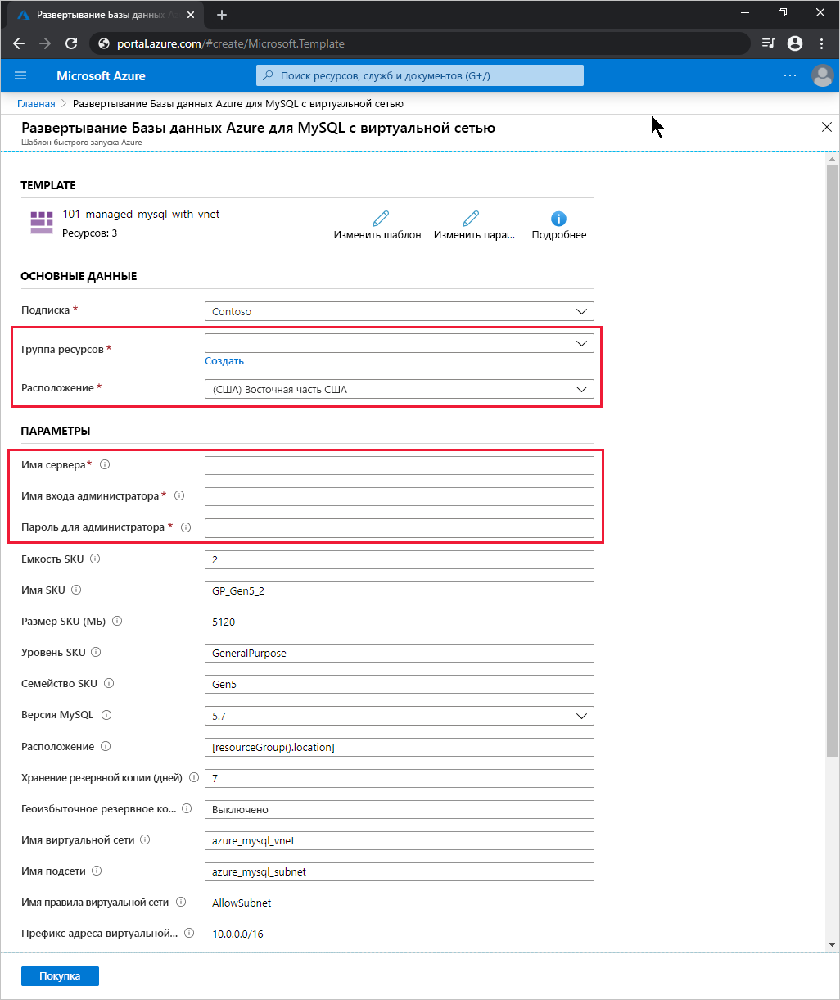

# <a name="quickstart-use-a-resource-manager-template-to-create-an-azure-database-for-mysql-server"></a>Краткое руководство. Создание сервера Базы данных Azure для MySQL с помощью шаблона Azure Resource Manager

База данных Azure для MySQL — это управляемая служба, которая позволяет запускать, администрировать и масштабировать в облаке базы данных MySQL с высоким уровнем доступности. В этом кратком руководстве показано, как с помощью шаблона Azure Resource Manager (ARM) создать сервер Базы данных Azure для MySQL с интеграцией виртуальной сети. Этот сервер можно развернуть на портале Azure, в Azure CLI или Azure PowerShell.

[!INCLUDE [About Azure Resource Manager](../../includes/resource-manager-quickstart-introduction.md)]

## <a name="prerequisites"></a>Предварительные требования

# <a name="portal"></a>[Портал](#tab/azure-portal)

Учетная запись Azure с активной подпиской. [Создайте бесплатно](https://azure.microsoft.com/free/).

# <a name="powershell"></a>[PowerShell](#tab/PowerShell)

* Учетная запись Azure с активной подпиской. [Создайте бесплатно](https://azure.microsoft.com/free/).
* Если вы хотите выполнить код локально, используйте [Azure PowerShell](/powershell/azure/).

# <a name="cli"></a>[CLI](#tab/CLI)

* Учетная запись Azure с активной подпиской. [Создайте бесплатно](https://azure.microsoft.com/free/).
* Если вы хотите выполнить код локально, используйте [Azure CLI](/cli/azure/).

---

## <a name="create-an-azure-database-for-mysql-server"></a>Создайте сервер базы данных Azure для MySQL.

Сервер Базы данных Azure для MySQL создается с определенным набором вычислительных ресурсов и ресурсов хранения. Дополнительные сведения см. в статье [Ценовые категории службы "База данных Azure для MySQL"](concepts-pricing-tiers.md). Он создается в [группе ресурсов Azure](../azure-resource-manager/management/overview.md).

### <a name="review-the-template"></a>Изучение шаблона

Шаблон, используемый в этом кратком руководстве, взят из [шаблонов быстрого запуска Azure](https://github.com/Azure/azure-quickstart-templates/tree/master/101-managed-mysql-with-vnet/).

:::code language="json" source="~/quickstart-templates/101-managed-mysql-with-vnet/azuredeploy.json" range="001-231" highlight="149,162,176,199,213":::

Этот шаблон определяет пять ресурсов:

* [**Microsoft.Network/virtualNetworks**](/azure/templates/microsoft.network/virtualnetworks);
* [**Microsoft.Network/virtualNetworks/subnets**](/azure/templates/microsoft.network/virtualnetworks/subnets);
* [**Microsoft.DBforMySQL/servers**](/azure/templates/microsoft.dbformysql/servers);
* [**Microsoft.DBforMySQL/servers/virtualNetworkRules**](/azure/templates/microsoft.dbformysql/servers/virtualnetworkrules);
* [**Microsoft.DBforMySQL/servers/firewallRules**](/azure/templates/microsoft.dbformysql/servers/firewallrules).

Дополнительные примеры шаблонов Базы данных Azure для MySQL можно найти в [коллекции шаблонов быстрого запуска Azure](https://azure.microsoft.com/resources/templates/?resourceType=Microsoft.Dbformysql&pageNumber=1&sort=Popular).

## <a name="deploy-the-template"></a>Развертывание шаблона

# <a name="portal"></a>[Портал](#tab/azure-portal)

Щелкните следующую ссылку, чтобы развернуть шаблон сервера Базы данных Azure для MySQL с помощью портала Azure.

[](https://portal.azure.com/#create/Microsoft.Template/uri/https%3a%2f%2fraw.githubusercontent.com%2fAzure%2fazure-quickstart-templates%2fmaster%2f101-managed-mysql-with-vnet%2fazuredeploy.json)

На странице **развертывания Базы данных Azure для MySQL с виртуальной сетью** сделайте следующее:

1. В разделе **Группа ресурсов** щелкните **Создать новую**, введите имя новой группы ресурсов и нажмите **ОК**.

2. Если вы создаете новую группу ресурсов, выберите **расположение** для группы ресурсов и новый сервер.

3. Введите значения в полях **Имя сервера**, **Имя входа администратора** и **Пароль администратора для входа**.

    

4. Измените остальные стандартные параметры по своему усмотрению.

    * **Подписка** — выберите подписку Azure, которую вы примените для этого сервера.
    * **Емкость SKU** — количество виртуальных ядер, где допускаются значения *2* (по умолчанию), *4*, *8*, *16*, *32* или *64*.
    * **Имя SKU** — префикс уровня SKU, семейство SKU и емкость SKU, соединенные символами подчеркивания, например так: *B_Gen5_1*, *GP_Gen5_2* (по умолчанию) или *MO_Gen5_32*.
    * **SKU Size MB** (Размер SKU в МБ) — размер в мегабайтах для хранилища сервера Базы данных Azure для MySQL (по умолчанию это *5120*).
    * **Уровень SKU** — уровень развертывания, например *Basic*, *GeneralPurpose* (по умолчанию) или *MemoryOptimized*.
    * **Семейство SKU** — значение *Gen4* или *Gen5*, которое обозначает поколение оборудования для развертывания сервера.
    * **Версия MySQL** — версия сервера MySQL для развертывания, например *5.6* или *5.7* (по умолчанию).
    * **Backup Retention Days** (Срок хранения резервных копий) — требуемый период для хранения геоизбыточных резервных копий в днях (по умолчанию *7*).
    * **Геоизбыточное резервное копирование** — *Включено* или *Выключено* (по умолчанию), в зависимости от потребности в геоизбыточном аварийном восстановлении (GEO-DR).
    * **Имя виртуальной сети** — имя используемой виртуальной сети (по умолчанию *azure_mysql_vnet*).
    * **Имя подсети** — имя используемой подсети (по умолчанию *azure_mysql_subnet*).
    * **Имя правила виртуальной сети** — имя правила виртуальной сети, которое разрешает эту подсеть (по умолчанию *AllowSubnet*).
    * **Префикс адресов виртуальной сети** — префикс адресов для виртуальной сети (по умолчанию *10.0.0.0/16*).
    * **Префикс подсети** — префикс адресов для подсети (по умолчанию *10.0.0.0/16*).

5. Прочтите условия использования и установите флажок **Я принимаю указанные выше условия**.

6. Щелкните **Приобрести**.

# <a name="powershell"></a>[PowerShell](#tab/PowerShell)

С помощью следующего интерактивного кода создайте сервер Базы данных Azure для MySQL на основе шаблона. В коде вам предложено ввести имя нового сервера, имя и расположение новой группы ресурсов, а также имя и пароль учетной записи администратора.

Чтобы выполнить этот код в Azure Cloud Shell, щелкните **Попробовать** в правом верхнем углу блока кода.

```azurepowershell-interactive
$serverName = Read-Host -Prompt "Enter a name for the new Azure Database for MySQL server"
$resourceGroupName = Read-Host -Prompt "Enter a name for the new resource group where the server will exist"
$location = Read-Host -Prompt "Enter an Azure region (for example, centralus) for the resource group"
$adminUser = Read-Host -Prompt "Enter the Azure Database for MySQL server's administrator account name"
$adminPassword = Read-Host -Prompt "Enter the administrator password" -AsSecureString

New-AzResourceGroup -Name $resourceGroupName -Location $location # Use this command when you need to create a new resource group for your deployment
New-AzResourceGroupDeployment -ResourceGroupName $resourceGroupName `
    -TemplateUri https://raw.githubusercontent.com/Azure/azure-quickstart-templates/master/101-managed-mysql-with-vnet/azuredeploy.json `
    -serverName $serverName `
    -administratorLogin $adminUser `
    -administratorLoginPassword $adminPassword

Read-Host -Prompt "Press [ENTER] to continue ..."
```

# <a name="cli"></a>[CLI](#tab/CLI)

С помощью следующего интерактивного кода создайте сервер Базы данных Azure для MySQL на основе шаблона. В коде вам предложено ввести имя нового сервера, имя и расположение новой группы ресурсов, а также имя и пароль учетной записи администратора.

Чтобы выполнить этот код в Azure Cloud Shell, щелкните **Попробовать** в правом верхнем углу блока кода.

```azurecli-interactive
echo "Enter a name for the new Azure Database for MySQL server:" &&
read serverName &&
echo "Enter a name for the new resource group where the server will exist:" &&
read resourceGroupName &&
echo "Enter an Azure region (for example, centralus) for the resource group:" &&
read location &&
echo "Enter the Azure Database for MySQL server's administrator account name:" &&
read adminUser &&
echo "Enter the administrator password:" &&
read adminPassword &&
params='serverName='$serverName' administratorLogin='$adminUser' administratorLoginPassword='$adminPassword &&
az group create --name $resourceGroupName --location $location &&
az deployment group create --resource-group $resourceGroupName --parameters $params --template-uri https://raw.githubusercontent.com/Azure/azure-quickstart-templates/master/101-managed-mysql-with-vnet/azuredeploy.json &&
echo "Press [ENTER] to continue ..."
```

---

## <a name="review-deployed-resources"></a>Просмотр развернутых ресурсов

# <a name="portal"></a>[Портал](#tab/azure-portal)

Чтобы просмотреть сводные сведения о новом сервере Базы данных Azure для MySQL, сделайте следующее:

1. На [портале Azure](https://portal.azure.com) выполните поиск по фразе **Серверы Базы данных Azure для MySQL** и выберите этот вариант.

2. В списке баз данных выберите новый сервер. Откроется страница **Обзор** для нового сервера Базы данных Azure для MySQL.

# <a name="powershell"></a>[PowerShell](#tab/PowerShell)

Выполните следующий интерактивный код, чтобы просмотреть сведения о сервере Базы данных Azure для MySQL. Вам будет предложено ввести имя нового сервера.

```azurepowershell-interactive
$serverName = Read-Host -Prompt "Enter the name of your Azure Database for MySQL server"
Get-AzResource -ResourceType "Microsoft.DBforMySQL/servers" -Name $serverName | ft
Write-Host "Press [ENTER] to continue..."
```

# <a name="cli"></a>[CLI](#tab/CLI)

Выполните следующий интерактивный код, чтобы просмотреть сведения о сервере Базы данных Azure для MySQL. Вам нужно ввести имя группы ресурсов для нового сервера.

```azurecli-interactive
echo "Enter your Azure Database for MySQL server name:" &&
read serverName &&
echo "Enter the resource group where the Azure Database for MySQL server exists:" &&
read resourcegroupName &&
az resource show --resource-group $resourcegroupName --name $serverName --resource-type "Microsoft.DbForMySQL/servers"
```

---

## <a name="clean-up-resources"></a>Очистка ресурсов

Удалите ненужную группу ресурсов, когда надобность в ней отпадет. Ресурсы в ней также будут удалены.

# <a name="portal"></a>[Портал](#tab/azure-portal)

1. На [портале Azure](https://portal.azure.com) найдите и выберите элемент **Группы ресурсов**.

2. В списке групп ресурсов выберите имя нужной группы ресурсов.

3. На странице **Обзор** для этой группы ресурсов выберите **Удалить группу ресурсов**.

4. В диалоговом окне подтверждения введите имя группы ресурсов и щелкните **Удалить**.

# <a name="powershell"></a>[PowerShell](#tab/PowerShell)

```azurepowershell-interactive
$resourceGroupName = Read-Host -Prompt "Enter the Resource Group name"
Remove-AzResourceGroup -Name $resourceGroupName
Write-Host "Press [ENTER] to continue..."
```

# <a name="cli"></a>[CLI](#tab/CLI)

```azurecli-interactive
echo "Enter the Resource Group name:" &&
read resourceGroupName &&
az group delete --name $resourceGroupName &&
echo "Press [ENTER] to continue ..."
```

---

## <a name="next-steps"></a>Дальнейшие действия

Пошаговые инструкции по созданию шаблона см. в следующей статье:

> [!div class="nextstepaction"]
> [Руководство. Создание и развертывание первого шаблона Azure Resource Manager](../azure-resource-manager/templates/template-tutorial-create-first-template.md)
