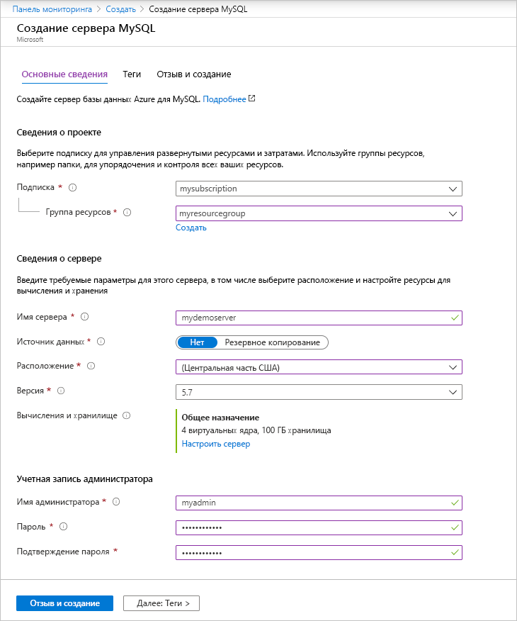
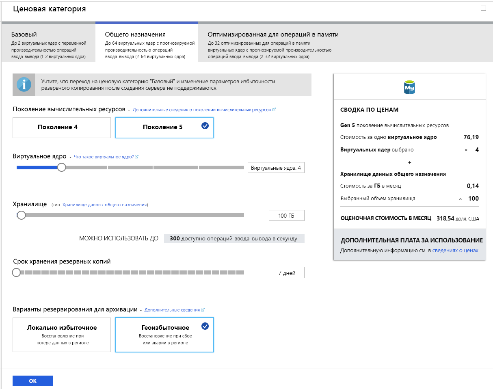
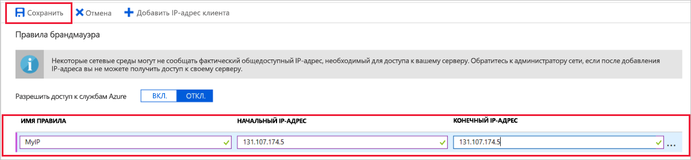

# <a name="create-an-azure-database-for-mysql-server-by-using-the-azure-portal"></a>Создание базы данных Azure для сервера MySQL с помощью портала Azure

База данных Azure для MySQL — это управляемая служба, которая позволяет запускать, администрировать и масштабировать высокодоступные базы данных MySQL в облаке. В этом кратком руководстве описывается, как за пять минут создать сервер службы "База данных Azure для MySQL" с помощью портала Azure.  

Если у вас еще нет подписки Azure, создайте [бесплатную учетную запись](https://azure.microsoft.com/free/) Azure, прежде чем начинать работу.

## <a name="sign-in-to-the-azure-portal"></a>Вход на портал Azure
В браузере откройте [портал Azure](https://portal.azure.com/). Введите свои учетные данные для входа на портал. Панель мониторинга службы является представлением по умолчанию.

## <a name="create-an-azure-database-for-mysql-server"></a>Создайте сервер базы данных Azure для MySQL.
Сервер базы данных Azure для MySQL создается с определенным набором [вычислительных ресурсов и ресурсов хранения](./concepts-compute-unit-and-storage.md). Он создается в [группе ресурсов Azure](../azure-resource-manager/resource-group-overview.md).

Чтобы создать базу данных Azure для сервера MySQL, сделайте следующее:

1. Нажмите кнопку **Создать ресурс** (+) в левом верхнем углу окна портала.

2. Выберите **Базы данных** > **База данных Azure для MySQL**. Чтобы найти службу, вы также можете ввести в поле поиска **MySQL**.

   

3. Заполните форму для создания сервера, указав следующую информацию:
   
   

    **Параметр** | **Рекомендуемое значение** | **Описание поля** 
    ---|---|---
    Имя сервера | Уникальное имя сервера | Выберите уникальное имя, идентифицирующее базу данных Azure для сервера MySQL. Например, mydemoserver. Имя домена *.mysql.database.azure.com* добавляется к указанному имени сервера. Имя сервера может содержать только строчные буквы, цифры и знак дефиса (-). Его длина должна составлять от 3 до 63 символов.
    Подписка | Ваша подписка | Выберите подписку Azure, которую вы хотите использовать для сервера. Если у вас есть несколько подписок, выберите ту, в которой взимается плата за использование ресурса.
    Группа ресурсов | *myresourcegroup* | Укажите имя новой или имеющейся группы ресурсов.
    Выбор источника | *Пустой* | Чтобы создать сервер с нуля, выберите *Пустой*. (Выберите *Резервное копирование* при создании сервера из геоизбыточного хранилища резервных копий существующего сервера Базы данных Azure для MySQL.)
    учетные данные администратора сервера для входа; | myadmin | Учетная запись для входа, используемая при подключении к серверу. Не используйте для имени учетной записи администратора такие варианты: **azure_superuser**, **admin**, **administrator**, **root**, **guest** или **public**.
    Пароль | *По своему выбору* | Укажите пароль учетной записи администратора сервера. Его длина должна составлять от 8 до 128 символов. Пароль должен содержать символы из таких трех категорий: прописные латинские буквы, строчные латинские буквы, цифры (0–9) и небуквенно-цифровые знаки (!, $, #, % и т. д.).
    Подтверждение пароля. | *По своему выбору*| Подтвердите пароль учетной записи администратора.
    Расположение | *Ближайший к пользователям регион*| Выберите расположение, наиболее близкое к пользователям или другим приложениям Azure.
    Version (версия) | *Последний основной номер версии*| Последний основной номер версии (если нет особых требований использовать другую версию).
    Ценовой уровень | **Общего назначения**, **Поколение 5**, **2 виртуальных ядра**, **5 ГБ**, **7 дней**, **Геоизбыточное хранилище** | Конфигурации вычислительных ресурсов, хранилища и резервного копирования для нового сервера. Выберите **ценовую категорию**. Затем выберите вкладку **Общего назначения**. *Поколение 5*, *2 виртуальных ядра*, *5 ГБ*, и *7 дней* — это значения по умолчанию для параметров **Поколение вычислительных ресурсов**, **Виртуальное ядро**, **Хранилище** и **Срок хранения резервных копий**. Можно оставить эти ползунки как есть. Чтобы включить резервные копии сервера в географически избыточном хранилище, выберите **Геоизбыточное хранилище** в **параметрах избыточности резервного копирования**. Щелкните **ОК**, чтобы сохранить ценовую категорию. На следующем снимке экрана показаны выбранные параметры.
  
   > [!NOTE]
   > Используйте ценовую категорию "Базовый", если для вашей рабочей нагрузки не требуется большое количество вычислительных ресурсов и операций ввода-вывода. Обратите внимание, что серверы, созданные в ценовой категории "Базовый", нельзя масштабировать до ценовых категорий "Общего назначения" или "Оптимизировано для памяти". Дополнительные сведения см. на [странице с ценами](https://azure.microsoft.com/pricing/details/mysql/).
   > 

   

4. Щелкните **Создать**, чтобы подготовить сервер. Подготовка может занять до 20 минут.
   
5. На панели инструментов щелкните **Уведомления** (значок колокольчика), чтобы отслеживать процесс развертывания.
   
   По умолчанию на сервере создаются следующие базы данных: **information_schema**, **mysql**, **performance_schema** и **sys**.

## <a name="configure-a-server-level-firewall-rule"></a>Настройка правила брандмауэра на уровне сервера

База данных Azure для службы MySQL создает брандмауэр на уровне сервера. Чтобы брандмауэр разрешил внешним приложениям и средствам подключаться к серверу и любой базе данных на сервере, должно быть создано соответствующее правило, открывающее брандмауэр для определенных IP-адресов. 

1. Найдите сервер после завершения развертывания. Для этого при необходимости можно выполнить поиск. Например, щелкните **Все ресурсы** в меню слева. Затем введите имя сервера (например, **mydemoserver**), чтобы найти созданный сервер. Выберите имя сервера в списке результатов поиска. После этого откроется страница **обзора** сервера с параметрами для дальнейшей конфигурации.

2. На странице сервера выберите **Безопасность подключения**.

3. В разделе **Правила брандмауэра** щелкните пустое текстовое поле в столбце **Имя правила**, чтобы создать правило брандмауэра. Введите точный диапазон IP-адресов клиентов, которые будут иметь доступ к этому серверу.
   
   


4. На верхней панели инструментов на странице **Безопасность подключения** щелкните **Сохранить**. Прежде чем продолжить, подождите, пока не появится уведомление о том, что обновление успешно завершено. 

   > [!NOTE]
   > Подключитесь к базе данных Azure для MySQL через порт 3306. Если вы пытаетесь подключиться из корпоративной сети, исходящий трафик через порт 3306 может быть запрещен. В таком случае вы не сможете подключиться к серверу. Для этого ваш ИТ-отдел должен открыть порт 3306.
   > 

## <a name="get-the-connection-information"></a>Получение сведений о подключении
Чтобы подключиться к серверу базы данных, вам потребуются учетные данные администратора для входа и полное имя сервера. Скорее всего, вы уже записали эти значения раньше. Если нет, вы можете легко найти данные для входа на странице **Обзор** сервера или на странице **Свойства** на портале Azure.

Чтобы найти эти значения, сделайте следующее: 

1. Откройте страницу сервера **Обзор**. Запишите значения **имени сервера** и **имени для входа администратора сервера**. 

2. Наведите указатель на каждое поле. Справа от текста отобразится значок копирования. Щелкните значок копирования, чтобы скопировать нужные значения.

В этом примере серверу присвоено имя **mydemoserver.mysql.database.azure.com**, а имя для входа администратора сервера — **myadmin\@mydemoserver**.

## <a name="connect-to-mysql-by-using-the-mysql-command-line-tool"></a>Подключение к MySQL с помощью программы командной строки mysql
Подключитесь к серверу с помощью программы командной строки **mysql.exe**. MySQL можно скачать [здесь](https://dev.mysql.com/downloads/) и установить на компьютер. 

1. Чтобы подключиться к серверу базы данных Azure для MySQL с помощью служебной программы mysql, используйте следующий формат:

    ```bash
    mysql --host <fully qualified server name> --user <server admin login name>@<server name> -p
    ```

    Например, следующая команда позволяет подключиться к нашему серверу, используемому для примера:

    ```bash
    mysql --host mydemoserver.mysql.database.azure.com --user myadmin@mydemoserver -p
    ```

    параметр mysql |Рекомендуемое значение|ОПИСАНИЕ
    ---|---|---
    --host | *Server name* (Имя сервера) | Значение имени сервера, которое вы использовали раньше при создании базы данных Azure для сервера MySQL. В нашем примере используется такое имя сервера: **mydemoserver.mysql.database.azure.com**. Используйте полное доменное имя (**\*.mysql.database.azure.com**), как показано в примере. Если вы не помните имя своего сервера, выполните действия из предыдущего раздела, чтобы получить сведения о подключении. 
    --user | *Имя для входа администратора сервера* |Имя для входа администратора сервера, которое вы использовали раньше при создании базы данных Azure для сервера MySQL. Если вы не помните имя пользователя, выполните действия из предыдущего раздела, чтобы получить сведения о подключении. Формат *имя_пользователя\@имя_сервера*.
    -p | *Дождитесь появления запроса* |При появлении запроса укажите тот же пароль, который вы указали при создании сервера. Обратите внимание, что символы вводимого пароля не отображаются в строке Bash. Введите пароль и нажмите клавишу **ВВОД**.

   После подключения в служебной программе mysql появится командная строка `mysql>` для ввода команд. 

   Пример выходных данных mysql:

    ```bash
    Welcome to the MySQL monitor.  Commands end with ; or \g.
    Your MySQL connection id is 65505
    Server version: 5.6.26.0 MySQL Community Server (GPL)
    
    Copyright (c) 2000, 2017, Oracle and/or its affiliates. All rights reserved.
    
    Oracle is a registered trademark of Oracle Corporation and/or its
    affiliates. Other names may be trademarks of their respective
    owners.

    Type 'help;' or '\h' for help. Type '\c' to clear the current input statement.
    
    mysql>
    ```
    > [!TIP]
    > Если в брандмауэре не настроено разрешение IP-адресов клиента, возникает следующая ошибка:
    >
    > ERROR 2003 (28000). Для клиента с IP-адресом 123.456.789.0 доступ к серверу не разрешен.
    >
    > Чтобы устранить эту ошибку, убедитесь, что конфигурация сервера соответствует конфигурации, описанной в разделе "Настройка правила брандмауэра уровня сервера".

4. Чтобы проверить состояние подключения, просмотрите состояние сервера. Для этого введите `status` в командную строку mysql>.

    ```sql
    status
    ```

   > [!TIP]
   > Дополнительные команды см. в [разделе 4.5.1 справочного руководства по MySQL 5.7](https://dev.mysql.com/doc/refman/5.7/en/mysql.html).

5.  Создайте пустую базу данных. Для этого в командной строке **mysql>** введите следующую команду:
    ```sql
    CREATE DATABASE quickstartdb;
    ```
    Выполнение команды может занять несколько секунд. 

    На сервере базы данных Azure для MySQL можно создать одну или несколько баз данных. Можно создать по одной базе данных на каждом сервере, чтобы использовать все ресурсы, или несколько баз данных, чтобы предоставить общий доступ к ресурсам. Число создаваемых баз данных не ограничено, но все они совместно используют одни и те же ресурсы сервера. 

6. Выведите список баз данных в командной строке **mysql>**, введя следующую команду:

    ```sql
    SHOW DATABASES;
    ```

7.  Введите `\q`, а затем нажмите клавишу **ВВОД**, чтобы завершить работу средства mysql. 

Итак, вы подключились к базе данных Azure для сервера MySQL и создали пустую пользовательскую базу данных. В следующем разделе мы выполним похожее задание. Вы подключитесь к тому же серверу с помощью другого популярного средства — MySQL Workbench.

## <a name="connect-to-the-server-by-using-the-mysql-workbench-gui-tool"></a>Подключение к серверу с помощью инструмента графического пользовательского интерфейса MySQL Workbench
Чтобы подключиться к серверу с помощью средства графического пользовательского интерфейса MySQL Workbench, сделайте следующее:

1.  Откройте приложение MySQL Workbench на клиентском компьютере. Скачать и установить MySQL Workbench вы можете [здесь](https://dev.mysql.com/downloads/workbench/).

2. Создайте подключение. Щелкните значок плюс (+) рядом с заголовком **MySQL Connections** (Подключения MySQL).

3. В диалоговом окне **Setup New Connection** (Настройка нового подключения) на вкладке **Параметры** введите сведения о подключении сервера: Значения заполнителей показаны в качестве примера. Замените имя узла, имя пользователя и пароль собственными значениями.

   

    |Параметр |Рекомендуемое значение|Описание поля|
    |---|---|---|
     Имя подключения | Пример подключения | Метка для этого подключения. |
    Способ подключения | Стандартный способ (по протоколу TCP/IP) | Стандартный способ (по протоколу TCP/IP) соответствует требованиям. |
    имя узла; | *Server name* (Имя сервера) | Значение имени сервера, которое вы использовали раньше при создании базы данных Azure для сервера MySQL. В нашем примере используется такое имя сервера: **mydemoserver.mysql.database.azure.com**. Используйте полное доменное имя (**\*.mysql.database.azure.com**), как показано в примере. Если вы не помните имя своего сервера, выполните действия из предыдущего раздела, чтобы получить сведения о подключении.|
     Порт | 3306 | Порт, используемый при подключении к базе данных Azure для сервера MySQL. |
    Имя пользователя |  *Имя для входа администратора сервера* | Имя для входа администратора сервера, которое вы использовали раньше при создании базы данных Azure для сервера MySQL. В нашем примере используется имя пользователя **myadmin\@mydemoserver**. Если вы не помните имя пользователя, выполните действия из предыдущего раздела, чтобы получить сведения о подключении. Формат *имя_пользователя\@имя_сервера*.
    Пароль | *Ваш пароль* | Щелкните **Сохранить в хранилище**, чтобы сохранить пароль. |

4. Щелкните **Проверить подключение**, чтобы проверить, все ли параметры настроены правильно. Затем нажмите кнопку **ОК**, чтобы сохранить подключение. 

    > [!NOTE]
    > На сервере по умолчанию применяется протокол SSL. Чтобы подключиться, его нужно дополнительно настроить. Дополнительные сведения см. в статье [Настройка SSL-подключений в приложении для безопасного подключения к базе данных Azure для MySQL](./howto-configure-ssl.md). Чтобы отключить протокол SSL для работы с этим руководством, перейдите на портал Azure. Затем перейдите на страницу "Безопасность подключения", чтобы отключить выключатель **Принудительно использовать SSL-соединение**.

## <a name="clean-up-resources"></a>Очистка ресурсов
Вы можете удалить ресурсы, созданные в ходе работы с этим руководством, двумя способами. Можно удалить [группу ресурсов Azure](../azure-resource-manager/resource-group-overview.md), которая содержит все связанные ресурсы. Если же вы хотите сохранить другие ресурсы, удалите только один ресурс сервера.

> [!TIP]
> Другие краткие руководства из этого цикла созданы на основе этого документа. Если вы планируете продолжать работу с этими краткими руководствами, не удаляйте созданные ресурсы. Если вы не планируете продолжать работу, удалите все созданные в ходе работы с этим руководством ресурсы, выполнив следующие действия.
>

Чтобы удалить всю группу ресурсов, включая созданный сервер, сделайте следующее:

1.  Найдите группу ресурсов на портале Azure. В меню слева щелкните **Группы ресурсов**, а затем выберите имя группы ресурсов (в нашем примере это **myresourcegroup**).

2.  На странице "Группа ресурсов" щелкните **Удалить**. Затем введите имя своей группы ресурсов (в нашем примере это **myresourcegroup**) в текстовое поле, чтобы подтвердить удаление, и щелкните **Удалить**.

Чтобы удалить только созданный сервер, сделайте следующее:

1. Найдите сервер на портале Azure, если он у вас не открыт. В меню слева на портале Azure щелкните **Все ресурсы**. Затем найдите созданный сервер.

2. На странице **Обзор** щелкните **Удалить**. 

   

3. Подтвердите имя сервера, которое нужно удалить, чтобы отобразить связанные базы данных. Введите имя сервера в текстовое поле (в нашем примере это **mydemoserver**). Нажмите кнопку **Удалить**.

## <a name="next-steps"></a>Дополнительная информация

> [!div class="nextstepaction"]
> [Проектирование первой базы данных Azure для MySQL](./tutorial-design-database-using-portal.md)

