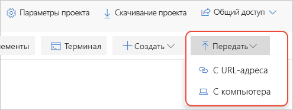

# Краткое руководство. Перенос локальной записной книжки Jupyter

Записные книжки Jupyter, создаваемые локально на компьютере, доступны только текущему пользователю. Можно совместно использовать файлы с помощью различных средств. Но затем у получателей будут собственные локальные копии записной книжки, и будет сложно объединить изменения, которые они внесли. Записные книжки также можно хранить в общем онлайн-репозитории, например GitHub. Но для этого по-прежнему требуется наличие у каждого участника совместной работы собственной локальной установки Jupyter с той же конфигурацией, что и у вас.

Перенос локальных записных книжек или записных книжек, расположенных в репозитории, в Записные книжки Azure позволяет хранить их в облаке, из которого вы можете предоставить к ним общий доступ другим участникам. Участникам совместной работы нужен только браузер, чтобы просматривать и запускать ваши записной книжки. Если они [войдут](quickstart-sign-in-azure-notebooks.md) в Записные книжки Azure, то также смогут вносить изменения.

В этом кратком руководстве описан перенос записной книжки с локального компьютера или другого доступного URL-адреса файла. Чтобы перенести записные книжки из репозитория GitHub, см. статью [Quickstart: Clone a notebook](quickstart-clone-jupyter-notebook.md) (Краткое руководство по клонированию записной книжки).

## Создание проекта в Записных книжках Azure

1. Перейдите в [Записные книжки Azure](https://notebooks.azure.com) и войдите в систему. (Дополнительные сведения см. в кратком руководстве по [входу в Записные книжки Azure](quickstart-sign-in-azure-notebooks.md).)

1. Вверху на общедоступной странице профиля щелкните **Мои проекты**:

    

1. На странице **Мои проекты** выберите **+ Новый проект** (сочетание клавиш: n). Если окно браузера сужено, кнопка может отображаться как **+** :

    

1. В появившемся всплывающем окне **Создание проекта** введите соответствующие значения для записной книжки, которую вы переносите, в поля **Имя проекта** и **Идентификатор проекта**, снимите флажки напротив вариантов **Public project** (Открытый проект) и **Create a README.md** (Создать файл README.md), а затем выберите **Создать**.

## Передача локальной записной книжки

1. На странице проекта выберите **Отправить** (отображается как стрелка вверх, только если окно браузера небольшое), затем выберите 1. В появившемся всплывающем окне выберите **С компьютера**, если записная книжка находится в локальной файловой системе, или **From URL** (С URL-адреса), если записная книжка находится в сети:

    

   Напоминаем: если записная книжка находится в репозитории GitHub, следуйте инструкциям в статье [Quickstart: Clone a notebook](quickstart-clone-jupyter-notebook.md)(Краткое руководство по клонированию записной книжки).

   - Если вы используете параметр **С компьютера**, перетащите файлы *.ipynb* в поле всплывающего окна или щелкните **Выбрать файлы**, а затем найдите и выберите файлы, которые нужно импортировать. Затем нажмите кнопку **Отправить**. Переданные файлы получают то же имя, что и у локальных файлов (не требуется отправлять содержимое папок *.ipynb_checkpoints*).

     

   - Если вы используете параметр **From URL** (С URL-адреса), введите адрес источника в поле **URL-адрес файла** и имя файла, чтобы назначить его записной книжке проекта в поле **Имя файла**. Затем нажмите кнопку **Отправить**. Если у вас несколько файлов с разными URL-адресами, используйте команду **+ Добавить файл**, чтобы проверить первый введенный URL-адрес. После этого во всплывающем окне появятся новые поля для других файлов.

     

1. Откройте и запустите только что переданную записную книжку, чтобы проверить ее содержимое и операцию. Когда все будет готово, последовательно выберите **Файл** > **Halt and close** (Остановить и закрыть), чтобы закрыть записную книжку.

1. Чтобы предоставить ссылку на отправленную записную книжку, щелкните правой кнопкой мыши файл в проекте и выберите **Копировать ссылку** (сочетание клавиш: y). Затем вставьте эту ссылку в соответствующее сообщение. Кроме того, можно совместно использовать проект целиком с помощью элемента управления **Общий доступ** на странице проекта.

1. Чтобы изменить файлы, не являющиеся записными книжками, щелкните правой кнопкой мыши файл в проекте и выберите **Изменить файл** (сочетание клавиш: i). Действие по умолчанию, **Запустить** (сочетание клавиш: r), позволяет только просматривать содержимое файла без редактирования

## Дополнительная информация

> [!div class="nextstepaction"]
> [Руководство по созданию и запуску записной книжки Jupyter для выполнения линейной регрессии](tutorial-create-run-jupyter-notebook.md)
