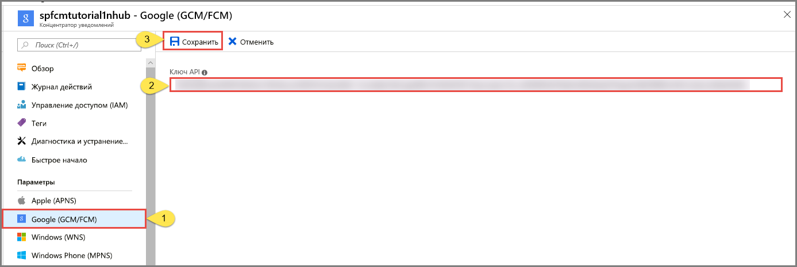

# Настройка параметров Google Firebase Cloud Messaging (FCM) для центра уведомлений в портал Azure
В этой статье показано, как настроить параметры Google Firebase Cloud Messaging (FCM) для центра уведомлений Azure с помощью портал Azure.  

## Предварительные требования
Если вы еще не создали центр уведомлений, сделайте это сейчас. Дополнительные сведения см. в статье [Создание центра уведомлений Azure с помощью портала Azure](create-notification-hub-portal.md). 

## Настройка Google Firebase Cloud Messaging (FCM)

Следующая процедура позволяет настроить параметры Google Firebase Cloud Messaging (FCM) для центра уведомлений. 

1. В портал Azure на странице **Центр уведомлений** выберите **Google (gcm/FCM)** в меню слева. 
2. В соответствующее поле вставьте **ключ API** для проекта FCM, сохраненного ранее. 
3. Щелкните **Сохранить**. 

   

## Следующие шаги
Пошаговые инструкции по отправке уведомлений на устройства Android с помощью центров уведомлений Azure и Google Firebase Cloud Messaging см. в статье [Push-уведомления для устройств Android с помощью концентраторов уведомлений и Google FCM](notification-hubs-android-push-notification-google-fcm-get-started.md).

