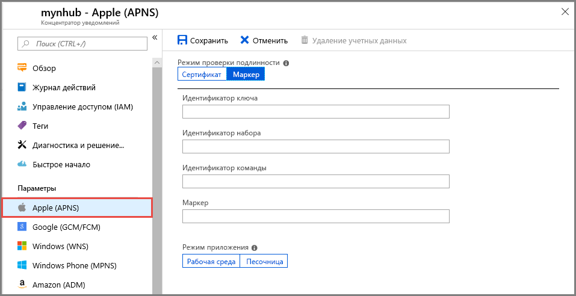

# <a name="quickstart-set-up-push-notifications-in-a-notification-hub"></a>Краткое руководство. Настройка push-уведомлений в центре уведомлений

Центры уведомлений Azure предоставляют удобный в использовании масштабируемый механизм отправки push-уведомлений. С помощью Центров уведомлений можно отправлять уведомления на любую платформу (iOS, Android, Windows, Baidu) и из любой серверной части (облачной или локальной). Дополнительные сведения см. в статье [Что такое Центры уведомлений Azure?](notification-hubs-push-notification-overview.md).

В этом кратком руководстве вы используете параметры системы отправки уведомлений платформы (PNS) в Центрах уведомлений для настройки push-уведомлений для нескольких платформ. Здесь описаны действия, которые необходимо выполнить на портале Azure.  Раздел [Google Firebase Cloud Messaging](/azure/notification-hubs/configure-notification-hub-portal-pns-settings?tabs=azure-cli#google-firebase-cloud-messaging-fcm) содержит инструкции по использованию Azure CLI.

Если вы еще не создали центр уведомлений, сделайте это сейчас. Дополнительные сведения см. в кратких руководствах по созданию центра уведомлений Azure с помощью [портала Azure](create-notification-hub-portal.md) и [Azure CLI](create-notification-hub-azure-cli.md).

## <a name="apple-push-notification-service"></a>Служба push-уведомлений Apple

Чтобы настроить Службу push-уведомлений Apple (APNS), сделайте следующее:

1. На портале Azure на странице **Центр уведомлений** выберите **Apple (APNS)** в меню слева.

1. В разделе **Режим проверки подлинности** выберите **Сертификат** или **Токен**.

   а. Если вы выбрали **Сертификат**:
   * Щелкните значок файла и выберите файл *.p12*, который нужно отправить.
   * Введите пароль.
   * Выберите режим **Песочница**. Если нужно отправлять push-уведомления пользователям, которые приобрели приложение в магазине, выберите режим **Рабочий**.

     

   b. Если вы выбрали **Токен**:

   * Введите значения для параметров **Идентификатор ключа**, **Идентификатор набора**, **Идентификатор команды** и **Токен**.
   * Выберите режим **Песочница**. Если нужно отправлять push-уведомления пользователям, которые приобрели приложение в магазине, выберите режим **Рабочий**.

     

См. статью [Руководство. Отправка push-уведомлений в приложения iOS с помощью Центров уведомлений Azure](ios-sdk-get-started.md).

## <a name="google-firebase-cloud-messaging-fcm"></a>Google Firebase Cloud Messaging (FCM)

# <a name="portal"></a>[Портал](#tab/azure-portal)

Чтобы настроить push-уведомления для Google FCM:

1. На портале Azure на странице **Центр уведомлений** выберите **Google (GCM/FCM)** в меню слева.
2. В соответствующее поле вставьте **ключ API** для проекта Google FCM, сохраненного ранее.
3. Щелкните **Сохранить**.

   

Когда вы выполните эти шаги, появится оповещение о том, что Центр уведомлений успешно обновлен. Кнопка **Сохранить** отключена.

# <a name="azure-cli"></a>[Azure CLI](#tab/azure-cli)

### <a name="prerequisites"></a>Предварительные требования

Перед началом работы убедитесь, что у вас есть такие компоненты.

* [Azure CLI](/cli/azure/install-azure-cli) 2.0.67 или более поздней версии;

* расширение Azure CLI [для центров уведомлений](/cli/azure/ext/notification-hub/notification-hub);
* **ключ API** для проекта Google Firebase Cloud Messaging (FCM).

### <a name="set-up-push-notifications-for-google-fcm"></a>Настройка push-уведомлений для Google FCM

1. Чтобы добавить ключ API Google в центр уведомлений, используйте команду [az notification-hub credential gcm update](/cli/azure/ext/notification-hub/notification-hub/credential/gcm#ext-notification-hub-az-notification-hub-credential-gcm-update).

   ```azurecli
   az notification-hub credential gcm update --resource-group spnhubrg --namespace-name spnhubns    --notification-hub-name spfcmtutorial1nhub --google-api-key myKey
   ```

2. Для подключения к центру уведомлений приложению Android нужна строка подключения.  Чтобы получить список доступных политик доступа, используйте команду [az notification-hub authorization-rule list](/cli/azure/ext/notification-hub/notification-hub/authorization-rule#ext-notification-hub-az-notification-hub-authorization-rule-list).  Чтобы получить строки подключения к политике доступа, используйте команду [az notification-hub authorization-rule list-keys](/cli/azure/ext/notification-hub/notification-hub/authorization-rule#ext-notification-hub-az-notification-hub-authorization-rule-list-keys).  Чтобы получить непосредственно основную строку подключения, укажите **primaryConnectionString** или **secondaryConnectionString** в параметре `--query`.

   ```azurecli
   #list access policies for a notification hub
   az notification-hub authorization-rule list --resource-group spnhubrg --namespace-name spnhubns --notification-hub-name spfcmtutorial1nhub --output table

   #list keys and connection strings for a notification hub access policy
   az notification-hub authorization-rule list-keys --resource-group spnhubrg --namespace-name spnhubns --notification-hub-name spfcmtutorial1nhub --name myAccessPolicyName --output json

   #get the primaryConnectionString for an access policy
   az notification-hub authorization-rule list-keys --resource-group spnhubrg --namespace-name spnhubns --notification-hub-name spfcmtutorial1nhub --name myAccessPolicyName --query primaryConnectionString
   ```

3. Чтобы протестировать отправку сообщений в приложение Android, используйте команду [az notification-hub test-send](/cli/azure/ext/notification-hub/notification-hub#ext-notification-hub-az-notification-hub-test-send).

   ```azurecli
   #test with message body
   az notification-hub test-send --resource-group spnhubrg --namespace-name spnhubns --notification-hub-name spfcmtutorial1nhub --notification-format gcm --message "my message body"

   #test with JSON string
   az notification-hub test-send --resource-group spnhubrg --namespace-name spnhubns --notification-hub-name spfcmtutorial1nhub --notification-format gcm --payload "{\"data\":{\"message\":\"my JSON string\"}}"
   ```

Получите ссылки на Azure CLI для других платформ с помощью команды [az notification-hub credential](/cli/azure/ext/notification-hub/notification-hub/credential).

---

Дополнительные сведения об отправке push-уведомлений в приложение Android с помощью Firebase см. в [этом руководстве](notification-hubs-android-push-notification-google-fcm-get-started.md).

## <a name="windows-push-notification-service"></a>Служба push-уведомлений Windows

Чтобы настроить службу push-уведомлений Windows (WNS), сделайте следующее:

1. На портале Azure на странице **Центр уведомлений** выберите **Windows (WNS)** в меню слева.
2. Введите значения для **идентификатора безопасности пакета** и **ключа безопасности**.
3. Щелкните **Сохранить**.

   

Дополнительные сведения см. в статье [Руководство по отправке уведомлений в приложения универсальной платформы Windows с использованием Центров уведомлений Azure](notification-hubs-windows-store-dotnet-get-started-wns-push-notification.md).

## <a name="microsoft-push-notification-service-for-windows-phone"></a>Служба push-уведомлений Microsoft для Windows Phone

Чтобы настроить службу push-уведомлений Microsoft (MPNS) для Windows Phone, сделайте следующее:

1. На портале Azure на странице **Центр уведомлений** выберите **Windows Phone (MPNS)** в меню слева.
1. Включите push-уведомления с проверкой подлинности или без нее:

   а. Чтобы включить push-уведомления без проверки подлинности, выберите **Включить push-уведомления без проверки подлинности** > **Сохранить**.

      

   b. Чтобы включить push-уведомления с проверкой подлинности, сделайте следующее:
      * На панели инструментов щелкните **Отправка сертификата**.
      * Щелкните значок файла, а затем выберите файл сертификата.
      * Введите пароль для сертификата.
      * Щелкните **ОК**.
      * На странице **Windows Phone(MPNS)** выберите **Сохранить**.

Дополнительные сведения см. в статье [Руководство по отправке push-уведомлений в конкретные приложения Windows Phone с помощью Центров уведомлений Azure](notification-hubs-windows-mobile-push-notifications-mpns.md).

## <a name="baidu-android-china"></a>Baidu (Android China)

Чтобы настроить push-уведомления для Baidu, сделайте следующее:

1. На портале Azure на странице **Центр уведомлений** выберите **Baidu (Android China)** в меню слева.
2. В соответствующее поле введите **ключ API**, полученный в консоли Baidu в проекте службы push-уведомлений облака Baidu.
3. Введите **секретный ключ**, полученный из консоли Baidu в проекте службы push-уведомлений облака Baidu.
4. Щелкните **Сохранить**.

    

Когда вы выполните эти шаги, появится оповещение о том, что Центр уведомлений успешно обновлен. Кнопка **Сохранить** отключена.

Дополнительные сведения см. в статье [Начало работы с Центрами уведомлений с помощью Baidu](notification-hubs-baidu-china-android-notifications-get-started.md).

## <a name="next-steps"></a>Дальнейшие действия

В этом кратком руководстве вы узнали, как настроить параметры системы отправки уведомлений платформы для центра уведомлений на портале Azure.

Дополнительные сведения о том, как отправлять push-уведомления на различные платформы, см. в следующих учебниках:

* [Руководство. Отправка push-уведомлений в приложения iOS с помощью Центров уведомлений Azure](ios-sdk-get-started.md)
* [Руководство по отправке push-уведомлений на устройства Android с помощью Firebase SDK версии 0.6](notification-hubs-android-push-notification-google-fcm-get-started.md)
* [Руководство по отправке уведомлений в приложения универсальной платформы Windows с использованием Центров уведомлений Azure](notification-hubs-windows-store-dotnet-get-started-wns-push-notification.md)
* [Руководство по отправке push-уведомлений в приложения Windows Phone с помощью Центров уведомлений](notification-hubs-windows-mobile-push-notifications-mpns.md)
* [Начало работы с Центрами уведомлений с использованием Baidu](notification-hubs-baidu-china-android-notifications-get-started.md)
