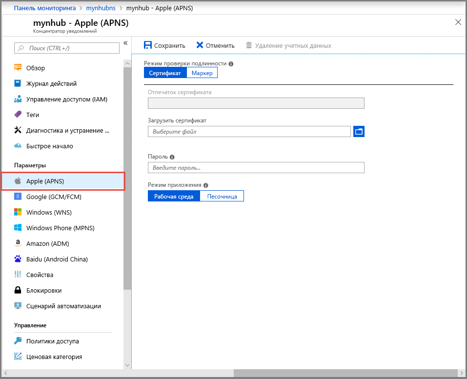
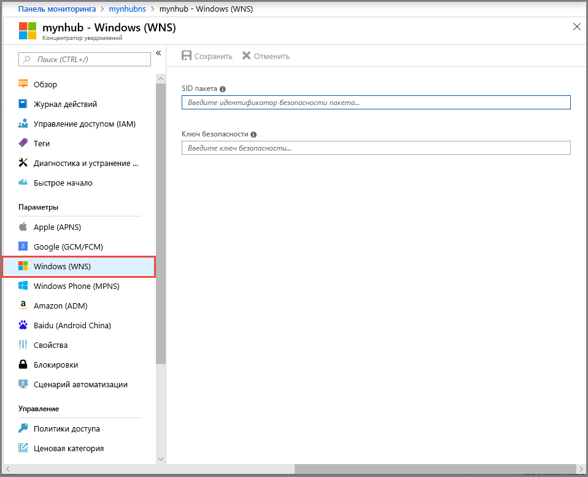
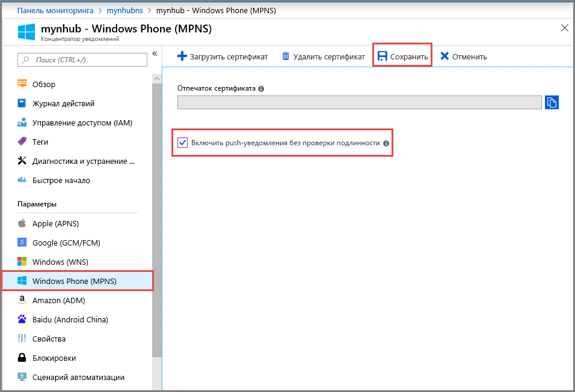
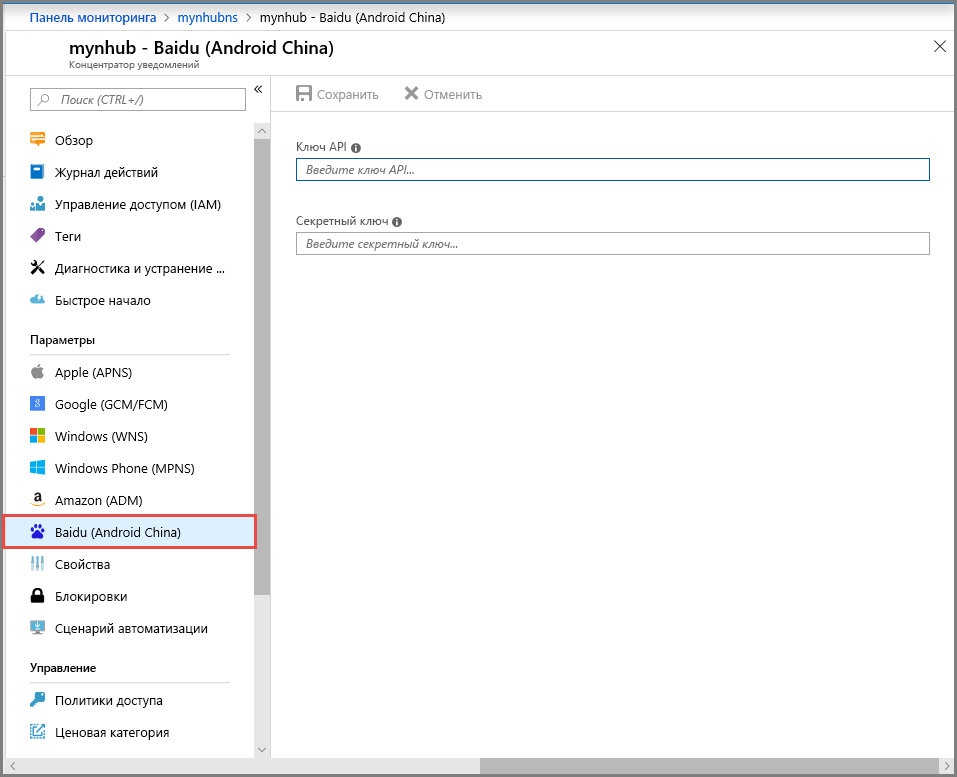

# Настройка push-уведомлений в центре уведомлений на портале Azure

Центры уведомлений Azure предоставляют удобный в использовании масштабируемый механизм отправки push-уведомлений. С помощью Центров уведомлений можно отправлять уведомления на любую платформу (iOS, Android, Windows, Baidu) и из любой серверной части (облачной или локальной). Дополнительные сведения см. в статье [Что такое Центры уведомлений Azure?](notification-hubs-push-notification-overview.md).

В этом кратком руководстве вы используете параметры системы отправки уведомлений платформы (PNS) в Центрах уведомлений для настройки push-уведомлений для нескольких платформ. Здесь описаны действия, которые необходимо выполнить на портале Azure.

Если вы еще не создали центр уведомлений, сделайте это сейчас. Дополнительные сведения см. в статье [Создание центра уведомлений Azure с помощью портала Azure](create-notification-hub-portal.md). 

## Служба push-уведомлений Apple

Чтобы настроить Службу push-уведомлений Apple (APNS), сделайте следующее:

1. На портале Azure на странице **Центр уведомлений** выберите **Apple (APNS)** в меню слева.

1. В разделе **Режим проверки подлинности** выберите **Сертификат** или **Токен**.

   a. Если вы выбрали **Сертификат**:
   * Щелкните значок файла и выберите файл *.p12*, который нужно отправить.
   * Введите пароль.
   * Выберите режим **Песочница**. Если нужно отправлять push-уведомления пользователям, которые приобрели приложение в магазине, выберите режим **Рабочий**.

     

   b. Если вы выбрали **Токен**:

   * Введите значения для параметров **Идентификатор ключа**, **Идентификатор набора**, **Идентификатор команды** и **Токен**.
   * Выберите режим **Песочница**. Если нужно отправлять push-уведомления пользователям, которые приобрели приложение в магазине, выберите режим **Рабочий**.

     

См. подробнее об [отправке push-уведомлений в приложения iOS с помощью Центров уведомлений Azure](notification-hubs-ios-apple-push-notification-apns-get-started.md).

## Google Firebase Cloud Messaging

Чтобы настроить уведомления для Google Firebase Cloud Messaging (FCM), сделайте следующее:

1. На портале Azure на странице **Центр уведомлений** выберите **Google (GCM/FCM)** в меню слева. 
2. В соответствующее поле вставьте **ключ API** для проекта FCM, сохраненного ранее. 
3. Щелкните **Сохранить**. 

   

Когда вы выполните эти шаги, появится оповещение о том, что Центр уведомлений успешно обновлен. Кнопка **Сохранить** отключена. 

Дополнительные сведения см. в статье [Руководство. Отправка push-уведомлений на устройства Android с помощью Центров уведомлений Azure и Google Firebase Cloud Messaging](notification-hubs-android-push-notification-google-fcm-get-started.md).

## Служба push-уведомлений Windows

Чтобы настроить службу push-уведомлений Windows (WNS), сделайте следующее:

1. На портале Azure на странице **Центр уведомлений** выберите **Windows (WNS)** в меню слева.
2. Введите значения для **идентификатора безопасности пакета** и **ключа безопасности**.
3. Щелкните **Сохранить**.

   

Дополнительные сведения см. в статье [Руководство по отправке уведомлений в приложения универсальной платформы Windows с использованием Центров уведомлений Azure](notification-hubs-windows-store-dotnet-get-started-wns-push-notification.md).

## Служба push-уведомлений Microsoft для Windows Phone

Чтобы настроить службу push-уведомлений Microsoft (MPNS) для Windows Phone, сделайте следующее: 

1. На портале Azure на странице **Центр уведомлений** выберите **Windows Phone (MPNS)** в меню слева.
1. Включите push-уведомления с проверкой подлинности или без нее:

   a. Чтобы включить push-уведомления без проверки подлинности, выберите **Включить push-уведомления без проверки подлинности** > **Сохранить**.

      

   b. Чтобы включить push-уведомления с проверкой подлинности, сделайте следующее:
      * На панели инструментов щелкните **Отправка сертификата**.
      * Щелкните значок файла, а затем выберите файл сертификата.
      * Введите пароль для сертификата.
      * Нажмите кнопку **ОК**.
      * На странице **Windows Phone(MPNS)** выберите **Сохранить**.

Дополнительные сведения см. в статье [Руководство по отправке push-уведомлений в конкретные приложения Windows Phone с помощью Центров уведомлений Azure](notification-hubs-windows-mobile-push-notifications-mpns.md).
      

## Baidu (Android China)

Чтобы настроить push-уведомления для Baidu, сделайте следующее:

1. На портале Azure на странице **Центр уведомлений** выберите **Baidu (Android China)** в меню слева. 
2. В соответствующее поле введите **ключ API**, полученный из консоли Baidu, в проекте службы push-уведомлений облака Baidu. 
3. Введите **секретный ключ**, полученный из консоли Baidu в проекте службы push-уведомлений облака Baidu. 
4. Щелкните **Сохранить**. 

    

Когда вы выполните эти шаги, появится оповещение о том, что Центр уведомлений успешно обновлен. Кнопка **Сохранить** отключена. 

Дополнительные сведения см. в статье [Начало работы с Центрами уведомлений с помощью Baidu](notification-hubs-baidu-china-android-notifications-get-started.md).

## Дополнительная информация
В этом кратком руководстве вы узнали, как настроить параметры системы отправки уведомлений платформы для центра уведомлений на портале Azure. 

Дополнительные сведения о том, как отправлять push-уведомления на различные платформы, см. в следующих учебниках:

- [Руководство. Отправка push-уведомлений в приложения iOS с помощью Центров уведомлений Azure](notification-hubs-ios-apple-push-notification-apns-get-started.md)
- [Руководство. Отправка push-уведомлений на устройства Android с помощью Центров уведомлений Azure и Google Firebase Cloud Messaging](notification-hubs-android-push-notification-google-fcm-get-started.md)
- [Руководство по отправке уведомлений в приложения универсальной платформы Windows с использованием Центров уведомлений Azure](notification-hubs-windows-store-dotnet-get-started-wns-push-notification.md)
- [Руководство по отправке push-уведомлений в конкретные приложения Windows Phone с помощью Центров уведомлений Azure](notification-hubs-windows-mobile-push-notifications-mpns.md)
- [Get started with Notification Hubs using Baidu](notification-hubs-baidu-china-android-notifications-get-started.md) (Приступая к работе с Центрами уведомлений с использованием Baidu)
