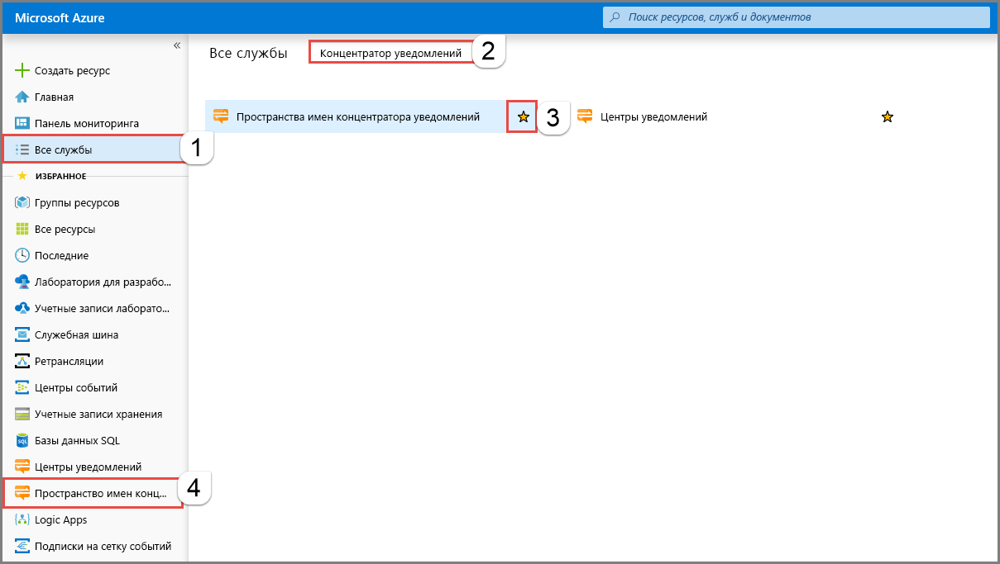
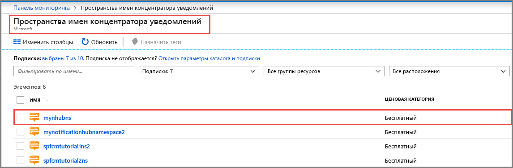
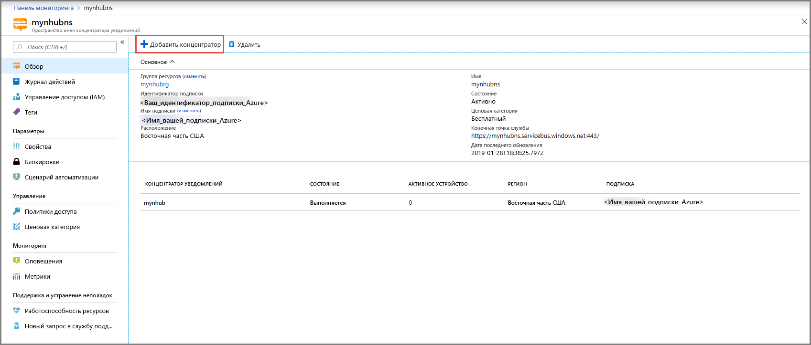
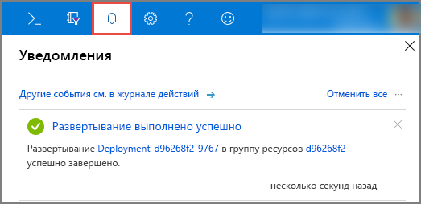
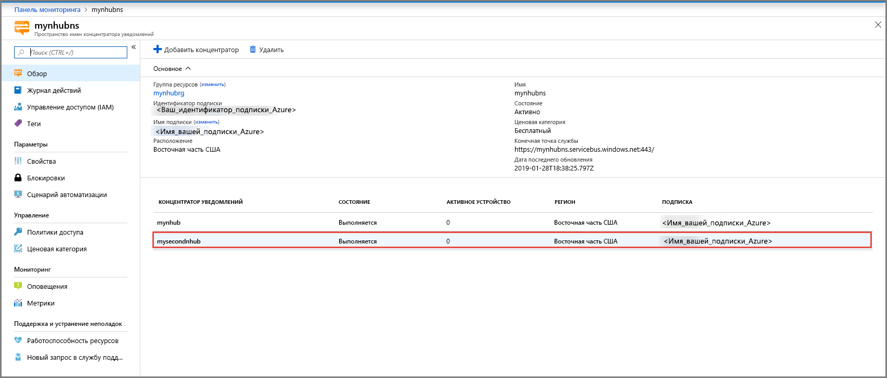
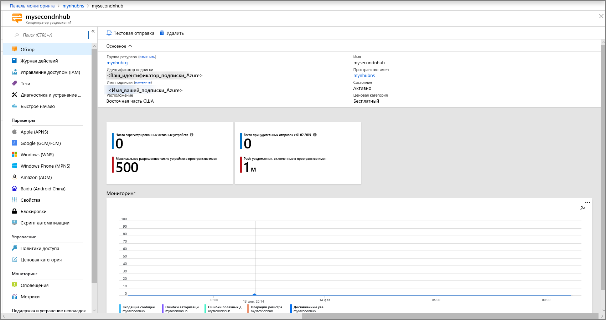

# Создание центра уведомлений Azure с помощью портала Azure 
Центры уведомлений Azure обеспечивают простой в использовании и масштабируемый механизм отправки push-уведомлений, который позволяет отправлять уведомления на любую платформу (iOS, Android, Windows, Kindle, Baidu и т. д.) из любой серверной части (облачной или локальной). Дополнительные сведения о службе см. в статье [Что такое Центры уведомлений Azure?](notification-hubs-push-notification-overview.md).

В этом кратком руководстве вы создадите центр уведомлений на портале Azure. В первом разделе приведены шаги по созданию Центров уведомлений и концентратора в этом пространстве имен. Во втором разделе приведены пошаговые инструкции по созданию центра уведомлений в имеющемся пространстве имен Центров уведомлений. 

## Создание пространства имен и центра уведомлений
В этом разделе вы создадите пространство имен и центр в нем. 

[!INCLUDE [notification-hubs-portal-create-new-hub](../../includes/notification-hubs-portal-create-new-hub.md)]

## Создание центра уведомлений в имеющемся пространстве имен
В этом разделе создается центр уведомлений в имеющемся пространстве имен. 

1. Войдите на [портале Azure](https://portal.azure.com).
2. Выберите **Все службы** в меню слева, выполните поиск **центра уведомлений**, выберите **звездочку** (`*`) рядом с полем **Пространства имен концентратора уведомлений**, чтобы добавить его в раздел **Избранное** в меню слева. Выберите **Пространства имен концентратора уведомлений**. 

      
3. На странице **Пространства имен концентратора уведомлений** выберите нужное пространство имен из списка. 

      
1. На странице **Пространство имен концентратора уведомлений** выберите **Добавить концентратор** на панели инструментов. 

      
4. На странице **Пространство имен концентратора уведомлений** введите имя для концентратора уведомлений и выберите **ОК**.

      
4. Выберите **Уведомления** (значок колокольчика) в верхней части, чтобы просмотреть состояние развертывания нового центра. Выберите **X** в правом верхнем углу, чтобы закрыть окно уведомлений. 

      
5. Обновите веб-страницу **Пространство имен концентратора уведомлений** для просмотра нового центра в списке. 

      
6. Чтобы просмотреть домашнюю страницу центра уведомлений, выберите свой **центр уведомлений**. 

      

## Дополнительная информация
В этом кратком руководстве вы создали центр уведомлений. Чтобы узнать, как настроить центр с помощью системы уведомлений платформы, ознакомьтесь с [этой статьей](configure-notification-hub-portal-pns-settings.md). 