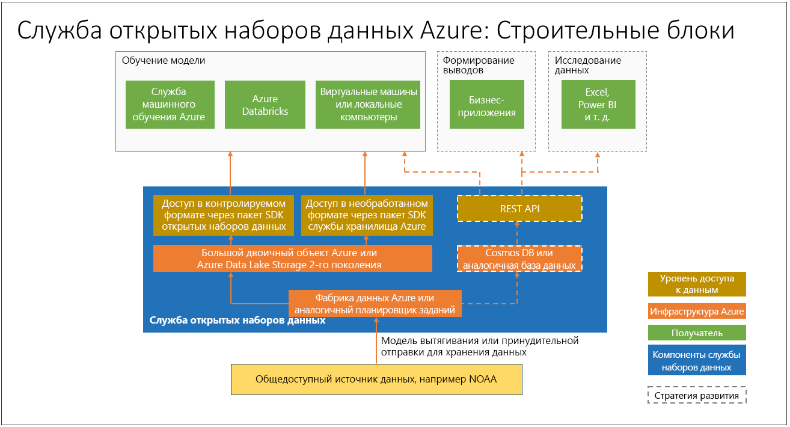

# Что представляют собой открытые наборы данных Azure (предварительная версия) и как их использовать?

[Открытые наборы данных Azure](https://azure.microsoft.com/services/open-datasets/) — это проверенные общедоступные наборы данных, которые можно использовать для добавления функций конкретных сценариев в решения машинного обучения для создания более точных моделей. Открытые наборы данных размещаются в облаке Microsoft Azure и доступны для платформы Azure Databricks, Службы машинного обучения и Студии машинного обучения. Кроме того, вы можете получать доступ к наборам данных с помощью интерфейсов API, а также использовать их в других продуктах, например в Power BI и Фабрике данных Azure.

Наборы данных включают открытые данные о погоде, численности населения, праздниках, общественной безопасности и расположениях, которые помогают вам обучать модели машинного обучения и обогащать прогностические решения. Вы также можете делиться своими общедоступными наборами данных в Azure. 

## Проверенные и подготовленные наборы данных
Проверенные открытые общедоступные наборы данных в Azure оптимизированы для рабочих процессов машинного обучения. 

Специалисты по анализу данных часто тратят большую часть своего времени на очистку и подготовку данных для расширенной аналитики. Открытые наборы данных копируются в облако Azure и проходят предварительную подготовку, что позволяет вам сэкономить время. Данные регулярно извлекаются из источников, например через FTP-подключение к сети Национального управления океанических и атмосферных исследований США, анализируются для преобразования в структурированный формат, а затем соответствующим образом обогащаются с добавлением таких данных, как почтовые индексы или сведения о расположении ближайшей метеостанции.

Наборы данных размещаются вместе с облачными вычислительными ресурсами Azure, что упрощает доступ и работу с ними.  

Ниже приведены примеры доступных наборов данных. 

### Метеоданные
 
|Выборка         | Записные книжки     | ОПИСАНИЕ                                    |
|----------------|---------------|------------------------------------------------|
|[База данных Integrated Surface Data (ISD) Национального управления океанических и атмосферных исследований США (NOAA)](https://azure.microsoft.com/services/open-datasets/catalog/noaa-integrated-surface-data/) | [Записные книжки Azure](https://azure.microsoft.com/services/open-datasets/catalog/noaa-integrated-surface-data/?tab=data-access#AzureNotebooks)   [Azure Databricks](https://azure.microsoft.com/services/open-datasets/catalog/noaa-integrated-surface-data/?tab=data-access#AzureDatabricks) | Почасовые метеоданные со всего мира от NOAA с наилучшим территориальным охватом в Северной Америке, Европе, Австралии и в некоторых регионах Азии. Обновляются ежедневно. |
|[Глобальная система прогнозирования погоды (GFS) NOAA](https://azure.microsoft.com/services/open-datasets/catalog/noaa-global-forecast-system/) | [Записные книжки Azure](https://azure.microsoft.com/services/open-datasets/catalog/noaa-global-forecast-system/?tab=data-access#AzureNotebooks)   [Azure Databricks](https://azure.microsoft.com/services/open-datasets/catalog/noaa-global-forecast-system/?tab=data-access#AzureDatabricks) | Данные почасовых прогнозов погоды в США за 15 дней от NOAA. Обновляются ежедневно. |

### Данные календаря

|Выборка         | Записные книжки     | ОПИСАНИЕ                                    |
|----------------|---------------|------------------------------------------------|
|[Государственные праздники](https://azure.microsoft.com/services/open-datasets/catalog/public-holidays/) | [Записные книжки Azure](https://azure.microsoft.com/services/open-datasets/catalog/public-holidays/?tab=data-access#AzureNotebooks)   [Azure Databricks](https://azure.microsoft.com/services/open-datasets/catalog/public-holidays/?tab=data-access#AzureDatabricks) | Данные о государственных праздниках в 41 стране и регионе за период с 1970 по 2099 гг. Включают код страны и сведения о том, является ли праздник оплачиваемым для большинства занятого населения. |

## Доступ к наборам данных  
Учетная запись Azure обеспечивает доступ к открытым наборам данных с помощью кода или через интерфейс службы Azure. Такие данные размещаются совместно с облачными вычислительными ресурсами Azure и могут использоваться в решении машинного обучения.  

Открытые наборы данных поддерживают службу "Записные книжки Azure" и записные книжки Azure Databricks, с помощью которых вы можете связывать данные со Службой машинного обучения Azure и платформой Azure Databricks. Доступ к наборам данных также можно осуществлять с помощью пакета SDK для Python. 

При этом вам не требуется учетная запись Azure для доступа к открытым наборам данных — это можно сделать в любой среде Python с решением Spark или без него.

## Отправка запроса на наборы данных или их предоставление

Если вы не можете найти нужные данные, отправьте нам по электронной почте [запрос на набор данных](mailto:aod@microsoft.com?Subject=Request%20dataset%3A%20%3Creplace%20with%20dataset%20name%3E&Body=%0AYour%20name%20and%20institution%3A%20%0A%0ADataset%20name%3A%0A%20%0ADataset%20description%3A%20%0A%3Cfill%20in%20a%20brief%20description%20and%20share%20any%20web%20links%20of%20the%20dataset%3E%20%0A%0ADataset%20size%3A%20%0A%3Chow%20much%20space%20does%20the%20dataset%20need%20today%20and%20how%20much%20is%20it%20expected%20to%20grow%20each%20year%3E%20%0A%0ADataset%20file%20formats%3A%20%0A%3Ccurrent%20dataset%20file%20formats%2C%20and%20optionally%2C%20any%20formats%20that%20the%20dataset%20must%20be%20transformed%20to%20for%20easy%20access%3E%0A%0ALicense%3A%20%0A%3Cwhat%20is%20the%20license%20or%20terms%20and%20conditions%20governing%20the%20distribution%20of%20this%20dataset%3E%0A%0AUse%20cases%3A%20%0A%3CExplain%20some%20common%20use%20of%20the%20dataset.%20E.g.%20weather%20dataset%20can%20be%20useful%20in%20demand%20forecasting%20and%20predictive%20maintenance%20scenarios%3E%20%0A%0AAny%20additional%20information%20you%20want%20us%20to%20know%3A%0A) или [поделитесь собственным](mailto:aod@microsoft.com?Subject=Contribute%20dataset%3A%20%3Creplace%20with%20dataset%20name%3E&Body=%0AYour%20name%20and%20institution%3A%20%0A%0ADataset%20name%3A%0A%20%0ADataset%20description%3A%20%0A%3Cfill%20in%20a%20brief%20description%20and%20share%20any%20web%20links%20of%20the%20dataset%3E%20%0A%0ADataset%20size%3A%20%0A%3Chow%20much%20space%20does%20the%20dataset%20need%20today%20and%20how%20much%20is%20it%20expected%20to%20grow%20each%20year%3E%20%0A%0ADataset%20file%20formats%3A%20%0A%3Ccurrent%20dataset%20file%20formats%2C%20and%20optionally%2C%20any%20formats%20that%20the%20dataset%20must%20be%20transformed%20to%20for%20easy%20access%3E%0A%0ALicense%3A%20%0A%3Cwhat%20is%20the%20license%20or%20terms%20and%20conditions%20governing%20the%20distribution%20of%20this%20dataset%3E%0A%0AUse%20cases%3A%20%0A%3CExplain%20some%20common%20use%20of%20the%20dataset.%20E.g.%20weather%20dataset%20can%20be%20useful%20in%20demand%20forecasting%20and%20predictive%20maintenance%20scenarios%3E%20%0A%0AAny%20additional%20information%20you%20want%20us%20to%20know%3A%0A). 

## Дополнительная информация
* [Пример записной книжки](samples.md)
* [Руководство. по моделированию регрессии с данными о такси Нью-Йорка](tutorial-opendatasets-automl.md)
* [Пакет SDK для Python для открытых наборов данных](https://aka.ms/open-datasets-api)
