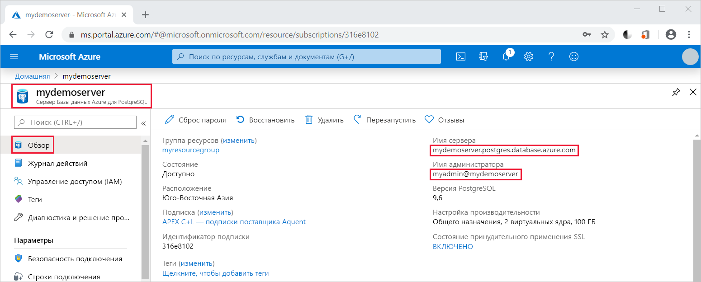

# <a name="quickstart-use-nodejs-to-connect-and-query-data-in-azure-database-for-postgresql---single-server"></a>Краткое руководство. Подключение к службе "База данных Azure для PostgreSQL — отдельный сервер" и выполнение запроса данных с помощью Node.js

Из этого краткого руководства вы узнаете, как подключиться к Базе данных Azure для PostgreSQL с помощью приложения Node.js. Здесь также показано, как использовать инструкции SQL для запроса, вставки, обновления и удаления данных в базе данных. В этой статье предполагается, что у вас уже есть опыт разработки на Node.js и вы только начали работу с Базой данных Azure для PostgreSQL.

## <a name="prerequisites"></a>Предварительные требования

- Учетная запись Azure с активной подпиской. [Создайте учетную запись](https://azure.microsoft.com/free/?ref=microsoft.com&utm_source=microsoft.com&utm_medium=docs&utm_campaign=visualstudio) бесплатно.

- Завершение [краткого руководства по созданию сервера службы "База данных Azure для PostgreSQL" на портале Azure](quickstart-create-server-database-portal.md) или [по созданию службы "База данных Azure для PostgreSQL" с помощью Azure CLI](quickstart-create-server-database-azure-cli.md).

- [Node.js](https://nodejs.org)

## <a name="install-pg-client"></a>Установка клиента pg
Установите [pg](https://www.npmjs.com/package/pg), клиент PostgreSQL для Node.js.

Для этого запустите диспетчер пакетов узла (npm) для JavaScript из командной строки.
```bash
npm install pg
```

Проверьте установку, получив список установленных пакетов.
```bash
npm list
```

## <a name="get-connection-information"></a>Получение сведений о подключении
Получите сведения, необходимые для подключения к базе данных Azure.для PostgreSQL. Вам потребуется полное имя сервера и учетные данные для входа.

1. На **портале Azure** найдите и выберите созданный вами сервер (например, [mydemoserver](https://portal.azure.com/)).

1. Запишите **имя сервера** и **имя для входа администратора** с панели сервера **Обзор**. Если вы забыли свой пароль, можно также сбросить пароль с помощью этой панели.

   

## <a name="running-the-javascript-code-in-nodejs"></a>Выполнение кода JavaScript в Node.js
Node.js можно запустить из оболочки Bash, терминала или командной строки Windows при помощи команды `node`. Затем интерактивно запустите пример кода JavaScript, скопировав и вставив его в командную строку. Либо же можно сохранить код JavaScript в текстовый файл и запустить `node filename.js` с именем файла в качестве параметра для его выполнения.

## <a name="connect-create-table-and-insert-data"></a>Подключение, создание таблицы и вставка данных
Используйте приведенный ниже код для подключения и загрузки данных с помощью инструкций SQL **CREATE TABLE** и **INSERT INTO**.
Объект [pg.Client](https://github.com/brianc/node-postgres/wiki/Client) используется для обмена данными с сервером PostgreSQL. Функция [pg.Client.connect()](https://github.com/brianc/node-postgres/wiki/Client#method-connect) используется для подключения к серверу. Функция [pg.Client.query()](https://github.com/brianc/node-postgres/wiki/Query) используется для выполнения SQL-запроса к базе данных PostgreSQL. 

Замените значения параметров host, dbname, user и password значениями, указанными при создании сервера и базы данных.

```javascript
const pg = require('pg');

const config = {
    host: '<your-db-server-name>.postgres.database.azure.com',
    // Do not hard code your username and password.
    // Consider using Node environment variables.
    user: '<your-db-username>',     
    password: '<your-password>',
    database: '<name-of-database>',
    port: 5432,
    ssl: true
};

const client = new pg.Client(config);

client.connect(err => {
    if (err) throw err;
    else {
        queryDatabase();
    }
});

function queryDatabase() {
    const query = `
        DROP TABLE IF EXISTS inventory;
        CREATE TABLE inventory (id serial PRIMARY KEY, name VARCHAR(50), quantity INTEGER);
        INSERT INTO inventory (name, quantity) VALUES ('banana', 150);
        INSERT INTO inventory (name, quantity) VALUES ('orange', 154);
        INSERT INTO inventory (name, quantity) VALUES ('apple', 100);
    `;

    client
        .query(query)
        .then(() => {
            console.log('Table created successfully!');
            client.end(console.log('Closed client connection'));
        })
        .catch(err => console.log(err))
        .then(() => {
            console.log('Finished execution, exiting now');
            process.exit();
        });
}
```

## <a name="read-data"></a>Чтение данных
Используйте указанный ниже код с инструкцией SQL **SELECT** для подключения и чтения данных. Объект [pg.Client](https://github.com/brianc/node-postgres/wiki/Client) используется для обмена данными с сервером PostgreSQL. Функция [pg.Client.connect()](https://github.com/brianc/node-postgres/wiki/Client#method-connect) используется для подключения к серверу. Функция [pg.Client.query()](https://github.com/brianc/node-postgres/wiki/Query) используется для выполнения SQL-запроса к базе данных PostgreSQL. 

Замените значения параметров host, dbname, user и password значениями, указанными при создании сервера и базы данных. 

```javascript
const pg = require('pg');

const config = {
    host: '<your-db-server-name>.postgres.database.azure.com',
    // Do not hard code your username and password.
    // Consider using Node environment variables.
    user: '<your-db-username>',     
    password: '<your-password>',
    database: '<name-of-database>',
    port: 5432,
    ssl: true
};

const client = new pg.Client(config);

client.connect(err => {
    if (err) throw err;
    else { queryDatabase(); }
});

function queryDatabase() {
  
    console.log(`Running query to PostgreSQL server: ${config.host}`);

    const query = 'SELECT * FROM inventory;';

    client.query(query)
        .then(res => {
            const rows = res.rows;

            rows.map(row => {
                console.log(`Read: ${JSON.stringify(row)}`);
            });

            process.exit();
        })
        .catch(err => {
            console.log(err);
        });
}
```

## <a name="update-data"></a>Обновление данных
Используйте указанный ниже код с инструкцией SQL **UPDATE** для подключения и чтения данных. Объект [pg.Client](https://github.com/brianc/node-postgres/wiki/Client) используется для обмена данными с сервером PostgreSQL. Функция [pg.Client.connect()](https://github.com/brianc/node-postgres/wiki/Client#method-connect) используется для подключения к серверу. Функция [pg.Client.query()](https://github.com/brianc/node-postgres/wiki/Query) используется для выполнения SQL-запроса к базе данных PostgreSQL. 

Замените значения параметров host, dbname, user и password значениями, указанными при создании сервера и базы данных. 

```javascript
const pg = require('pg');

const config = {
    host: '<your-db-server-name>.postgres.database.azure.com',
    // Do not hard code your username and password.
    // Consider using Node environment variables.
    user: '<your-db-username>',     
    password: '<your-password>',
    database: '<name-of-database>',
    port: 5432,
    ssl: true
};

const client = new pg.Client(config);

client.connect(err => {
    if (err) throw err;
    else {
        queryDatabase();
    }
});

function queryDatabase() {
    const query = `
        UPDATE inventory 
        SET quantity= 1000 WHERE name='banana';
    `;

    client
        .query(query)
        .then(result => {
            console.log('Update completed');
            console.log(`Rows affected: ${result.rowCount}`);
        })
        .catch(err => {
            console.log(err);
            throw err;
        });
}
```

## <a name="delete-data"></a>Удаление данных
Используйте указанный ниже код с инструкцией SQL **DELETE** для подключения и чтения данных. Объект [pg.Client](https://github.com/brianc/node-postgres/wiki/Client) используется для обмена данными с сервером PostgreSQL. Функция [pg.Client.connect()](https://github.com/brianc/node-postgres/wiki/Client#method-connect) используется для подключения к серверу. Функция [pg.Client.query()](https://github.com/brianc/node-postgres/wiki/Query) используется для выполнения SQL-запроса к базе данных PostgreSQL. 

Замените значения параметров host, dbname, user и password значениями, указанными при создании сервера и базы данных. 

```javascript
const pg = require('pg');

const config = {
    host: '<your-db-server-name>.postgres.database.azure.com',
    // Do not hard code your username and password.
    // Consider using Node environment variables.
    user: '<your-db-username>',     
    password: '<your-password>',
    database: '<name-of-database>',
    port: 5432,
    ssl: true
};

const client = new pg.Client(config);

client.connect(err => {
    if (err) {
        throw err;
    } else {
        queryDatabase();
    }
});

function queryDatabase() {
    const query = `
        DELETE FROM inventory 
        WHERE name = 'apple';
    `;

    client
        .query(query)
        .then(result => {
            console.log('Delete completed');
            console.log(`Rows affected: ${result.rowCount}`);
        })
        .catch(err => {
            console.log(err);
            throw err;
        });
}
```

## <a name="next-steps"></a>Дальнейшие действия
> [!div class="nextstepaction"]
> [Перенос базы данных с помощью экспорта и импорта](./howto-migrate-using-export-and-import.md)
