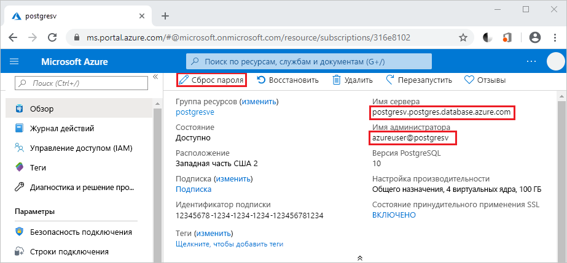

# <a name="use-python-to-connect-and-query-data-in-azure-database-for-postgresql---single-server"></a>Подключение к службе "База данных Azure для PostgreSQL — отдельный сервер" и выполнение запроса данных с помощью Python
В этом кратком руководстве показано, как работать со службой "База данных Azure для PostgreSQL" с помощью Python в операционной системе macOS, Ubuntu Linux или Windows. Здесь описано, как подключиться к базе данных и как с помощью инструкций SQL запрашивать, вставлять, обновлять и удалять данные. В этой статье предполагается, что вы знакомы с Python, но только начинаете работу со службой "База данных Azure для PostgreSQL".

## <a name="prerequisites"></a>Предварительные требования
- Служба "База данных Azure для PostgreSQL — отдельный сервер", созданная с помощью действий, описанных в [кратком руководстве по созданию сервера службы "База данных Azure для PostgreSQL" на портале Azure](quickstart-create-server-database-portal.md) или [по созданию службы "База данных Azure для PostgreSQL" с помощью Azure CLI](quickstart-create-server-database-azure-cli.md). 
  
- [Python](https://www.python.org/downloads/) 2.7.9 или 3.4+.
  
- Последнее обновление установщика пакета [PIP](https://pip.pypa.io/en/stable/installing/), установленного с помощью `pip install -U pip`. 

## <a name="install-the-python-libraries-for-postgresql"></a>Установка библиотек Python для PostgreSQL
Модуль [psycopg2](https://pypi.python.org/pypi/psycopg2/) позволяет подключаться к базе данных PostgreSQL и выполнять запросы к ней. Он доступен в виде пакета [Wheel](https://pythonwheels.com/) для Linux, macOS или Windows. Установите двоичную версию модуля, включая все зависимости. Дополнительные сведения об установке `psycopg2` и о предварительных требованиях см. на [этой странице](http://initd.org/psycopg/docs/install.html). 

Чтобы установить `psycopg2`, откройте окно терминала или командную строку и выполните команду `pip install psycopg2`.

## <a name="get-database-connection-information"></a>Получение сведений о подключении к базе данных
Чтобы подключиться к базе данных службы "База данных Azure для PostgreSQL", требуется полное имя сервера и учетные данные для входа. Эти сведения можно получить на портале Azure.

1. На [портале Azure](https://portal.azure.com/) выполните поиск по имени сервера и выберите сервер службы "База данных Azure для PostgreSQL". 
1. На странице **Обзор** сервера скопируйте **полное имя сервера** и **имя администратора**. Полное **имя сервера** всегда имеет формат *\<имя-сервера>.postgres.database.azure.com*, а **имя администратора** — формат *\<имя-администратора>@\<имя-сервера>* . 
   
   Кроме того, потребуется пароль администратора. Если вы не помните этот пароль, вы можете сбросить его на этой странице. 
   
   

## <a name="how-to-run-the-python-examples"></a>Выполнение примеров кода Python

Для каждого примера кода в этой статье сделайте следующее:

1. Создайте файл в текстовом редакторе. 
   
1. Добавьте пример кода в файл. В коде замените:
   - `<server-name>` и `<admin-username>` значениями, скопированными на портале Azure.
   - `<admin-password>` паролем сервера.
   - `<database-name>` именем базы данных службы "База данных Azure для PostgreSQL". При создании сервера автоматически создается база данных по умолчанию с именем *postgres*. Вы можете переименовать эту базу данных или создать другую с помощью команд SQL. 
   
1. Сохраните файл в папке проекта с расширением *PY*, например *postgres-insert.py*. При сохранении файла в ОС Windows обязательно выберите кодировку UTF-8. 
   
1. Чтобы запустить этот файл, перейдите в папку проекта в интерфейсе командной строки и введите `python`, а затем — имя файла, например `python postgres-insert.py`.

## <a name="create-a-table-and-insert-data"></a>Создание таблицы и вставка данных
Приведенный ниже пример кода подключается к базе данных службы "База данных Azure для PostgreSQL" с помощью функции [psycopg2.connect](http://initd.org/psycopg/docs/connection.html) и загружает данные с помощью инструкции SQL **INSERT**. Функция [cursor.execute](http://initd.org/psycopg/docs/cursor.html#execute) выполняет SQL-запрос к базе данных. 

```Python
import psycopg2

# Update connection string information 
host = "<server-name>"
dbname = "<database-name>"
user = "<admin-username>"
password = "<admin-password>"
sslmode = "require"

# Construct connection string
conn_string = "host={0} user={1} dbname={2} password={3} sslmode={4}".format(host, user, dbname, password, sslmode)
conn = psycopg2.connect(conn_string) 
print("Connection established")

cursor = conn.cursor()

# Drop previous table of same name if one exists
cursor.execute("DROP TABLE IF EXISTS inventory;")
print("Finished dropping table (if existed)")

# Create a table
cursor.execute("CREATE TABLE inventory (id serial PRIMARY KEY, name VARCHAR(50), quantity INTEGER);")
print("Finished creating table")

# Insert some data into the table
cursor.execute("INSERT INTO inventory (name, quantity) VALUES (%s, %s);", ("banana", 150))
cursor.execute("INSERT INTO inventory (name, quantity) VALUES (%s, %s);", ("orange", 154))
cursor.execute("INSERT INTO inventory (name, quantity) VALUES (%s, %s);", ("apple", 100))
print("Inserted 3 rows of data")

# Clean up
conn.commit()
cursor.close()
conn.close()
```

При успешном выполнении кода возвращаются следующие данные:


## <a name="read-data"></a>Чтение данных
Приведенный ниже пример кода подключается к базе данных службы "База данных Azure для PostgreSQL" и считывает данные с помощью функции [cursor.execute](http://initd.org/psycopg/docs/cursor.html#execute) и инструкции SQL **SELECT**. Эта функция принимает запрос и возвращает результирующий набор для итерации с помощью [cursor.fetchall()](http://initd.org/psycopg/docs/cursor.html#cursor.fetchall). 

```Python
import psycopg2

# Update connection string information
host = "<server-name>"
dbname = "<database-name>"
user = "<admin-username>"
password = "<admin-password>"
sslmode = "require"

# Construct connection string
conn_string = "host={0} user={1} dbname={2} password={3} sslmode={4}".format(host, user, dbname, password, sslmode)
conn = psycopg2.connect(conn_string) 
print("Connection established")

cursor = conn.cursor()

# Fetch all rows from table
cursor.execute("SELECT * FROM inventory;")
rows = cursor.fetchall()

# Print all rows
for row in rows:
    print("Data row = (%s, %s, %s)" %(str(row[0]), str(row[1]), str(row[2])))

# Cleanup
conn.commit()
cursor.close()
conn.close()
```

## <a name="update-data"></a>Обновление данных
Приведенный ниже пример кода подключается к базе данных службы "База данных Azure для PostgreSQL" и обновляет данные с помощью функции [cursor.execute](http://initd.org/psycopg/docs/cursor.html#execute) и инструкции SQL **UPDATE**. 

```Python
import psycopg2

# Update connection string information
host = "<server-name>"
dbname = "<database-name>"
user = "<admin-username>"
password = "<admin-password>"
sslmode = "require"

# Construct connection string
conn_string = "host={0} user={1} dbname={2} password={3} sslmode={4}".format(host, user, dbname, password, sslmode)
conn = psycopg2.connect(conn_string) 
print("Connection established")

cursor = conn.cursor()

# Update a data row in the table
cursor.execute("UPDATE inventory SET quantity = %s WHERE name = %s;", (200, "banana"))
print("Updated 1 row of data")

# Cleanup
conn.commit()
cursor.close()
conn.close()
```

## <a name="delete-data"></a>Удаление данных
Приведенный ниже пример кода подключается к базе данных службы "База данных Azure для PostgreSQL" и удаляет вставленный ранее элемент inventory с помощью функции [cursor.execute](http://initd.org/psycopg/docs/cursor.html#execute) и инструкции SQL **DELETE**. 

```Python
import psycopg2

# Update connection string information
host = "<server-name>"
dbname = "<database-name>"
user = "<admin-username>"
password = "<admin-password>"
sslmode = "require"

# Construct connection string
conn_string = "host={0} user={1} dbname={2} password={3} sslmode={4}".format(host, user, dbname, password, sslmode)
conn = psycopg2.connect(conn_string) 
print("Connection established")

cursor = conn.cursor()

# Delete data row from table
cursor.execute("DELETE FROM inventory WHERE name = %s;", ("orange",))
print("Deleted 1 row of data")

# Cleanup
conn.commit()
cursor.close()
conn.close()
```

## <a name="next-steps"></a>Дополнительная информация
> [!div class="nextstepaction"]
> [Перенос базы данных с помощью экспорта и импорта](./howto-migrate-using-export-and-import.md)
