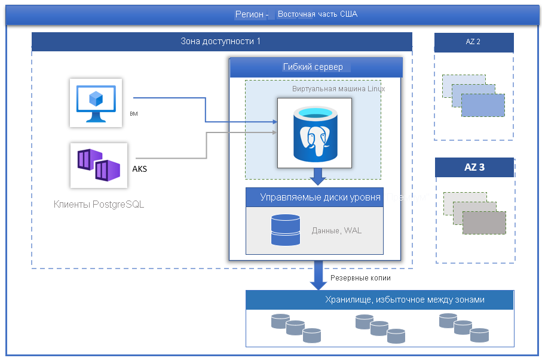

# Гибкий сервер Базы данных Azure для PostgreSQL

[База данных Azure для PostgreSQL](../overview.md) на основе PostgreSQL Community Edition доступна в трех режимах развертывания:

- [Отдельный сервер](../overview-single-server.md)
- Гибкий сервер (предварительная версия)
- Гипермасштабирование (Citus)

В этой статье приводится обзор и основные понятия модели развертывания гибкого сервера.

> [!IMPORTANT]
> Гибкий сервер Базы данных Azure для PostgreSQL предоставляется в режиме предварительной версии

## Обзор

Гибкий сервер Базы данных Azure для PostgreSQL — это полностью управляемая служба базы данных, которая обеспечивает более детализированный контроль и гибкость функций управления базами данных, а также параметрами конфигурации. Как правило, эта служба обеспечивает лучшую гибкость и настройку конфигурации сервера на основе требований пользователей. Гибкая серверная архитектура позволяет пользователям совмещать ядро СУБД с клиентским уровнем для снижения задержки, а также обеспечивает высокий уровень доступности в пределах одной или нескольких зон доступности. Гибкий сервер также дает больше возможностей для оптимизации затрат, позволяя останавливать и запускать сервер и вычислительную среду с накапливаемыми ресурсами. Это идеально подходит для рабочих нагрузок, не требующих постоянной работы с полной нагрузкой на вычислительные ресурсы. В настоящее время служба поддерживает версии сообщества PostgreSQL 11 и 12. Сейчас служба доступна в предварительной версии в различных [регионах Azure](https://azure.microsoft.com/global-infrastructure/services/).

Гибкие серверы обеспечивают:

- разработку приложений, которым требуются лучшие возможности управления и настройки;
- высокий уровень доступности с избыточностью в пределах зоны;
- управляемые периоды обслуживания.
  
## Высокий уровень доступности

Модель развертывания гибкого сервера позволяет обеспечивать высокий уровень доступности в пределах одной или нескольких зон доступности. В этой архитектуре ресурсы вычислений и хранилища разделены. Ядро СУБД работает на виртуальной машине Linux, а файлы данных находятся в службе хранилища Azure. Хранилище поддерживает три локально избыточные синхронные копии файлов базы данных, обеспечивающие устойчивость данных.

При запланированных или незапланированных событиях отработки отказа, если сервер выходит из строя, служба поддерживает высокий уровень доступности серверов, используя следующую автоматическую процедуру:

1. Будет подготовлена новая виртуальная машина Linux для вычислений.
2. Хранилище с файлами данных сопоставляется с новой виртуальной машиной.
3. Ядро СУБД PostgreSQL переходит в режим "в сети" на новой виртуальной машине.
4. Служба шлюза обеспечивает прозрачную отработку отказа, не требуя изменений на стороне приложения.

На рисунке ниже показан переход виртуальной машины и сбой хранилища.

 :::image type="content" source="./media/overview/overview-azure-postgres-flex-virtualmachine-storage-failure.png" alt-text="Гибкий сервер — сбои виртуальных машин и хранилищ":::

Если настроен высокий уровень доступности с избыточностью в пределах зоны, служба подготавливает и обслуживает сервер горячей замены в зоне доступности в одном и том же регионе Azure. Изменения данных на исходном сервере синхронно реплицируются на резервный сервер во избежание потери данных. При повышении уровня доступности с избыточностью в пределах зоны после запуска планового или внепланового события отработки отказа резервный сервер немедленно переходит в оперативный режим и становится доступным для обработки входящих транзакций. Это обеспечивает устойчивость службы к сбоям зон доступности в пределах региона Azure, который поддерживает несколько зон доступности, как показано на рисунке ниже.

 :::image type="content" source="./media/business-continuity/concepts-zone-redundant-high-availability-architecture.png" alt-text="Высокий уровень доступности с избыточностью в пределах зоны":::

 Дополнительные сведения см. в документации [по высокому уровню доступности](./concepts-high-availability.md).

## Автоматизированное исправление с управляемым периодом обслуживания

Служба выполняет автоматическую установку исправлений, Установка исправлений включает обновления для системы безопасности и программного обеспечения. Для ядра PostgreSQL в рамках планового обслуживания также выполняется обновление дополнительных версий. Пользователи могут настроить расписание исправлений, управляемое системой, или задать собственное расписание. В течение запланированного обслуживания устанавливается исправление. Для завершения обновления может потребоваться перезапустить сервер в рамках процесса исправления. С помощью настраиваемого расписания пользователи могут сделать цикл исправлений прогнозируемым и выбрать период обслуживания с минимальным влиянием на бизнес-процессы. Как правило, служба придерживается графика ежемесячных выпусков в рамках непрерывной интеграции и выпуска.

## Автоматическое резервное копирование

Служба гибкого сервера автоматически создает резервные копии и сохраняет их локально в хранилище, избыточном между зонами, настроенном пользователем. Резервные копии можно использовать для восстановления сервера на любой момент в течение периода хранения резервной копии. По умолчанию срок хранения резервных копий составляет 7 дней. Хранение можно дополнительно продлить на срок до 35 дней. Все резервные копии шифруются с помощью 256-битового шифрования AES. Дополнительные сведения см. в статье [о резервных копиях](./concepts-backup-restore.md).

## Быстрая настройка производительности и масштабирования

Служба гибкого сервера доступна на трех уровнях вычислений: "С накапливаемыми ресурсами", "Общего назначения" и "Оптимизированная для операций в памяти". Вариант "С накапливаемыми ресурсами" лучше всего подходит для экономичной разработки и небольших рабочих нагрузок, для которых не требуется непрерывная полная вычислительная мощность. Варианты "Общего назначения" и "Оптимизированная для операций в памяти" лучше подходят для рабочих нагрузок, в которых требуются высокая степень параллелизма, масштабирование и прогнозируемая производительность. Вы можете создать свое первое приложение в небольшой базе данных за несколько долларов в месяц, а затем изменить масштаб в соответствии с потребностями решения.

## Запуск и остановка сервера для снижения совокупной стоимости владения

Служба гибкого сервера позволяет останавливать и запускать сервер по запросу для снижения совокупной стоимости владения. Выставление счетов за уровень вычислений немедленно прекращается при остановке сервера. Это позволяет значительно сократить затраты при разработке, тестировании и для прогнозируемых рабочих нагрузок с ограничением по времени. Сервер находится в остановленном состоянии в течение семи дней, если не будет перезапущен раньше.

## Безопасность корпоративного уровня

В службе гибкого сервера используется проверенный криптографический модуль с сертификацией FIPS 140-2 для шифрования неактивных данных. Шифруются все данные, включая резервные копии и временные файлы, создаваемые при выполнении запросов. Служба использует 256-разрядный шифр AES, включенный в шифрование службы хранилища Azure. Ключами управляет система (по умолчанию). Служба по умолчанию шифрует все перемещаемые данные по протоколу SSL/TLS. Служба применяет и поддерживает только протоколы TLS версии 1.2.

Гибкие серверы предоставляют полностью частный доступ к серверам с помощью интеграции с виртуальной сетью Azure. К серверам в виртуальной сети Azure можно подключиться только через частные IP-адреса. При интеграции с виртуальной сетью отклоняется общий доступ и к серверам нельзя подключиться с помощью общедоступных конечных точек.

## Мониторинг и оповещения

Служба гибкого сервера оснащена встроенными функциями мониторинга производительности и оповещений. Все метрики Azure записываются ежеминутно, и каждая из них предоставляет данные за последние 30 дней. Вы можете настроить оповещения на основе метрик. Служба предоставляет метрики сервера узла для мониторинга использования ресурсов и позволяет настраивать журналы медленных запросов. С помощью этих средств можно быстро оптимизировать рабочие нагрузки и настроить оптимальную производительность сервера.

## Миграция

В этой службе работает версия PostgreSQL виртуального сообщества. Это обеспечивает полную совместимость приложений и минимальные затраты на рефакторинг при переносе на гибкий сервер существующих приложений, разработанных для ядра СУБД PostgreSQL. 

- **Создание резервной копии и восстановление.** Для миграций в автономной среде, где допустим некоторый простой для пользователей, самым быстрым способом миграции будет создание резервной копии с последующим восстановлением, для которой применяются такие средства сообщества, как pg_dump and pg_restore. Дополнительные сведения см. в статье [Миграция с использованием дампа и восстановления](https://docs.microsoft.com/azure/postgresql/howto-migrate-using-dump-and-restore).
- **Azure Database Migration Service.** Чтобы без проблем выполнить простую миграцию на гибкий сервер с минимальным временем простоя, можно применить Azure Database Migration Service. Изучите возможности [DMS с использованием портала](https://docs.microsoft.com/azure/dms/tutorial-postgresql-azure-postgresql-online-portal) и [DMS с использованием CLI](https://docs.microsoft.com/azure/dms/tutorial-postgresql-azure-postgresql-online). Вы можете выполнить миграцию из Базы данных Azure для PostgreSQL (с отдельного сервера на гибкий сервер). Подробные сведения см. в [статье о DMS](https://docs.microsoft.com/azure/dms/tutorial-azure-postgresql-to-azure-postgresql-online-portal).

## Следующие шаги

Итак, вы завершили знакомство с режимом развертывания Базы данных Azure для PostgreSQL с отдельным сервером и теперь готовы создать свой первый сервер. [Создание гибкого сервера Базы данных Azure для PostgreSQL с помощью портала Azure](./quickstart-create-server-portal.md)

