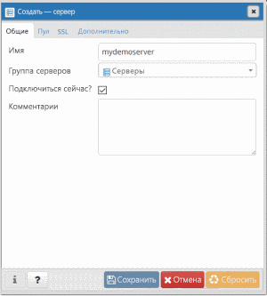
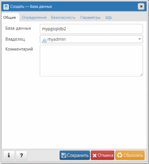

# <a name="quickstart-create-an-azure-database-for-postgresql-using-the-azure-cli"></a>Краткое руководство. Создание базы данных Azure для PostgreSQL с помощью Azure CLI
База данных Azure для PostgreSQL — это управляемая служба, которая позволяет вам запускать, администрировать и масштабировать высокодоступные базы данных PostgreSQL в облаке. Azure CLI используется для создания ресурсов Azure и управления ими из командной строки или с помощью скриптов. В этом кратком руководстве описывается создание базы данных Azure для сервера PostgreSQL в [группе ресурсов Azure](https://docs.microsoft.com/azure/azure-resource-manager/resource-group-overview) с помощью Azure CLI.

Если у вас еще нет подписки Azure, создайте [бесплатную](https://azure.microsoft.com/free/) учетную запись Azure, прежде чем начинать работу.

[!INCLUDE [cloud-shell-try-it](../../includes/cloud-shell-try-it.md)]

Если вы решили установить и использовать интерфейс командной строки локально, для работы с этой статьей вам понадобится Azure CLI 2.0 или более поздней версии. Чтобы узнать, какая установлена версия, выполните команду `az --version`. Если вам необходимо выполнить установку или обновление, см. статью [Установка Azure CLI 2.0]( /cli/azure/install-azure-cli). 

Если интерфейс командной строки выполняется локально, необходимо войти учетную запись, выполнив команду [az login](/cli/azure/authenticate-azure-cli?view=interactive-log-in). Запишите свойство **id** из выходных данных команды для соответствующего имени подписки.
```azurecli-interactive
az login
```

Если вы используете несколько подписок, выберите соответствующую, в которой за ресурс будет взиматься плата. Выберите конкретный идентификатор подписки вашей учетной записи, выполнив команду [az account set](/cli/azure/account#az_account_set). Подставьте свойство **id** из выходных данных **az login** для вашей подписки в заполнитель для идентификатора подписки.
```azurecli-interactive
az account set --subscription <subscription id>
```

## <a name="create-a-resource-group"></a>Создание группы ресурсов

Создайте [группу ресурсов Azure](../azure-resource-manager/resource-group-overview.md) с помощью команды [az group create](/cli/azure/group#az_group_create). Группа ресурсов — это логический контейнер, в котором ресурсы Azure развертываются и администрируются как группа. Необходимо указать уникальное имя. В следующем примере создается группа ресурсов с именем `myresourcegroup` в расположении `westus`.
```azurecli-interactive
az group create --name myresourcegroup --location westus
```

## <a name="create-an-azure-database-for-postgresql-server"></a>Создание сервера базы данных Azure для PostgreSQL

Создайте [сервер базы данных Azure для PostgreSQL](overview.md), выполнив команду [az postgres server create](/cli/azure/postgres/server#az_postgres_server_create). Сервер может управлять несколькими базами данных.


**Параметр** | **Пример значения** | **Описание**
---|---|---
name | mydemoserver | Выберите уникальное имя, идентифицирующее базу данных Azure для сервера PostgreSQL. Имя сервера может содержать только строчные буквы, цифры и знак дефиса (-). Его длина должна составлять от 3 до 63 символов.
resource-group | myresourcegroup | Укажите имя группы ресурсов Azure.
sku-name | GP_Gen4_2 | Имя номера SKU. В сокращенной записи соответствует схеме {ценовая категория}_{поколение вычислительных ресурсов}_{число виртуальных ядер}. Под этой таблицей приведены дополнительные сведения о параметре sku-name.
backup-retention | 7 | Срок хранения резервной копии. Указывается в днях. Можно указать от 7 до 35 дней. 
geo-redundant-backup | Отключено | Позволяет включить или отключить создание геоизбыточных резервных копий для этого сервера. Допустимые значения: Enabled, Disabled.
location | westus | Расположение сервера в Azure.
ssl-enforcement | Включено | Позволяет включить или отключить SSL для этого сервера. Допустимые значения: Enabled, Disabled.
storage-size | 51 200 | Объем хранилища сервера (в мегабайтах). Допустимое минимальное значение storage-size составляет 5120 МБ и может быть увеличено с шагом в 1024 МБ. Ознакомьтесь с документом о [ценовых категориях](./concepts-pricing-tiers.md), чтобы узнать больше об ограничениях размера хранилища. 
версия | 9,6 | Основной номер версии PostgreSQL.
admin-user | myadmin | Имя для входа администратора. Не может иметь значение **azure_superuser**, **admin**, **administrator**, **root**, **guest** или **public**.
admin-password | *Надежный пароль* | Пароль администратора. Пароль должен содержать от 8 до 128 символов. Пароль должен содержать символы из таких трех категорий: прописные латинские буквы, строчные латинские буквы, цифры и небуквенно-цифровые знаки.


Значение параметра sku-name соответствует соглашению {ценовая категория}\_{поколение вычислительных ресурсов}\_{количество виртуальных ядер}, как показано в примерах ниже:
+ `--sku-name B_Gen4_1` — ценовая категория "Базовый", поколение 4, 1 виртуальное ядро; Это номер SKU наименьший по размеру из доступных.
+ `--sku-name GP_Gen5_32` — "Общего назначения", поколение 5, 32 виртуальных ядра;
+ `--sku-name MO_Gen5_2` — "Оптимизированная для операций в памяти", поколение 5, 2 виртуальных ядра.

Допустимые значения для каждого региона и каждого уровня указаны в документации по [ценовым категориям](./concepts-pricing-tiers.md).

В примере ниже показано создание сервера PostgreSQL 9.6 с именем `mydemoserver` в группе ресурсов `myresourcegroup` с именем пользователя администратора сервера `myadmin`. Это сервер **4-го поколения** **общего назначения** с **2 виртуальными ядрами**. Замените `<server_admin_password>` собственным значением.
```azurecli-interactive
az postgres server create --resource-group myresourcegroup --name mydemoserver  --location westus --admin-user myadmin --admin-password <server_admin_password> --sku-name GP_Gen4_2 --version 9.6
```

> [!NOTE]
> Используйте ценовую категорию "Базовый", если для вашей рабочей нагрузки не требуется большое количество вычислительных ресурсов и операций ввода-вывода. Обратите внимание, что серверы, созданные в ценовой категории "Базовый", нельзя масштабировать до ценовых категорий "Общего назначения" или "Оптимизировано для памяти". Дополнительные сведения см. на [странице с ценами](https://azure.microsoft.com/pricing/details/postgresql/).
> 

## <a name="configure-a-server-level-firewall-rule"></a>Настройка правила брандмауэра на уровне сервера

Создайте правило брандмауэра на уровне сервера Azure PostgreSQL, выполнив команду [az postgres server firewall-rule create](/cli/azure/postgres/server/firewall-rule#az_postgres_server_firewall_rule_create). Правило брандмауэра на уровне сервера позволяет внешним приложениям, таким как [psql](https://www.postgresql.org/docs/9.2/static/app-psql.html) или [PgAdmin](https://www.pgadmin.org/), подключаться к серверу через брандмауэр службы Azure PostgreSQL. 

Вы можете задать правило брандмауэра, охватывающее диапазон IP-адресов, чтобы иметь возможность подключаться из сети. В указанном ниже примере, чтобы создать правило брандмауэра `AllowMyIP` для одного IP-адреса, используется команда [az postgres server firewall-rule create](/cli/azure/postgres/server/firewall-rule#az_postgres_server_firewall_rule_create).
```azurecli-interactive
az postgres server firewall-rule create --resource-group myresourcegroup --server mydemoserver --name AllowMyIP --start-ip-address 192.168.0.1 --end-ip-address 192.168.0.1
```

> [!NOTE]
> Сервер PostgreSQL Azure обменивается данными через порт 5432. При попытках подключения из корпоративной сети может оказаться, что исходящий трафик через порт 5432 запрещен сетевым брандмауэром. Чтобы вы могли подключиться к серверу PostgreSQL Azure, ваш ИТ-отдел должен открыть порт 5432.

## <a name="get-the-connection-information"></a>Получение сведений о подключении

Чтобы подключиться к серверу, необходимо указать сведения об узле и учетные данные для доступа.
```azurecli-interactive
az postgres server show --resource-group myresourcegroup --name mydemoserver
```

Результаты выводятся в формате JSON. Запишите **administratorLogin** и **fullyQualifiedDomainName**.
```json
{
  "administratorLogin": "myadmin",
  "earliestRestoreDate": null,
  "fullyQualifiedDomainName": "mydemoserver.postgres.database.azure.com",
  "id": "/subscriptions/00000000-0000-0000-0000-000000000000/resourceGroups/myresourcegroup/providers/Microsoft.DBforPostgreSQL/servers/mydemoserver",
  "location": "westus",
  "name": "mydemoserver",
  "resourceGroup": "myresourcegroup",
  "sku": {
    "capacity": 2,
    "family": "Gen4",
    "name": "GP_Gen4_2",
    "size": null,
    "tier": "GeneralPurpose"
  },
  "sslEnforcement": "Enabled",
  "storageProfile": {
    "backupRetentionDays": 7,
    "geoRedundantBackup": "Disabled",
    "storageMb": 5120
  },
  "tags": null,
  "type": "Microsoft.DBforPostgreSQL/servers",
  "userVisibleState": "Ready",
  "version": "9.6"
}
```

## <a name="connect-to-postgresql-database-using-psql"></a>Подключение к базе данных PostgreSQL с помощью psql

Если на клиентском компьютере установлено PostgreSQL, вы можете использовать локальный экземпляр [psql](https://www.postgresql.org/docs/current/static/app-psql.html), чтобы подключиться к серверу Azure PostgreSQL. Теперь подключимся к серверу Azure PostgreSQL с помощью служебной программы командной строки psql.

1. Чтобы подключиться к серверу базы данных Azure для PostgreSQL, выполните следующую команду psql:
```bash
psql --host=<servername> --port=<port> --username=<user@servername> --dbname=<dbname>
```

  Например, следующая команда устанавливает подключение к базе данных по умолчанию **postgres** на сервере PostgreSQL **mydemoserver.postgres.database.azure.com**, используя учетные данные для доступа. Введите `<server_admin_password>`, указанный при появлении запроса на ввод пароля.
  
  ```bash
psql --host=mydemoserver.postgres.database.azure.com --port=5432 --username=myadmin@mydemoserver --dbname=postgres
```

2.  Подключившись к серверу, создайте пустую базу данных с помощью командной строки.
```sql
CREATE DATABASE mypgsqldb;
```

3.  Чтобы подключиться к созданной базе данных **mypgsqldb**, выполните следующую команду в командной строке:
```sql
\c mypgsqldb
```

## <a name="connect-to-the-postgresql-server-using-pgadmin"></a>Подключение к серверу PostgreSQL с помощью pgAdmin

pgAdmin — это средство с открытым кодом, которое используется с PostgreSQL. Средство PgAdmin можно установить с [веб-сайта pgAdmin](https://www.pgadmin.org/). Ваша версия pgAdmin может отличаться от используемой в этом кратком руководстве. Если вам требуются дополнительные инструкции, ознакомьтесь с документацией по pgAdmin.

1. Откройте приложение pgAdmin на клиентском компьютере.

2. На панели инструментов выберите **Object** (Объект), наведите указатель мыши на пункт **Create** (Создать) и выберите **Server** (Сервер).

3. На вкладке **General** (Общее) в диалоговом окне **Create — Server** (Создание сервера) введите уникальное понятное имя сервера, например **mydemoserver**.

   

4. На вкладке **Connection** (Подключение) в диалоговом окне **Create — Server** (Создание сервера) заполните таблицу настроек.

   

    параметр pgAdmin |Значение|ОПИСАНИЕ
    ---|---|---
    Имя узла и адрес | Имя сервера | Значение имени сервера, которое вы использовали раньше при создании базы данных Azure для сервера PostgreSQL. В нашем примере используется имя сервера **mydemoserver.postgres.database.azure.com**. Используйте полное доменное имя (**\*.postgres.database.azure.com**), как показано в примере. Если вы не помните имя своего сервера, выполните действия из предыдущего раздела, чтобы получить сведения о подключении. 
    Порт | 5432 | Порт, используемый при подключении к базе данных Azure для сервера PostgreSQL. 
    База данных обслуживания | *postgres* | Имя базы данных по умолчанию, созданное системой.
    Имя пользователя | Имя для входа администратора сервера | Имя для входа администратора сервера, которое вы использовали раньше при создании базы данных Azure для сервера PostgreSQL. Если вы не помните имя пользователя, выполните действия из предыдущего раздела, чтобы получить сведения о подключении. Используйте формат *username@servername*.
    Пароль | Ваш пароль администратора | Пароль, выбранный при создании сервера во время работы с этим руководством.
    Роль | Не указывайте | Указывать роль на этом шаге не нужно. Оставьте поле пустым.
    Режим SSL | *Require* (Требовать) | На вкладке pgAdmin SSL можно настроить режим SSL. По умолчанию все серверы службы "База данных Azure для PostgreSQL" создаются с включенным применением SSL. Чтобы отключить применение SSL, см. сведения о [включении SSL](./concepts-ssl-connection-security.md).
    
5. Щелкните **Сохранить**.

6. В области **Браузер** слева разверните узел **Серверы**. Выберите свой сервер, например **mydemoserver**. Щелкните, чтобы подключиться к нему.

7. Разверните узел сервера, а затем разверните раздел **Базы данных** под ним. Список должен включать существующую базу данных *postgres* и еще одну базу данных, созданную вами. С помощью службы "База данных Azure для PostgreSQL" для сервера можно создать несколько баз данных.

8. Щелкните правой кнопкой мыши **Базы данных**, выберите меню **Создать**, а затем щелкните **База данных**.

9. Введите выбранное имя базы данных в поле **База данных**, например **mypgsqldb2**.

10. Выберите **владельца** базы данных из списка. Выберите имя администратора сервера для входа (например, **my admin**).

   

11. выберите **Сохранить**, чтобы создать пустую базу данных.

12. Созданная база данных отобразится в области **Browser** (Обозреватель) в списке баз данных под именем сервера.


## <a name="clean-up-resources"></a>Очистка ресурсов

Очистите все ресурсы, созданные при работе с кратким руководством, удалив [группу ресурсов Azure](../azure-resource-manager/resource-group-overview.md).

> [!TIP]
> Другие краткие руководства в этой коллекции созданы на основе этого документа. Если вы планируете продолжать работу с этими краткими руководствами, не удаляйте созданные ресурсы. Если вы не планируете продолжать работу, удалите все созданные с помощью Azure CLI ресурсы, выполнив следующие действия.

```azurecli-interactive
az group delete --name myresourcegroup
```

Если вы хотите удалить созданный сервер, выполните команду [az postgres server delete](/cli/azure/postgres/server#az_postgres_server_delete).
```azurecli-interactive
az postgres server delete --resource-group myresourcegroup --name mydemoserver
```

## <a name="next-steps"></a>Дополнительная информация
> [!div class="nextstepaction"]
> [Перенос базы данных с помощью экспорта и импорта](./howto-migrate-using-export-and-import.md)

