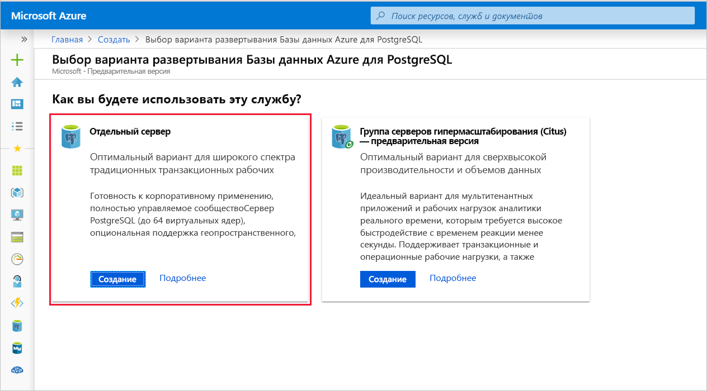
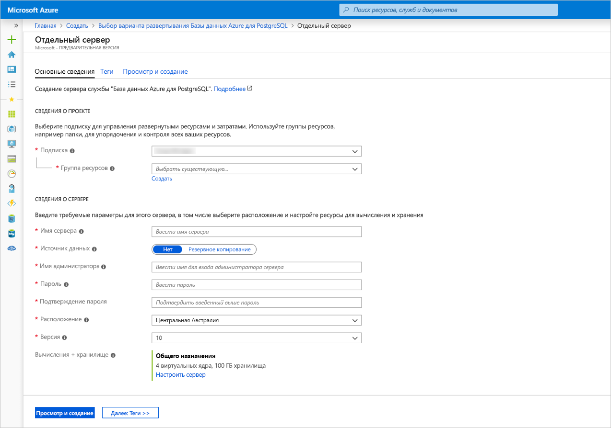
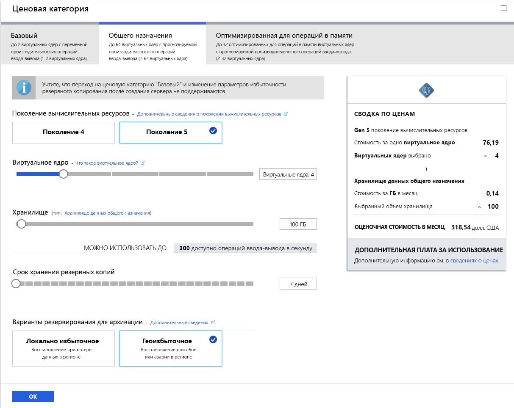
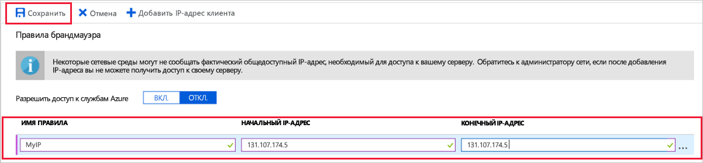
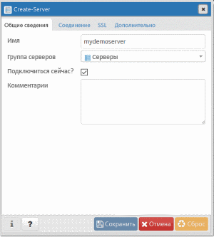
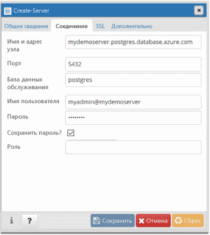
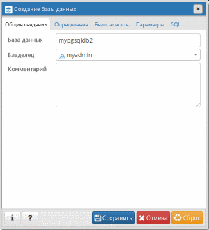
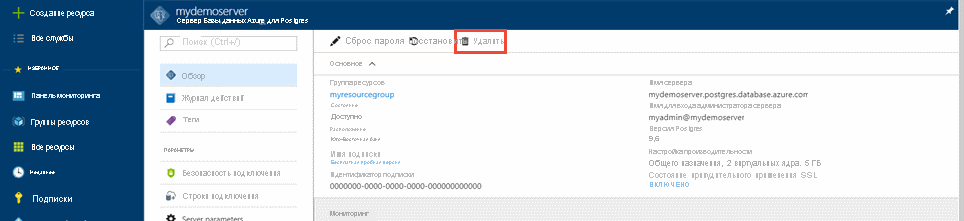

# <a name="quickstart-create-an-azure-database-for-postgresql-server-in-the-azure-portal"></a>Краткое руководство. Создание базы данных Azure для сервера PostgreSQL на портале Azure

База данных Azure для PostgreSQL — это управляемая служба, с помощью которой можно запускать и масштабировать базы данных PostgreSQL высокой доступности, а также управлять ими в облаке. Из этого краткого руководства вы узнаете, как за 5 минут создать сервер службы "База данных Azure для PostgreSQL" с помощью портала Azure.

Если у вас еще нет подписки Azure, создайте [бесплатную учетную запись](https://azure.microsoft.com/free/) Azure, прежде чем начинать работу.

## <a name="sign-in-to-the-azure-portal"></a>Вход на портал Azure
Откройте веб-браузер и перейдите на [портал](https://portal.azure.com/). Введите свои учетные данные для входа на портал. Панель мониторинга службы является представлением по умолчанию.

## <a name="create-an-azure-database-for-postgresql-server"></a>Создание сервера Базы данных Azure для PostgreSQL

Сервер службы "База данных Azure для PostgreSQL" создается с настроенным набором [вычислительных ресурсов и ресурсов хранения](./concepts-pricing-tiers.md). Он создается в [группе ресурсов Azure](../azure-resource-manager/resource-group-overview.md).

Чтобы создать базу данных Azure для сервера PostgreSQL, выполните такие действия:
1. Нажмите кнопку **Создать ресурс** (+) в левом верхнем углу окна портала.

2. Выберите **Базы данных** > **База данных Azure для PostgreSQL**.

    

3. Выберите вариант развертывания **Отдельный сервер**.

   

4. Заполните форму **Основные данные** , указав следующую информацию:

    

    Параметр|Рекомендуемое значение|ОПИСАНИЕ
    ---|---|---
    Подписка|Имя вашей подписки|Подписка Azure, которую вы хотите использовать для сервера. Если у вас есть несколько подписок, выберите ту, в которой взимается плата за использование ресурса.
    Группа ресурсов|*myresourcegroup*| Новое имя группы ресурсов или уже имеющееся из подписки.
    Имя сервера |*mydemoserver*|Уникальное имя, идентифицирующее базу данных Azure для сервера PostgreSQL. Имя домена *postgres.database.azure.com* добавляется к указанному имени сервера. Сервер может содержать только строчные буквы, цифры и знак дефиса (-). Его длина должна составлять от 3 до 63 символов.
    Источник данных | *None* | Чтобы создать сервер с нуля, выберите *Нет*. Если вы создаете сервер из геоизбыточной резервной копии существующего сервера службы "База данных Azure для PostgreSQL", выберите *Резервная копия*.
    Имя администратора |*myadmin*| Собственная учетная запись входа, используемая при подключении к серверу. Не используйте для имени учетной записи администратора такие варианты: **azure_superuser**, **azure_pg_admin**, **admin**, **administrator**, **root**, **guest** или **public**. Оно не может начинаться с **pg_** .
    Пароль |Ваш пароль| Новый пароль для учетной записи администратора сервера. Пароль должен содержать от 8 до 128 символов. Пароль должен содержать символы из таких трех категорий: прописные латинские буквы, строчные латинские буквы, цифры (0–9) и небуквенно-цифровые символы (!, $, #, % и т. д.).
    Расположение|Ближайший к пользователям регион| Ближайшее к пользователям расположение.
    Version (версия)|Последний основной номер версии| Последний основной номер версии PostgreSQL, если нет особых требований.
    Вычисления и хранилище | **Общего назначения**, **Поколение 5**, **2 виртуальных ядра**, **5 ГБ**, **7 дней**, **Геоизбыточное хранилище** | Конфигурации вычислительных ресурсов, хранилища и резервного копирования для нового сервера. Щелкните **Настройка сервера**. Затем выберите вкладку **Общего назначения**. *Поколение 5*, *4 виртуальных ядра*, *100 ГБ* и *7 дней* — это значения по умолчанию для параметров **Поколение вычислительных ресурсов**, **Виртуальное ядро**, **Хранилище** и **Срок хранения резервных копий**. Вы можете оставить эти ползунки как есть или же настроить их. Чтобы включить резервное копирование сервера в геоизбыточном хранилище, выберите **Геоизбыточное** в разделе **параметров избыточности резервного копирования**. Щелкните **ОК**, чтобы сохранить ценовую категорию. На следующем снимке экрана показаны выбранные параметры.

   > [!NOTE]
   > Используйте ценовую категорию "Базовый", если для вашей рабочей нагрузки не требуется большое количество вычислительных ресурсов и операций ввода-вывода. Обратите внимание, что серверы, созданные в ценовой категории "Базовый", нельзя масштабировать до ценовых категорий "Общего назначения" или "Оптимизировано для памяти". Дополнительные сведения см. на [странице с ценами](https://azure.microsoft.com/pricing/details/postgresql/).
   > 

    

5. Выберите **Просмотр и создание** , чтобы просмотреть выбранные элементы. Щелкните **Создать**, чтобы подготовить сервер. Это может занять несколько минут.

6. На панели инструментов щелкните значок **Уведомления** (колокольчик), чтобы отслеживать процесс развертывания. По завершении развертывания можно выбрать **Закрепить на панели мониторинга**. После этого на панели мониторинга на портале Azure отобразится плитка, которая будет служить ярлыком страницы **Обзор** для этого сервера. Если выбрать **Перейти к ресурсу**, откроется страница сервера **Обзор**.

    
   
   По умолчанию на сервере создается база данных **postgres**. База данных [postgres](https://www.postgresql.org/docs/9.6/static/app-initdb.html) — это база данных по умолчанию, предназначенная для использования пользователями, служебными программами и сторонними приложениями. (Другая база данных по умолчанию — **azure_maintenance**. Ее функция заключается в отделении процессов управляемой службы от действий пользователей. У вас нет доступа к этой базе данных.)

## <a name="configure-a-server-level-firewall-rule"></a>Настройка правила брандмауэра на уровне сервера

База данных Azure для PostgreSQL создает брандмауэр на уровне сервера. Он не позволяет внешним приложениям и инструментам подключаться к серверу и к любой базе данных на сервере, если не создано правило, открывающее брандмауэр для определенных IP-адресов. 

1. Найдите сервер после завершения развертывания. При необходимости можно выполнить поиск. Например, в меню слева выберите **Все ресурсы**. Чтобы найти созданный сервер, введите его имя, например **mydemoserver**. Выберите имя сервера в списке результатов поиска. После этого откроется страница **обзора** сервера с параметрами для дальнейшей конфигурации.
 
    

2. На странице сервера выберите **Безопасность подключения**.

3. В разделе **Правила брандмауэра** в столбце **Имя правила** щелкните пустое текстовое поле, чтобы создать правило брандмауэра. 

   Заполните текстовые поля именем и начальным и конечным диапазонами IP-адресов клиентов, которые будут получать доступ к вашему серверу. Если один IP-адрес, используйте то же значение для начального и конечного IP-адреса.

   
     

4. На верхней панели инструментов на странице **Безопасность подключения** щелкните **Сохранить**. Прежде чем продолжить, подождите, пока не появится уведомление о том, что обновление безопасного подключения успешно завершено.

    > [!NOTE]
    > Подключения к базе данных Azure для сервера PostgreSQL выполняются через порт 5432. При попытке подключиться из корпоративной сети исходящий трафик через порт 5432 может блокироваться сетевым брандмауэром. В таком случае вы не сможете подключиться к серверу. Для этого ваш ИТ-отдел должен открыть порт 5432.
    >

## <a name="get-the-connection-information"></a>Получение сведений о подключении

При создании базы данных Azure для сервера PostgreSQL создается база данных по умолчанию с именем **postgres**. Чтобы подключиться к серверу базы данных, вам потребуются учетные данные администратора для входа и полное имя сервера. Скорее всего, вы уже записали эти значения раньше. Если вы не сделали этого, имя сервера и данные для входа можно легко найти на странице **Обзор** сервера на портале.

Откройте страницу сервера **Обзор**. Запишите значения **имени сервера** и **имени для входа администратора сервера**. Наведите указатель на каждое поле. Справа от текста отобразится символ копирования. Щелкните его, чтобы скопировать нужные значения.

 

## <a name="connect-to-the-postgresql-database-using-psql"></a>Подключение к базе данных PostgreSQL с помощью psql

К базе данных Azure для сервера PostgreSQL можно подключиться с помощью нескольких приложений. Если на клиентском компьютере установлено PostgreSQL, вы можете использовать локальный экземпляр [psql](https://www.postgresql.org/docs/current/static/app-psql.html), чтобы подключиться к серверу Azure PostgreSQL. Теперь подключимся к серверу Azure PostgreSQL с помощью служебной программы командной строки psql.

1. Чтобы подключиться к серверу базы данных Azure для PostgreSQL, выполните следующую команду psql:
   ```bash
   psql --host=<servername> --port=<port> --username=<user@servername> --dbname=<dbname>
   ```

   Например, следующая команда устанавливает подключение к базе данных по умолчанию **postgres** на сервере PostgreSQL **mydemoserver.postgres.database.azure.com**, используя учетные данные для доступа. Введите `<server_admin_password>`, указанный при появлении запроса на ввод пароля.
  
   ```bash
   psql --host=mydemoserver.postgres.database.azure.com --port=5432 --username=myadmin@mydemoserver --dbname=postgres
   ```

   > [!TIP]
   > Если вы предпочитаете использовать URL-путь для подключения к Postgres, закодируйте с помощью URL-адреса знак @ в имени пользователя с использованием `%40`. Например, строка подключения для psql будет выглядеть так: 
   > ```
   > psql postgresql://myadmin%40mydemoserver@mydemoserver.postgres.database.azure.com:5432/postgres
   > ```

   После подключения служебная программа psql отображает запрос postgres в поле, где вы вводите команды sql. Возможно, в первоначальных выходных данных подключения отобразится предупреждение, так как используемая версия psql может отличаться от версии сервера службы "База данных Azure для PostgreSQL". 

   Пример выходных данных psql:
   ```bash
   psql (9.5.7, server 9.6.2)
   WARNING: psql major version 9.5, server major version 9.6.
    Some psql features might not work.
    SSL connection (protocol: TLSv1.2, cipher: ECDHE-RSA-AES256-SHA384, bits: 256, compression: off)
   Type "help" for help.

   postgres=> 
   ```

   > [!TIP]
   > Если в брандмауэре не настроено разрешение IP-адресов клиента, возникает следующая ошибка:
   > 
   > "psql: FATAL: no pg_hba.conf entry for host `<IP address>`, user "myadmin", database "postgres", SSL on FATAL: необходимо SSL-подключение". Укажите параметры SSL и повторите попытку.
   > 
   > Убедитесь, что IP-адрес клиента разрешен на предыдущем шаге правил брандмауэра.

2. Создайте пустую базу данных с именем mypgsqldb. Для этого в командной строке введите следующую команду:
    ```bash
    CREATE DATABASE mypgsqldb;
    ```

3. Чтобы подключиться к созданной базе данных **mypgsqldb**, выполните в командной строке следующую команду:
    ```bash
    \c mypgsqldb
    ```

4. Введите `\q` и нажмите клавишу ВВОД, чтобы выйти из psql. 

Вы подключились к серверу службы "База данных Azure для PostgreSQL" через psql и создали пустую пользовательскую базу данных. Перейдите к следующему разделу, чтобы подключиться к базе данных с помощью другого популярного средства — pgAdmin.

## <a name="connect-to-the-postgresql-server-using-pgadmin"></a>Подключение к серверу PostgreSQL с помощью pgAdmin

pgAdmin — это средство с открытым кодом, которое используется с PostgreSQL. Средство PgAdmin можно установить с [веб-сайта pgAdmin](https://www.pgadmin.org/). Ваша версия pgAdmin может отличаться от используемой в этом кратком руководстве. Если вам требуются дополнительные инструкции, ознакомьтесь с документацией по pgAdmin.

1. Откройте приложение pgAdmin на клиентском компьютере.

2. На панели инструментов выберите **Object** (Объект), наведите указатель мыши на пункт **Create** (Создать) и выберите **Server** (Сервер).

3. На вкладке **General** (Общее) в диалоговом окне **Create — Server** (Создание сервера) введите уникальное понятное имя сервера, например **mydemoserver**.

    

4. На вкладке **Connection** (Подключение) в диалоговом окне **Create — Server** (Создание сервера) заполните таблицу настроек.

   

    параметр pgAdmin |Значение|ОПИСАНИЕ
    ---|---|---
    Имя узла и адрес | Имя сервера | Значение имени сервера, которое вы использовали раньше при создании базы данных Azure для сервера PostgreSQL. В нашем примере используется имя сервера **mydemoserver.postgres.database.azure.com**. Используйте полное доменное имя ( **\*.postgres.database.azure.com**), как показано в примере. Если вы не помните имя своего сервера, выполните действия из предыдущего раздела, чтобы получить сведения о подключении. 
    Порт | 5432 | Порт, используемый при подключении к базе данных Azure для сервера PostgreSQL. 
    База данных обслуживания | *postgres* | Имя базы данных по умолчанию, созданное системой.
    Имя пользователя | Имя для входа администратора сервера | Имя для входа администратора сервера, которое вы использовали раньше при создании базы данных Azure для сервера PostgreSQL. Если вы не помните имя пользователя, выполните действия из предыдущего раздела, чтобы получить сведения о подключении. Формат *имя пользователя\@имя сервера*.
    Пароль | Ваш пароль администратора | Пароль, выбранный при создании сервера во время работы с этим руководством.
    Роль | Не указывайте | Указывать роль на этом шаге не нужно. Оставьте поле пустым.
    Режим SSL | *Require* (Требовать) | На вкладке pgAdmin SSL можно настроить режим SSL. По умолчанию все серверы службы "База данных Azure для PostgreSQL" создаются с включенным применением SSL. Чтобы отключить применение SSL, см. сведения о [включении SSL](./concepts-ssl-connection-security.md).
    
5. Щелкните **Сохранить**.

6. В области **Браузер** слева разверните узел **Серверы**. Выберите свой сервер, например **mydemoserver**. Щелкните, чтобы подключиться к нему.

7. Разверните узел сервера, а затем разверните раздел **Базы данных** под ним. Список должен включать существующую базу данных *postgres* и еще одну базу данных, созданную вами. С помощью службы "База данных Azure для PostgreSQL" для сервера можно создать несколько баз данных.

8. Щелкните правой кнопкой мыши **Базы данных**, выберите меню **Создать**, а затем щелкните **База данных**.

9. Введите выбранное имя базы данных в поле **База данных**, например **mypgsqldb2**.

10. Выберите **владельца** базы данных из списка. Выберите имя администратора сервера для входа (например, **my admin**).

    

11. выберите **Сохранить**, чтобы создать пустую базу данных.

12. Созданная база данных отобразится в области **Browser** (Обозреватель) в списке баз данных под именем сервера.


## <a name="clean-up-resources"></a>Очистка ресурсов
Удалить ресурсы, созданные в ходе работы с этим руководством, можно с помощью одного из двух способов. Вы можете удалить [группу ресурсов Azure](../azure-resource-manager/resource-group-overview.md), которая содержит все связанные ресурсы. Чтобы сохранить другие ресурсы, удалите только ресурс сервера.

> [!TIP]
> Другие краткие руководства в этой коллекции созданы на основе этого документа. Если вы планируете продолжать работу с этими краткими руководствами, не удаляйте созданные ресурсы, а если нет — удалите все созданные в ходе работы с ним ресурсы, выполнив приведенные ниже действия на портале.

Чтобы удалить группу ресурсов, в том числе только что созданный сервер, сделайте следующее:
1. Найдите группу ресурсов на портале. В меню слева выберите **Группы ресурсов**. Затем выберите имя группы ресурсов (например, **myresourcegroup**).

2. На странице группы ресурсов щелкните **Удалить**. Затем введите имя своей группы ресурсов, например **myresourcegroup**, в текстовое поле, чтобы подтвердить удаление. Нажмите кнопку **Удалить**.

Чтобы удалить только что созданный сервер, сделайте следующее:
1. Найдите сервер на портале, если от еще не открыт. В меню слева выберите **Все ресурсы**. Затем найдите созданный сервер.

2. На странице **Обзор** выберите **Удалить**.

    

3. Подтвердите имя сервера, которое нужно удалить, чтобы появилась нужная база данных. Введите имя сервера в текстовое поле (например, **mydemoserver**). Нажмите кнопку **Удалить**.

## <a name="next-steps"></a>Дополнительная информация
> [!div class="nextstepaction"]
> [Перенос базы данных с помощью экспорта и импорта](./howto-migrate-using-export-and-import.md)
